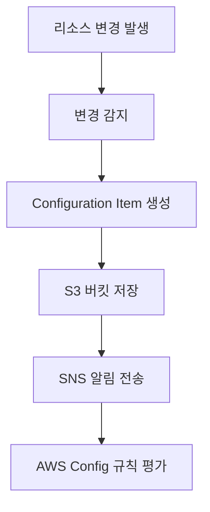

## 1. Configuration Recorder 개요

- Configuration Recorder는 AWS Config의 핵심 구성요소로, AWS 리소스의 구성 변경사항을 지속적으로 기록하고 추적하는 역할을 담당합니다. 
- 이는 AWS 환경의 규정 준수와 감사를 위한 기초를 제공합니다.

## 2. Configuration Item 이해하기

### 2.1 Configuration Item이란?

Configuration Item은 특정 시점의 AWS 리소스 상태를 캡처한 스냅샷입니다. 다음과 같은 경우에 생성됩니다:
- 리소스 속성 변경
- 리소스 간 관계 변경
- 구성 설정 변경
- 관련 이벤트 발생

### 2.2 Configuration Item의 구조

Configuration Item은 다음과 같은 정보를 포함합니다:

- **메타데이터**
    - 버전 정보
    - 생성 시간
    - 리소스 식별자
    - 변경 유형
- **리소스 속성**
    - 리소스별 구성 속성값
    - 태그
    - 상태 정보
- **관계 정보**
    - 연결된 리소스 목록
    - 의존성 관계
    - 네트워크 연결성

## 3. Configuration Recorder 설정

### 3.1 기본 설정

Configuration Recorder는 AWS Config를 처음 활성화할 때 자동으로 생성됩니다. 다음 두 가지 방법으로 설정할 수 있습니다:
- AWS Management Console 사용
- AWS CLI 또는 SDK 사용

### 3.2 AWS CLI를 사용한 설정

```bash
# Configuration Recorder 생성
aws configservice put-configuration-recorder \
    --configuration-recorder name=default,roleARN=arn:aws:iam::123456789012:role/config-role \
    --recording-group allSupported=true,includeGlobalResources=true

# Configuration Recorder 시작
aws configservice start-configuration-recorder \
    --configuration-recorder-name default
```

### 3.3 사용자 지정 설정

- 특정 리소스 유형만 기록하도록 Configuration Recorder를 직접 구성할 수 있습니다:

```bash
aws configservice put-configuration-recorder \
    --configuration-recorder name=default,roleARN=arn:aws:iam::123456789012:role/config-role \
    --recording-group resourceTypes=[AWS::EC2::Instance,AWS::EC2::SecurityGroup]
```

## 4. Configuration Recorder 작동 방식

### 4.1 기록 프로세스



### 4.2 리소스 변경 감지 시점

Configuration Recorder는 다음과 같은 경우에 변경을 감지합니다:
- API 호출을 통한 직접적인 변경
- AWS Management Console을 통한 변경
- 자동화된 작업에 의한 변경
- AWS 서비스에 의한 간접적인 변경

## 5. Configuration Recorder 관리

### 5.1 상태 확인

현재 Configuration Recorder의 상태를 확인하는 방법:

```bash
# 상태 확인
aws configservice describe-configuration-recorder-status

# 설정 확인
aws configservice describe-configuration-recorders
```

### 5.2 일시 중지 및 재시작

```bash
# 기록 중지
aws configservice stop-configuration-recorder \
    --configuration-recorder-name default

# 기록 시작
aws configservice start-configuration-recorder \
    --configuration-recorder-name default
```

## 6. 모범 사례

### 6.1 리소스 선택

- **중요 리소스 우선 기록**
    - 보안 그룹
    - IAM 역할
    - EC2 인스턴스
    - RDS 데이터베이스
    - S3 버킷
- **글로벌 리소스 포함**
    - IAM 사용자
    - Route 53 설정
    - CloudFront 배포

### 6.2 비용 최적화

- 필요한 리소스만 선택적으로 기록
- 적절한 보존 기간 설정
- 주기적인 데이터 정리

### 6.3 보안 고려사항

- Configuration Recorder용 IAM 역할에 최소 권한 부여
- S3 버킷 암호화 설정
- 접근 로깅 활성화

## 7. 문제 해결

### 7.1 일반적인 문제

- Configuration Item이 생성되지 않는 경우
    - IAM 역할 권한 확인
    - Configuration Recorder 상태 확인
    - 리소스 유형이 지원되는지 확인
- 지연 발생 시
    - AWS Config 서비스 상태 확인
    - 네트워크 연결성 확인
    - API 제한 확인

### 7.2 로깅 및 모니터링

- CloudWatch 로그 활성화
- CloudTrail과 연동하여 API 호출 추적
- 메트릭 모니터링 설정

## 8. 결론

- Configuration Recorder는 AWS Config의 기초가 되는 중요한 구성요소입니다.
- 적절한 설정과 관리를 통해 AWS 환경의 변경사항을 효과적으로 추적하고 감사할 수 있으며, 이는 보안과 규정 준수 유지에 핵심적인 역할을 합니다.