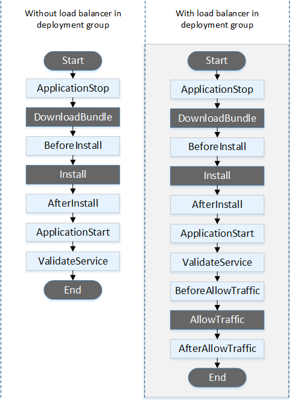
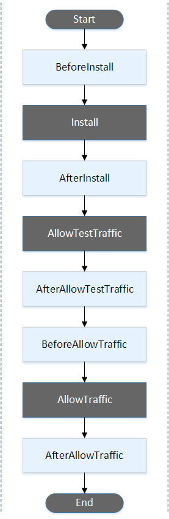
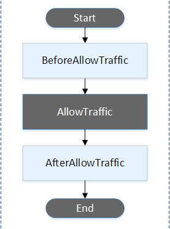

## 1. CodeDeploy 라이프사이클 훅 개요

- CodeDeploy는 컴퓨팅 플랫폼별로 서로 다른 배포 라이프사이클을 제공합니다. 
- 각 플랫폼의 특성에 맞게 설계된 이 라이프사이클들은 배포 과정의 각 단계를 세밀하게 제어할 수 있게 해줍니다.
- 전체 배포 라이프사이클 중 일부 단계에서만 사용자 정의 훅을 적용할 수 있으며, 이 문서에서는 훅을 적용할 수 있는 라이프사이클 단계들을 자세히 설명합니다.
- 'Start', 'Install', 'AllowTraffic', 'End'와 같은 일부 라이프사이클 단계들은 CodeDeploy가 내부적으로 관리하며 사용자가 훅을 연결할 수 없습니다.

## 2. EC2/온프레미스 배포 라이프사이클

- 하늘색 박스는 사용자가 훅을 연결할 수 있는 단계를 나타냅니다.

### 2.1 트래픽 차단 전 단계

#### ApplicationStop
- 새로운 배포가 시작되기 전에 실행
- 현재 실행 중인 애플리케이션을 정상적으로 중지
- 이전 배포의 파일들을 정리
- **주의사항**: 최초 배포 시에는 실행되지 않음
- **사용 예시**: 웹 서버 중지, 프로세스 종료, 임시 파일 정리

#### DownloadBundle
- CodeDeploy 에이전트가 애플리케이션 수정 파일을 임시 위치로 복사
- 에이전트 전용 이벤트로 스크립트 실행 불가
- 임시 위치:
  - Linux: `/opt/codedeploy-agent/deployment-root/deployment-group-id/deployment-id/deployment-archive`
  - Windows: `C:\ProgramData\Amazon\CodeDeploy\deployment-group-id\deployment-id\deployment-archive`

#### BeforeInstall
- 애플리케이션 설치 전 준비 작업 수행
- **주요 용도**:
  - 설정 파일 암호화/복호화
  - 현재 버전 백업
  - 필요한 디렉토리 생성
  - 파일 권한 설정

### 2.2 설치 단계

#### Install
- CodeDeploy 에이전트가 임시 위치의 파일들을 최종 목적지로 복사
- 에이전트 전용 이벤트로 스크립트 실행 불가

#### AfterInstall
- 파일 복사 완료 후 수행할 설정 작업
- **주요 용도**:
  - 애플리케이션 설정 변경
  - 파일 권한 조정
  - 데이터베이스 마이그레이션
  - 캐시 초기화

### 2.3 트래픽 제어 단계

#### BeforeBlockTraffic
- 인스턴스가 로드밸런서에서 제외되기 전 실행
- **주요 용도**:
  - 현재 처리 중인 요청 완료 대기
  - 세션 정리
  - 상태 저장

#### BlockTraffic
- 인스턴스로의 인터넷 트래픽 차단
- 에이전트 전용 이벤트로 스크립트 실행 불가

#### AfterBlockTraffic
- 인스턴스가 로드밸런서에서 제외된 후 실행
- **주요 용도**:
  - 리소스 정리
  - 로그 백업
  - 상태 저장

#### BeforeAllowTraffic
- 인스턴스가 로드밸런서에 등록되기 전 실행
- **주요 용도**:
  - 최종 구성 확인
  - 헬스체크 준비
  - 서비스 의존성 확인

#### AllowTraffic
- 인스턴스로의 인터넷 트래픽 허용
- 에이전트 전용 이벤트로 스크립트 실행 불가

#### AfterAllowTraffic
- 인스턴스가 로드밸런서에 등록된 후 실행
- **주요 용도**:
  - 트래픽 모니터링 시작
  - 알림 전송
  - 최종 상태 확인

### 2.4 애플리케이션 검증 단계

#### ApplicationStart
- 애플리케이션 시작 단계
- `ApplicationStop`에서 중지한 서비스 재시작
- **주요 용도**:
  - 웹 서버 시작
  - 애플리케이션 프로세스 시작
  - 서비스 활성화

#### ValidateService
- 최종 배포 검증 단계
- **주요 용도**:
  - 엔드포인트 접근성 확인
  - 핵심 기능 테스트
  - 로그 확인
  - 메트릭 수집

## 3. ECS 배포 라이프사이클

- ECS 배포는 블루/그린 방식으로 이루어지며, 각 단계는 Lambda 함수를 통해 검증됩니다.
- 하늘색 박스는 사용자가 훅을 연결할 수 있는 단계를 나타냅니다.

### BeforeInstall
- 대체 작업 세트 생성 전 실행
- 원본 작업 세트에만 대상 그룹 연결
- 테스트 리스너는 원본 작업 세트와 연결
- **중요**: 이 시점에서는 롤백 불가능
- **주요 용도**:
  - 데이터베이스 마이그레이션
  - 사전 조건 검증
  - 리소스 준비

### AfterInstall
- 대체 작업 세트 생성 및 첫 번째 대상 그룹 연결 후 실행
- 테스트 리스너는 여전히 원본 작업 세트와 연결
- **특징**: 이 단계부터 롤백 가능
- **주요 용도**:
  - 컨테이너 헬스 체크
  - 기본 설정 검증
  - 초기 상태 확인

### AfterAllowTestTraffic
- 테스트 리스너가 대체 작업 세트로 트래픽 전달 후 실행
- 실제 프로덕션 트래픽 전 테스트 단계
- **주요 용도**:
  - 기능 테스트 수행
  - 성능 테스트
  - 통합 테스트
  - API 검증

### BeforeAllowTraffic
- 두 번째 대상 그룹이 대체 작업 세트와 연결된 후 실행
- 프로덕션 트래픽 전환 직전 단계
- **주요 용도**:
  - 최종 구성 검증
  - 보안 점검
  - 성능 벤치마크
  - 프로덕션 준비 상태 확인

### AfterAllowTraffic
- 프로덕션 트래픽이 대체 작업 세트로 전환된 후 실행
- **주요 용도**:
  - 실시간 모니터링
  - 오류율 확인
  - 성능 메트릭 수집
  - 사용자 경험 모니터링

## 4. Lambda 배포 라이프사이클

- Lambda 배포는 가장 단순한 형태의 라이프사이클을 가지며, 트래픽 전환 전후에 검증을 수행합니다.
- 하늘색 박스는 사용자가 훅을 연결할 수 있는 단계를 나타냅니다.

### BeforeAllowTraffic
- 트래픽이 새 버전의 Lambda 함수로 전환되기 전 실행
- **주요 용도**:
  - 함수 구성 검증
  - 권한 확인
  - 의존성 테스트
  - 콜드 스타트 성능 측정

### AfterAllowTraffic
- 모든 트래픽이 새 버전의 Lambda 함수로 전환된 후 실행
- **주요 용도**:
  - 실시간 호출 모니터링
  - 오류율 확인
  - 지연 시간 측정
  - CloudWatch 메트릭 확인

## 5. 훅 구현 시 주의사항

### 5.1 공통 사항
- 모든 검증 함수는 1시간 이내 완료 필수
- 검증 실패 시 명확한 에러 메시지 반환
- 적절한 타임아웃 설정

### 5.2 플랫폼별 특이사항
- **EC2/온프레미스**:
  - `runas` 사용자 권한 확인
  - 스크립트 실행 권한 설정
  - 절대 경로 사용 권장

- **ECS/Lambda**:
  - IAM 역할에 필요한 권한 부여
  - Lambda 함수 타임아웃 설정
  - 메모리 할당량 고려

## 6. 마치며

각 컴퓨팅 플랫폼의 라이프사이클 훅은 해당 플랫폼의 특성을 고려하여 설계되었습니다. EC2/온프레미스는 가장 세밀한 제어가 가능하고, ECS는 컨테이너 기반 배포에 최적화되어 있으며, Lambda는 서버리스 환경에 맞게 단순화되어 있습니다. 이러한 특성을 이해하고 적절히 활용하면 안정적이고 효율적인 배포 파이프라인을 구축할 수 있습니다.