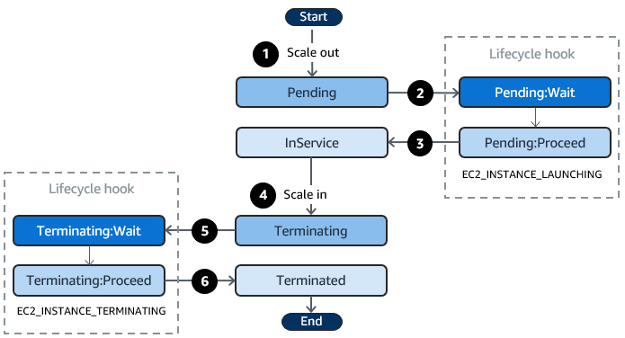

## 1. Lifecycle Hooks

- Amazon EC2 Auto Scaling은 애플리케이션의 수요에 따라 EC2 인스턴스를 자동으로 조정하는 강력한 서비스입니다.
- 이 서비스의 핵심 기능 중 하나인 Lifecycle Hooks에 대해 자세히 알아보겠습니다.

## 2. Lifecycle Hooks란?

- Lifecycle Hooks는 Auto Scaling 그룹에서 인스턴스가 시작되거나 종료될 때 추가적인 작업을 수행할 수 있게 해주는 기능입니다.
- 기본적으로 인스턴스는 시작되자마자 서비스 상태로 전환되지만, Lifecycle Hooks를 사용하면 이 과정에 개입할 수 있습니다.
- 이를 통해 인스턴스가 완전히 구성되기 전에 필요한 설정을 수행하거나, 종료되기 전에 중요한 데이터를 백업하는 등의 작업이 가능합니다.

## 3. Lifecycle Hooks의 주요 특징

- Lifecycle Hooks는 다음과 같은 주요 특징을 가지고 있습니다:
- **인스턴스 상태 제어**:
	- 인스턴스가 '대기' 상태에 머물게 하여 추가 작업을 수행할 시간을 제공합니다.
	- 시작 중인 인스턴스는 'Pending:Wait' 상태로, 종료 중인 인스턴스는 'Terminating:Wait' 상태로 전환됩니다.
- **유연한 작업 정의**:
	- 인스턴스 시작 시 실행할 스크립트를 정의할 수 있습니다.
	- 종료 전 문제 해결을 위해 인스턴스를 일시 중지할 수 있습니다.
- **다양한 사용 사례**:
	- 정리 작업, 로그 추출, 특별한 상태 확인 등 다양한 목적으로 활용 가능합니다.
- **이벤트 통합**:
	- Amazon EventBridge, SNS, SQS와 통합되어 이벤트 기반의 자동화를 구현할 수 있습니다.

## 4. Auto Scaling 인스턴스의 생명주기

### 4.1 인스턴스 상태 개요



- EC2 인스턴스는 생성부터 종료까지 여러 상태를 거치게 됩니다:
	- **Pending**: 초기 시작 상태
	- **Pending:Wait**: Lifecycle Hook 작동
	- **Pending:Proceed**: Lifecycle Hook 완료
	- **InService**: 서비스 중
	- **Terminating**: 종료 시작
	- **Terminating:Wait**: 종료 전 대기
	- **Terminating:Proceed**: 종료 진행
	- **Terminated**: 종료 완료

### 4.2 스케일 아웃 프로세스

1. **시작 트리거**
	- Auto Scaling 그룹이 스케일 아웃 이벤트 감지
	- 새로운 인스턴스 시작 프로세스 시작
2. **Pending:Wait 상태**
	- Lifecycle Hook 작동
	- 인스턴스가 대기 상태로 전환
	- 사용자 정의 작업 수행 (최대 1시간)
3. **InService 전환**
	- 작업 완료 후 Pending:Proceed 상태로 전환
	- 로드 밸런서 등록 (사용 시)
	- 헬스 체크 시작

### 4.3 스케일 인 프로세스

1. **종료 준비**
	- Auto Scaling 그룹이 스케일 인 이벤트 감지
	- 로드 밸런서에서 인스턴스 제거
	- Connection Draining 수행
2. **Terminating:Wait 상태**
	- Lifecycle Hook 작동
	- 종료 전 대기 상태 진입
	- 백업, 로그 수집 등 정리 작업 수행
3. **최종 종료**
	- 모든 작업 완료 후 Terminating:Proceed
	- 인스턴스 종료 및 리소스 정리

## 5. Lifecycle Hooks 활용 시나리오

### 5.1 인스턴스 시작 시

- **애플리케이션 설치 및 구성**
	- 필요한 소프트웨어 설치
	- 환경 설정 적용
	- 데이터 초기화
- **보안 설정**
	- 보안 패치 적용
	- 인증서 설치
	- 방화벽 규칙 구성

### 5.2 인스턴스 종료 시

- **데이터 보호**
	- 중요 데이터 백업
	- 임시 파일 정리
	- 세션 정보 저장
- **리소스 정리**
	- 연결된 리소스 해제
	- 로그 파일 수집
	- 모니터링 시스템에서 제거

## 6. 실제 구현 예시

### 6.1 Lifecycle Hook 생성

```bash
aws autoscaling put-lifecycle-hook \
  --lifecycle-hook-name my-launch-hook \
  --auto-scaling-group-name my-asg \
  --lifecycle-transition autoscaling:EC2_INSTANCE_LAUNCHING \
  --heartbeat-timeout 3600 \
  --default-result CONTINUE
```

### 6.2 EventBridge 규칙 설정

```json
{
  "source": ["aws.autoscaling"],
  "detail-type": ["EC2 Instance-launch Lifecycle Action"],
  "detail": {
    "AutoScalingGroupName": ["my-asg"],
    "LifecycleTransition": ["autoscaling:EC2_INSTANCE_LAUNCHING"]
  }
}
```

## 7. 모범 사례

- **타임아웃 관리**
	- 적절한 타임아웃 값 설정
	- 하트비트를 통한 시간 연장
	- 작업 실패 시 대체 로직 구현
- **오류 처리**
	- 실패 시나리오 대비
	- 롤백 메커니즘 구현
	- 상세한 로깅 설정
- **모니터링**
	- CloudWatch 메트릭 설정
	- 알림 구성
	- 주기적인 상태 확인

## 8. 결론

- Lifecycle Hooks는 Auto Scaling 그룹의 인스턴스 생명주기를 세밀하게 제어할 수 있게 해주는 강력한 기능입니다.
- 적절한 설정과 구현을 통해 안정적이고 자동화된 인프라 관리가 가능합니다.
- 특히 복잡한 애플리케이션 환경에서는 필수적인 도구로, AWS의 다른 서비스들과 결합하여 더욱 강력한 자동화 솔루션을 구축할 수 있습니다.

참고
- https://docs.aws.amazon.com/autoscaling/ec2/userguide/lifecycle-hooks-overview.html