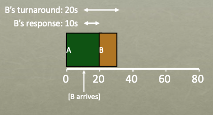
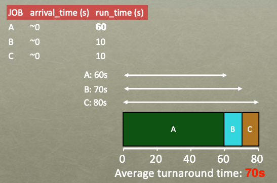
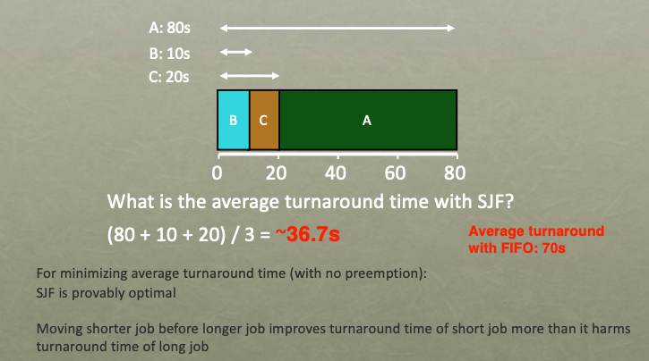
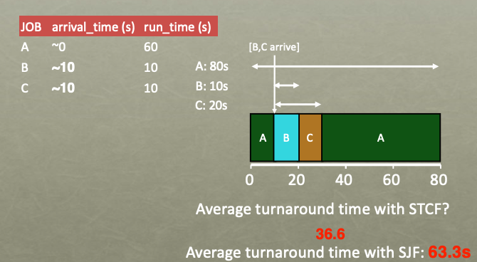
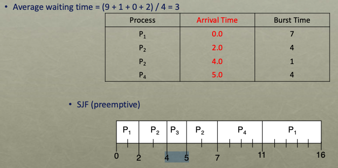

## #CPU Scheduling

### 1. CPU Scheduling의 개념

> 단일 처리기 시스템에서는 오직 한 순간에 오직 한의 프로세스만이 실행될 수 있다. 나머지 프로세스는 CPU가 자유 상태가 되어 다시 스케줄 될 수 있을 때까지 기다려야한다. 다중 프로그래밍의 목적은 CPU 이용률의 최대화하기 위해 항상 실행 중인 프로세스를 가져야한다. 어느 한 순간 다수의 프로세스들이 메모리 내에 유지되고 어떤 프로세스가 대기해야 할 경우, 운영체제는 CPU를 그 프로세스로부터 회수해 다른 프로세스에 할당한다. 이를 CPU Scheduling이라고 한다.

### 2. 프로세스의 특성

* 프로세스는 그 특성에 따라 I/O-bound process 또는 CPU-bound process로 분류된다

**I/O-bound process**

* CPU를 잡고 계산하는 시간 보다 I\O에 많은 시간이 필요한 프로세스
* 많고 짧은 CPU bursts
* 주로 사람과 상호작용 하는 프로세스

**CPU-bound process**

* 계산 위주의 프로세스
* 적고 긴 CPU bursts

**CPU와 입출력 버스트의 교차**

### 3. CPU Scheduler

* 단기 스케줄러(short term Scheduler)라고 불린다.
* ready 상태의 프로세스 중에서 이번에 **CPU를 할당할 프로세스를 결정**한다.
  * ready 큐에 있는 모든 프로세스들은 CPU에서 실행될 기회를 기다리며 대기하고 있다.
  * ready 큐에 있는 레코드들은 일반적으로 프로세스들의 PCB들 이다.

### 4. Dispatcher

* CPU의 제어권을 CPU Scheduler에 의해 선택된 프로세스에게 넘겨주는 모듈이며 다음과 같은 일을 한다.
  * 이 과정을 **context switching(문맥 교환)**이라 한다
* 사용자 모드로 전환하는 일
* 프로그램을 다시 시작하기 위해 사용자 프로그램의 적절한 위치로 이동하는 일
* Dispatch latency: 하나의 프로세스를 중지하고 다른 프로세스를 실행하기 까지 걸리는 시간

### 5. Preemptive Scheduling

* CPU 스케줄링 결정은 다음 네 가지 상황에서 발생한다.

1. 한 프로세스가 실행 상태에서 대기 상태로 전환될 때
   * 입출력 요청, wait() 시스템 콜
2. 프로세스가 실행 상태에서 준비 완료 상태로 전환될 때
   * 타이머 인터럽트
3. 프로세스가 대기 상태에서 준비 완료 상태로 전활될 때
   * 입출력 완료
4. 프로세스가 종료할 때

* 1번과 4번의 경우 실행을 위해 새로운 프로세스가 반드시 선택되어야한다.
* 2번과 3번의 경우는 선택의 여지가 있다.
* 1, 4번에서만 스케줄링이 발생할 경우 비선점형 스케줄링이라 한다.
  * 프로세스가 자발적으로 CPU를 놓을 때를 의미한다.
* 그렇지 않으면 비선점형 스케줄링이라 한다.
* 선점형 스케줄링은 **race conditions**을 초래할 수 있다.

### 6. Scheduling Criteria

* 여러 스케쥴링 알고리즘이 존재하는데 이러한 알고리즘을 비교하는데 사용되는 기준은 아래와 같다.

**Utilization(이용률)**

* CPU의 이용률을 의미한다.

**Throughput(처리량)**

* 단위 시간당 완료된 프로세스의 개수를 의미한다.

**Turnaround Time(소요 시간)**

* 프로세스의 제출시간과 완료 시간의 간격을 의미한다.
* Turnaround Time = 완료 시간 - 도착 시간

**Wating Time(대기 시간)**

* 대기 시간은 ready 큐에서 대기하면서 보낸 시간의 합이다.

**Response Time(응답 시간)**

* 하나의 요구를 제출한 후 첫번째 응답이 나올때까지의 시간이다.
* Response Time = 첫 실행 시간 – 도착 시간

## #Scheduling Alogorithms

### 1. FCFS Scheduling

* CPU를 먼저 요청하는 프로세스가 CPU를 먼저 할당하는 스케줄링 기법
* 비선점형

**장점**

* 구현과 이해가 쉽다.

**단점**

* 짧은 잡이 긴 잡을 기다리느라 평균 대기 시간이 길어질 수 있다.
* convoy effect: 모든 다른 프로세스들이 하나의 긴 CPU-bound process가 CPU를 양도하기를 기다리는 것
* 시분할 시스템에는 적합하지 않다

**예시**

### 2. SJF Scheduling

* 가장 작은 다음 CPU 버스트를 가진 프로세스에게 CPU를 할당하는 스케줄링 기법
* 비선점형

**단점**

* Starvation(기아 상태)
* 다음 CPU 버스트 시간을 알 수 없다
  * 과거의 CPU 버스트 시간을 이용해서 추정이 가능하다
  * exponential averaging 기법을 주로 사용한다

**예시**

### 3. SRTF Scheduling

* Shortest-Remaining-TIme-First Scheduling or STCF
* 현재 수행중인 프로세스의 남은 버스트 타임보다 더 짧은 버스트 타임을 가지는 새로운 프로세스가 도착하면 CPU를 새로운 프로세스에 할당하는 스케줄링 기법
* SJF Scheduling의 선점형 버전이라고 보면 된다.

**장점**

* 최소 평균 대기 시간을 보장한다.

**단점**

* Starvation(기아 상태)
* CPU 버스트 시간을 계산하는 것이 어렵다.

**예시**

### 4. Priority Scheduling

* 가장 높은 우선순위를 가지는 프로세스에게 CPU를 할당하는 스케줄링 기법
* SJF Scheduling, SRTF Scheduling도  Priority Scheduling의 일종이다.
* **선점형**과 **비선점형**으로 나뉜다.
* 단점
  * **Starvation**(기아 상태): 실행 준비는 되어 있으나 낮은 우선순위의 프로세스들이 CPU를 무한히 기다리는 상태
* 기아 상태 해결 방안
  * **Aging** 기법: 오랫동안 시스템에서 대기하는 프로세스들의 우선순위를 점진적으로 증가시켜서 기아 상태를 해결하는 기법

### 5. Round Robin Scheduling

* CPU 스케줄러가 준비 완료 큐를 돌면서 한 번에 한 프로세스에게 시간 할당량 동안 CPU를 할당하는 스케줄링 기법

* 선점형 스케줄링

* 각 프로세스는 동일한 크기의 **할당 시간(time quantum)**을 가진다.

  * 일반적으로 적절한 time quantum은 10-100 milliseconds로 알려져있다
  * 할당 시간이 지나면 프로세스는 선점되고 ready queue의 제일 뒤에 가서 다시 줄을 서게된다.

* n개의 프로세스가  ready queue에 있고 할당 시간이 q time unit인 경우
  * 각 프로세스는 최대  q time unit 단위로 CPU 시간의 1/n을 얻는다
  * 어떤 프로세스도 (n-1)q time unit 이상 기다리지 않는다
  
* 성능
  * time quantum이 극단적으로 **커지면 FCFS Schedulin**g과 같아진다.
  
  * time quantum이 매우 **작으면 context switch 오버헤드**가 커진다
  
    

**단점**

* 평균 Turnaround Time이 SJF보다 일반적으로 길다
  * 같은 크기의 잡이 여러개일 때 평균 Turnaround Time 크게 나옴

**장점**

* Response Time이 짧다.
* CPU 버스트 시간을 계산하지 않아도 된다.
* 짧은 잡이 빨리 종료될 수 있게 한다

### 6. Multilevel Queue

* ready queue를 다수의 별도의 queue로 분할한다
* 프로세스는 특성에 따라 한 개의 큐에 영구적으로 할당된다
* 각 큐는 독립전인 스케쥴링 알고리즘을 가지고 있다
* 각 큐는 낮은 우선순위의 큐보다 절대적인 우선순위를 가진다
* 예시 
  * 프로세스를 forground(대화형), background(일괄처리)로 구분한다
  * forground 큐는 응답시간을 줄이기 위해 Round Robin Scheduling을 사용하고
  * background 큐는 FCFS Scheduling를 사용할 수 있다

### 7. Multilevel Feedback Queue

* ready queue를 다수의 별도의 queue로 분할한다
* Multilevel Queue와 달리 프로세스가 큐들 사이를 이동하는것이 가능하다
* 낮은 우선순위의 큐에서 너무 오래 대기하는 프로세스는 높은 우선순위 큐로 이동시키는 Aging 기법으로 기아 상태를 예방할 수 있다

**스케쥴링 절차**

1. 새로운 프로세스가 첫번째 큐로 들어감
2. CPU를 잡아서 할당 시간 8 milliseconds 동안 수행됨
3. 8 milliseconds 동안 다 끝내지 못했으면 두번째 큐로 내려감
4. 두번째 큐에서 할당을 기다리다가 CPU를 잡아서 할당 시간 16 milliseconds 동안 수행됨
5. 16 milliseconds 동안 다 끝내지 못했으면 FCFS 큐로 내려감

* 이 방법에서는 입출력 중심의 프로세스와 대화형 프로세스들이 높은 우선순위를 가진다

