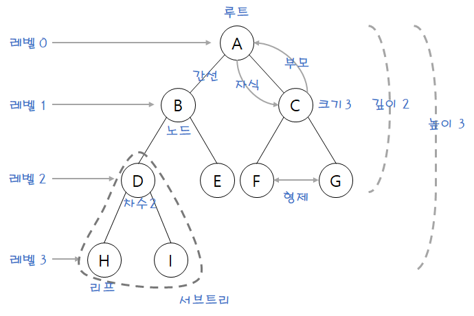

## 1. 트리

- 트리란 계층적인 구조를 표현하는 비순환 그래프입니다.
- 노드와 간선으로 구성되며, 루트 노드에서 시작하여 각 노드가 0개 이상의 자식 노드를 가집니다.
- 트리는 계층적인 데이터를 표현하거나 검색, 정렬, 삽입, 삭제 등의 연산을 수행하는 데 사용됩니다.

### 1.1 기본 구성 요소



- 트리의 기본 구성 요소를 이해하면 트리 자료구조를 쉽게 이해할 수 있습니다.
- 루트(Root): 트리의 최상위에 있는 노드
- 간선(Edge): 노드와 노드를 연결하는 선
- 노드(Node): 트리를 구성하는 각각의 요소
- 부모(Parent): 특정 노드의 상위 노드
- 자식(Child): 특정 노드의 하위 노드
- 단말(Leaf): 자식이 없는 말단 노드

### 1.2 트리의 속성

- 높이(Height): 루트에서 가장 먼 리프까지의 거리
- 깊이(Depth): 루트에서 특정 노드까지의 거리
- 레벨(Level): 같은 깊이에 있는 노드의 집합
- 차수(Degree): 노드의 자식 수

```python
class TreeNode:
    def __init__(self, value):
        self.value = value
        self.parent = None
        self.children = []
        self.height = 0
        self.depth = 0
```

## 2. 이진 트리 기초

### 2.1 정의

- 각 노드가 최대 2개의 자식을 가지는 트리입니다.
- 왼쪽 자식과 오른쪽 자식을 명확히 구분합니다.

```python
class BinaryTreeNode:
    def __init__(self, value):
        self.value = value
        self.left = None
        self.right = None
```

### 2.2 이진 트리의 종류

#### 2.2.1 완전 이진 트리(Complete Binary Tree)

- 마지막 레벨을 제외한 모든 레벨이 완전히 채워진 이진 트리를 의미합니다.
- 마지막 레벨은 왼쪽부터 순차적으로 채워져 있습니다.
- 힙(Heap)이 대표적인 완전 이진 트리입니다.

#### 2.2.2 정 이진 트리(Full Binary Tree)

- 모든 노드가 0개 또는 2개의 자식을 가지는 이진 트리입니다.
- 자식이 있다면 반드시 2개를 가져야 합니다.

#### 2.2.3 포화 이진 트리(Perfect Binary Tree)

- 모든 레벨이 완전히 채워진 이진 트리입니다.
- 노드 수가 2^k - 1개 (k는 트리의 높이)입니다.

## 3. 이진 트리 순회

### 3.1 깊이 우선 탐색(DFS)

- 깊이 우선 탐색의 종류로 전위 순회, 중위 순회, 후위 순회가 있습니다.
- 루트 노드를 언제 방문하느냐에 따라 순회 방법이 달라집니다.
	- 전위 순회: 루트 → 왼쪽 → 오른쪽
	- 중위 순회: 왼쪽 → 루트 → 오른쪽
	- 후위 순회: 왼쪽 → 오른쪽 → 루트
- 재귀 함수를 사용하여 구현합니다.

#### 3.1.1 전위 순회(Preorder)

- 순서: 루트 → 왼쪽 → 오른쪽
- 루트를 먼저 방문합니다.

```python
def preorder(node):
    if node:
        print(node.value)  # 루트
        preorder(node.left)  # 왼쪽
        preorder(node.right)  # 오른쪽
```

#### 3.1.2 중위 순회(Inorder)

- 순서: 왼쪽 → 루트 → 오른쪽
- 이진 탐색 트리에서 정렬된 순서로 노드 방문합니다.

```python
def inorder(node):
    if node:
        inorder(node.left)  # 왼쪽
        print(node.value)  # 루트
        inorder(node.right)  # 오른쪽
```

#### 3.1.3 후위 순회(Postorder)

- 순서: 왼쪽 → 오른쪽 → 루트
- 자식 노드부터 처리하는 경우에 사용합니다.

```python
def postorder(node):
    if node:
        postorder(node.left)  # 왼쪽
        postorder(node.right)  # 오른쪽
        print(node.value)  # 루트
```

### 3.2 너비 우선 탐색(BFS)

- 레벨 순서대로 노드를 방문합니다.
- 큐를 사용하여 구현합니다.

```python
from collections import deque

def bfs(root):
    if not root:
        return
    
    queue = deque([root])
    while queue:
        node = queue.popleft()
        print(node.value)
        
        if node.left:
            queue.append(node.left)
        if node.right:
            queue.append(node.right)
```

## 4. 이진 탐색 트리(Binary Search Tree)

### 4.1 특징

- 왼쪽 서브트리의 모든 노드 < 현재 노드 < 오른쪽 서브트리의 모든 노드를 만족하는 이진 트리입니다.
- 중위 순회시 정렬된 결과를 얻을 수 있습니다.
- 검색, 삽입, 삭제 연산의 평균 시간 복잡도: O(log n)

```python
class BST:
    def __init__(self):
        self.root = None
    
    def insert(self, value):
        if not self.root:
            self.root = BinaryTreeNode(value)
            return
        
        current = self.root
        while True:
            if value < current.value:
                if not current.left:
                    current.left = BinaryTreeNode(value)
                    break
                current = current.left
            else:
                if not current.right:
                    current.right = BinaryTreeNode(value)
                    break
                current = current.right
```

## 5. 균형 이진 트리(Balanced Binary Tree)

### 5.1 정의

- 왼쪽과 오른쪽 서브트리의 높이 차이가 1 이하
- 삽입, 삭제시 자동으로 균형을 맞춤
- AVL 트리, Red-Black 트리가 대표적

### 5.2 장점

- 최악의 경우에도 O(log n) 시간 복잡도 보장
- 검색 성능이 일정하게 유지

## 6. 이진 힙(Binary Heap)

### 6.1 특징

- 완전 이진 트리의 형태
- 최대 힙: 부모 노드가 자식 노드보다 크거나 같음
- 최소 힙: 부모 노드가 자식 노드보다 작거나 같음
- 이진 힙은 정렬되지 않으며 힙의 루트에 최대 또는 최소값이 위치합니다.
	- 같은 레벨의 노드들 사이에는 아무런 관계가 없습니다.
- 일반적으로 배열을 사용하여 구현합니다.
	- 부모 노드의 인덱스 i일 때, 왼쪽 자식은 2i, 오른쪽 자식은 2i + 1입니다.
	- 자식 노드의 인덱스 i일 때, 부모는 i // 2입니다.

```python

### 6.2 구현 예시

```python
class MinHeap:
    def __init__(self):
        self.heap = []
        
    def parent(self, i):
        return (i - 1) // 2
        
    def insert(self, key):
        self.heap.append(key)
        self._sift_up(len(self.heap) - 1)
        
    def _sift_up(self, i):
        parent = self.parent(i)
        if i > 0 and self.heap[i] < self.heap[parent]:
            self.heap[i], self.heap[parent] = self.heap[parent], self.heap[i]
            self._sift_up(parent)
```

## 7. B-Tree

- B-Tree는 이진 트리의 확장판으로, 각 노드가 여러 개의 자식을 가질 수 있는 트리입니다.
- B-Tree는 균형 트리로, 모든 리프 노드가 같은 레벨에 있습니다.
- B-Tree는 데이터베이스 인덱스, 파일 시스템, 운영체제 등 다양한 분야에서 사용됩니다.
- [BTree 참고](../B-Tree/B-Tree)

## 8. B+Tree

- B+Tree는 B-Tree의 변형으로, 데이터베이스 인덱스에 널리 사용됩니다.
- B+Tree는 리프 노드만 데이터를 가지며, 내부 노드는 키만 가집니다.
- B+Tree는 순차적 데이터 접근이 용이하여 디스크 캐시 활용도가 높습니다.
- [B+Tree 참고](../B%2BTree/B%2BTree.md)

## 7. 시간 복잡도 비교

### 7.1 일반적인 연산의 시간 복잡도

| 연산 | 이진 탐색 트리 (평균) | 이진 탐색 트리 (최악) | 균형 이진 트리 | 힙        |
|----|---------------|---------------|----------|----------|
| 검색 | O(log n)      | O(n)          | O(log n) | O(n)     |
| 삽입 | O(log n)      | O(n)          | O(log n) | O(log n) |
| 삭제 | O(log n)      | O(n)          | O(log n) | O(log n) |

## 8. 실전 활용

### 8.1 주요 사용 사례

- 파일 시스템 구조
- 데이터베이스 인덱싱
- 우선순위 큐 구현
- 허프만 코딩
- 게임의 의사결정 트리

## 9. 트리와 그래프 비교

### 9.1 기본 구조 비교

| 특성      | 트리                    | 그래프                                  |
|---------|-----------------------|--------------------------------------|
| 방향성     | 부모에서 자식으로의 단방향        | 방향 있거나(directed) 없을(undirected) 수 있음 |
| 사이클     | 불가능                   | 가능                                   |
| 루트 노드   | 반드시 하나 존재             | 존재하지 않음                              |
| 부모 노드   | 정확히 하나의 부모를 가짐(루트 제외) | 여러 노드가 가능                            |
| 노드 간 경로 | 두 노드 간 유일한 경로 존재      | 두 노드 간 여러 경로 가능                      |
| 연결성     | 모든 노드가 연결됨            | 연결되지 않을 수 있음                         |
