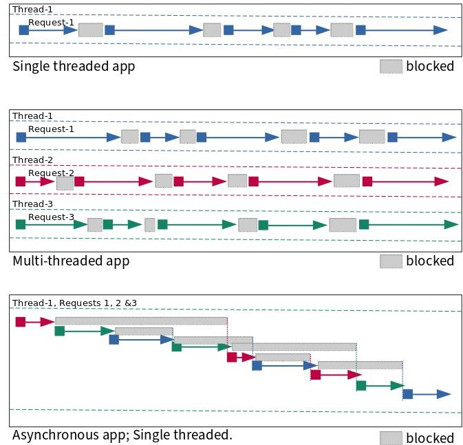
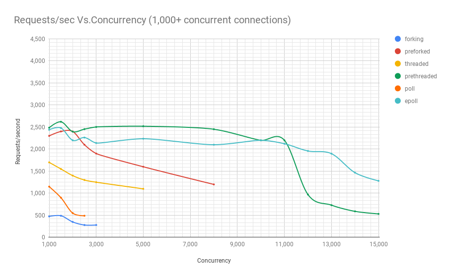

## 1. Asynchronous I/O

## 2. Asynchronous Programming Under Linux

- 우리는 대부분의 애플리케이션이 클라우드에 존재하는 시대에 살고 있습니다. 
- 사용자가 클라우드 기반 애플리케이션에 연결할 때마다, 웹 프레임워크 위에 작성된 대부분의 비즈니스 로직이 실행됩니다. 
- 모든 요청은 별도의 프로세스, 별도의 스레드에서 처리되거나, 비동기 프로그램에서는 여러 요청이 동일한 프로세스에서 처리됩니다. 
- 오늘날 스레드 풀과 비동기 모델 기반의 애플리케이션 프레임워크는 동등하게 인기가 있습니다. 
- 이러한 애플리케이션들은 작업을 수행하는 과정에서 네트워킹 및 파일 관련 시스템 호출을 혼합하여 사용합니다.

### 2.1 Processes (프로세스)

- 일반적으로 read와 같은 시스템 호출을 하면, 파일이 읽혀지고 데이터가 가용해질 때까지 프로그램이 블록됩니다. 
- 이는 일반적으로 꽤 빠르게 처리되어 프로그램이 블록되고 있다는 것을 보통 인식하지 못합니다. 
- 하지만 아마도 당신은 특히 바쁜 기계에서 당신의 프로그램이 초당 수백 번씩 다른 프로그램을 실행하기 위해 CPU에서 전환되었다는 사실도 인식하지 못할 것입니다. 
- 시스템 호출이 블록되면, 커널 모드에서 실행 중인 시스템 호출이 반환될 때마다 프로그램이 언블록되어 계속 실행됩니다. 
- 대부분의 다른 프로그램과 같다면, 운영 체제로부터 무언가가 필요할 때마다 이러한 블록 및 언블록 사이클을 계속할 것입니다. 
- 이 패러다임은 이벤트가 논리적 순서대로 하나씩 발생하기 때문에 이해하기 쉽습니다
- 비록 프로그램이 다른 프로그램을 실행하기 위해 선점되거나 시스템 호출에 의해 블록될 수 있더라도. 
- 프로그램이 다른 프로그램을 실행하기 위해 선점된다는 사실을 무시하면, 프로그램이 순차적으로 로직을 실행하는 것처럼 보입니다.

### 2.2 Multi-threaded programs (다중 스레드 프로그램)

- 다중 스레드 프로그램에서는 이 정신적 모델이 매우 잘 확장됩니다. 
- 프로그램에는 많은 실행 스레드가 있습니다. 
- 이러한 인스턴스들은 동일한 로직의 인스턴스(클라이언트 요청을 처리하기 위해 생성된 스레드의 인스턴스)이거나 그렇지 않을 수도 있습니다(임시 파일을 정리하기 위해 항상 백그라운드에서 실행되는 전용 스레드). 
- 이러한 개별 스레드는 시스템 호출에 의해 선점되거나 블록 및 언블록됩니다. 
- 몇 개 또는 여러 개가 실행 중이지만, 이 정신적 모델도 상당히 확장 가능합니다. 
- 그러나 다중 스레드 여정에서 락(locks)과 뮤텍스(mutexes)와 같은 까다로운 것들을 만나게 될 것입니다. 
- 하지만 우리의 논의를 위해, 우리는 가장 편리하게 그것들을 무시할 것입니다.

### 2.3 Why asynchronous programming? (왜 비동기 프로그래밍인가?)

- 시간당 수천 또는 수십만 개의 요청을 처리하는 것을 구축하려는 경우, 비동기 I/O에 신경 쓸 필요가 없습니다. 
- 스레드 풀 기반 아키텍처 주변에 설계된 애플리케이션 프레임워크가 충분히 잘 작동할 것입니다. 
- 그러나 시간당 수백만 개의 요청을 효율적으로 처리하고 효율성에 신경 쓴다면, 비동기 프로그래밍을 더 자세히 살펴볼 필요가 있습니다. 
- 비동기 프로그래밍은 단일 스레드에서 대부분의 I/O를 처리함으로써 운영 체제의 스레드/프로세스 컨텍스트 전환 오버헤드를 피합니다. 
- 운영 체제의 컨텍스트 전환 오버헤드는 많지 않은 것처럼 보일 수 있지만, 상당한 규모와 동시성을 다룰 때 중요해지기 시작합니다.
- 다음 그림은 1초 내에 일련의 요청에서 무슨 일이 일어나는지를 보여줍니다. 
- 스레드는 블록된 상태에서 실행 상태로 이동합니다. 
- 단일 스레드 및 다중 스레드 앱에서 무슨 일이 일어나는지는 명확하지만, 비동기 프로그래밍이 어떻게 작동하는지는 로켓 과학은 아니지만 이해하기 조금 까다로울 수 있습니다. 
- 아래 그림이 이해하는 데 도움이 되길 바랍니다.



#### 2.3.1 리눅스 프로세스 모델 비교

- 반복적(Iterative)
  - 이 서버 유형은 한 번에 하나의 요청을 처리합니다. 
  - 한 요청을 처리하는 동안, 다른 요청들은 이전 요청의 처리가 완료될 때까지 기다려야 합니다. 
  - 운영 체제가 대기열에 넣을 수 있는 요청 수에는 제한이 있습니다. 
  - 기본적으로 리눅스는 5.4 미만의 커널 버전에서는 최대 128개, 그 이상의 버전에서는 4,096개까지 대기열에 넣습니다.
- 포킹(Forking)
  - 이 유형의 서버는 처리해야 할 각 요청마다 새로운 프로세스를 생성합니다. 
  - 이렇게 하면 요청들이 이전 요청의 처리를 기다릴 필요가 없습니다. 
  - 서로 다른 프로세스가 다른 요청을 처리합니다. 
  - 또한 많은 프로세스나 스레드가 작동할 때, 이들은 여러 개의 사용 가능한 CPU 코어를 활용하는 경향이 있습니다.
- 프리포크(Preforked)
  - 이 유형의 서버는 요청을 처리할 때마다 완전히 새로운 프로세스를 생성해야 하는 오버헤드를 피합니다. 
  - 이는 요청이 들어올 때 할당되는 프로세스 풀을 미리 생성함으로써 이루어집니다. 
  - 풀 내의 모든 프로세스가 바쁜 경우에만 들어오는 요청들이 처리 차례를 기다려야 합니다. 
  - 또한 관리자는 일반적으로 경험하는 부하에 따라 풀 내의 프로세스 수를 조정할 수 있는 능력을 갖게 됩니다.
- 스레드(Threaded)
  - 이 유형의 서버는 요청을 처리할 때마다 새로운 스레드를 생성합니다. 
  - 스레드는 메인 프로세스와 많은 데이터를 공유하므로 새 프로세스를 생성하는 것에 비해 생성 시 약간 더 낮은 오버헤드가 발생합니다.
- 프리스레드(Prethreaded)
  - 이것은 프리포크 아키텍처의 스레드 버전입니다. 
  - 이 스타일에서는 스레드 풀이 생성되고 풀의 스레드가 들어오는 요청에 할당됩니다. 
  - 프리포크 모델에서와 마찬가지로, 모든 스레드가 이전에 받은 요청을 처리하느라 바쁜 경우에만 요청이 기다려야 합니다. 
  - 이는 매우 효율적인 모델이며 대부분의 웹 애플리케이션 프레임워크가 따르는 모델입니다.
- 폴(Poll)
  - 이 유형의 서버는 단일 스레드이며 poll 시스템 호출을 사용하여 요청 간에 다중화합니다.
  - 그러나 poll은 심각한 제한이 있는 시스템 호출입니다
  - 많은 수의 파일 디스크립터로 확장할 때 성능 문제가 있습니다. 
  - 아래 차트에서 이를 확인할 수 있습니다. 
  - 이러한 종류의 설계에서는 각 요청에 대한 상태가 추적되고, 해당 요청의 처리를 다음 단계로 진행시키는 일련의 함수 콜백이 이루어집니다.
- epoll
  - 이것도 단일 스레드 서버 유형으로, poll 대신 epoll 계열의 시스템 호출을 사용하지만, 그 외에는 아키텍처적으로 동일합니다.

#### 2.3.1 리눅스 프로세스 모델 비교 차트

- 이제 다양한 아키텍처의 이름이 무엇을 의미하는지 알았으니, 특정 동시성이 주어졌을 때 초당 처리할 수 있는 요청 수를 살펴보겠습니다. 
- 아래의 세 차트는 같은 벤치마크에서 나온 것이지만, 결과를 더 잘 보여주기 위해 확대한 것입니다.





- 보시다시피, 이 특정 벤치마크에서는 프리스레드(prethreaded) 또는 스레드 풀 기반 웹 서버가 11,000명의 동시 사용자 수준까지는 epoll 기반 서버와 대등한 성능을 보여줍니다.
- 그리고 이는 매우 많은 동시 사용자 수입니다. 아주 인기 있는 웹 서비스만이 이런 수준의 동시성을 경험합니다. 
- 복잡성 측면에서 볼 때, 스레드 풀 기반 프로그램은 비동기 방식에 비해 훨씬 코딩하기 쉽다는 점을 고려하면 이는 매우 중요한 의미를 가집니다. 
- 또한 이는 자연스럽게 이해하기 훨씬 쉽기 때문에 유지보수도 훨씬 쉽다는 것을 의미합니다.

## 3 비동기 프로그래밍을 더 쉽게 만들기

- 비동기 아키텍처로 프로그램을 구축할 때, 일반적으로 개발자로서 당신의 삶을 더 쉽게 만들어 주는 고수준 라이브러리를 사용합니다. 
- 또 다른 선택은 프로그램을 계층화하여 최하위 수준에서 비동기 리눅스 인터페이스를 처리하고, 상위 계층에서는 기능을 구축하는 더 사용하기 쉬운 인터페이스를 제공하는 방식입니다. 
- 이러한 저수준 운영 체제 인터페이스를 추상화하는 라이브러리의 좋은 예로는 libevent와 NodeJS를 구동하는 libuv가 있습니다.
- 웹 프레임워크나 고성능 네트워크 서비스와 같은 특수 애플리케이션을 작성하는 경우가 아니라면, 일반적으로 이러한 저수준 API에서 프로그래밍을 다룰 필요가 없습니다. 
- 하지만 호기심이 있고 시스템 프로그램이 어떻게 작동하는지 이해하고 싶다면, 당신은 적절한 곳에 있습니다. 
- 이 세계에서는 호기심이 결코 고양이를 죽이지 않습니다. 오히려 대부분의 경우, 그것은 고양이를 호랑이로 바꿔 놓습니다.
- Tornado와 NodeJS 같은 웹 애플리케이션 프레임워크는 비동기 I/O가 제공하는 성능을 활용하는 웹 애플리케이션을 쉽게 작성할 수 있게 해줍니다. 
- 웹 서비스를 작성하거나, 요즘은 데스크톱 애플리케이션을 작성하는 경우, 이러한 프레임워크를 사용하는 것이 좋을 수 있습니다. 
- 이러한 프레임워크는 많은 성능상의 이점을 유지하면서도 고수준 언어로 비즈니스 로직을 작성할 수 있게 해주기 때문입니다.

## 4 io_uring 이전의 리눅스 비동기 API

- 동기식 프로그래밍에서는 읽기, 쓰기를 다루는 시스템 호출이나 accept와 같은 원격 연결의 경우, 각각 데이터가 읽히거나, 쓰여지거나, 클라이언트 연결이 가능해질 때까지 블록됩니다. 
- 그때까지 해당 프로세스나 스레드는 블록된 상태입니다. 
- 만약 다른 작업을 수행해야 한다면 어떻게 될까요? 스레드를 사용하면 이러한 다른 작업을 처리하기 위해 다른 스레드를 생성할 수 있습니다. 
- 예를 들어, 메인 스레드는 새로운 클라이언트 연결이 즉시 처리되도록 accept에서 블록될 수 있고, 다른 스레드는 이전 클라이언트의 요청을 처리할 수 있습니다. 
- 하지만 클라이언트 연결을 수락하면서도 클라이언트 소켓에서 읽기를 시도하고, 동시에 로컬 파일을 읽거나 쓰기를 시도하는 등 모든 작업을 하나의 스레드에서 수행해야 한다면 어떻게 될까요? 
- 파일을 제공(읽기)하고 수락(쓰기)하는 FTP 서버는 소켓과 일반 파일 디스크립터를 모두 다루는데, 이는 좋은 예가 될 것입니다. 
- 어떻게 이 모든 것을 하나의 스레드나 프로세스에서 수행할 수 있을까요? 
- 이때 select, poll, epoll 계열의 시스템 호출이 등장합니다.
- 이러한 시스템 호출은 여러 파일 디스크립터(소켓도 파일 디스크립터임)를 모니터링하고 그 중 하나 이상이 준비되었을 때 알려줍니다.
- 예를 들어, FTP 서버가 몇몇 연결된 클라이언트로부터 다음 명령을 읽기 위해 대기하면서 새로운 클라이언트 요청에 대해 accept에서도 리스닝하고 있다고 가정해 봅시다. 
- 프로그램은 select, poll 또는 epoll 계열의 시스템 호출에게 이러한 파일 디스크립터를 모니터링하고 그 중 하나 이상에서 활동이 있을 때 프로그램에게 알려주도록 지시합니다.
- 이를 위해 각 요청을 프로세스나 스레드에서 독점적으로 처리하는 방식과는 매우 다르게 프로그램을 구조화해야 합니다.
- 리눅스의 aio(7) 계열 시스템 호출은 파일과 소켓 모두를 비동기적으로 처리할 수 있습니다. 그러나 알아두어야 할 몇 가지 제한 사항이 있습니다:
- O_DIRECT로 열린 파일이나 버퍼링되지 않은 모드로 열린 파일만 aio에서 지원됩니다. 
- 이는 의심할 여지 없이 가장 큰 제한 사항입니다. 일반적인 상황에서 모든 애플리케이션이 버퍼링되지 않은 모드로 파일을 열기를 원하는 것은 아닙니다.
- 버퍼링되지 않은 모드에서도 파일 메타데이터를 사용할 수 없으면 aio가 블록될 수 있습니다. 메타데이터가 사용 가능해질 때까지 기다립니다.
- 일부 저장 장치는 요청을 위한 고정된 수의 슬롯을 가지고 있습니다. 모든 슬롯이 사용 중이면 aio 제출이 블록될 수 있습니다.
- 제출 및 완료를 위해 총 104바이트를 복사해야 합니다. 또한 I/O를 위해 두 개의 다른 시스템 호출(제출 및 완료를 위해 각각 하나씩)이 필요합니다.
- 위의 제한 사항들은 aio 서브시스템에 많은 불확실성과 성능 오버헤드를 초래합니다.

###  4.1 일반 파일의 문제

- 서버가 그리 바쁘지 않은 상황에서는 파일을 읽거나 쓰는 것이 오래 걸리지 않을 수 있습니다. 
- 위에서 언급한 비동기 설계로 작성된 FTP 서버 예제를 생각해보세요. 
- 이 서버가 많은 동시 사용자들이 동시에 대용량 파일을 다운로드하고 업로드하느라 매우 바쁜 상황에서, 프로그래머로서 알아야 할 한 가지 문제가 있습니다. 
- 이렇게 바쁜 서버에서는 read와 write 호출이 많이 블록되기 시작할 수 있습니다. 
- 그렇다면 select, poll 또는 epoll 계열의 시스템 호출이 여기서 도움이 되지 않을까요? 
- 불행히도 그렇지 않습니다. 이러한 시스템 호출은 항상 일반 파일이 I/O 준비가 되었다고 알려줍니다. 
- 이것이 바로 이들의 아킬레스건입니다. 
- 왜 이런지는 자세히 다루지 않겠지만, 소켓에는 아주 잘 작동하는 반면 일반 파일에 대해서는 항상 "준비됨"을 반환한다는 점을 이해하는 것이 중요합니다.
- 불행히도, 이로 인해 비동기 프로그래밍에서 파일 디스크립터가 균일하지 않게 됩니다. 
- 일반 파일을 지원하는 파일 디스크립터는 차별을 받습니다. 
- 이런 이유로 libuv와 같은 라이브러리는 일반 파일에 대한 I/O를 위해 별도의 스레드 풀을 사용하며, 사용자로부터 이러한 불일치를 숨기는 API를 제공합니다. 

### 4.2 io_uring에서도 이 문제가 존재하나요?

- 아니요. io_uring은 소켓이든 일반 파일이든 균일한 인터페이스를 제공합니다. 
- 또한 API 설계 덕분에, 프로그램은 poll나 epoll에서처럼 파일 디스크립터가 준비되었을 때 알아내고 나서 그 후에 I/O 작업을 시작하는 방식이 아니라, 파일 디스크립터에서 읽거나 쓴 데이터를 직접 받을 수 있습니다. 
- 이것이 io_uring이 기존 리눅스 비동기 I/O API에 비해 가지는 유일한 장점은 아닙니다.

## 5 io_uring이란 무엇인가?

- io_uring은 Facebook의 Jens Axboe가 만든 리눅스를 위한 새로운 비동기 I/O API입니다. 
- 이는 이전 섹션에서 논의했던 현재의 select, poll, epoll 또는 aio 계열 시스템 호출의 제한 사항 없이 API를 제공하는 것을 목표로 합니다. 
- 비동기 프로그래밍 모델의 사용자들이 성능상의 이유로 처음에 이를 선택한다는 점을 고려하면, 성능 오버헤드가 매우 낮은 API를 가지는 것이 합리적입니다. 
- 이후 섹션에서 io_uring이 어떻게 이를 달성하는지 살펴보겠습니다.

### 5.1 io_uring 인터페이스

- io_uring이라는 이름 자체는 이 인터페이스가 커널-사용자 공간 통신을 위한 주요 인터페이스로 링 버퍼를 사용한다는 사실에서 비롯됩니다. 
- 시스템 호출이 관여되지만, 이는 최소한으로 유지되며 시스템 호출의 필요성을 가능한 한 줄이기 위해 사용할 수 있는 폴링 모드가 있습니다.

### 5.2 metal model

- 비동기적으로 I/O를 처리하는 프로그램을 구축하기 위해 io_uring을 사용하기 위해 구성해야 하는 정신적 모델은 꽤 간단합니다.
- 2개의 링 버퍼가 있으며, 하나는 요청 제출용(제출 큐 또는 SQ)이고 다른 하나는 이러한 요청의 완료를 알려주는 용도(완료 큐 또는 CQ)입니다.
- 이러한 링 버퍼는 커널과 사용자 공간 사이에 공유됩니다. io_uring_setup()으로 이를 설정한 다음 2번의 mmap 호출을 통해 사용자 공간에 매핑합니다.
- io_uring에게 수행해야 할 작업(파일 읽기 또는 쓰기, 클라이언트 연결 수락 등)을 알려주는데, 이는 제출 큐 항목(SQE)의 일부로 설명되며 제출 링 버퍼의 끝에 추가됩니다.
- 그런 다음 io_uring_enter() 시스템 호출을 통해 제출 큐 링 버퍼에 SQE를 추가했음을 커널에 알립니다. 시스템 호출을 하기 전에 여러 SQE를 추가할 수도 있습니다.
- 선택적으로, io_uring_enter()는 반환하기 전에 커널이 처리할 요청 수를 기다릴 수 있으므로 결과를 위해 완료 큐를 읽을 준비가 되었음을 알 수 있습니다.
- 커널은 제출된 요청을 처리하고 완료 큐 이벤트(CQE)를 완료 큐 링 버퍼의 끝에 추가합니다.
- 완료 큐 링 버퍼의 시작 부분에서 CQE를 읽습니다. 각 SQE에 해당하는 CQE가 하나씩 있으며, 이는 해당 특정 요청의 상태를 포함합니다.
- 필요에 따라 SQE를 추가하고 CQE를 수확하는 작업을 계속합니다.
- 커널이 제출 큐의 새 항목을 폴링하는 폴링 모드를 사용할 수 있습니다. 이는 항목을 처리하기 위해 제출할 때마다 io_uring_enter()를 호출하는 시스템 호출 오버헤드를 피할 수 있습니다.

### 5.3 io_uring 성능

- 커널과 사용자 공간 사이에 공유된 링 버퍼 덕분에, io_uring은 제로 카피(zero-copy) 시스템이 될 수 있습니다. 
- 커널과 사용자 공간 사이에 데이터를 전송하는 시스템 호출이 관여할 때 바이트를 복사하는 작업이 필요해집니다. 
- 하지만 io_uring에서 통신의 대부분이 커널과 사용자 공간 사이에 공유된 버퍼를 통해 이루어지므로, 이러한 큰 성능 오버헤드가 완전히 피해집니다. 
- 시스템 호출(그리고 우리는 이를 많이 사용하는 데 익숙합니다)이 큰 오버헤드로 보이지 않을 수 있지만, 고성능 애플리케이션에서는 많은 시스템 호출을 하게 되면 문제가 되기 시작합니다. 
- 또한, 시스템 호출은 예전만큼 저렴하지 않습니다. 스펙터(Specter)와 멜트다운(Meltdown)을 처리하기 위해 운영 체제에 마련된 해결책을 고려하면, 우리는 무시할 수 없는 오버헤드에 대해 이야기하고 있습니다. 
- 따라서, 고성능 애플리케이션에서 가능한 한 시스템 호출을 피하는 것은 실제로 환상적인 아이디어입니다.
- 동기식 프로그래밍 인터페이스를 사용하거나 심지어 리눅스에서 비동기 프로그래밍 인터페이스를 사용할 때도, 각 요청 제출에는 최소한 하나의 시스템 호출이 관여합니다. 
- io_uring에서는 원하는 I/O 작업을 설명하는 여러 SQE를 추가하고 io_uring_enter를 한 번만 호출하여 여러 요청을 추가할 수 있습니다. 
- 시작부터, 그것은 그 자체로 성공입니다. 그러나 더 좋아집니다.
- 커널이 제출 큐에 추가하는 대로 SQE를 폴링하고 처리하도록 할 수 있습니다. 
- 이는 커널에게 SQE를 가져가도록 알리기 위해 해야 하는 io_uring_enter() 호출을 피할 수 있습니다. 
- 고성능 애플리케이션의 경우, 이는 더 적은 시스템 호출 오버헤드를 의미합니다. 
- 공유 링 버퍼의 현명한 사용으로, io_uring 성능은 정말로 메모리 바운드입니다. 
- 폴링 모드에서는 시스템 호출을 완전히 없앨 수 있기 때문입니다. 
- 성능 벤치마킹이 일종의 공통 참조점을 가진 상대적인 과정이라는 것을 기억하는 것이 중요합니다. 
- io_uring 논문에 따르면, 참조 머신에서 폴링 모드에서 io_uring은 1.7M 4k IOPS를 기록한 반면, aio는 608k를 기록했습니다.
- 두 배 이상이지만, aio는 폴링 모드를 제공하지 않기 때문에 이는 공정한 비교가 아닙니다. 
- 그러나 폴링 모드가 비활성화되어도, io_uring은 1.2M IOPS를 기록하며, 이는 aio의 거의 두 배에 가깝습니다.
- io_uring 인터페이스의 원시 처리량을 확인하기 위해 no-op 요청 유형이 있습니다. 
- 이를 통해, 참조 머신에서, io_uring은 초당 20M 메시지를 달성합니다. 

## 6 저수준 io_uring 인터페이스

- 이전 세션에서 제안된 것처럼, 실제 프로그램에서 저수준 io_uring API를 사용할 가능성은 낮습니다. 
- 하지만 io_uring이 실제로 어떤 인터페이스를 제공하는지 아는 것은 항상 좋은 생각입니다. 
- 이를 위해, 공유 링 버퍼와 관련 io_uring 시스템 콜을 통해 io_uring이 프로그램에 직접 제공하는 인터페이스를 살펴봐야 합니다. 
- 좋은 예시, 그것도 간단한 예시가 이 인터페이스를 잘 보여줄 수 있습니다. 
- 이를 위해, 여기서는 유닉스 cat 유틸리티를 모방하는 예제를 제시합니다. 
- 단순하게 유지하기 위해, io_uring에 한 번에 하나의 작업을 제시하고, 그 작업이 완료될 때까지 기다린 다음 다음 작업을 제시하는 프로그램을 만들 것입니다. 
- 이런 방식으로 작업을 수행하기 위해 실제 프로그램은 동기식/차단 호출을 사용할 수도 있지만, 이 프로그램의 주요 목적은 다른 프로그램 로직이 방해가 될 가능성 없이 io_uring 인터페이스에 익숙해지는 것입니다.
- 이 예제를 잘 이해하려면 readv 시스템 콜에 친숙해야 합니다.

### 6.1 저수준 인터페이스 소개

- io_uring의 인터페이스는 간단합니다. 
- 제출 큐(submission queue)와 완료 큐(completion queue)가 있습니다. 
- 제출 큐에서는 수행하고자 하는 다양한 작업에 대한 정보를 제출합니다. 
- 예를 들어, 현재 프로그램에서는 readv로 파일을 읽고 싶으므로, 제출 큐 항목(SQE, Submission Queue Entry)의 일부로 이를 설명하는 제출 큐 요청을 배치합니다. 
- 또한, 한 개 이상의 요청을 배치할 수 있습니다. 
- 큐 깊이(정의할 수 있음)가 허용하는 만큼 많은 요청을 배치할 수 있습니다. 
- 이러한 작업들은 읽기, 쓰기 등의 혼합일 수 있습니다. 
- 그런 다음, io_uring_enter() 시스템 콜을 호출하여 제출 큐에 요청을 추가했다고 커널에 알립니다. 
- 커널은 그 후 자신의 작업을 수행하고, 그 요청들을 처리한 후에는 각 해당 SQE에 대해 하나씩 CQE(Completion Queue Entry) 또는 완료 큐 항목의 일부로 결과를 완료 큐에 배치합니다. 
- 이러한 CQE들은 커널과 사용자 공간이 공유하는 버퍼에 배치되므로 사용자 공간에서 즉시 접근할 수 있습니다.
- 우리는 이전에 io_uring의 이러한 특정 장점을 다뤘지만, 예리한 독자라면 각 I/O 요청마다 하나의 시스템 콜을 하는 대신 여러 I/O 요청으로 큐를 채우고 단일 시스템 콜을 하는 이 인터페이스가 이미 더 효율적이라는 것을 알아차렸을 것입니다. 
- 효율성을 한 단계 더 높이기 위해, io_uring은 사용자가 io_uring_enter()를 호출하여 커널에 새로운 제출 큐 항목에 대해 알리지 않아도 커널이 제출 큐에 사용자가 만든 항목을 폴링하는 모드를 지원합니다. 
- 또 다른 주목할 점은 Specter와 Meltdown 하드웨어 취약점이 발견되고 운영 체제가 이에 대한 해결책을 만든 후에는, 시스템 콜이 그 어느 때보다 비싸졌다는 것입니다. 
- 따라서, 고성능 애플리케이션의 경우 시스템 콜 수를 줄이는 것은 정말 중요한 일입니다.
- 이 중 어떤 것도 할 수 있기 전에, 큐를 설정해야 합니다. 
- 이것들은 실제로 특정 깊이/길이를 가진 링 버퍼입니다. 
- 이를 수행하기 위해 io_uring_setup() 시스템 콜을 호출합니다. 
- 우리는 링 버퍼에 제출 큐 항목을 추가하고 완료 큐 링 버퍼에서 완료 큐 항목을 읽음으로써 실제 작업을 수행합니다. 
- 이것이 io_uring 인터페이스가 설계된 방식에 대한 개요입니다.

### 6.2 완료 큐 항목(Completion Queue Entry)

- 이제 어떻게 작동하는지에 대한 정신적 모델을 가지게 되었으니, 이것이 조금 더 자세하게 어떻게 이루어지는지 살펴보겠습니다. 
- 제출 큐 항목(SQE)에 비해, 완료 큐 항목(CQE)은 매우 간단합니다. 
- 그래서 먼저 이것을 살펴보겠습니다. SQE는 요청을 제출하는 데 사용하는 io_uring_sqe struct의 인스턴스입니다. 
- 이것을 제출 링 버퍼에 추가합니다. 
- CQE는 제출 큐에 추가된 모든 io_uring_sqe 구조체 인스턴스에 대해 커널이 응답하는 io_uring_cqe 구조체의 인스턴스입니다. 
- 이것은 SQE 인스턴스를 통해 요청한 작업의 결과를 포함합니다.

```c
struct io_uring_cqe {
  __u64  user_data;   /* sqe->user_data 제출이 다시 전달됨 */
  __s32  res;         /* 이 이벤트에 대한 결과 코드 */
  __u32  flags;
};
```

### 6.3 완료와 제출 연관짓기

- 코드 주석에서 언급된 대로, user_data 필드는 SQE에서 CQE 인스턴스로 그대로 전달되는 것입니다. 
- 제출 큐에 여러 요청을 제출했다고 가정해 봅시다. 
- 이들이 같은 순서로 완료되어 CQE로 완료 큐에 나타날 필요는 없습니다. 
- 다음과 같은 시나리오를 생각해보세요
- 기계에 두 개의 디스크가 있습니다: 하나는 더 느린 회전 하드 드라이브이고 다른 하나는 매우 빠른 SSD입니다. 
- 제출 큐에 2개의 요청을 제출합니다. 
- 첫 번째는 느린 회전 하드 디스크에서 100kB 파일을 읽는 것이고, 두 번째는 더 빠른 SSD에서 같은 크기의 파일을 읽는 것입니다. 
- 순서가 유지되어야 한다면, SSD의 파일 데이터가 더 빨리 도착할 것으로 예상되더라도, 커널이 회전 하드 드라이브의 파일 데이터가 사용 가능해질 때까지 기다려야 할까요? 
- 이는 나쁜 생각입니다. 왜냐하면 이것은 우리가 가능한 한 빨리 실행되는 것을 방해하기 때문입니다. 
- 따라서, CQE는 사용 가능해지는 대로 어떤 순서로든 도착할 수 있습니다. 
- 어떤 작업이 끝나든, 그에 대한 결과는 CQ에서 사용 가능해집니다. 
- CQE가 도착하는 지정된 순서가 없기 때문에, 이제 위의 io_uring_cqe 구조체에서 CQE가 어떻게 생겼는지 알게 되었으니, 특정 CQE가 어떤 SQE 요청에 해당하는지 어떻게 식별할까요? 
- 그렇게 하는 한 가지 방법은 SQE와 CQE 모두에 공통된 user_data 필드를 사용하여 완료를 식별하는 것입니다. 
- 고유 ID 같은 것을 설정하는 것이 아니라, 보통 포인터를 전달할 것입니다. 이것이 혼란스럽다면, 나중에 여기에서 명확한 예를 볼 때까지 기다리세요.
- 완료 큐 항목은 주로 시스템 콜의 반환 값에 관련되어 있기 때문에 간단합니다. 
- 이는 res 필드에 반환됩니다. 예를 들어, 읽기 작업을 큐에 넣었다면, 성공적으로 완료되면 읽은 바이트 수가 포함될 것입니다. 
- 오류가 있었다면, 음수 오류 번호가 포함될 것입니다. 본질적으로 read 시스템 콜 자체가 반환할 것과 같습니다.

###  6.4 순서화

- CQE가 어떤 순서로든 도착할 수 있다고 언급했지만, SQE 순서화를 통해 특정 작업의 순서를 강제할 수 있습니다. 
- 이는 사실상 작업들을 연결하는 것입니다.

### 6.5 제출 큐 항목(Submission Queue Entry)

- 제출 큐 항목은 완료 큐 항목보다 약간 더 복잡합니다. 
- 이는 오늘날 리눅스에서 가능한 다양한 I/O 작업을 표현하고 처리하기에 충분히 일반적이어야 하기 때문입니다.

```c
struct io_uring_sqe {
  __u8  opcode;   /* 이 sqe의 작업 유형 */
  __u8  flags;    /* IOSQE_ 플래그 */
  __u16  ioprio;  /* 요청에 대한 ioprio */
  __s32  fd;      /* IO를 수행할 파일 디스크립터 */
  __u64  off;     /* 파일 내 오프셋 */
  __u64  addr;    /* 버퍼 또는 iovec에 대한 포인터 */
  __u32  len;     /* 버퍼 크기 또는 iovec 수 */
  union {
    __kernel_rwf_t  rw_flags;
    __u32    fsync_flags;
    __u16    poll_events;
    __u32    sync_range_flags;
    __u32    msg_flags;
  };
  __u64  user_data;   /* 완료 시 다시 전달될 데이터 */
  union {
    __u16  buf_index; /* 고정 버퍼를 사용하는 경우 인덱스 */
    __u64  __pad2[3];
  };
};
```

- 이 struct가 복잡해 보이지만, 더 일반적으로 사용되는 필드는 몇 개뿐이며, 우리가 다루고 있는 cat과 같은 간단한 예로 쉽게 설명할 수 있습니다. 
- readvs 시스템 콜을 사용하여 파일을 읽으려는 경우
  - opcode는 작업을 지정하는 데 사용됩니다. 우리의 경우, IORING_OP_READV 상수를 사용한 readv입니다.
  - fd는 읽으려는 파일을 나타내는 파일 디스크립터를 지정하는 데 사용됩니다.
  - addr는 I/O를 위해 할당한 버퍼의 주소와 길이를 담고 있는 iovec 구조체 배열을 가리키는 데 사용됩니다.
	- 마지막으로, len은 iovec 구조체 배열의 길이를 저장하는 데 사용됩니다.
- 이제 그렇게 어렵지 않았죠? 이 값들을 채워서 io_uring에게 무엇을 해야 하는지 알려줍니다. 
- 여러 SQE를 큐에 넣고 마지막으로 커널이 큐에 넣은 요청 처리를 시작하기를 원할 때 io_uring_enter()를 호출합니다.

참고

- https://unixism.net/loti/async_intro.html
- https://unixism.net/loti/what_is_io_uring.html
- https://unixism.net/loti/low_level.html#