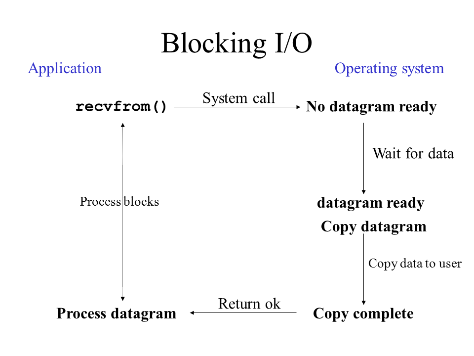
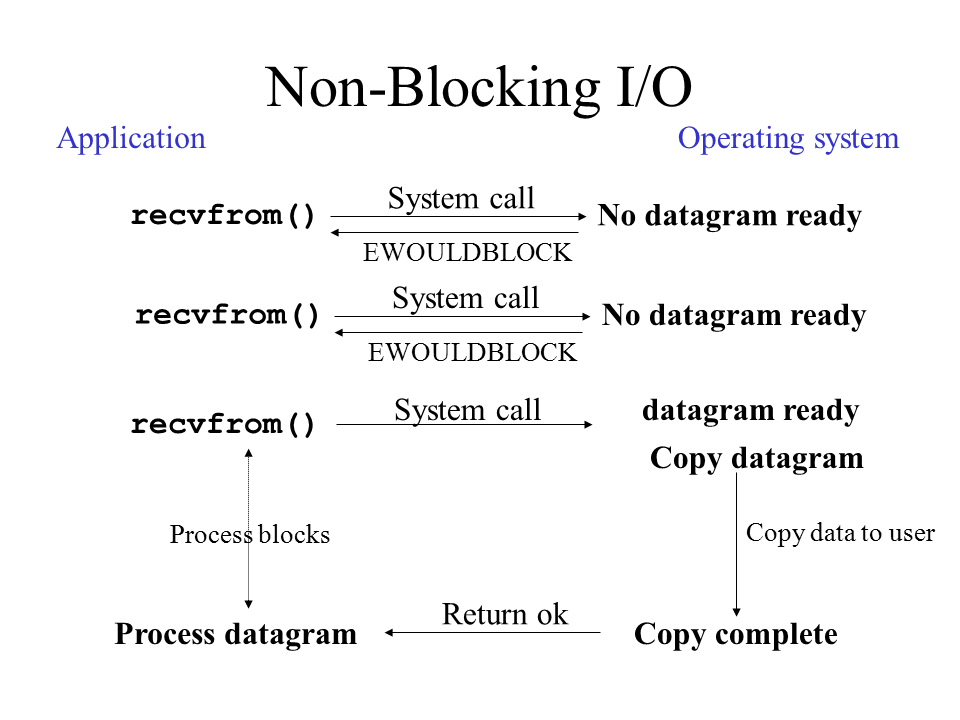
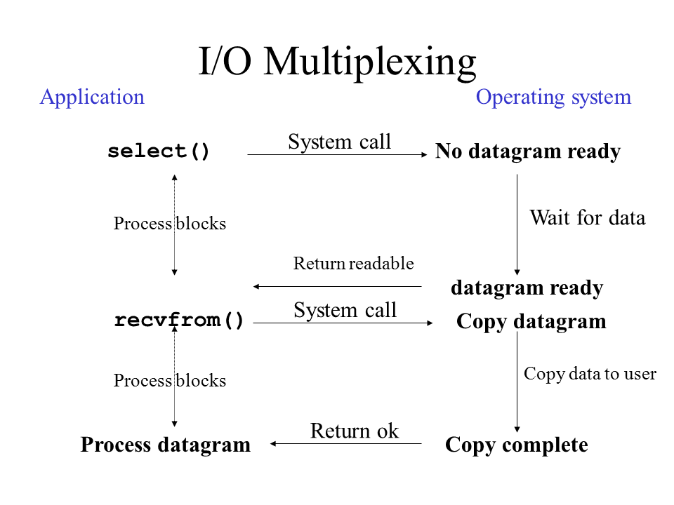
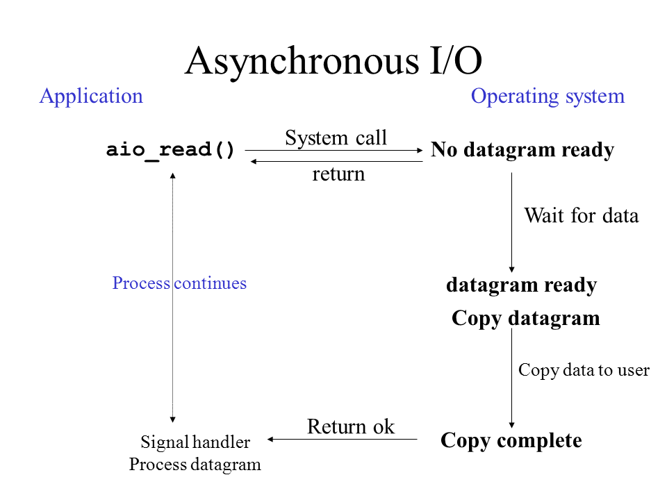

## 1. I/O 모델의 이해

### 1.1 기본 개념

모든 I/O 작업은 두 단계로 이루어집니다:

1. **데이터 준비 단계**
	- 커널이 데이터를 준비하는 과정
	- 디스크 읽기, 네트워크 패킷 수신 등
	- 시간이 오래 걸릴 수 있는 작업
2. **데이터 복사 단계**
	- 준비된 데이터를 커널 공간에서 유저 공간으로 복사
	- 메모리 복사 작업
	- 상대적으로 빠른 작업

이 두 단계에서 프로세스가 어떻게 대기하고, 어떻게 완료를 확인하는지에 따라 I/O 모델이 구분됩니다.

### 1.2 분류 기준

#### 1.2.1 프로세스의 대기 방식

- **블로킹(Blocking)**
	- 프로세스가 I/O 작업 동안 대기
	- 작업이 완료될 때까지 다음 명령어를 실행하지 않음
	- 자원 사용은 적지만 응답성이 떨어짐
- **논블로킹(Non-blocking)**
	- 프로세스가 I/O 작업과 관계없이 계속 실행
	- I/O 작업의 진행 상태를 주기적으로 확인
	- 더 나은 응답성을 제공하지만 자원을 더 많이 사용

#### 1.2.2 작업 완료 확인 방식

- **동기(Synchronous)**
	- 프로세스가 직접 I/O 완료를 확인
	- 명시적인 I/O 완료 체크 필요
	- 프로세스가 I/O 작업의 결과를 즉시 처리
- **비동기(Asynchronous)**
	- 커널이 I/O 완료를 프로세스에 통지
	- 완료 시 콜백이나 시그널로 알림
	- 프로세스가 I/O 완료를 신경쓰지 않아도 됨

이러한 기준들의 조합으로 네 가지 주요 I/O 모델이 만들어집니다.

## 2. 블로킹 I/O (Blocking I/O)

### 1.1 동작 과정

1. **시스템 콜 호출**
	- 애플리케이션이 recvfrom() 호출
	- 제어권이 커널로 넘어감
	- 프로세스는 블로킹 상태로 진입
2. **데이터 대기**
	- 커널이 데이터 준비될 때까지 대기
	- 이 시간 동안 프로세스는 계속 블로킹
	- 프로세스는 다른 작업을 전혀 수행할 수 없음
3. **데이터 복사 및 반환**
	- 데이터가 준비되면 커널 공간에서 유저 공간으로 복사
	- 복사가 완료되면 시스템 콜이 반환됨
	- 프로세스는 데이터 처리 시작

## 2. 논블로킹 I/O (Non-blocking I/O)

### 2.1 동작 과정

1. **즉시 반환되는 시스템 콜**
	- 애플리케이션이 recvfrom() 호출 (O_NONBLOCK 플래그 설정)
	- 데이터가 준비되지 않았다면 EWOULDBLOCK 에러와 함께 즉시 반환
	- 프로세스는 계속 다른 작업 수행 가능
2. **반복적인 확인**
	- 프로세스가 주기적으로 recvfrom() 재호출
	- 매번 EWOULDBLOCK으로 반환될 수 있음
	- 이런 반복적 확인을 "폴링(polling)"이라고 함
3. **데이터 처리**
	- 데이터가 준비되면 마지막 recvfrom() 호출에서 데이터 복사
	- 복사가 완료되면 프로세스가 데이터 처리

## 3. I/O 멀티플렉싱 (I/O Multiplexing)

### 3.1 동작 과정

1. **감시 시작**
	- select() 시스템 콜 호출
	- 여러 파일 디스크립터를 한 번에 모니터링
	- select() 호출 동안은 프로세스 블로킹
2. **데이터 준비 통지**
	- 커널이 데이터 준비되었음을 알림
	- select()가 "readable" 상태로 반환
	- 어떤 파일 디스크립터가 준비되었는지 정보 제공
3. **실제 데이터 읽기**
	- 준비된 파일 디스크립터에 대해 recvfrom() 호출
	- 데이터를 커널에서 유저 공간으로 복사
	- 복사가 완료되면 프로세스가 데이터 처리

## 4. 비동기 I/O (Asynchronous I/O)

### 4.1 동작 과정

1. **비동기 요청**
	- aio_read() 시스템 콜 호출
	- 즉시 반환되어 프로세스는 다른 작업 수행
	- 커널에 읽기 작업 등록
2. **백그라운드 처리**
	- 커널이 독립적으로 데이터 준비
	- 데이터가 준비되면 커널이 복사까지 수행
	- 이 모든 과정에서 프로세스는 자유롭게 다른 작업 수행
3. **완료 통지**
	- 모든 I/O 작업(준비+복사)이 완료되면
	- 시그널 또는 콜백으로 프로세스에 통지
	- 프로세스는 이미 복사된 데이터 즉시 사용 가능

## 5. 모델 별 주요 차이점

### 5.1 프로세스 블로킹 관점

1. **블로킹 I/O**
	- 데이터 준비 단계: 블로킹
	- 데이터 복사 단계: 블로킹
2. **논블로킹 I/O**
	- 데이터 준비 단계: 논블로킹 (폴링)
	- 데이터 복사 단계: 블로킹
3. **I/O 멀티플렉싱**
	- 데이터 준비 단계: 여러 fd 동시 감시하며 블로킹
	- 데이터 복사 단계: 블로킹
4. **비동기 I/O**
	- 데이터 준비 단계: 논블로킹
	- 데이터 복사 단계: 논블로킹

### 5.2 사용 사례

1. **블로킹 I/O**
	- 단순한 클라이언트 프로그램
	- 연결 수가 적은 서버
2. **논블로킹 I/O**
	- 실시간성이 중요한 애플리케이션
	- 폴링 오버헤드를 감당할 수 있는 경우
3. **I/O 멀티플렉싱**
	- 대부분의 현대적 서버 (nginx, redis 등)
	- 많은 동시 연결을 처리해야 하는 경우
	- Node.js의 이벤트 루프
4. **비동기 I/O**
	- 고성능 데이터베이스 시스템
	- 과학 계산 애플리케이션

:::tip
리눅스의 AIO가 가진 제한사항으로 인해, 대부분의 고성능 서버는 비동기 I/O 대신 epoll 기반의 I/O 멀티플렉싱을 사용합니다. epoll은 select의 한계(1024 fd 제한, O(n) 복잡도)를 극복한
더 효율적인 I/O 멀티플렉싱 메커니즘입니다.
:::