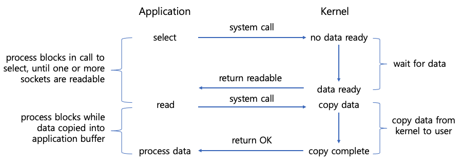
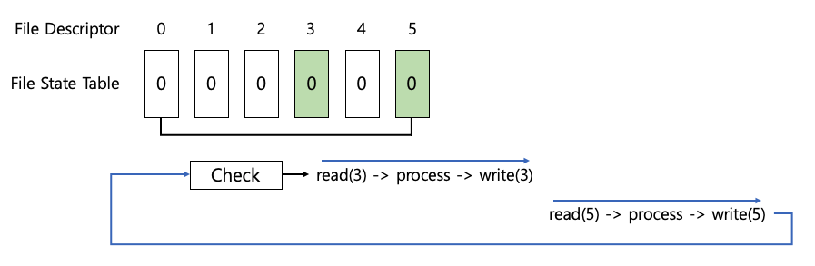

## 1. I/O 멀티플렉싱 개요

- 커널에서는 하나의 스레드가 여러 개의 소켓(파일)을 핸들링할 수 있는 select, poll, epoll, io_uring과 같은 시스템 콜을 제공합니다.
- 멀티플렉싱 모델에서는 select 함수를 호출해서 여러 개의 소켓 중 read 함수 호출이 가능한 소켓이 생길 때까지 대기합니다.

### 1.1 동작 방식

- select 시스템 콜 단계
	- 애플리케이션이 select 시스템 콜을 호출
	- 커널이 "no data ready" 상태 확인
	- 커널이 데이터가 준비될 때까지 대기
	- 데이터가 준비되면 "return readable" 신호를 애플리케이션에 전달
- read 시스템 콜 단계
	- 애플리케이션이 read 시스템 콜 호출
	- 커널이 데이터를 복사 (copy data)
	- 데이터 복사가 완료되면 "return OK" 신호 전달
	- 애플리케이션이 복사된 데이터 처리 시작

## 2. select 함수

### 2.1 동작 원리

- select 방식은 이벤트(입력, 출력, 에러)별로 감시할 파일들을 fd_set이라는 파일 상태 테이블(파일 디스크립터 비트 배열)에 등록합니다.
- 등록된 파일에 이벤트가 발생하면 fd_set을 확인하는 방식으로 동작합니다.

### 2.2 처리 과정

1. 6개의 파일을 다뤄야 할 때, 6개의 파일에 대해 입출력 데이터가 준비될 때까지 이벤트를 기다리는 파일 상태 테이블 준비
2. 6개의 파일 중 입출력이 준비된 파일에 대한 이벤트 발생 시 이벤트가 발생한 파일 디스크립터의 수 반환
3. 이벤트가 준비된 파일에 대해 입출력 수행
4. 이미 데이터가 준비된 파일에 대해 입출력을 수행하므로 무한정 대기하는 블록이 발생하지 않음

### 2.3 장점

- 단일 프로세스(스레드)에서 여러 파일의 입출력 처리 가능
- 동시에 수만 개의 커넥션 처리 가능 (C10k problem 해결)
- POSIX 표준을 따르므로 지원하는 운영 체제가 많아 이식성이 좋음
- 클라이언트 요청마다 별도 스레드를 생성하지 않아 컨텍스트 전환 오버헤드 없음

### 2.4 단점

- select 함수 호출 시 매번 관련 정보를 전달해야 함 (커널에 정보가 등록되지 않음)
- 이벤트가 발생한 파일 디스크립터 확인을 위해 fd_set 테이블 전체 검사 필요
- 검사할 수 있는 파일 디스크립터 개수 제한 (최대 1024개)
- select 함수 호출할 때마다 데이터 복사 필요 (이벤트 처리 시 fd_set 테이블 변경 필요)

## 3. poll 함수

### 3.1 동작 원리

- poll도 select와 마찬가지로 멀티플렉싱을 구현하는 시스템 콜입니다.
- 파일 디스크립터의 이벤트를 기다리다가 이벤트가 발생하면, poll에서의 블록이 해제되고 어떤 파일 디스크립터에 이벤트가 발생했는지 검사합니다.

### 3.2 select와의 차이점

1. **감시 방식**
	- select처럼 표준 입력, 출력, 에러를 따로 감시할 필요가 없음
	- 단일 pollfd 구조체로 모든 이벤트 처리
2. **타임아웃 처리**
	- select는 timeval 구조체 사용
	- poll은 별도 구조체 없이 타임아웃 설정 가능

### 3.3 장점과 한계

- select와 같이 단일 프로세스에서 여러 파일 입출력 처리 가능
- 이벤트 감시 방식이 더 단순하고 직관적
- 일부 UNIX 시스템은 poll을 지원하지 않아 이식성 제약

## 4. epoll 함수

### 4.1 개요

- epoll은 select와 poll의 단점을 보완하기 위해 리눅스 커널 2.5.44 버전에서 처음 소개된 시스템 콜입니다.
- 이벤트 기반의 I/O 모델을 사용하며, 이벤트가 발생한 파일 디스크립터만 반환하기 때문에 select와 poll의 단점을 보완했습니다.

### 4.2 주요 특징

1. **효율적인 이벤트 처리**
	- 상태 변화를 확인하기 위한 전체 파일 디스크립터 대상 반복문 불필요
	- 커널에서 상태 정보를 유지하여 매번 정보 전달 불필요
	- 이벤트 발생한 파일 디스크립터만 처리
2. **확장성**
	- 파일 디스크립터 수 제한이 없음
	- 대규모 동시 연결 처리에 적합

### 4.3 한계

- Linux 전용 시스템 콜로 이식성 제한
- Windows의 IOCP 기반 시스템과의 호환성 문제
- select 대비 구현 복잡도 증가

## 5. POSIX와 이식성

### 5.1 POSIX 표준

- POSIX(Portable Operating System Interface)는 이식 가능 운영 체제 인터페이스의 약자로:
	- 서로 다른 UNIX OS의 공통 API를 정리
	- 이식성이 높은 유닉스 응용 프로그램 개발 목적
	- IEEE가 책정한 애플리케이션 인터페이스 규격

### 5.2 멀티플렉싱 API 선택 기준

1. **이식성 중시**
	- select: POSIX 표준으로 높은 이식성 필요시
	- poll: 유닉스 계열에서 향상된 기능 필요시
2. **성능 중시**
	- epoll: 리눅스 환경에서 고성능 필요시
	- IOCP: Windows 환경에서 고성능 필요시