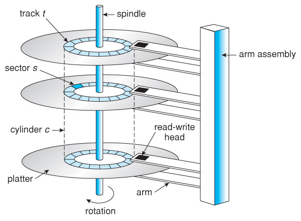
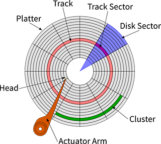

## 1. 자기 디스크(Magnetic Disks)의 이해

- 자기 디스크는 오랫동안 컴퓨터 시스템의 주요 저장 장치로 사용되어 왔습니다.
- SSD가 점차 보편화되고 있지만, 여전히 많은 시스템에서 대용량 저장 장치로 자기 디스크를 활용하고 있습니다.

### 1.1 자기 디스크의 물리적 구조

- 자기 디스크는 여러 개의 구성 요소가 정교하게 조합된 기계식 저장 장치입니다.
- 각 구성 요소들은 다음과 같은 역할을 수행합니다.

#### 1.1.1 플래터(Platter)

- 자기 물질로 코팅된 원판 형태의 저장 매체입니다
- 하나의 디스크에 여러 개의 플래터가 쌓여있는 구조입니다
- 각 플래터의 양면에 데이터를 저장할 수 있으며, 면마다 별도의 읽기/쓰기 헤드가 있습니다

#### 1.1.2 트랙(Track)과 섹터(Sector)

하드디스크의 데이터 저장 구조는 다음과 같습니다:

- 트랙(Track)
	- 플래터 위의 동심원 형태로 구성된 데이터 저장 영역입니다
	- 그림에서 빨간 동심원들이 각각의 트랙을 나타냅니다
	- 빨간색으로 강조된 동심원이 하나의 완전한 트랙 예시입니다
- 섹터(Sector)의 구조
	- 디스크 섹터(Disk Sector, 보라색 부분)
		- 플래터를 중심에서 부채꼴 모양으로 나눈 영역입니다
		- 이는 디스크의 물리적 구조를 나타냅니다
	- 트랙 섹터(Track Sector) 또는 블록(Block)
		- 트랙(빨간색)과 디스크 섹터(보라색)가 교차하는 영역입니다
		- 실제 데이터가 저장되는 공간입니다
		- 일반적으로 512바이트 크기를 가집니다
- 클러스터(Cluster, 초록색 부분)
	- 여러 개의 블록(트랙 섹터)을 묶은 논리적 저장 단위입니다
	- 파일 시스템이 데이터를 관리하는 최소 단위입니다
	- 그림에서 초록색으로 표시된 영역이 하나의 클러스터 예시입니다

### 1.1.3 블록과 바이트의 주소 체계

- 블록(Block)은 디스크의 기본 저장 단위로, 트랙과 섹터의 교차점에 위치합니다
- 디스크에서 데이터의 위치는 계층적 주소 체계로 표현됩니다:

#### 블록 주소

- 블록은 물리적 위치를 나타내는 주소를 가집니다
- [트랙 번호, 섹터 번호]의 형태로 표현됩니다
- 이를 통해 디스크 상의 정확한 블록 위치를 찾을 수 있습니다

#### 바이트 주소

- 각 블록은 일반적으로 512바이트로 구성됩니다
- 블록 내의 특정 바이트 위치는 오프셋(offset)으로 표현합니다
- 따라서 디스크 상의 특정 바이트는 [트랙 번호, 섹터 번호, 오프셋]으로 정확한 위치를 지정할 수 있습니다

:::info 주소 체계의 예시
예를 들어, 트랙 5, 섹터 3의 블록에서 20번째 바이트를 가리키고 싶다면:

- 블록 주소: [5, 3]
- 바이트 주소: [5, 3, 20]
  :::

### 1.2 디스크 접근 메커니즘

자기 디스크의 데이터 접근 시간은 다음 세 가지 요소로 구성됩니다:

- 탐색 시간(Seek Time): 읽기/쓰기 헤드를 원하는 트랙으로 이동하는 시간
- 회전 지연(Rotational Latency): 원하는 섹터가 헤드 아래로 올 때까지 기다리는 시간
- 전송 시간(Transfer Time): 실제 데이터를 읽거나 쓰는 시간

:::info 성능에 영향을 미치는 주요 요소
탐색 시간(Seek Time)이 전체 접근 시간의 대부분을 차지하며, 이는 자기 디스크의 성능을 결정하는 가장 중요한 요소입니다.
:::

### 1.3 순차 I/O와 랜덤 I/O

데이터베이스 시스템의 성능은 디스크 I/O 패턴에 크게 영향을 받습니다.

#### 순차 I/O

- 디스크의 연속된 영역을 순차적으로 읽거나 쓰는 방식
- 헤드 이동이 최소화되어 효율적인 데이터 접근 가능
- 대용량 파일 처리에 적합

#### 랜덤 I/O

- 디스크의 여러 위치를 불규칙하게 접근하는 방식
- 잦은 헤드 이동으로 인한 성능 저하 발생
- 데이터베이스의 일반적인 작업 패턴

:::warning 성능 고려사항
같은 양의 데이터를 처리하더라도, 랜덤 I/O는 순차 I/O에 비해 현저히 낮은 성능을 보입니다. 데이터베이스 설계 시 이러한 특성을 고려해야 합니다.
:::

## 2. SSD(Solid State Drive)의 특징

SSD는 기존 자기 디스크의 한계를 극복하기 위해 개발된 저장 장치입니다. 플래시 메모리를 기반으로 하여 다음과 같은 특징을 가집니다:

### 2.1 SSD의 장점

- 기계적 부품이 없어 물리적 내구성이 우수
- 데이터 접근 시 지연 시간(Latency)이 매우 짧음
- 전력 소비가 적어 에너지 효율적
- 랜덤 I/O 성능이 자기 디스크보다 월등히 우수

### 2.2 SSD의 제한사항

- 용량당 가격이 자기 디스크보다 높음
- 쓰기 횟수에 제한이 있어 수명이 상대적으로 짧음
- 대용량 모델의 경우 가격이 매우 높음

:::tip 최적의 사용 사례
SSD는 다음과 같은 경우에 특히 효과적입니다:

- 데이터베이스의 메타데이터 저장
- 빈번한 랜덤 I/O가 발생하는 시스템
- 응답 시간이 중요한 애플리케이션
  :::

## 3. 저장 장치 선택 가이드

시스템 설계 시 다음 요소들을 고려하여 적절한 저장 장치를 선택해야 합니다:

- 워크로드 특성 (순차/랜덤 I/O 비율)
- 필요한 저장 용량
- 성능 요구사항
- 비용 제약
- 전력 소비량
- 신뢰성 요구사항

:::info 하이브리드 접근 방식
많은 시스템에서 SSD와 자기 디스크를 함께 사용하여 각 장치의 장점을 활용하고 있습니다:

- SSD: 운영체제, 자주 접근하는 데이터, 성능이 중요한 애플리케이션
- 자기 디스크: 대용량 데이터 저장, 아카이브, 백업
  :::