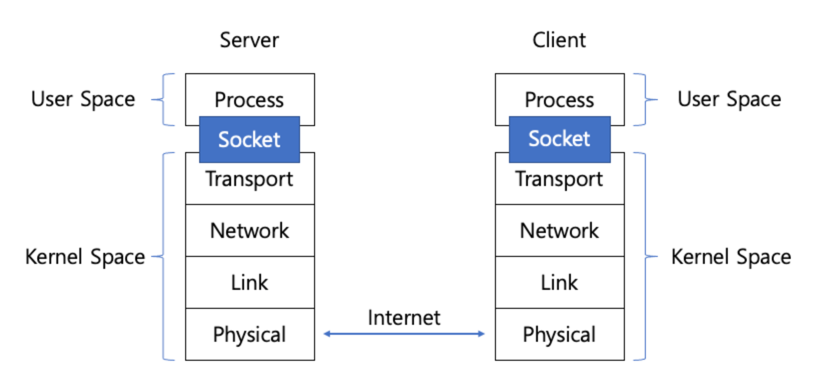

## 1. Socket

- Socket은 네트워크 입출력을 위해 Unix나 윈도우를 포함한 많은 운영체제에서 사용하는 인터페이스입니다.

### 1.1 개요

소켓은 네트워크에서 서버와 클라이언트, 두 개의 프로세스가 특정 포트를 통해 양방향 통신이 가능하도록 만들어 주는 추상화된 장치입니다. 메모리의 사용자 공간에 존재하는 프로세스(서버, 클라이언트)는 커널 공간에
생성된 소켓을 통해 데이터를 송수신할 수 있습니다.

### 1.2 구조와 특징

소켓은 다음과 같은 주요 구성 요소를 가집니다:

- 지역(로컬) IP 주소와 포트 번호
- 상대방의 IP 주소와 포트 번호
- 수신 버퍼와 송신 버퍼
- 소켓의 상태 정보
- 통신 프로토콜 관련 정보

## 2. File Descriptor

### 2.1 정의

파일 디스크립터(File Descriptor)는 운영체제가 파일을 식별하기 위해 사용하는 정수입니다. 저수준 파일 입출력 함수는 입출력을 목적으로 파일 디스크립터를 요구합니다.

### 2.2 Unix 철학

Unix 계열 OS에서는 'Everything is a File' 철학에 따라 소켓도 파일 디스크립터로 관리됩니다. 이는 다음과 같은 의미를 가집니다:

- 모든 입출력 장치를 파일처럼 다룰 수 있음
- 저수준 파일 입출력 함수에 소켓의 파일 디스크립터를 전달하면, 소켓을 대상으로 입출력을 진행
- 일관된 인터페이스로 다양한 리소스 접근 가능

## 3. Blocking I/O

### 3.1 동작 방식

애플리케이션에서 I/O 작업을 할 때, 스레드는 데이터가 사용할 수 있는 상태로 준비될 때까지 대기합니다. 예를 들어 소켓을 통해 read를 수행하는 경우 데이터가 네트워크를 통해 도착할 때까지 기다립니다.

### 3.2 상세 처리 과정

1. **데이터 도착**
	- 패킷이 네트워크를 통해 도착하면 커널 내 버퍼에 복사됩니다.

2. **메모리 복사**
	- 커널 내 버퍼에 복사된 데이터를 애플리케이션에서 사용하기 위해서는 커널 공간(kernel space)에서 사용자 공간(user space)으로 복사해야 합니다.
	- 이는 애플리케이션이 사용자 모드에서 사용자 공간에만 접근할 수 있기 때문입니다.

3. **프로세스 블로킹**
	- 프로세스(스레드)가 하나의 소켓에 대해 read 함수를 호출하면, 데이터가 네트워크를 통해 커널 공간에 도착해 사용자 공간의 프로세스 버퍼에 복사될 때까지 시스템 콜이 반환되지 않습니다.

## 4. 데이터 이동 경로

### 4.1 기본 구조

운영체제에서 데이터 입출력은 다음과 같은 구조로 이루어집니다:

- 사용자 공간(User Space)과 커널 공간(Kernel Space) 분리
- 디바이스와의 실제 데이터 전송은 커널 공간에서 수행
- DMA(Direct Memory Access)를 통한 효율적인 데이터 전송

### 4.2 데이터 입력 과정

1. **디바이스 → 커널 버퍼**
	- 디바이스(네트워크 카드, 디스크 등)로부터 데이터 수신
	- DMA 컨트롤러가 CPU 개입 없이 직접 메모리로 데이터 전송

2. **커널 버퍼 → 사용자 버퍼**
	- 시스템 콜을 통해 커널 버퍼의 데이터를 사용자 버퍼로 복사
	- 이 과정에서 Context Switch 발생

### 4.3 데이터 출력 과정

1. **사용자 버퍼 → 커널 버퍼**
	- 프로세스가 시스템 콜을 통해 데이터를 커널 버퍼로 복사

2. **커널 버퍼 → 디바이스**
	- DMA 컨트롤러가 커널 버퍼의 데이터를 디바이스로 전송
	- 디바이스를 통한 실제 데이터 전송 수행

## 5. 특징과 한계

### 5.1 장점

- 구현이 단순하고 직관적인 코드 작성 가능
- 데이터의 순차적 처리가 보장됨
- 프로그래밍 모델이 단순하여 디버깅이 용이
- 리소스 관리가 용이하고 예측 가능한 동작

### 5.2 단점

- I/O 작업 동안 스레드가 블로킹되어 다른 작업 수행 불가
- 동시에 여러 클라이언트 처리 시 심각한 성능 저하
- 리소스 활용도가 매우 낮음
- 확장성에 제약이 있음