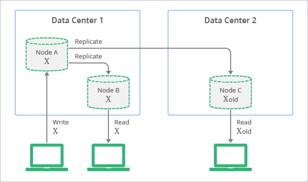
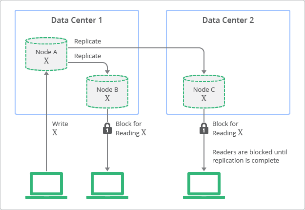

## 2. Eventual consistency

- Eventual consistency는 항목이 새롭게 업데이트되지 않는다는 전제하에 항목의 모든 읽기 작업이 최종적으로는 마지막으로 업데이트된 값을 반환한다는 것을 이론적으로 보장합니다. 
- 인터넷 DNS(도메인 이름 시스템)는 eventual consistency 모델이 사용된 시스템의 예로 잘 알려져 있습니다. 
- DNS 서버가 항상 최신의 값을 반영하는 것은 아니며, 이러한 값들은 인터넷상의 수많은 디렉터리에서 캐싱되고 복제됩니다. 
- 수정된 값을 모든 DNS 클라이언트와 서버에 복제하려면 어느 정도의 시간이 소요됩니다. 
- 하지만 DNS 시스템은 인터넷의 근간을 이루는 요소로 자리잡은 매우 성공적인 시스템입니다. 
- DNS는 가용성이 매우 높으며 엄청난 확장성이 증명되었고, 인터넷 전체에서 수천만 대 기기의 이름 조회를 가능하게 하고 있습니다.
- 시스템의 가용성과 성능을 높이는 대신, 일시적인 데이터 불일치를 허용한다고 볼 수 있습니다.

### 2.1 예시

- 위 그림은 eventual consistency를 고려한 복제의 개념을 보여줍니다. 
- 이 다이어그램에서 복제본을 읽는 것은 언제든 가능하지만 일부 복제본은 특정 시점에 상위 노드에 쓰여진 값과 일치하지 않을 수 있음을 볼 수 있습니다. 
- 다이어그램에서 노드 A는 상위 노드이며 노드 B와 C는 복제본입니다.

## 3. strong consistency

- 반대로 기존의 관계형 데이터베이스는 즉각적 일관성이라도 하는 strong consistency 개념을 토대로 설계되었습니다. 
- 즉, 업데이트 즉시 조회된 데이터는 항목을 보는 모든 사용자에게 일관성 있게 표시됩니다. 
  - 따라서 모든 읽기 작업이 가장 최근의 쓰기 작업 결과를 반환하는 것을 보장합니다.
- 이러한 특성은 관계형 데이터를 사용하는 많은 개발자에게 기본적인 전제가 되어 왔습니다. 
- 하지만 strong consistency를 얻기 위해서는 개발자가 애플리케이션의 확장성과 성능을 어느 정도 포기해야 합니다. 
- 간단히 말해 업데이트 또는 복제 프로세스 도중에는 데이터를 잠금 설정하여 다른 프로세스에서 동일한 데이터를 업데이트하지 않도록 해야 합니다.
- 데이터의 정확성이 중요한 금융 거래나 재고 관리 시스템에서 주로 사용됩니다.

### 3.1 예시

- 위 그림은 strong consistency에서의 배포 토폴로지 및 복제 프로세스에 대한 개념적 묘사가 나와 있습니다. 
- 이 다이어그램에서는 복제본이 항상 상위 노드와 일치하는 값을 가지지만 업데이트가 완료되기 전까지 이 값에 액세스할 수 없다는 점을 확인할 수 있습니다.

## 4. strong consistency와 eventual consistency 간 균형 유지

- 비관계형 데이터베이스는 최근에 와서 주목받고 있으며, 특히 높은 확장성과 높은 가용성을 갖춘 성능을 요구하는 웹 애플리케이션에서 자주 사용되고 있습니다. 
- 비관계형 데이터베이스는 개발자가 각 애플리케이션에서 strong consistency와 eventual consistency 사이에서 최적의 균형을 맞출 수 있도록 해줍니다. 
- 개발자는 이를 통해 두 일관성의 장점을 결합하여 활용할 수 있습니다. 
- 예를 들어 '친구 목록에서 특정 시간에 온라인 상태인 사용자 확인하기' 또는 '게시물에서 몇 명의 사용자가 +1을 눌렀는지 확인하기'는 strong consistency를 필요로 하지 않는 사용 사례에 해당합니다.
- 이러한 사용 사례에서 eventual consistency를 활용하면 확장성과 성능을 확보할 수 있습니다. 
- strong consistency를 필요로 하는 경우로는 '사용자가 결제 프로세스를 완료했는지' 또는 '게임 플레이어가 한 전투 세션 동안 획득한 포인트' 정보 등의 사용 사례를 예시로 들 수 있습니다.
- 매우 많은 항목이 포함된 사용 사례에서는 보통 eventual consistency가 최적의 모델임을 알 수 있습니다. 
- 쿼리가 대량의 결과를 반환하는 경우에는 특정 항목을 포함하거나 제외해도 사용자 경험에 영향을 미치지 않을 가능성이 높습니다. 
- 반면에 항목 수가 적고 맥락이 제한된 사용 사례에서는 strong consistency가 필요하다는 것을 알 수 있습니다. 
- 사용자가 맥락을 통해 포함하거나 제외할 항목을 알 수 있으므로 사용자 환경이 영향을 받게 됩니다.

참고

- https://cloud.google.com/datastore/docs/articles/balancing-strong-and-eventual-consistency-with-google-cloud-datastore?hl=ko