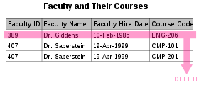

## 1. Database Normalization

- 데이터베이스 정규화는 데이터 중복을 줄이고 데이터 무결성을 향상시키기 위해 일련의 정규 양식에 따라 관계형 데이터베이스를 구성하는 과정입니다.
- 에드가 F. 코드(Edgar F. Codd)에 의해 처음 제안되었습니다.
- 정규화에는 데이터베이스의 컬럼(Column)과 테이블(Table)을 구성하여 데이터베이스 무결성 제약 조건에 의해 종속성이 적절하게 적용되도록 하는 작업이 수반됩니다.
- 이것은 합성 과정(새 데이터베이스 설계 생성) 또는 분해 과정(기존 데이터베이스 설계 개선)에 의해 일부 공식 규칙을 적용함으로써 달성됩니다.

## 2. 이상(Anomaly)

- 정규화를 거치지 않은 데이터베이스에서 발생할 수 있는 현상입니다.
- 데이터들이 불필요하게 중복되어 릴레이션 조작에 예기치 못한 문제가 발생합니다.

### 이상의 원인

- 이상은 속성들 간에 존재하는 여러 종류의 종속 관계를 하나의 릴레이션에 표현할 때 발생합니다.

### 2.1. 갱신 이상 (Update Anomaly)

- 속성값 갱신 시 일부 튜플만 갱신되어 모순이 발생합니다.

#### 예시

- 직원의 스킬을 나타내는 릴레이션입니다.
- Employee ID, Employee Address, Skill 속성으로 구성됩니다.
- 한 직원이 이사를 가서 주소가 변경되었습니다.
  - 96 Walnut Avenue -> 94 chestnut street
  - 따라서 아래 2개의 레코드의 주소를 모두 변경해야 합니다.
  - 만약 모두를 변경하지 않고 일부만 변경한 경우 해당 릴레이션은 일관성이 깨진 상태가 됩니다.

### 2.2. 삽입 이상 (Insertion Anomaly)

- 릴레이션에 새로운 레코드를 삽입할 수 없는 현상입니다.
- 데이터 삽입 시 의도와 다른 값들도 삽입됩니다.

#### 예시

- 교수와 자신의 수업을 나타내는 테이블이 있습니다.
- Faculty ID, Faculty Name, Faculty Hire Date, Course Code의 속성을 가집니다.
- 만약 새롭게 임명된 교수는 현재 진행하는 수업이 없기 때문에 테이블에 삽입할 수 없습니다.
  - Course Code가 not null인 경우입니다.

### 2.3. 삭제 이상 (Deletion Anomaly)

- 특정 데이터를 삭제할 때 삭제하지 말아야 할 다른 데이터까지 삭제되는 현상입니다.
- 데이터 삭제 시 의도와 다른 값들도 연쇄 삭제됩니다.

#### 예시

- 교수와 자신의 수업을 나타내는 테이블이 있습니다.
- Faculty ID, Faculty Name, Faculty Hire Date, Course Code의 속성을 가집니다.
  - Course Code는 not null입니다.
- 교수가 일시적으로 수업을 그만두는 경우 Course Code 속성만 null로 만들 수 없기 때문에 해당 레코드를 삭제해야 합니다.
  - 교수의 수업 데이터만 삭제하고 싶은데 교수의 데이터까지 삭제되는 문제가 발생합니다.

## 3. 함수 종속 (Functional Dependency)

- 데이터베이스의 릴레이션(Relation)에서 두 개의 애트리뷰트(Attribute) 집합 간 제약의 일종입니다.
- 어떤 릴레이션 R에서, X와 Y를 각각 R의 애트리뷰트 집합의 부분 집합이라 합니다.
- 애트리뷰트 **X의 값 각각에 대해** 시간에 관계없이 항상 애트리뷰트 **Y의 값이 오직 하나만 연관**되어 있을 때 Y는 X에 함수 종속이라 합니다.
- `X → Y`라고 표기합니다.
- X를 결정자(Determinant Set)이라 하고, Y를 종속자(Dependent Attribute)라고 합니다.

:::tip[함수 종속 기본 예시]

학생 테이블에서:
- `학번 → 이름`: 학번이 정해지면 이름이 유일하게 결정됩니다.
- `학번 → 학과`: 학번이 정해지면 소속 학과가 유일하게 결정됩니다.
- `학번 → 학년`: 학번이 정해지면 학년이 유일하게 결정됩니다.

이처럼 학번(X)을 알면 이름, 학과, 학년(Y)이 하나로 결정되므로 함수 종속 관계입니다.

:::

### 3.1. 완전 함수 종속

- 종속자가 기본키에만 종속되며, 기본키가 여러 속성으로 구성되어 있을 경우 기본키를 구성하는 모든 속성이 포함된 기본키의 부분집합에 종속된 경우입니다.

#### 예시

| 학번 | 과목코드 | 성적 | 학점 |
|:----:|:--------:|:----:|:----:|
| 100  |   CS01   |  95  |  A+  |
| 100  |   MA01   |  88  |  B+  |
| 200  |   CS01   |  92  |  A   |

- 기본키: `(학번, 과목코드)`
- `(학번, 과목코드) → 성적`: **완전 함수 종속**
  - 학번과 과목코드를 **모두** 알아야 성적을 알 수 있습니다.
  - 학번만으로는 성적을 알 수 없고, 과목코드만으로도 성적을 알 수 없습니다.
- `(학번, 과목코드) → 학점`: **완전 함수 종속**
  - 마찬가지로 둘 다 필요합니다.

:::info[완전 함수 종속의 핵심]

완전 함수 종속은 기본키를 구성하는 **모든 속성**이 있어야만 다른 속성을 결정할 수 있는 경우입니다. 기본키의 일부만으로는 결정할 수 없습니다.

:::

### 3.2. 부분적 함수 종속

- 릴레이션에서 종속자가 기본키가 아닌 다른 속성에 종속되거나, 기본키가 여러 속성으로 구성되어 있을 경우 기본키를 구성하는 속성 중 일부만 종속된 경우입니다.

#### 예시

| 학번 | 과목코드 | 성적 | 학생이름 | 과목이름     |
|:----:|:--------:|:----:|:--------:|:------------:|
| 100  |   CS01   |  95  |  홍길동  | 데이터베이스 |
| 100  |   MA01   |  88  |  홍길동  | 선형대수학   |
| 200  |   CS01   |  92  |  임꺽정  | 데이터베이스 |

- 기본키: `(학번, 과목코드)`
- `(학번, 과목코드) → 성적`: 완전 함수 종속 ✅
- `학번 → 학생이름`: **부분적 함수 종속** ⚠️
  - 학번**만** 알면 학생이름을 알 수 있습니다.
  - 기본키의 일부(학번)만으로 학생이름이 결정됩니다.
- `과목코드 → 과목이름`: **부분적 함수 종속** ⚠️
  - 과목코드**만** 알면 과목이름을 알 수 있습니다.
  - 기본키의 일부(과목코드)만으로 과목이름이 결정됩니다.

:::warning[부분적 함수 종속의 문제점]

부분적 함수 종속이 있으면 데이터 중복이 발생합니다. 위 예시에서:
- 학번 100인 학생의 이름 '홍길동'이 여러 행에 중복됩니다.
- 과목코드 CS01의 과목이름 '데이터베이스'가 여러 행에 중복됩니다.

이런 중복은 갱신 이상, 삽입 이상, 삭제 이상을 유발합니다. 2NF는 이를 해결합니다.

:::

### 3.3. 이행적 함수 종속

- 릴레이션에서 X, Y, Z라는 3개의 속성이 있을 때 `X → Y`, `Y → Z`이란 종속 관계가 있을 경우, `X → Z`가 성립될 때 이행적 함수 종속이라고 합니다.
- 즉, X를 알면 Y를 알고 그를 통해 Z를 알 수 있는 경우입니다.

#### 예시

| 학번 | 학생이름 | 학과코드 | 학과이름 | 학과장   |
|:----:|:--------:|:--------:|:--------:|:--------:|
| 100  |  홍길동  |   CS     | 컴퓨터과 | 김교수   |
| 200  |  임꺽정  |   EE     | 전자과   | 박교수   |
| 300  | 신사임당 |   CS     | 컴퓨터과 | 김교수   |

- 기본키: `학번`
- `학번 → 학과코드`: 학번을 알면 학과코드를 알 수 있습니다.
- `학과코드 → 학과장`: 학과코드를 알면 학과장을 알 수 있습니다.
- `학번 → 학과장`: **이행적 함수 종속** ⚠️
  - 학번을 알면 → 학과코드를 알 수 있고 → 학과장을 알 수 있습니다.
  - 학번이 직접 학과장을 결정하는 것이 아니라, 학과코드를 **거쳐서** 학과장을 결정합니다.
- 마찬가지로:
  - `학번 → 학과코드`
  - `학과코드 → 학과이름`
  - `학번 → 학과이름`: **이행적 함수 종속** ⚠️

:::warning[이행적 함수 종속의 문제점]

이행적 함수 종속이 있으면:
- 학번 100과 300이 같은 컴퓨터과 소속이므로 '김교수' 정보가 중복됩니다.
- 컴퓨터과의 학과장이 변경되면 여러 행을 모두 수정해야 합니다. (갱신 이상)
- 학번 100이 자퇴하면 컴퓨터과 학과장 정보가 사라질 수 있습니다. (삭제 이상)

3NF는 이런 이행적 함수 종속을 제거하여 문제를 해결합니다.

:::

:::tip[함수 종속 관계 정리]

| 종속 유형        | 의미                                      | 문제점                      | 해결 정규형 |
|:----------------|:------------------------------------------|:----------------------------|:----------:|
| 완전 함수 종속   | 기본키 전체 → 속성                         | 문제 없음 (바람직함) ✅      | -          |
| 부분적 함수 종속 | 기본키 일부 → 속성                         | 데이터 중복, 이상 현상 발생 | 2NF        |
| 이행적 함수 종속 | 기본키 → 일반속성 → 다른 일반속성           | 데이터 중복, 이상 현상 발생 | 3NF        |

:::

## 4. 정규화

- 중복을 배제하여 삽입, 삭제, 갱신 이상의 발생을 방지합니다.
- 각 릴레이션에 중복된 종속성을 여러 개의 릴레이션에 분할합니다.

### 4.1. 제1정규형 (1NF)

- 릴레이션에 속한 모든 도메인이 원자값이어야 합니다.
- 원자값이란 단일 값을 의미합니다. 따라서 다중 값을 가지면 안 됩니다.

#### 1NF를 만족하지 않는 릴레이션

| 수강과목 |      수강자      |
| :------: | :--------------: |
|   수학   |      홍길동      |
|   과학   | 임꺽정, 신사임당 |
|   사회   |  홍길동, 임꺽정  |

:::warning[발생할 수 있는 이상(Anomaly)]

- **갱신 이상**: 홍길동이 사회과목을 '역사'로 바꾸었습니다. 그럼 임꺽정이 듣고 있는 사회 과목도 바뀌어버립니다.
  - `UPDATE 과목 SET 수강과목 = '역사' WHERE 수강과목 = '사회' AND 수강자 = '홍길동'`
- **삭제 이상**: 임꺽정이 '과학' 과목을 수강취소했습니다. 그럼 신사임당의 수강 정보도 삭제됩니다.
  - `DELETE FROM 과목 WHERE 수강과목 = '과학' AND 수강자 = '임꺽정'`

:::

#### 1NF를 만족시키는 릴레이션

- 가장 간단한 것은 원자값으로 분해해 튜플로 구분하고 다른 키를 추가하는 것입니다.

| 수강과목 |  수강자  | 일련번호 |
| :------: | :------: | :------: |
|   수학   |  홍길동  |    1     |
|   과학   |  임꺽정  |    2     |
|   과학   | 신사임당 |    3     |
|   사회   |  홍길동  |    4     |
|   사회   |  임꺽정  |    5     |

### 4.2. 제2정규형 (2NF)

- 2NF를 만족하려면 부분적 함수 종속을 제거해야 합니다.
- 즉 완전 함수 종속이 되도록 해야 합니다.

#### 2NF를 만족하지 않는 릴레이션

| 학번 |   이름   | 소속학과 | 학과장 |
| :--: | :------: | :------: | :----: |
| 1901 |  홍길동  | 컴퓨터과 | 김교수 |
| 1845 |  임꺽정  |  전자과  | 박교수 |
| 1706 | 신사임당 |  기계과  | 천교수 |
| 1925 |  장영실  | 컴퓨터과 | 김교수 |

- 학번이 기본키입니다(한 학과 내의 이름은 중복되지 않는다고 가정).
- 부분적 함수 종속이 발생합니다.
  - `학번 → 학과장`
  - `소속학과 → 학과장`
  - 학과장이라는 종속자가 기본키(학번)가 아닌 다른 속성(소속학과)에 종속되므로 부분적 함수 종속입니다.
  - 즉 학과장이라는 속성이 이 릴레이션에 꼭 필요한 속성이 아니며 이 릴레이션에 있는 순간 '김교수'와 같이 계속 중복 적재될 것입니다.

:::warning[발생할 수 있는 이상(Anomaly)]

- **삽입 이상**: 컴퓨터과, 전자과, 기계과 학생을 추가하고자 할 경우 더 이상 불필요한 중복정보인 학과장 정보가 삽입되어야 합니다.
- **갱신 이상**: 컴퓨터과의 학과장이 변경되었습니다. 하나만 변경하면 모순이 발생하므로 다 찾아서 변경해야 합니다.
- **삭제 이상**: 신사임당이 자퇴해서 삭제하고자 합니다. 이 삭제로 인해 기계과 학과장의 정보가 사라져버립니다.

:::

#### 2NF를 만족시키는 릴레이션

- 아래와 같이 릴레이션을 구분하는 것이 바람직합니다.

| 학번 |   이름   | 소속학과 |
| :--: | :------: | :------: |
| 1901 |  홍길동  | 컴퓨터과 |
| 1845 |  임꺽정  |  전자과  |
| 1706 | 신사임당 |  기계과  |
| 1925 |  장영실  | 컴퓨터과 |

|   학과   | 학과장 |
| :------: | :----: |
| 컴퓨터과 | 김교수 |
|  전자과  | 박교수 |
|  기계과  | 천교수 |

### 4.3. 제3정규형 (3NF)

- 3NF를 만족하려면 이행적 함수 종속을 제거해야 합니다.

#### 3NF를 만족하지 않는 릴레이션

| 학번 |   이름   | 소속학과 | 대학 |
| :--: | :------: | :------: | :--: |
| 1901 |  홍길동  | 컴퓨터과 | 공대 |
| 1845 |  임꺽정  |  전자과  | 공대 |
| 1706 | 신사임당 |   경제   | 경상 |
| 1925 |  장영실  |   경영   | 경상 |

- 이행적 함수 종속이 발생합니다.
  - `이름 → 소속학과` 종속 관계(한 학과 내의 이름은 중복되지 않는다고 가정)
  - `소속학과 → 대학` 종속 관계

:::warning[발생할 수 있는 이상(Anomaly)]

- **삽입 이상**: 컴퓨터과, 전자과 학생을 추가하고자 할 경우 더 이상 불필요한 중복정보인 대학 정보가 삽입되어야 합니다.
- **갱신 이상**: 컴퓨터과의 소속 대학이 'IT대학'으로 변경되었습니다. 하나만 변경하면 모순이 발생하므로 다 찾아서 변경해야 합니다.
- **삭제 이상**: 홍길동이 자퇴해서 삭제하고자 합니다. 이 삭제로 인해 컴퓨터과의 대학 정보가 사라져버립니다.

:::

#### 3NF를 만족시키는 릴레이션

| 학번 |   이름   | 소속학과 |
| :--: | :------: | :------: |
| 1901 |  홍길동  | 컴퓨터과 |
| 1845 |  임꺽정  |  전자과  |
| 1706 | 신사임당 |   경제   |
| 1925 |  장영실  |   경영   |

| 소속학과 | 대학 |
| :------: | :--: |
| 컴퓨터과 | 공대 |
|  전자과  | 공대 |
|   경제   | 경상 |
|   경영   | 경상 |

### 4.4. 보이스-코드 정규형 (BCNF)

- BCNF를 만족하려면 결정자이면서 후보키가 아닌 것을 제거해야 합니다.

#### BCNF를 만족하지 않는 릴레이션

| 학번 |     과목     |  교수  |
| :--: | :----------: | :----: |
| 100  | 데이터베이스 | 홍길동 |
| 100  |   자료구조   | 임꺽정 |
| 200  |   네트워크   | 장영실 |
| 300  |   인공지능   | 유관순 |

**제약사항:**

- 한 학생은 동일한 과목에 대해 한 교수에게만 수강 가능합니다.
- 각 교수는 하나의 과목만 담당합니다.
- 한 과목은 여러 교수가 담당 가능합니다.

**함수 종속:**

- `(학번 + 과목) → 교수`를 결정 짓습니다.
- `교수 → 과목`을 결정 짓습니다.
- 즉, 교수 또한 결정자인데 교수는 학번을 결정 지을 수 없으므로 후보키는 아닙니다.

:::warning[발생할 수 있는 이상(Anomaly)]

- **삽입 이상**: 200학생이 데이터베이스를 수강하고자 할 경우, 현재 불필요한 홍길동 교수 정보가 한 번 더 삽입됩니다.
- **갱신 이상**: 홍길동의 담당 과목이 알고리즘으로 바뀌었습니다. 담당 과목을 변경할 경우, 학생의 수강 과목이 변경되어 버립니다.
- **삭제 이상**: 300학생이 자퇴해서 삭제하고자 합니다. 이 삭제로 인해 인공지능 과목을 유관순 교수가 담당하고 있다는 정보가 사라집니다.

:::

#### BCNF를 만족시키는 릴레이션

| 학번 | 과목코드 |
| :--: | :------: |
| 100  |   DB01   |
| 100  |   DS01   |
| 200  |   NW01   |
| 300  |   AI01   |

| 과목코드 |     과목     |  교수  |
| :------: | :----------: | :----: |
|   DB01   | 데이터베이스 | 홍길동 |
|   DS01   |   자료구조   | 임꺽정 |
|   NW01   |   네트워크   | 장영실 |
|   AI01   |   인공지능   | 유관순 |

## 참고

- [데이터베이스 정규화 - IT위키](https://itwiki.kr/w/%EB%8D%B0%EC%9D%B4%ED%84%B0%EB%B2%A0%EC%9D%B4%EC%8A%A4_%EC%A0%95%EA%B7%9C%ED%99%94)