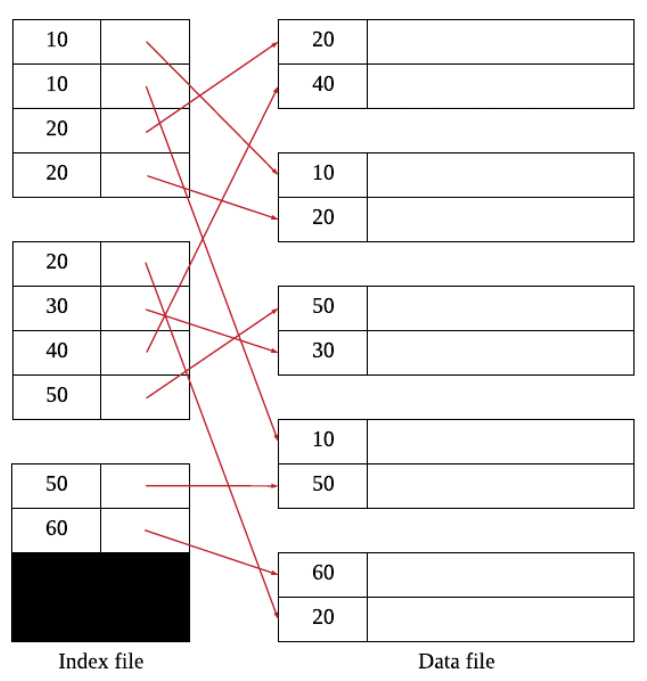
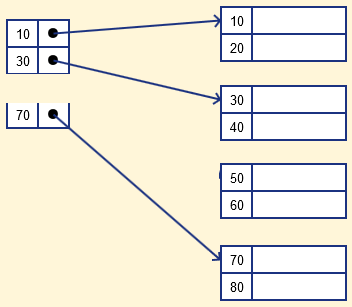

## 1 Index

- 인덱스는 조회 성능을 향상 시킬 수 있는 자료구조입니다.
	- 데이터의 저장 성능을 희생하고 그 대신 데이터의 읽기 속도를 높입니다.
	- 인덱스 자료구조를 관리하기 위한 추가적인 저장 공간(인덱스 파일)을 소비합니다.
- 인덱스는 하나 이상의 컬럼을 이용하여 생성할 수 있습니다.
- 인덱스는 데이터 파일과는 별도의 파일에 저장합니다.
- 인덱스 파일은 일반적으로 데이터 파일에 비하면 훨씬 작습니다.
- 하나의 데이터 파일에 여러개의 인덱스를 정의할 수 있습니다.

### 1.1 Disk Structure

- 인덱스는 자료구조를 이용해 디스크 접근 횟수를 줄여 조회 성능을 최적화합니다.
- 인덱스가 없다면 특정 조건의 레코드를 찾기 위해 테이블의 모든 레코드를 순차적으로 읽어야 하므로(Full Table Scan) 많은 디스크 I/O가 발생합니다.
- B-Tree 구조의 인덱스는 데이터베이스 버퍼 풀(메모리)에 자주 사용되는 데이터 페이지들을 캐시합니다.
- 하지만 인덱스의 전체 크기가 크기 때문에 모든 인덱스 페이지를 메모리에 올릴 수는 없습니다.
- 따라서 인덱스 검색 시에도 디스크에서 필요한 인덱스 페이지를 읽어와야 하는데, 루트→브랜치→리프 노드 순으로 탐색하며 각 레벨에서 디스크 I/O가 발생할 수 있습니다.
- 그러나 자주 사용되는 상위 레벨 노드들은 메모리에 캐시되어 있을 가능성이 높아 실제 디스크 I/O는 더 적을 수 있습니다.
- 최근에는 하드 디스크보다 SSD 드라이브가 많이 활용되고 있지만, 여전히 데이터 저장 매체는 컴퓨터에서 가장 느린 부분입니다.
- 따라서 데이터베이스의 성능 튜닝은 어떻게 디스크 I/O를 줄이느냐가 관건입니다.
- [Mass Storage Structure 디스크의 구조 참고](../../../ComputerScience/OS/Mass-Storage-Structure/Mass-Storage-Structure.md) 

#### 주요 장치의 초당 처리 횟수


### 1.2 인덱스 파일과 엔트리

#### 1.2.1 인덱스 파일(Index File)

- 데이터베이스는 실제 데이터를 저장하는 **데이터 파일(Data File)**과 별도로 검색을 빠르게 하기 위한 **인덱스 파일(Index File)**을 관리합니다.
- 인덱스 파일은 데이터 파일의 레코드가 어디에 있는지 빠르게 찾을 수 있도록 도와주는 일종의 '목차'나 '색인' 역할을 합니다.
- 인덱스 파일은 데이터 파일과 물리적으로 분리되어 저장되며, 데이터 파일보다 훨씬 작은 크기를 가집니다.
- 하나의 데이터 파일에 대해 여러 개의 인덱스 파일을 생성할 수 있습니다.

#### 1.2.2 인덱스 엔트리(Index Entry)

- 인덱스 파일은 **인덱스 엔트리(Index Entry)**라고 불리는 레코드들로 구성됩니다.
- 인덱스 엔트리는 **[탐색 키, 포인터]**의 구조를 가지고 있습니다.
	- **탐색 키(Search Key)**: 레코드를 찾고자 할 때 사용되는 애트리뷰트의 집합입니다.
	- **포인터(Pointer)**: 실제 데이터가 저장된 위치를 가리킵니다.

### 1.3 인덱스의 장점과 단점

#### 1.3.1 장점

- 검색 속도가 향상됩니다.

#### 1.3.2 단점

- 인덱스를 저장하기위한 공간이 추가적으로 필요합니다.
- 삽입, 삭제, 수정 연산의 속도가 저하됩니다.
	- 따라서 인덱스를 하나 더 추가할지 말지는 데이터의 저장 속도를 어디까지 희생할 수 있는지에 따라 결정됩니다.
	- WHERE 절에 사용되는 컬럼이라고 전부 인덱스를 생성하면 데이터 저장 성능이 떨어지고 인덱스의 크기가 비대해져 오히려 역효과가 날 수 있습니다.

### 1.4 인덱스 적용 지침

1. 기본 키는 클러스터링 인덱스를 정의할 훌륭한 후보입니다.
2. 외래 키도 인덱스를 정의할 중요한 후보입니다.
3. 한 애트리뷰트에 들어있는 상이한 값들의 개수가 거의 전체 레코드 수와 비슷하고 그 애트리뷰트가 동등 조건에 사용된다면 비클러스터링 인덱스를 생성하는 것이 좋습니다.
4. 튜플이 많이 들어 있는 릴레이션에서 대부분의 질의가 검색하는 튜플이 2%~4% 미만인 경우에는 인덱스를 생성합니다.
5. 자주 갱신되는 애트리뷰트에는 인덱스를 정의하지 않는 것이 좋습니다.
6. 갱신이 빈번하게 이루어지는 릴레이션에는 인덱스를 많이 만드는 것을 피합니다.
7. 대량의 데이터를 삽입할 때는 인덱스를 제거하고 데이터 삽입이 끝난 후에 다시 생성하는 것이 좋습니다.
8. ORDER BY, GROUP BY 절에 자주 사용되는 애트리뷰트는 인덱스를 정의할 후보입니다.

## 2. 인덱스의 블록 접근 최적화

- 데이터베이스의 성능을 결정하는 가장 중요한 요소 중 하나는 블록 접근 횟수입니다.
- 디스크에서 데이터를 읽고 쓰는 작업은 메모리 접근에 비해 수천 배 이상 느리기 때문에, 블록 접근을 최소화하는 것이 매우 중요합니다.
- 인덱스가 어떻게 블록 접근을 줄이는지 이해하기 위해, 먼저 단순한 Single-level 인덱스 예제를 통해 살펴보겠습니다.

### 2.1 Single-level 인덱스의 최적화

- 데이터베이스에 100개의 레코드가 있고, 각 레코드의 크기가 128바이트, 블록 크기가 512바이트라고 가정해봅시다.
- 이 경우 한 블록에는 4개의 레코드가 저장됩니다.

#### 인덱스가 없는 경우

- 특정 레코드를 찾기 위해서는 전체 데이터 파일을 순차적으로 검색해야 합니다
- 100개의 레코드를 저장하기 위해 25개의 블록이 필요하므로, 최대 25번의 블록 접근이 발생합니다
- 원하는 레코드를 찾을 때까지 모든 블록을 읽어야 하므로 매우 비효율적입니다

#### Dense 인덱스를 사용하는 경우

- 인덱스 엔트리의 크기가 16바이트라면, 한 블록에 32개의 엔트리를 저장할 수 있습니다.
  - 512(블록 크기) / 16(인덱스 엔트리 크기) = 32개
- 100개의 레코드에 대한 인덱스 엔트리를 저장하기 위해 4개의 블록이 필요합니다.
  - 100(레코드 수) / 32(한 블록당 엔트리 수) = 3.125 ≈ 4개 블록 
- Dense 인덱스를 사용하는 경우 검색 과정은 아래와 같습니다.
	- 인덱스 파일 검색: 최대 4번의 블록 접근하여 실제 데이터 블록의 위치를 찾습니다.
	- 실제 데이터 접근: 1번의 블록 접근하여 원하는 데이터를 찾습니다.
- 총 5번의 블록 접근으로 원하는 데이터를 찾을 수 있습니다.
  - 4(인덱스 파일 검색) + 1(실제 데이터 접근) = 5번
- 인덱스가 없을 때보다 블록 접근이 1/5로 감소했습니다.

### 2.2 Multi-level 인덱스의 최적화

- Single-level 인덱스도 데이터가 커지면 인덱스 자체의 크기가 커져 한계에 부딪힙니다.
- 예를 들어 데이터가 100만 건이라면 인덱스 파일도 매우 커져서 블록 접근이 다시 증가하게 됩니다.
- 이를 해결하기 위해 인덱스에 대한 인덱스를 만드는 Multi-level 인덱스를 사용할 수 있습니다.

#### 2-level 인덱스 예제

- 1000개의 레코드가 있고, 레코드 크기는 128바이트, 블록 크기는 512바이트입니다
- 데이터 파일은 250개의 블록이 필요합니다.
  - 1000(레코드 수) * 128(레코드 크기) / 512(블록 크기) = 250 블록
- Level 1 인덱스:
	- 엔트리 크기 16바이트, 블록당 32개 엔트리 저장
	- 1000개의 엔트리를 저장하기 위해 32개의 블록 필요합니다.
	- 1000(엔트리 수) / 32(한 블록당 엔트리 수) = 31.25 ≈ 32개 블록
- Level 2 인덱스:
	- Level 1 인덱스가 정렬되어 있으므로 Sparse 인덱스 사용 가능합니다.
	- 32개의 Level 1 블록에 대한 인덱스 엔트리 필요합니다.
	- 32개의 엔트리는 하나의 블록에 모두 저장 가능합니다.
	- 32개의 엔트리를 저장하기 위해 1개의 블록이 필요합니다.
	- 32(엔트리 수) / 32(한 블록당 엔트리 수) = 1 블록
- 검색 과정
	- Level 2 인덱스 검색: 1번의 블록 접근하여 Level 1 인덱스의 위치를 찾습니다.
	- Level 1 인덱스 검색: 1번의 블록 접근하여 실제 데이터 블록의 위치를 찾습니다.
	- 실제 데이터 접근: 1번의 블록 접근하여 원하는 데이터를 찾습니다.
- 총 3번의 블록 접근으로 원하는 데이터를 찾을 수 있습니다.
  - 1(Level 2 인덱스 검색) + 1(Level 1 인덱스 검색) + 1(실제 데이터 접근) = 3번
- 이는 인덱스가 없을 때의 250번, Single-level 인덱스의 33번(32 + 1)과 비교하면 획기적인 감소입니다.
- 이처럼 Multi-level 인덱스는 인덱스의 크기를 효율적으로 관리하면서도 블록 접근 횟수를 최소화할 수 있습니다.
- 실제 데이터베이스에서 사용하는 B-Tree 인덱스도 이러한 Multi-level 인덱스의 개념을 기반으로 발전된 자료구조입니다.

## 3 Primary Indexing & Secondary Indexing

:::info[분류 기준: 인덱스 키]

이 섹션에서는 **인덱스가 어떤 컬럼을 기반으로 만들어졌는가**에 따라 인덱스를 분류합니다.

- **Primary Indexing**: 데이터 파일의 기본키(Primary Key)로 만든 인덱스
- **Secondary Indexing**: 기본키가 아닌 다른 컬럼으로 만든 인덱스

:::

### 3.1 Primary Indexing

- 데이터 파일의 **기본키(Primary Key)**로 생성된 인덱스를 Primary Indexing이라고 합니다.
- 데이터 파일은 이미 기본키를 기준으로 정렬되어 있습니다.
- 인덱스 엔트리의 구조는 아래와 같습니다.
	- **[기본키, 데이터 블록 위치]**
- 데이터가 정렬되어 있기 때문에 Sparse Index를 사용할 수 있습니다.

**특징**

- 데이터 파일이 인덱스 키(기본키) 순서대로 정렬되어 있어 범위 검색에 효율적입니다.
- 순차적인 데이터 접근 시 성능이 우수합니다.

### 3.2 Secondary Indexing



- 기본키가 **아닌 다른 컬럼**으로 생성된 인덱스를 Secondary Indexing이라고 합니다.
- 인덱스의 탐색 키 값에 따라 **데이터 파일이 정렬되어 있지 않은 경우**를 말합니다.
- Secondary Indexing은 반드시 **Dense Index**를 사용해야 합니다.
	- 데이터 파일이 탐색키에 따라 정렬되어 있지 않기 때문에 Sparse Index를 사용할 수 없습니다.
- 인덱스 엔트리의 구조는 아래와 같습니다.
	- **[인덱스 키, 실제 레코드 위치]**

**특징**

- 하나의 테이블에 여러 개의 Secondary Index를 생성할 수 있습니다.
- Dense Index를 사용하므로 인덱스 파일의 크기가 Primary Index보다 큽니다.
- 같은 수의 레코드를 접근할 때 Primary Index보다 디스크 접근 횟수가 증가할 수 있습니다.
- 레코드를 순서대로 탐색할 때 비효율적입니다.
	- 데이터 파일이 정렬되어 있지 않아 무작위 접근이 발생하기 때문입니다.

## 4 Dense & Sparce Index

- Index는 보는 관점에 따라 여러 종류의 Index가 존재합니다.
- 인덱스의 데이터 파일 참조의 횟수 관점에서 Dense Index와 Sparse Index 두 종류가 존재합니다.
- 데이터 파일이 탐색키를 기준으로 정렬되어 있다면 Dense Index와 Sparse Index 모두 적용할 수 있습니다.
- 만약 데이터 파일이 탐색키를 기준으로 정렬되어 있지 않다면 Dense Index만 적용할 수 있습니다.

### 4.1 Dense Index


- Dense Index는 데이터 파일의 모든 레코드에 대해 일대일로 엔트리가 만들어집니다.
- 따라서 Dense Index는 데이터 파일의 레코드 수만큼 엔트리를 가지고 있습니다.

### 4.2 Sparse Index



- 데이터 파일을 블록 단위로 자르고 각각 블록의 첫 번째 레코드(Anchor record)를 가리키는 엔트리를 만듭니다.
- 블록의 첫 번째 레코드를 Anchor record 또는 Block anchor라고 부릅니다.
- 데이터 파일이 기본키로 이미 정렬되어 있기 때문에 엔트리는 정확한 데이터의 위치를 가리키는 것이 아니라 데이터가 속한 블록의 위치를 가리킵니다.
	- 실제 데이터를 찾기 위해서는 블록안에서 레코드를 하나씩 조회해야 합니다.
	- 따라서 dense Index와 비교하면 조회 성능이 좋지 않습니다.
- Sparse Index는 데이터 파일의 레코드 수보다 적은 엔트리를 가지고 있습니다.
- dense Index와 비교하여 인덱스 파일의 크기가 작습니다.

## 5 Clustered Index & Non-clustered Index

:::info[분류 기준: 데이터 파일의 물리적 정렬]

이 섹션에서는 **인덱스의 순서와 데이터 파일의 물리적 저장 순서가 일치하는가**에 따라 인덱스를 분류합니다.

- **Clustered Index**: 인덱스 키 순서 = 데이터의 물리적 저장 순서
- **Non-clustered Index**: 인덱스 키 순서 ≠ 데이터의 물리적 저장 순서

이는 Section 3의 Primary/Secondary Indexing과는 **다른 분류 기준**입니다.

:::

:::tip[Primary/Secondary vs Clustered/Non-clustered]

**관계**

- **Primary Indexing** → 보통 **Clustered Index**
  - 기본키로 데이터가 정렬되어 있는 경우가 많음
- **Secondary Indexing** → 보통 **Non-clustered Index**
  - 일반 컬럼은 데이터가 정렬되어 있지 않음

**하지만 항상 그런 것은 아닙니다:**
- Primary Key라도 Non-clustered일 수 있음 (예: PostgreSQL의 Heap Table)
- Secondary Index라도 특정 컬럼으로 데이터를 정렬한다면 Clustered가 될 수 있음

:::

- [Clustered and non-clustered indexes 참고](https://www.ibm.com/docs/en/ias?topic=indexes-clustered-non-clustered)

### 5.1 Clustered Index

- 데이터 파일의 레코드 순서와 인덱스 엔트리의 순서가 일치하는 인덱스를 Clustered Index라고 합니다.
- 즉, 인덱스의 탐색키를 기준으로 **데이터 파일이 물리적으로 정렬**되어 있다는 것입니다.

**핵심 특징**

- 하나의 데이터 파일에는 **하나의 Clustered Index만** 존재할 수 있습니다.
	- 데이터를 한 가지 기준으로만 물리적으로 정렬할 수 있기 때문입니다.
	- 다른 탐색키를 기준으로 하면 데이터 파일이 정렬된 상태가 아니기 때문입니다.
- 범위 검색(Range Scan)에 매우 효율적입니다.
	- 데이터가 순차적으로 저장되어 있어 연속된 블록 접근이 가능합니다.
- INSERT/UPDATE/DELETE 시 데이터 재정렬이 필요할 수 있어 성능 오버헤드가 있습니다.

**MySQL InnoDB의 예**

```sql
CREATE TABLE employees (
    employee_id INT PRIMARY KEY,    -- Clustered Index
    name VARCHAR(100),
    email VARCHAR(100),
    salary INT
);
```

- MySQL InnoDB에서는 **Primary Key가 자동으로 Clustered Index**가 됩니다.
- 테이블의 데이터는 `employee_id` 순서로 물리적으로 정렬되어 저장됩니다.
- Primary Key를 지정하지 않으면 InnoDB가 내부적으로 숨겨진 Clustered Index를 생성합니다.

**주의사항**

- 데이터 파일의 레코드는 삽입 순서대로 저장되는 것으로 생각하지만 실제로 그렇지 않습니다.
	- 레코드를 전혀 삭제하지 않거나 변경하지 않고 삽입만 했다면 그럴 수 있습니다.
	- 하지만 레코드를 삭제하여 빈 공간이 생기면 다음 삽입 시 가능한 삭제된 공간을 재사용하도록 DBMS가 설계되어 있기 때문입니다.
- 대부분의 RDBMS는 기본적으로 데이터 파일이 정렬되어 있지 않습니다.
	- 예외: InnoDB는 항상 Primary Key 순서로 정렬되어 저장됩니다.

### 5.2 Non-clustered Index

- 데이터 파일의 레코드 순서와 인덱스 엔트리의 순서가 일치하지 않는 인덱스를 Non-clustered Index라고 합니다.
- 인덱스는 별도의 공간에 저장되며, 실제 데이터의 위치를 가리키는 포인터를 가지고 있습니다.

**핵심 특징**

- 한 데이터 파일에 **여러 개의 Non-clustered Index**를 생성할 수 있습니다.
- 별도의 인덱스 파일을 관리해야 하므로 추가 저장 공간이 필요합니다.
- 데이터 접근 시 인덱스 → 데이터의 2단계 접근이 필요합니다.
- 특정 컬럼만 검색하는 경우(커버링 인덱스) 성능이 우수할 수 있습니다.

**MySQL InnoDB의 예**

```sql
CREATE TABLE employees (
    employee_id INT PRIMARY KEY,    -- Clustered Index
    name VARCHAR(100),
    email VARCHAR(100),
    salary INT,
    INDEX idx_email (email),        -- Non-clustered Index
    INDEX idx_salary (salary)       -- Non-clustered Index
);
```

- `email`과 `salary` 컬럼에 생성한 인덱스는 Non-clustered Index입니다.
- 이 인덱스들은 실제 데이터가 아닌 Primary Key 값을 가리킵니다.
- 검색 과정: Non-clustered Index → Primary Key 획득 → Clustered Index로 실제 데이터 접근

**PostgreSQL의 경우**

- PostgreSQL은 기본적으로 Heap Table을 사용합니다.
- Primary Key를 포함한 **모든 인덱스가 Non-clustered**입니다.
- 데이터는 삽입 순서대로 저장되며 인덱스와 무관하게 관리됩니다.

## 6 구현 알고리즘

- 대표적으로 B-Tree와 Hash 자료구조를 이용해 구현합니다.

### 6.1 B-Tree

- 가장 일반적으로 사용되는 인덱스 알고리즘입니다.
- B-Tree는 균형 트리로, 모든 리프 노드가 같은 깊이에 있습니다.
- [B-Tree 참고](../../../ComputerScience/DataStructure/B-Tree/B-Tree.md)

### 6.2 B+Tree

- B-Tree를 개선시킨 자료구조입니다.
- B-Tree의 모든 노드에 존재하는 Key마다 Record Pointer를 가지고 있습니다.
	- B+Tree는 리프 노드만 Key마다 Record Pointer를 가지고 있습니다.
- 리프노드들은 LinkedList로 연결되어 있습니다.
- B-Tree의 리프노드들을 LinkedList로 연결하여 순차검색을 용이하게 하는 등 B-Tree를 인덱스에 맞게 최적화하였습니다.
- [B+Tree 참고](../../../ComputerScience/DataStructure/B+Tree/B+Tree.md)

### 6.3 `B*Tree`

### 6.4 Hash Table

- Hash Table은 키와 값을 쌍으로 저장할 수 있는 자료구조
	- Key: 탐색키
	- Value: 데이터의 위치
	- 탐색키의 값으로 해시값을 계산해서 데이터의 위치를 찾는다

**장점**

- 해시 테이블의 가장 큰 특징은 대부분의 연산이 분할 상환 분석에 따른 시간 복잡도가 O(1)이라는 점이다
- WHERE 조건의 등호(=) 연산에는 효율이 좋다

**단점**

- 값을 변경해서 인덱싱하므로 Prefix 일치와 같이 값의 일부만 검색하거나 범위를 검색할 때는 해시 인덱스를 사용할 수 없다
- 부등호 연산(`>`, `<`)은 부적합

## 7 파일 조직

### 7.1 힙 파일

- 레코드들이 삽입된 순서대로 파일에 저장됨
- 삽입: 새로 삽입되는 레코드는 파일 가장 끝에 추가됨
- 검색: 레코드를 찾기 위해서는 모든 레코드들은 순차적으로 접근해야함
- 삭제 : 원하는 레코드를 찾은 후 그 레코드를 삭제하고 삭제된 레코드가 차지하던 공간을 재사용하지 않음
- 좋은 성능을 위해 힙 파일을 주기적으로 재조직 해야한다.

| 연산        | 시간  |
|-----------|-----|
| 삽입        | 효율  |
| 삭제        | 비효율 |
| 탐색        | 비효율 |
| 순서대로 탐색   | 비효율 |
| 특정 레코드 탐색 | 비효율 |

### 7.2 순차 파일

- 레코드들이 하나 이상의 필드 값에 따라 순서대로 저장된 파일
- 레코드들이 탐색 키 값의 순서에 따라 저장된다.
- 탐색 키는 순차 파일을 정렬하는데 사용되는 필드를 의미한다.
- 삽입시 레코드 순서를 고려 시간이 많이 소요된다
- 삭제시 레코드가 사용하던 공간이 빈공간으로 남아 주기적인 재조직이 필요하다

| 연산                  | 시간  |
|---------------------|-----|
| 삽입                  | 비효율 |
| 삭제                  | 비효율 |
| 탐색키를 기반으로 검색        | 효율  |
| 탐색키가 아닌 필드를 사용하여 탐색 | 비효율 |

참고

* https://www.youtube.com/watch?v=aZjYr87r1b8
* https://tecoble.techcourse.co.kr/post/2021-09-18-db-index/
* http://www.kocw.net/home/search/kemView.do?kemId=1154374
* http://www.kocw.net/home/search/kemView.do?kemId=1173887
* http://www.kocw.net/home/search/kemView.do?kemId=1064626
* https://www.geeksforgeeks.org/primary-indexing-in-databases/#:~:text=Primary%20indexing%20is%20defined%20mainly,fixed%20length%20with%20two%20fields.
* https://www.guru99.com/indexing-in-database.html