## 1 Isolation levels

- 트랜잭션의 격리 수준(Isolation levels)이란 동시에 여러 트랜잭션이 처리될 때, 특정 트랜잭션이 다른 트랜잭션에서 변경하거나 조회하는 데이터를 볼 수 있도록 허용할지 말지를 결정하는 것입니다.
- ANSI 표준은 트랜잭션의 격리 수준을 4단계로 나누어 정의했습니다.
  - 격리 수준에는 `READ UNCOMMITTED`,  `READ COMMITTED`, `REAPEATABLE READ`, `SERIALIZABLE`이 있습니다.
  - 순서대로 뒤로 갈수록 격리 정도가 높아지며 동시에 동시성도 떨어집니다.
- `READ UNCOMMITTED`, `SERIALIZABLE`은 일반적으로 잘 사용되지 않습니다.
  - `READ UNCOMMITTED`: 트랜잭션이 커밋되지 않은 데이터를 읽을 수 있습니다. 이로 인해 Dirty reads 현상이 발생할 수 있습니다.
  - `SERIALIZABLE`: 트랜잭션이 순차적으로 실행됩니다. 이로 인해 성능 저하가 발생할 수 있습니다.
  - 자세한 설명은 아래에서 다룹니다.
- 실질적으로 `Serializable` 을 제외한 3가지 격리 수준의 성능 간에 큰 차이는 없습니다.
- 일반적인 온라인 서비스 용도의 데이터베이스는 `READ COMMITTED`, `REAPEATABLE READ` 둘 중에서 하나를 선택합니다.
	- 오라클은 주로 `READ COMMITTED`을 사용합니다.
	- MySQL에서는 주로 `REAPEATABLE READ`를 사용합니다.

## 2 Read phenomena

- `Read phenomena`이란 격리 수준에 따라 발생할 수 있는 3가지 부정합 문제를 말합니다.
- Dirty reads, Non-repeatable reads, Phantom reads가 있습니다.

### 2.1 Dirty reads

- 어떤 트랜잭션에서 처리한 작업이 완료되지 않았는데도 다른 트랜잭션에서 볼 수 있게 되는 현상입니다.

**예시**

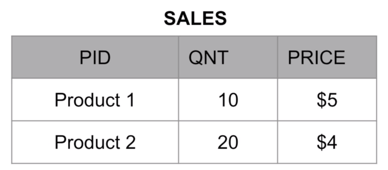

초기 테이블 상태입니다.

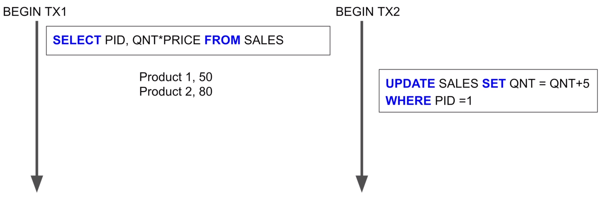

트랜잭션 TX1와 TX2 시작 후 각각 조회 쿼리와 업데이트 쿼리문 실행합니다.

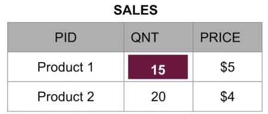
그 결과로 위와 같이 테이블 상태 QNT가 5 증가했다.

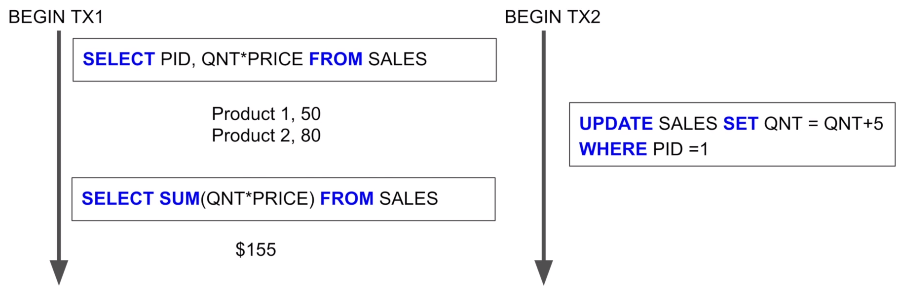

이후 TX1에서 다시 조회 쿼리 실행한다. 아직 커밋되지 않은 TX2의 변경사항을 읽었다. Dirty reads 현상이 발생했습니다.

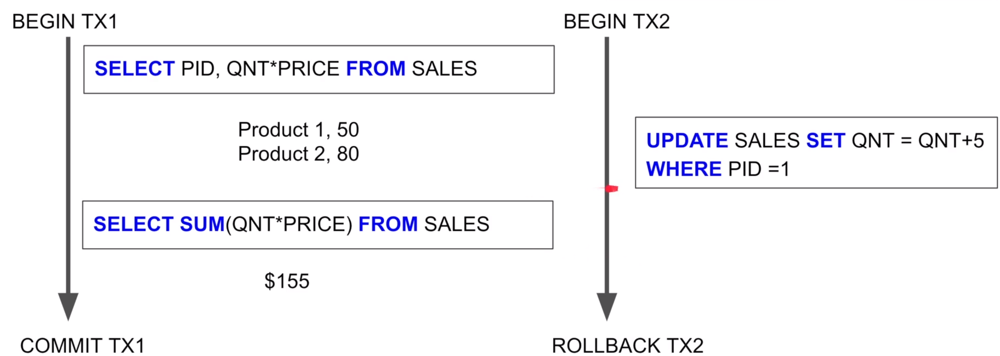
어떠한 문제가 발생해 TX2이 롤백됩니다.

### 2.2 Non-repeatable reads

- 트랜잭션 안에서 같은 쿼리를 실행했을 때 결과가 다른 현상을 말합니다.
- 이러한 부정합 현상은 일반적인 웹 프로그램에서는 크게 문제되지 않지만 하나의 트랜잭션에서 동일 데이터를 여러번 읽고 변경하는 작업이 금전적인 처리와 관련되어 있다면 문제가 될 수 있습니다.
- 예를 들어, 다른 트랜잭션에서 입금과 출금 처리가 진행되고 있을 때 다른 트랜잭션에서 오늘 입금된 금액의 총 합을 계산한다고 했을 때 REPEATABLE READ가 보장되지 않으면 쿼리를 실행할 때마다 금액이 달라질 수 있습니다.

**예시**

초기 테이블 상태입니다.

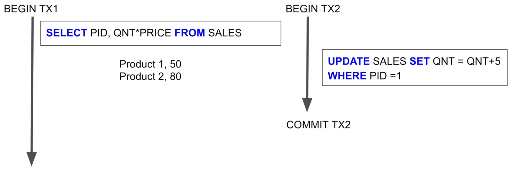
트랜잭션 TX1와 TX2 시작 후 각각 조회 쿼리와 업데이트 쿼리문 실행 이후 TX2는 커밋까지 완료합니다.

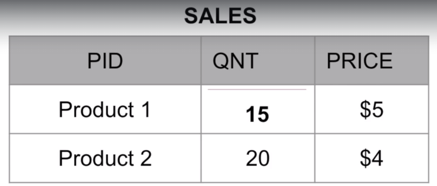
현재 테이블 상태입니다.

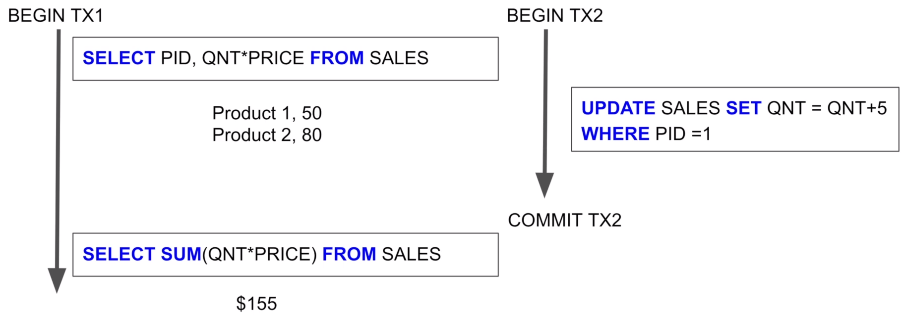
TX1에서 TX2의 커밋된 데이터만 읽었음에도 불구하고 한 트랜잭션 안에서 실행한 쿼리문의 결과가 다릅니다. 이를 Non-repeatable reads 현상이라고 합니다.

### 2.3 Phantom reads

- 다른 트랜잭션에서 수행한 변경 작업에 의해 레코드가 보였다가 안 보였다가 하는 현상을 말합니다.

**예시**

초기 테이블 상태입니다.

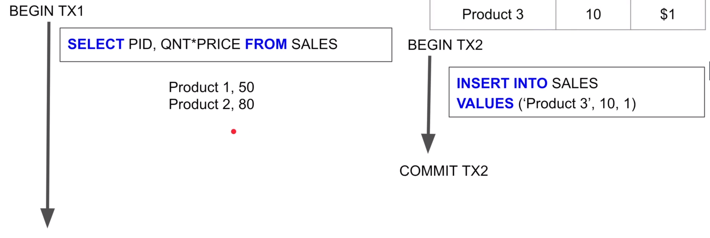
트랜잭션 TX1와 TX2 시작 후 각각 조회 쿼리와 삽입 쿼리문 실행 후 TX2 커밋까지 완료합니다.

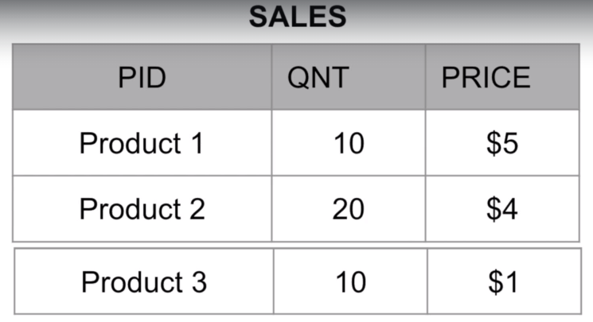
현재 테이블 상태입니다.

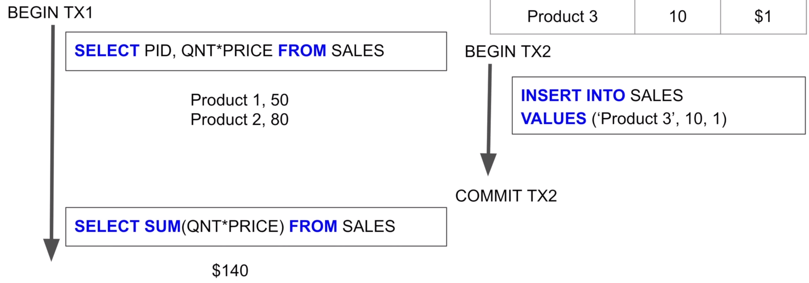
TX1 에서 조회 쿼리 실행한다. TX2에서 추가한 레코드가 포함된 결과가 보입니다. 이를 Phantom reads 현상이라고 합니다.

### 2.4 격리 수준에 따른 부정합 문제 발생 여부

|                  | Dirty reads | Non-repeatable reads | Phantom reads |
|------------------|-------------|----------------------|---------------|
| Read uncommitted | O           | O                    | O             |
| Read committed   | X           | O                    | O             |
| Repeatable Reads | X           | X                    | O(InnoDB는 X)  |
| Serializable     | X           | X                    | X             |

## 3 READ UNCOMMITTED

- 각 트랜잭션에서의 변경 내용이 COMMIT 이나 ROLLBACK 여부에 상관 없이 다른 트랜잭션에서 보여지는 격리 수준입니다.
- **Dirty reads**, **Non-repeatable reads**, **Phantom reads**  현상이 발생하는 격리 수준입니다.
- RDBMS 표준에서는 트랙잭션의 격리 수준으로 인정하지 않을 정도로 정합성에 문제가 많습니다.
  - 따라서 실제 서비스에서는 사용하지 않는 것이 좋습니다.
- MySQL을 사용한다면 최소한 `READ COMMITED` 이상의 격리 수준을 사용할 것을 권장합니다.

## 4 READ COMMITTED

- 어떤 트랜잭션에서 변경한 내용이 COMMIT이 완료되기 전까지는 다른 트랜잭션에서 조회할 수 없는 격리 수준입니다.
	- 따라서 **Dirty reads** 현상이 발생하지 않습니다.
- **Non-repeatable reads**, **Phantom reads**  현상이 발생하는 격리 수준입니다.
- 오라클 DBMS에서 기본적으로 사용하는 격리 수준입니다.

## 5 REAPEATABLE READ

- 하나의 트랜잭션 내에서 똑같은 SELECT 쿼리를 실행했을 때 항상 같은 결과를 보장해야 하는 격리 수준입니다.
- Repeatable Reads는 MySQL의 InnoDB 스토리지 엔진에서 기본으로 사용하는 격리 수준입니다.
- **Phantom reads**  현상이 발생하는 격리 수준입니다.
- InnoDB 스토리지 엔진은 트랜잭션이 ROLLBACK될 가능성에 대비해 변경되기 전 레코드를 언두 공간에 백업해두고 실제 레코드 값을 변경합니다.
	- 이 방식을 MVCC(Multi Version Concurrency Control)라고 합니다.
- 백업된 데이터는 불필요하다고 판단하는 시점에 주기적으로 삭제합니다.
- Undo에 백업된 레코드가 많아지면 MySQL 서버의 처리 성능이 떨어질 수 있습니다.
- MySQL에서는 트랜잭션마다 트랜잭션 ID를 부여하여 트랜잭션 ID보다 작은 트랜잭션 번호에서 변경한 것만 읽게 됩니다.

## 6 SERIALIZABLE

- 한 트랜잭션에서 읽고 쓰는 레코드를 다른 트랙잭션에서 절대 접근할 수 없는 격리 수준입니다.
- 두 트랜잭션을 병렬적으로 동시에 수행하는 것이 아닌 하나씩 순차적으로 수행합니다.
- 가장 엄격한 격리 수준이며 그만큼 동시 처리 성능도 다른 격리 수준보다 떨어집니다.
- **Dirty reads**, **Non-repeatable reads**, **Phantom reads**  현상이 발생하지 않는 격리 수준입니다.

## 7. 어떤 격리 수준을 선택해야 할까?

- 격리 수준에 대해서 알아봤으니 이제 어떤 격리 수준을 선택해야 할지 알아보겠습니다.
- 특별한 이유가 없다면 데이터베이스의 기본 격리 수준을 사용하는 것을 권장합니다.
- 이번 글에서는 MySQL을 기준으로 설명합니다.

### 7.1 기본 격리 수준 사용하기

- MySQL을 사용한다면 기본 격리 수준인 `REPEATABLE READ` 를 그대로 사용하는 것을 권장합니다.
- 트래픽이 매우 많고 단순 조회 위주의 웹 애플리케이션이라면 `READ COMMITTED` 을 고려할 수 있습니다.
- `REPEATABLE READ` 는 데이터 정합성과 동시성 사이에서 매우 합리적인 균형을 제공합니다.
- 한 트랜잭션이 시작되면 그 트랜잭션이 끝날 때까지 다른 트랜잭션의 변경 사항에 영향을 받지 않고 일관된 데이터를 조회할 수 있습니다.
- 심지어 MySQL의 InnoDB 엔진은 갭 락(Gap Lock) 덕분에 다른 데이터베이스라면 막지 못했을 팬텀 리드까지 대부분 막아주니, 웬만한 비즈니스 로직에서는 충분히 안정적입니다.

### 7.2 `READ UNCOMMITTED` 로 낮추는 것을 고려하는 경우

- 이 격리 수준은 실무에서 **거의 사용하지 않습니다**.
- 왜냐하면 커밋되지 않은, 즉 언제든 사라질 수 있는 '더러운' 데이터(Dirty Data)를 읽는 것을 허용하기 때문입니다. 
- 이는 데이터 정합성에 매우 심각한 문제를 일으킬 수 있습니다.
- 그리고 MySQL을 포함한 현대의 데이터베이스들은 다양한 최적화 기법을 제공하기 때문에 다음 단계인 `READ COMMITTED` 와 성능 차이가 거의 나지 않기 때문에 사용하지 않는 것을 권장합니다.
  - 약 0~3% 정도의 성능 차이가 있을 수 있습니다.

### 7.3 `READ COMMITTED`로 낮추는 것을 고려하는 경우

- 성능과 동시성 확보가 매우 중요하고, 약간의 데이터 비일관성을 감수할 수 있는 특정 상황에서 `READ COMMITTED`를 선택할 수 있습니다.
- 많은 온라인 서비스, 특히 웹 애플리케이션은 '하나의 요청 = 하나의 짧은 트랜잭션'으로 동작하는 경우가 대부분입니다.
- 예를 들어, 사용자가 상품 목록을 조회하면, 서버는 DB에서 상품 목록을 조회해서 반환하고 트랜잭션을 바로 종료합니다.
- 이런 환경에서는 트랜잭션 하나에서 똑같은 `SELECT` 쿼리를 여러 번 실행할 일이 거의 없으므로, `Non-Repeatable Read`가 발생할 가능성 자체가 낮습니다.
- 이럴 때 `READ COMMITTED`를 사용하면 불필요한 락(Lock)들을 사용하지 않게 되어 락(Lock)을 기다리는 시간이 줄어듭니다.
- 결과적으로 데이터베이스의 전체적인 처리량(Throughput)이 향상될 수 있습니다.
- 오라클(Oracle), PostgreSQL, SQL Server와 같은 다른 인기 있는 데이터베이스들이 `READ COMMITTED`를 기본값으로 채택한 이유이기도 합니다.
- 성능 향상은 애플리케이션의 성격에 따라 다르지만, 업데이트와 입력이 빈번하게 발생하는 높은 동시성 환경에서는 대략 10% ~ 30% 수준의 처리량 향상을 기대해 볼 수 있으며, 경우에 따라 그 이상도 가능합니다.
- 물론, 이는 일반적인 수치이며 실제로는 애플리케이션의 쿼리 패턴과 데이터 경쟁 정도에 따라 크게 달라질 수 있습니다.

### 7.4 `SERIALIZABLE`로 높이는 것을 고려하는 경우

- 데이터의 정합성이 극도로 중요해서 아주 작은 예외도 허용할 수 없을 때 사용합니다.
- 이는 마치 트랜잭션을 한 줄로 세워 순서대로 처리하는 것과 유사하므로, 동시성이 크게 저하됩니다.
- 예를 들어, 여러 사용자가 동시에 하나의 은행 계좌에서 돈을 인출하려 하거나, 초당 수십 건의 주문이 몰리는 한정 수량 상품의 재고를 차감하는 로직이 있다면 `SERIALIZABLE`을 고려해볼 수 있습니다. (실무에서는 다른 대안을 선택합니다.)
- 하지만 그 대가는 매우 혹독합니다. 동시성이 현저히 떨어져서 시스템 전체 성능에 병목이 될 가능성이 매우 높습니다.
- 따라서 `SERIALIZABLE`은 정말 다른 방법이 없을 때 사용하는 최후의 수단으로 생각해야 합니다.
- 대부분의 경우, 격리 수준을 무작정 높이기보다는 애플리케이션 코드 레벨에서 `SELECT ... FOR UPDATE`와 같은 비관적 락(Pessimistic Lock)을 사용하거나, 버전 번호를 두는 낙관적 락(Optimistic Lock)을 구현하여 문제를 더 정교하게 해결하는 것이 현명한 선택입니다.
- 이런 이유로 `SERIALIZABLE`은 실무에서 거의 사용하지 않습니다.

## 8. 트랜잭션 격리 수준 구현 방식

- 트랜잭션 격리 수준을 구현하기 위해 데이터베이스는 주로 락(Lock)과 MVCC(Multi-Version Concurrency Control) 기술을 사용합니다.
- MySQL의 InnoDB 스토리지 엔진을 통해 트랜잭션 격리 수준을 어떻게 구현하는지 알아보고 싶다면 아래 문서를 참고해주세요.
- [MySQL InnoDB 스토리지 엔진의 MVCC](../../Database/Mysql/MVCC/MVCC.md)

참조

- [Real MySQL](http://www.yes24.com/Product/Goods/6960931)
