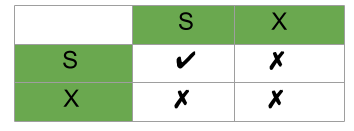

## 1 Locking

- Locking은 Transaction과 서로 비슷한 개념 같지만 사실 잠금은 동시성을 제어하기 위한 기능이고 Transaction과은 데이터의 정합성을 보장하기 위한 기능입니다.
- 하나의 회원 정보 레코드는 여러 커넥션에서 동시에 변경할 때 잠금이 없다면 하나의 데이터를 여러 커넥션에서 동시에 변경할 수 있게 되고 결과는 예측할 수 없게 됩니다.
- Locking은 여러 커넥션에서 동일한 자원을 요청할 경우 순서대로 한 시점에는 하나의 커넥션만 변경할 수 있게 해주는 역할을 합니다.

## 2. Optimistic Locking & Pessimistic Locking

### 2.1 Optimistic Locking

- 낙관적 락은 데이터 충돌이 드물게 발생한다는 낙관적인 가정에 기반합니다.
- 트랜잭션이 같은 레코드를 변경할 가능성이 희박하다고 가정하고 우선 작업을 수행합니다.
- 변경 작업 후 커밋 시점에 충돌 여부를 확인하고, 충돌이 있었다면 ROLLBACK 처리합니다.
- 주로 버전 관리 필드(version)나 타임스탬프를 사용하여 구현합니다.

### 2.2 Pessimistic Locking

- 비관적 락은 데이터 충돌이 자주 발생할 것이라는 비관적인 가정에 기반합니다.
- 트랜잭션이 데이터를 변경하기 전에 먼저 해당 레코드에 대한 락을 획득합니다.
- 락을 획득한 후에야 변경 작업을 진행하고, 작업이 완료될 때까지 다른 트랜잭션의 접근을 차단합니다.

## 3 Shared Lock & Exclusive Lock

### 3.1 Shared Lock

- 공유 락은 데이터 읽기만 가능하게 하는 락으로, Read Lock이라고도 불립니다.
- 한 레코드에 대해 여러 트랜잭션이 동시에 공유 락을 획득할 수 있습니다.
- 읽기 무결성(read integrity)을 보장하여, 데이터를 읽는 동안 다른 트랜잭션이 해당 데이터를 업데이트하는 것을 방지합니다.

**예시**

- A=100일 때, 두 트랜잭션이 A값을 읽고 있다면 공유 락은 다른 트랜잭션이 A를 변경하지 못하도록 합니다. 
- 두 트랜잭션 모두 읽기를 완료한 후에야 A값을 변경할 수 있습니다.

### 3.2 Exclusive Lock

- 배타적 락은 데이터 읽기와 쓰기 모두 가능하게 하는 락으로, Write Lock이라고도 불립니다.
- 한 레코드에 배타적 락이 설정되면 다른 어떤 종류의 락도 설정할 수 없습니다.
- 한 시점에 오직 하나의 트랜잭션만 배타적 락을 소유할 수 있습니다.
- 데이터 업데이트 작업 시 자동으로 획득됩니다.

### 3.3 Lock Compatibility Matrix

- 트랜잭션1이 아이템 A에 대해서 Shared Lock을 가지고 있을 때
  - 트랜잭션2가 아이템 A에 대해서 Shared Lock을 획득할 수 있습니다.
  - 트랜잭션2가 아이템 A에 대해서 Exclusive Lock을 획득할 수 없습니다.
- 트랜잭션1이 아이템 A에 대해서 Exclusive Lock을 가지고 있을 때
  - 트랜잭션2가 아이템 A에 대해서 Shared Lock을 획득할 수 없습니다.
  - 트랜잭션2가 아이템 A에 대해서 Exclusive Lock을 획득할 수 없습니다.

### 3.4 Shared Lock과 Exclusive Lock 비교

- 기능: 공유 락은 읽기 전용, 배타적 락은 읽기/쓰기 모두 가능
- 제한: 공유 락은 데이터 업데이트를 방지, 배타적 락은 모든 접근을 방지
- 획득 시점: 공유 락은 데이터 읽기 시, 배타적 락은 데이터 변경 시 획득
- 동시성: 공유 락은 여러 트랜잭션이 동시에 소유 가능, 배타적 락은 하나의 트랜잭션만 소유 가능

## 4. Distributed Lock

- 분산 락은 여러 서버나 인스턴스가 동일한 리소스에 접근할 때 동시성을 제어하는 메커니즘입니다.
- 로 분산 시스템, 마이크로서비스 아키텍처에서 활용됩니다.
- [Distributed Lock 더 보기](../DistributedLock/DistributedLock.md)

## 관련 자료

- [Difference between Shared Lock and Exclusive Lock - geeksforgeeks](https://www.geeksforgeeks.org/difference-between-shared-lock-and-exclusive-lock/)
