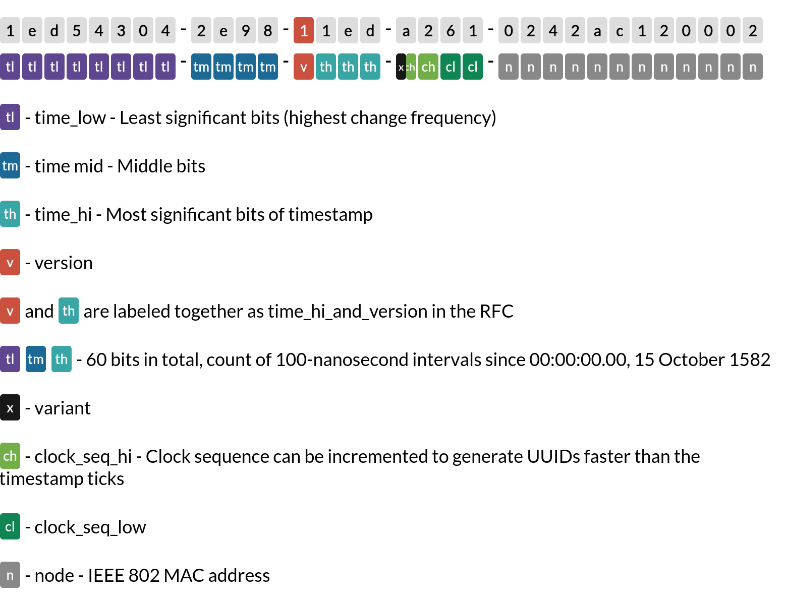
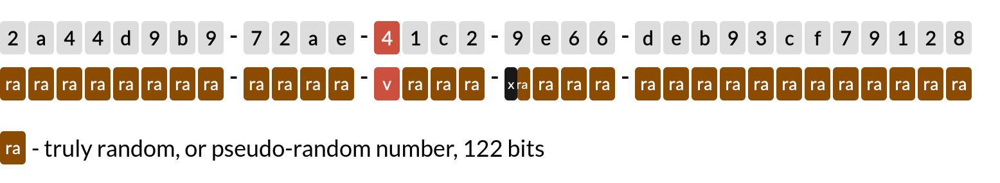
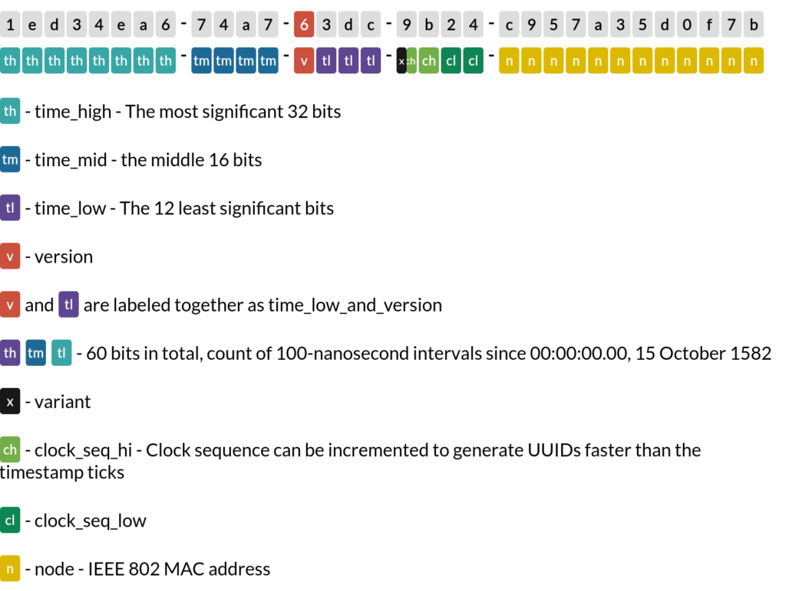
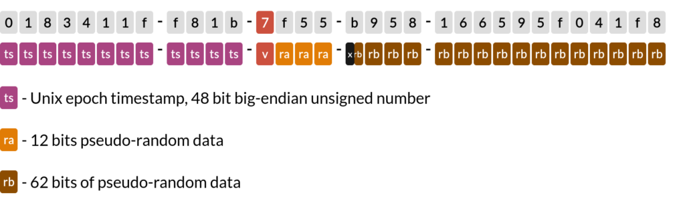

## 1. 개요

- 데이터베이스를 설계할 때 가장 신중하게 고려해야 할 요소 중 하나가 Primary Key의 선택입니다.
- 이 선택은 단순히 레코드를 식별하는 것을 넘어서 시스템의 전반적인 성능과 확장성, 그리고 데이터의 무결성에 직접적인 영향을 미칩니다.

## 2. UUID(Universally Unique Identifier)
- UUID는 RFC 4122 표준에 정의된 128비트 길이의 식별자로, 32개의 16진수를 5개 그룹으로 나누어 표현합니다.

:::info[UUID 구조]
`123e4567-e89b-12d3-a456-426655440000`
- 각 그룹은 하이픈(-)으로 구분됨
- 총 36자 (32개 문자 + 4개 하이픈)
  :::

### 2.1 UUID의 장점

**분산 시스템에서의 강점**
- 여러 서버에서 동시에 ID를 생성해도 충돌 걱정이 없습니다.
- 데이터베이스 샤딩이나 마이크로서비스 아키텍처에서 특히 유용합니다.
- ID 생성을 위한 중앙 서버가 필요 없어 시스템 복잡도가 낮아집니다.

**향상된 보안성**
- ID의 무작위성으로 인해 다음 값 예측이 불가능합니다.
- URL에 노출되어도 비즈니스 정보(가입 순서 등)가 유출되지 않습니다.
- 자동 증가하는 ID를 통한 스크래핑이나 봇 공격을 방지할 수 있습니다.

**유연한 생성 방식**
- 애플리케이션 레벨에서 ID 생성이 가능합니다.
- 데이터베이스에 실제로 저장하기 전에 ID를 알 수 있어 관련 로직 처리가 용이합니다.
- 벌크 인서트나 배치 처리 시에도 ID 충돌 걱정 없이 처리할 수 있습니다.

### 2.2 UUID의 단점

**저장 공간과 성능**
- 128비트 크기로 인해 저장 공간이 더 필요합니다.
- 인덱스 크기가 커져 메모리 사용량이 증가합니다.
- B-tree 인덱스에서 랜덤한 값으로 인한 성능 저하가 발생할 수 있습니다.

**가독성과 사용성**
- 긴 16진수 문자열로 인해 사람이 읽고 기억하기 어렵습니다.
- 디버깅이나 로그 분석 시 불편할 수 있습니다.
- API 응답이나 로그에서 차지하는 공간이 큽니다.

**정렬 관련 제약**
- 기본적으로 생성 순서대로 정렬이 불가능합니다.
- 최신 데이터 조회 같은 일반적인 쿼리의 성능이 저하될 수 있습니다.

## 3. Sequential ID
- 순차적으로 증가하는 숫자를 사용하는 전통적인 Primary Key 방식입니다.

### 3.1 Sequential ID의 장점

**최적화된 성능**
- B-tree 인덱스에서 순차적 삽입으로 인한 최적의 성능을 제공합니다.
- 인덱스 단편화가 최소화됩니다.
- 메모리 사용량이 UUID에 비해 절반 수준입니다.

**우수한 가독성**
- 간단한 숫자 형태로 직관적입니다.
- 데이터베이스 관계 파악이 용이합니다.
- 로깅과 디버깅이 간편합니다.

**효율적인 정렬과 페이징**
- 자연스러운 순서가 보장됩니다.
- 최신 데이터 조회가 효율적입니다.
- 페이지네이션 구현이 간단합니다.

### 3.2 Sequential ID의 단점

**분산 환경에서의 한계**
- 여러 서버에서 동시에 ID를 생성할 때 충돌이 발생할 수 있습니다.
- 중앙 집중식 ID 생성 서버가 필요할 수 있습니다.
- 데이터베이스 샤딩 시 복잡도가 증가합니다.

**보안 취약성**
- ID의 예측이 가능해 자동화된 공격에 취약합니다.
- URL에서 비즈니스 정보가 노출될 수 있습니다.
- 리소스 열거 공격이 가능합니다.

**확장성 제한**
- BIGINT 타입(64비트)의 최대값 제한이 있습니다.
- 대규모 데이터의 경우 한계에 도달할 수 있습니다.

## 4. UUID 버전별 특징 및 성능

### 4.1 UUID V1 (시간 기반)

- 시간과 MAC 주소를 조합하여 생성하는 방식입니다.
- 시간 정보가 세 부분으로 나뉘어 저장됩니다:
  - time_low: 타임스탬프의 하위 32비트
  - time_mid: 타임스탬프의 중간 16비트
  - time_hi: 타임스탬프의 상위 12비트
- 정렬이 효과적이지 않은 이유:
  - 시간 정보가 "상위-중간-하위" 순서가 아닌 "하위-중간-상위" 순서로 배치됨
  - 이 필드는 시간의 가장 빠르게 변하는 부분(초, 밀리초 등)을 담고 있습니다
  - 마치 시계에서 "초:분:시" 순서로 표시하는 것과 비슷합니다

**주요 특징**
- 60비트 타임스탬프 + MAC 주소 사용
- 시간 정보가 포함되어 있어 생성 시점 추적 가능
- 같은 시스템에서는 충돌이 거의 불가능

:::warning[보안 주의]
MAC 주소 포함으로 인해 생성 시스템의 정보가 노출될 수 있습니다.
:::

### 4.2 UUID V4 (랜덤)

- 가장 널리 사용되는 버전으로, 완전한 랜덤 값을 사용합니다.

**주요 특징**
- 122비트의 랜덤 데이터 사용
- 예측 불가능성이 가장 높음
- 이론상 충돌 가능성 존재 (실제로는 무시할 수 있는 수준)

:::tip[실무 팁]
보안이 중요한 시스템에서는 V4 사용을 권장합니다.
:::

### 4.3 UUID V6

- UUID6은 UUID1의 단점을 개선하기 위해 만들어진 버전입니다.
- UUID1과 동일한 필드 구조를 유지했습니다.
- MAC 주소, 버전 정보 등 기본 구성 요소는 그대로 사용하되, 시간 정보를 개선했습니다.
- 아래와 같이 V1의 시간 정보를 재배치 했습니다
  - 가장 중요한(높은 자리) 시간 비트가 앞에 옴
  - 그 다음 중요한 비트가 그 다음에 옴
  - 가장 덜 중요한(낮은 자리) 비트가 마지막에 옴
- 따라서 연속으로 생성된 UUID가 시간 순서대로 정렬됩니다.
- 그레고리력 에포크 사용 (1582년 기준)
- 100-나노초 정밀도

### 4.4 UUID V7

- UUID7은 새로운 시스템을 설계할 때 가장 권장되는 UUID 버전입니다.
- 핵심적인 차이점은 타임스탬프 형식에 있습니다.
- UUID1: 그레고리력 에포크 (1582년 10월 15일 기준)
  - 매우 오래된 시작점 
  - 현대 시스템에는 불필요하게 긴 범위 
  - 레거시 시스템과의 호환성 때문에 사용 
- UUID7: 유닉스 에포크 (1970년 1월 1일 기준)
  - 현대 컴퓨터 시스템의 사실상 표준 
  - 대부분의 프로그래밍 언어와 데이터베이스가 사용 
  - 실용적이고 효율적인 시간 범위

**UUID7의 장점**
- 시간 순서대로 정렬 가능
- 현대적인 시스템에 최적화
- 불필요한 과거 시간 범위를 제거해 효율성 증가

:::tip[실무 선택 가이드]
새로운 시스템을 만들 때는 UUID7 선택
레거시 시스템과의 호환성이 필요한 경우만 UUID1 또는 UUID6 고려
:::

## 5. 성능 분석
- [UUID Version별 성능 비교](https://www.toomanyafterthoughts.com/uuids-are-bad-for-database-index-performance-uuid7/)
- [UUID와 Sequential ID의 성능 비교](https://www.percona.com/blog/store-uuid-optimized-way/)

### 5.1 핵심 요약
- UUID V4는 랜덤값으로 인해 B-tree 인덱스 성능이 가장 낮음
- UUID V1의 time_low 필드는 약 7분마다 롤오버되어 그 주기로 성능 변동
- UUID V6/V7은 시간 정보가 올바른 순서로 정렬되어 Sequential ID와 비슷한 성능
- PostgreSQL은 Non-Clustered 인덱스를 사용하여 UUID의 성능 패널티가 덜 심각
  - PostgreSQL이 UUID를 사용할 때 성능 저하가 InnoDB보다 훨씬 덜 심각하다
- UUID를 char(36) 대신 binary(16)으로 저장하면 저장 공간과 인덱스 크기를 크게 줄일 수 있음

## 6. 선택 가이드

### 6.1 UUID를 선택해야 할 때
- 분산 시스템을 구축하는 경우
- 데이터베이스 샤딩을 계획하는 경우
- 보안이 중요한 경우
- ID 예측을 방지하고 싶은 경우

### 6.2 Sequential ID를 선택해야 할 때
- 단일 데이터베이스 환경인 경우
- 성능이 가장 중요한 경우
- 데이터 양이 제한적인 경우
- 정렬과 페이징이 빈번한 경우

:::tip[실무 최적화 팁]
1. UUID를 사용할 때는 반드시 binary(16) 타입으로 저장하세요.
2. 시간 기반 정렬이 필요하다면 UUID V6나 V7 사용을 고려하세요.
3. PostgreSQL을 사용한다면 UUID의 성능 페널티가 덜 심각합니다.
4. 하이브리드 접근도 고려해 보세요: 내부적으로는 Sequential ID를 사용하고, 외부 노출용으로는 UUID를 사용하는 방식입니다.
:::