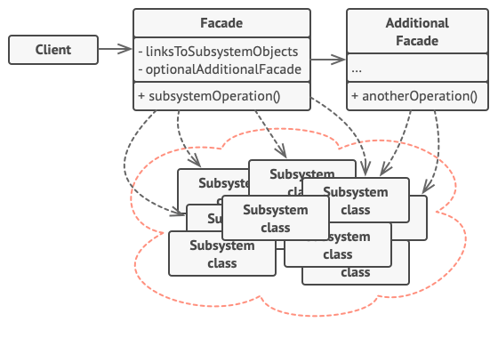

## 1. 파사드 패턴이란?

- 파사드(Facade) 패턴은 복잡한 서브시스템에 대한 간단한 인터페이스를 제공하는 구조적 디자인 패턴입니다.
- 이 패턴은 라이브러리, 프레임워크 또는 복잡한 클래스 집합에 대한 단순화된 인터페이스를 제공합니다.
- 파사드는 클라이언트가 복잡한 서브시스템의 내부 동작을 이해하지 않고도 필요한 기능을 쉽게 사용할 수 있게 합니다.

### 1.1 파사드 패턴의 목적

- 복잡한 시스템의 사용 난이도를 낮춤
- 서브시스템에 대한 의존성 감소
- 클라이언트 코드와 서브시스템 간의 결합도 감소
- 코드의 가독성과 유지보수성 향상

## 2. 문제 상황

- 복잡한 라이브러리나 프레임워크를 사용할 때 많은 객체를 초기화하고, 의존성을 추적하며, 올바른 순서로 메서드를 실행해야 합니다.
- 이로 인해 비즈니스 로직이 서드파티 클래스의 구현 세부사항과 강하게 결합되어 코드 이해와 유지보수가 어려워집니다.

### 2.1 실생활 예시

- 전화로 상품을 주문할 때 상담원은 주문 시스템, 결제 게이트웨이, 배송 서비스 등 가게의 모든 서비스와 부서에 대한 파사드 역할을 합니다.
- 상담원은 복잡한 주문 시스템의, 단순한 음성 인터페이스를 제공합니다.

:::tip
파사드 패턴은 마치 복잡한 기계의 간단한 제어판과 같습니다. 내부 작동 방식은 복잡하지만, 사용자(클라이언트)는 몇 개의 버튼만 눌러 원하는 기능을 사용할 수 있습니다.
:::

## 3. 파사드 패턴의 구조

### 3.1 주요 구성 요소



- **파사드(Facade)**: 서브시스템의 기능에 대한 편리한 접근을 제공하는 클래스입니다. 클라이언트 요청을 어디로 전달할지 알고 있으며 모든 구성 요소를 작동시키는 방법을 알고 있습니다.
- **추가 파사드(Additional Facade)**: 단일 파사드에 관련 없는 기능들로 오염되는 것을 방지하기 위해 생성할 수 있는 클래스입니다.
- **복잡한 서브시스템(Complex Subsystem)**: 수십 개의 다양한 객체로 구성됩니다. 서브시스템 클래스들은 파사드의 존재를 알지 못하며, 시스템 내에서 서로 직접 작동합니다.
- **클라이언트(Client)**: 서브시스템 객체를 직접 호출하는 대신 파사드를 사용합니다.

### 3.2 구조 다이어그램

```
+----------------+      +----------------+
|    Client      |----->|    Facade     |
+----------------+      +----------------+
                               |
                               |
                               v
                        +--------------+
                        |              |
                 +----->| Subsystem A  |
                 |      |              |
                 |      +--------------+
                 |
                 |      +--------------+
                 |      |              |
                 +----->| Subsystem B  |
                 |      |              |
                 |      +--------------+
                 |
                 |      +--------------+
                 |      |              |
                 +----->| Subsystem C  |
                        |              |
                        +--------------+
```

## 4. 파사드 패턴 구현 방법

### 4.1 구현 단계

- 기존 서브시스템보다 간단한 인터페이스를 제공할 수 있는지 확인합니다.
- 새로운 파사드 클래스에서 이 인터페이스를 선언하고 구현합니다.
- 파사드는 클라이언트 코드의 호출을 서브시스템의 적절한 객체로 리디렉션해야 합니다.
- 모든 클라이언트 코드가 오직 파사드를 통해서만 서브시스템과 통신하도록 합니다.
- 파사드가 너무 커진다면, 그 동작의 일부를 새로운 파사드 클래스로 추출하는 것을 고려합니다.

### 4.2 코드 예제

다음은 복잡한 비디오 변환 프레임워크에 대한 파사드 패턴 구현 예시입니다.

#### 복잡한 서브시스템 클래스

```java
// 복잡한 서드파티 비디오 변환 프레임워크의 일부 클래스입니다.
// 우리는 이 코드를 제어할 수 없으므로 단순화할 수 없습니다.

class VideoFile {
    private String name;
    
    public VideoFile(String name) {
        this.name = name;
    }
    
    public String getName() {
        return name;
    }
}

class OggCompressionCodec {
    // 구현 생략
}

class MPEG4CompressionCodec {
    // 구현 생략
}

class CodecFactory {
    public static Codec extract(VideoFile file) {
        // 코덱 추출 로직
        return new OggCompressionCodec();
    }
}

class BitrateReader {
    public static byte[] read(VideoFile file, Codec codec) {
        // 파일 읽기 로직
        return new byte[0];
    }
    
    public static byte[] convert(byte[] buffer, Codec codec) {
        // 변환 로직
        return new byte[0];
    }
}

class AudioMixer {
    public byte[] fix(byte[] audioData) {
        // 오디오 수정 로직
        return new byte[0];
    }
}

interface Codec {
    // 코덱 인터페이스
}
```

#### 파사드 클래스 구현

```java
class VideoConverter {
    public File convert(String filename, String format) {
        VideoFile file = new VideoFile(filename);
        Codec sourceCodec = CodecFactory.extract(file);
        
        Codec destinationCodec;
        if (format.equals("mp4")) {
            destinationCodec = new MPEG4CompressionCodec();
        } else {
            destinationCodec = new OggCompressionCodec();
        }
        
        byte[] buffer = BitrateReader.read(file, sourceCodec);
        byte[] result = BitrateReader.convert(buffer, destinationCodec);
        result = (new AudioMixer()).fix(result);
        
        return new File(result);
    }
}
```

- 프레임워크의 복잡성을 간단한 인터페이스 뒤에 숨기는 파사드 클래스를 생성합니다.
- `VideoConverter` 클래스는 비디오 파일을 변환하는 단순한 메서드 `convert`를 제공합니다.
- 이 메서드는 내부적으로 복잡한 서브시스템의 여러 클래스를 사용하여 비디오 파일을 변환합니다.
- 클라이언트는 `VideoConverter` 클래스의 `convert` 메서드만 호출하면 됩니다.

#### 클라이언트 코드

```java
class Application {
    public static void main(String[] args) {
        VideoConverter converter = new VideoConverter();
        File mp4 = converter.convert("funny-cats-video.ogg", "mp4");
        mp4.save();
    }
}
```

- 클라이언트는 `VideoConverter` 클래스의 `convert` 메서드를 호출하여 비디오 파일을 변환합니다.
- 클라이언트는 파사드의 `convert` 메서드만 호출하면, 내부적으로 복잡한 프레임워크의 여러 클래스와 메서드가 사용됩니다.

:::info
파사드 패턴은 단순히 복잡한 서브시스템을 감추는 것보다, 클라이언트의 실제 요구에 맞게 필요한 기능만을 제공하는 것이 중요합니다. 모든 기능을 제공하는 것이 아니라, 클라이언트가 정말로 관심 있는 기능만 포함하는
것이 좋습니다.
:::

## 5. 파사드 패턴 적용 시기

- 복잡한 서브시스템에 대한 제한적이지만 간단한 인터페이스가 필요할 때
- 서브시스템을 레이어로 구조화하고 싶을 때
- 서브시스템의 복잡성이 시간이 지남에 따라 증가하는 경우
- 클라이언트 코드를 서브시스템의 구현 세부사항으로부터 보호하고 싶을 때

:::warning
파사드 패턴을 적용하면 일부 유연성을 잃을 수 있습니다. 파사드는 서브시스템의 모든 기능을 노출하지 않기 때문에, 특정 고급 기능에 접근하기 위해서는 여전히 서브시스템의 내부 클래스를 직접 사용해야 할 수도
있습니다.
:::

## 6. 파사드 패턴의 장단점

### 6.1 장점

- 서브시스템의 복잡성으로부터 코드를 분리할 수 있습니다.
- 서브시스템에 대한 의존성을 줄이고 결합도를 낮출 수 있습니다.
- 클라이언트 코드의 가독성과 유지보수성이 향상됩니다.
- 서브시스템의 내부 변경으로부터 클라이언트 코드를 보호합니다.

### 6.2 단점

- 파사드가 애플리케이션의 모든 클래스와 결합된 "신 객체(God Object)"가 될 수 있습니다.
- 파사드는 서브시스템의 모든 기능을 노출하지 않아 유연성이 제한될 수 있습니다.
- 잘못 설계된 파사드는 오히려 복잡성을 증가시킬 수 있습니다.

## 7. 다른 디자인 패턴과의 관계

- **어댑터(Adapter)**: 파사드는 기존 객체에 대한 새로운 인터페이스를 정의하지만, 어댑터는 기존 인터페이스를 사용 가능하게 만듭니다. 어댑터는 일반적으로 하나의 객체만 래핑하지만, 파사드는 전체
  서브시스템의 객체들과 작동합니다.
- **추상 팩토리(Abstract Factory)**: 파사드의 대안으로 사용될 수 있으며, 서브시스템 객체가 생성되는 방식을 클라이언트 코드로부터 숨기고 싶을 때 유용합니다.
- **플라이웨이트(Flyweight)**: 많은 작은 객체를 만드는 방법을 보여주는 반면, 파사드는 전체 서브시스템을 대표하는 단일 객체를 만드는 방법을 보여줍니다.
- **중재자(Mediator)**: 파사드와 중재자는 모두 많은 긴밀하게 결합된 클래스 간의 협력을 조직하려고 합니다. 중재자는 구성 요소 간의 통신을 중앙 집중화하지만, 파사드는 서브시스템에 대한 단순화된
  인터페이스만 정의합니다.
- **싱글톤(Singleton)**: 대부분의 경우 단일 파사드 객체로 충분하기 때문에 파사드 클래스는 종종 싱글톤으로 변환될 수 있습니다.
- **프록시(Proxy)**: 파사드와 프록시 모두 복잡한 엔티티를 버퍼링하고 자체적으로 초기화합니다. 그러나 프록시는 파사드와 달리 서비스 객체와 동일한 인터페이스를 가지고 있어 서로 교체 가능합니다.

## 참고

- https://refactoring.guru/design-patterns/facade