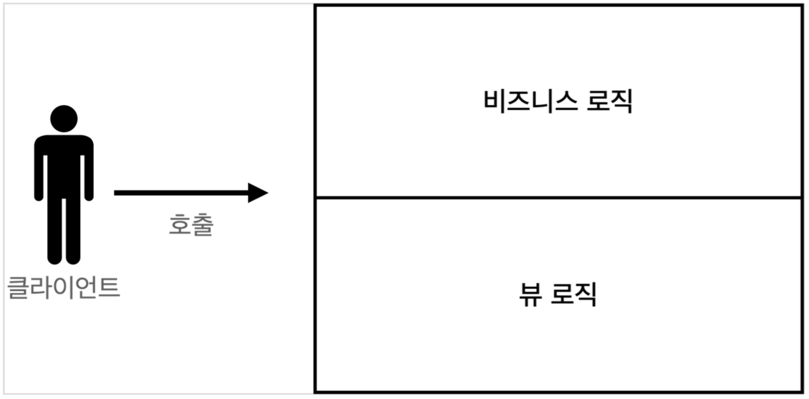

## 1 MVC Pattern

### 1.1 Model

* 뷰에 출력할 데이터를 담아둔다. 
* 뷰가 필요한 데이터를 모두 모델에 담아서 전달해주는 덕분에 뷰는 비즈니스 로직이나 데이터 접근을 몰라도 되고, 화면을 렌더링 하는 일에 집중할 수 있다.


### 1.2 View

* 모델에 담겨있는 데이터를 사용해서 화면을 그리는 일에 집중한다.


### 1.3 Controller

* HTTP 요청을 받아서 파라미터를 검증하고, 비즈니스 로직을 호출하는 역할을 한다. 그리고 뷰에 전달할 결과 데이터를 조회해서 모델에 담는다.
* 컨트롤러에 비즈니스 로직을 둘 수도 있지만, 이렇게 되면 컨트롤러가 너무 많은 역할을 담당한다. 
  * 그래서 일반적으로 비즈니스 로직은 서비스(Service)라는 계층을 별도로 만들어서 처리한다. 
  * 따라서 컨트롤러는 비즈니스 로직이 있는 서비스를 호출하는 담당한다. 
  * 비즈니스 로직을 변경하면 비즈니스 로직을 호출하는 컨트롤러의 코드도 변경될 수 있다. 


## 2 MVC 패턴 등장 배경



* MVC 패턴 이전 비즈니스 로직과 뷰 로직이 분리되지 않았다.


**MVC 이전 JSP 코드**

* JSP는 자바 코드를 그대로 다 사용할 수 있다.
* JSP를 사용한 덕분에 뷰를 생성하는 HTML 작업을 깔끔하게 가져가고, 중간중간 동적으로 변경이 필요한 부분에만 자바 코드를 적용할 수 있다
* 그러나 데이터를 조회하는 리포지토리 등등 다양한 코드가 모두 JSP에 노출되어 있다. JSP가 너무 많은 역할을 한다

```jsp
<%@ page import="hello.servlet.domain.member.MemberRepository" %>
<%@ page import="hello.servlet.domain.member.Member" %>
<%@ page contentType="text/html;charset=UTF-8" language="java" %>
<%
  MemberRepository memberRepository = MemberRepository.getInstance();
  System.out.println("save.jsp");
  String username = request.getParameter("username");
  int age = Integer.parseInt(request.getParameter("age"));
  Member member = new Member(username, age);
  System.out.println("member = " + member);
  memberRepository.save(member);
%>

<html>
  <head>
    <meta charset="UTF-8">
  </head>
  <body>
    성공
    <ul>
      <li>id=<%=member.getId()%></li>
      <li>username=<%=member.getUsername()%></li>
      <li>age=<%=member.getAge()%></li>
    </ul>
    <a href="/index.html">메인</a>
  </body>
</html>
```


**문제점**

* 비즈니스 로직을 호출하는 부분에 변경이 발생해도 해당 코드를 손대야 하고, UI를 변경할 일이 있어도 비즈니스 로직이 함께 있는 해당 파일을 수정해야 한다.
* 둘 사이에 변경의 라이프 사이클이 다르다는 점이다. 
  * 예를 들어서 UI 를 일부 수정하는 일과 비즈니스 로직을 수정하는 일은 각각 다르게 발생할 가능성이 매우 높고 대부분 서로에게 영향을 주지 않는다. 
  * 이렇게 변경의 라이프 사이클이 다른 부분을 하나의 코드로 관리하는 것은 유지보수하기 좋지 않다

## 3 MVC 패턴 등장

* 비즈니스 로직은 서블릿 처럼 다른곳에서 처리하고, JSP는 목적에 맞게 HTML로 화면(View)을 그리는 일에 집중하도록 하자.


### 3.1 MVC 패턴1

*  비즈니스 로직과 뷰 로직이 분리되었다.


**예시**

* HttpServletRequest를 Model로 사용한다.
* request가 제공하는 setAttribute() 를 사용하면 request 객체에 데이터를 보관해서 뷰에 전달할 수 있다.
* 뷰는 request.getAttribute() 를 사용해서 데이터를 꺼내면 된다.

```java
@WebServlet(name = "mvcMemberSaveServlet", urlPatterns = "/servlet-mvc/members/save")
public class MvcMemberSaveServlet extends HttpServlet {
  private MemberRepository memberRepository = MemberRepository.getInstance();
  
  @Override
  protected void service(HttpServletRequest request, HttpServletResponse response) throws ServletException, IOException {
    String username = request.getParameter("username");
    int age = Integer.parseInt(request.getParameter("age"));
    Member member = new Member(username, age);
    System.out.println("member = " + member);
    memberRepository.save(member);
    
    //Model에 데이터를 보관한다. 
    request.setAttribute("member", member);
    String viewPath = "/WEB-INF/views/save-result.jsp";
    RequestDispatcher dispatcher = request.getRequestDispatcher(viewPath);
    dispatcher.forward(request, response);
  } 
}
```

```jsp
<%@ page contentType="text/html;charset=UTF-8" language="java" %>
<html>
  <head>
    <meta charset="UTF-8">
  </head>
  <body> 성공
    <ul>
      <li>id=${member.id}</li>
      <li>username=${member.username}</li>
      <li>age=${member.age}</li>
    </ul>
    <a href="/index.html">메인</a>
  </body>
</html>
```

* MVC 덕분에 컨트롤러 로직과 뷰 로직을 확실하게 분리한 것을 확인할 수 있다. 향후 화면에 수정이 발생하면 뷰 로직만 변경하면 된다.


### 3.2 MVC 패턴2

* 컨트롤러에 비즈니스 로직을 둘 수도 있지만, 이렇게 되면 컨트롤러가 너무 많은 역할을 담당한다.
* 일반적으로 비즈니스 로직은 서비스(Service)라는 계층을 별도로 만들어서 처리한다. 
* 그리고 컨트롤러는 비즈니스 로직이 있는 서비스를 호출하는 담당한다.

