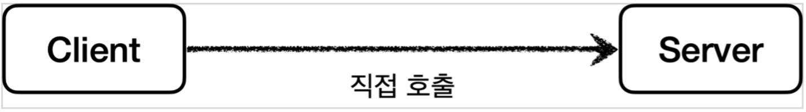
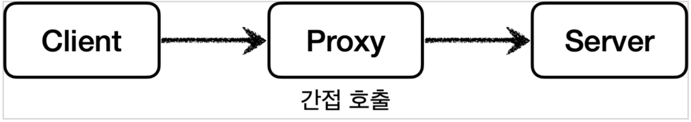
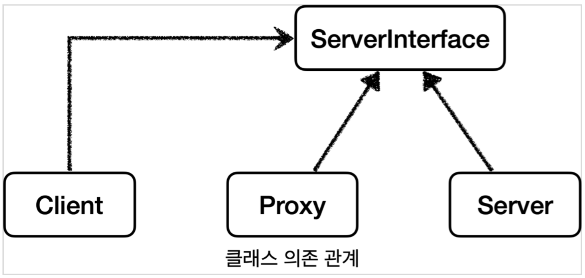
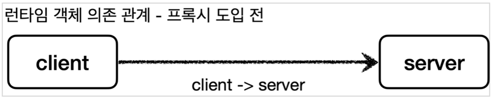
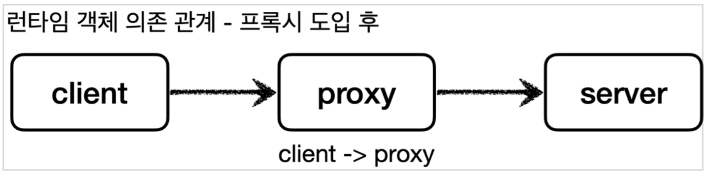
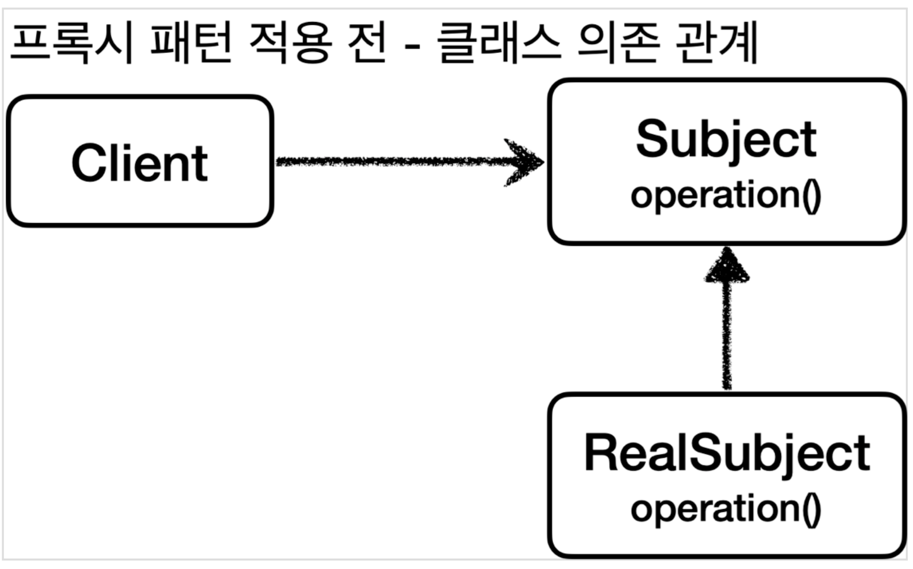
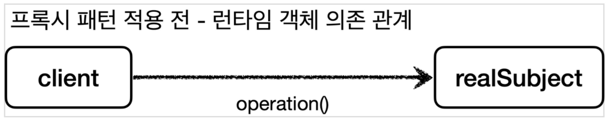
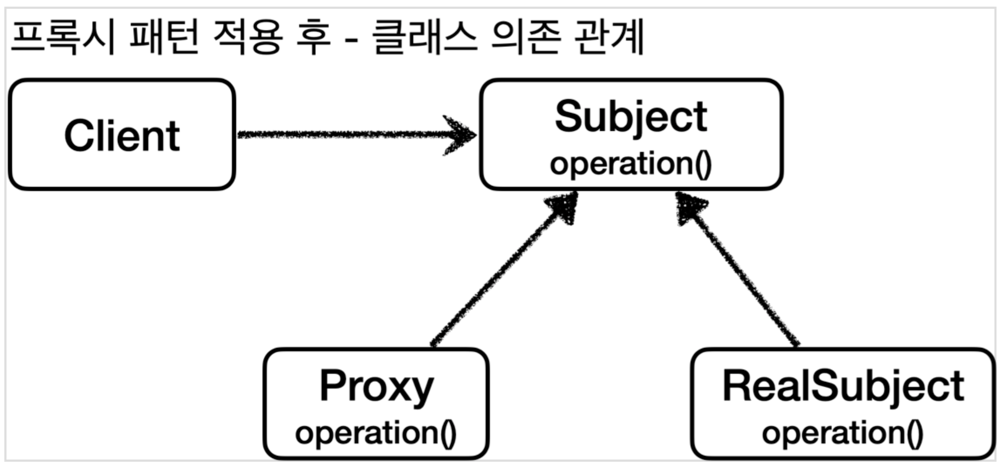
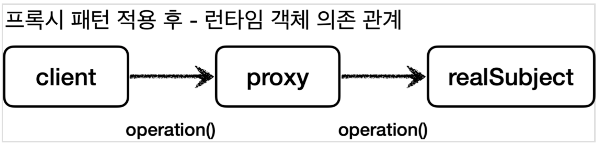

## 1 Proxy Pattern

- **클라이언트**는 의뢰인이라는 뜻이고, **서버**는 '서비스나 상품을 제공하는 사람이나 물건'을 뜻하는 서버-클라이언트 구조를 생각해보자
- 이 개념을 **네트워크**에 도입하면 **클라이언트는 웹 브라우저**가 되고, 요청을 처리하는 **서버는 웹 서버**가 된다.
- 이 개념을 **객체**에 도입하면, **요청하는 객체는 클라이언트**가 되고, **요청을 처리하는 객체는 서버**가 된다.

**직접 호출**

- 일반적으로 클라이언트가 서버를 직접 호출하고, 처리 결과를 직접 받는다.
- 이것을 직접 호출이라 한다.

**프록시를 통한 간접 호출**

- 클라이언트가 요청한 결과를 서버에 직접 요청하는 것이 아니라 어떤 대리자를 통해서 대신 간접적으로 서버에 요청할 수 있다
- 여기서 대리자를 **프록시**라 한다

## 2 Proxy의 역할

- 클라이언트는 서버에게 요청을 한 것인지, 프록시에게 요청을 한 것인지 조차 몰라야 한다.
- **따라서 서버와 프록시는 같은 인터페이스를 사용**해야 한다.
- 같은 인터페이스를 사용하기 때문에 클라이언트가 사용하는 서버 객체를 프록시 객체로 변경해도 클라이언트 코드를 변경하지 않고 동작할 수 있다
- 프록시는 클라이언트와 서버 중간에 위치하며 아래와 같은 기능을 한다.

**클래스 의존 관계**



- 클라이언트는 ServerInterface에 의존하고 있으며 Server와 Proxy는 같은 인터페이스를 구현하고 있다

**런타임 객체 의존 관계**





- 런타임 객체 의존 관계가 클라이언트 -> Server인 상태에서 DI를 사용해서 Server 대신 Proxy를 주입해도 클라이언트의 코드를 변경하지 않아도 된다
- 같은 인터페이스를 사용하기 때문에 Server를 Proxy로 교체해도 예전처럼 그대로 사용가능

### 2.1 Proxy의 주요 기능

- 프록시에의 주요 기능에는 크게 2가지로 구분됩니다.
- **접근 제어**
	- 권한에 따른 접근 차단
	- 캐싱
	- 지연 로딩
- **부가 기능 추가**
	- 서버가 제공하는 기능에 더해 부가 기능을 수행합니다.
	- 로그 서비스
	- 요청이나 응답 값 중간 수정
	- 부가 기능 추가의 목적을 가진 프록시 패턴을 데코레이터 패턴이라 부릅니다.

### 2.2 GOF의 Proxy 정의

- 프록시 패턴과 데코레이터 패턴은 둘다 프록시를 사용하지만 의도에 따라서 구분합니다.
	- 프록시 패턴: **접근 제어가 목적**
	- 데코레이터 패턴: **새로운 기능 추가가 목적**
	- [Decorator.md](../Decorator/Decorator.md) 참고

:::info
프록시라는 개념은 클라이언트 서버라는 큰 개념 안에서 자연스럽게 발생할 수 있습니다. 프록시는 객체 안에서의 개념도 있고, 웹 서버에서의 프록시도 있습니다. 객체 안에서 객체로 구현되어 있는가, 웹 서버로 구현되어
있는가처럼 규모의 차이가 있을 뿐 근본적인 역할은 같습니다.
:::

## 3 Proxy Pattern 예제 코드

- 서버의 응답을 캐시에 클라이언트의 접근을 제어하는 프록시를 만들어보겠습니다.

### 3.1 Client 클래스

- 클라이언트 클래스로 Subject 인터페이스를 의존하고 있습니다.

```java
public class Client {

  private Subject subject;

  public Client(Subject subject) {
    this.subject = subject;
  }

  public void execute() {
    subject.operation();
  }

}
```

### 3.2 Subject 인터페이스

- 클라이언트가 의존하는 인터페이스
- Subject 인터페이스는 단순히 operation() 메서드 하나만 가지고 있습니다.

```java
public interface Subject {
    String operation();
}
```

### 3.3 RealSubject 클래스

- RealSubject는 Server 인터페이스를 구현한 구현체입니다.
- operation() 메서드는 호출할 때 마다 시스템에 큰 부하를 주는 데이터 조회를 시뮬레이션한 것으로 1초가 소요됩니다.

```java
@Slf4j
public class RealSubject implements Subject {
  @Override
  public String operation() {
    log.info("RealSubject 호출");
    sleep(1000);
    return "data";
  }

  private void sleep(int millis) {
    try {
      Thread.sleep(millis);
    } catch (InterruptedException e) {
      e.printStackTrace();
    }
  }
}
```

### 3.4 클래스 의존 관계



**런타임 객체 의존 관계**

- 런타임에는 클라이언트 객체는 realSubject 객체를 의존하고 있습니다.



### 3.5 테스트 코드

```java
@Test
void noProxyTest() {
  RealSubject realSubject = new RealSubject();
  Client client = new Client(realSubject);
  client.execute();
  client.execute();
  client.execute();
}
```

- RealSubject 객체를 만들어 Client에 의존성 주입 후 `client.execute()` 메서드 3회 호출
- 아래는 테스트 결과로 RealSubject 호출한 것을 볼 수 있습니다.
- 바로 위 그림에서 런타임 객체 의존 관계가 client -> realSubject 이기 때문

```
RealSubject - RealSubject 호출
RealSubject - RealSubject 호출
RealSubject - RealSubject 호출
```

### 3.6 프록시 패턴 적용

- 테스트 코드를 통해 데이터를 조회하는 데 3초 가량 소요되었습니다.
- 만약 데이터가 변하지 않는 데이터라면 데이터를 캐싱해두고 캐싱된 데이터를 조회하는 것이 성능상 좋습니다.
- 이처럼 캐시를 적용하고 싶다면 프록시 패턴를 이용할 수 있습니다.
	- 캐시는 프록시 패턴의 주요 기능 중 접근 제어 기능입니다.

**Proxy 클래스**



- Proxy는 Subject 인터페이스를 구현한다.
- RealSubject도 Subject 인터페이스를 구현해 Proxy와 RealSubject는 인터페이스가 같음



- proxy는 client와 realSubject 사이에 존재하기 때문에 realSubject 객체를 참조하고 있다
- 따라서 런타임 시 객체 의존 관계는 `client -> proxy -> realSubject`
- client는 realSubject의 operation 메서드를 직접 호출하지 않고 proxy의 operation 메서드를 호출하게 된다
- proxy의 operation 메서드는 아래와 같이 작동한다
	- 프록시는 캐싱된 값이 없으면 realSubject의 operation 메서드를 호출하고 결과 값을 `cacheValue` 변수에 저장한다
	- 캐싱된 값이 있으면 realSubject의 operation 메서드를 호출하지 않고 캐싱된 `cacheValue` 의 값을 반환한다

**Proxy.java**

- 프록시도 실제 객체와 그 모양이 같아야 하기 때문에 Subject 인터페이스를 구현
- `private Subject target`
	- 클라이언트가 프록시를 호출하면 프록시가 최종적으로 실제 객체를 호출
	- 따라서 내부에 실제 객체의 참조를 가지고 있어야 한다

```java
@Slf4j
public class Proxy implements Subject {
    private Subject target;
    private String cacheValue;

    public Proxy(Subject target) {
        this.target = target;
    }

    @Override
    public String operation() {
        log.info("프록시 호출");
        if (cacheValue == null) {
            cacheValue = target.operation();
        }
        return cacheValue;
    }

}
```

### 3.7 프록시 적용 Test 코드

- 클라이언트가 프록시를 의존하고 있다.
- 런타임 객체 의존 관계: client -> proxy -> realSubject
- 클라이언트와 서버 사이에 프록시가 존재에 접근 제어
	- `RealSubject - 실제 객체 호출` 이 한번만 일어났다

```java
@Test
void cacheProxyTest() {
  Subject realSubject = new RealSubject();
  Subject proxy = new Proxy(realSubject);
  Client client = new Client(proxy);
  client.execute();
  client.execute();
  client.execute();
}
```

**실행결과**

```
Proxy - 프록시 호출
RealSubject - RealSubject 호출
Proxy - 프록시 호출
Proxy - 프록시 호출
```

### 3.8 결과

- 프록시 패턴의 핵심은 접근 제어 또는 새로운 기능의 추가를 Client의 코드 변경없이 추가할 수 있다는 점

## 4 동적 프록시

- 프록시를 적용하기 위해 적용 대상의 숫자 만큼 많은 프록시 클래스를 만들어야 합니다.
	- 적용 대상이 100 개면 프록시 클래스도 100개 만들어야 한다는 어려움이 있습니다.
- 프록시의 로직은 같은데, 적용 대상만 차이가 있는 경우 동적 프록시 기술을 사용하면 개발자가 직접 프록시 클래스를 만들지 않아도 됩니다.
	- 이름 그대로 프록시 객체를 동적으로 런타임에 개발자 대신 만들어줍니다.
	- 그리고 동적 프록시에 원하는 실행 로직을 지정할 수 있습니다.
- 대표적인 동적 프록시 기술로는 JDK 동적 프록시와 CGLIB가 있습니다.
- 해당 기술에 대해서 알아보겠습니다.

## 5 JDK 동적 프록시

- JDK 동적 프록시는 인터페이스를 기반으로 프록시를 동적으로 만들어줍니다.
- 따라서 인터페이스가 필수입니다.
- 인터페이스 없이 클래스만 있는 경우에는 다음에 알아볼 CGLIB라는 바이트코드를 조작하는 특별한 라이브러리를 사용해야 합니다.

### 5.1 예제 코드

```java
public interface AInterface {
  String call();
}
```

```java
@Slf4j
public class AImpl implements AInterface {

  @Override
  public String call() {
    log.info("A 호출");
    return "a"; }

}
```

```java
public interface BInterface {
  String call();
}
```

```java
@Slf4j
public class BImpl implements BInterface {

  @Override
  public String call() {
    log.info("B 호출");
    return "b"; }

}
```

- AInterface와 BInterface가 존재하고 각각 구현체인 AImpl과 BImpl가 있다.

### 5.2 InvocationHandler

```java
package java.lang.reflect;

public interface InvocationHandler {
  public Object invoke(Object proxy, Method method, Object[] args) throws Throwable;
}
```

- JDK 동적 프록시에 적용할 로직은 InvocationHandler 인터페이스의 invoke 메서드를 구현하면 됩니다.
- `Object proxy` : 프록시 자신
- `Method method` : 호출한 메서드
- `Object[] args` : 메서드를 호출할 때 전달한 인수

### 5.3 프록시 기능 구현

```java
import lombok.extern.slf4j.Slf4j;
import java.lang.reflect.InvocationHandler;
import java.lang.reflect.Method;

@Slf4j
public class TimeInvocationHandler implements InvocationHandler {
  private final Object target;

  public TimeInvocationHandler(Object target) {
    this.target = target;
  }

  @Override
  public Object invoke(Object proxy, Method method, Object[] args) throws Throwable {
    log.info("TimeProxy 실행");
    long startTime = System.currentTimeMillis();

    Object result = method.invoke(target, args);

    long endTime = System.currentTimeMillis();
    long resultTime = endTime - startTime;
    log.info("TimeProxy 종료 resultTime={}", resultTime);
    return result;
  }
}
```

- InvocationHandler를 구현해서 프록시에 적용할 공통 로직을 구현했습니다.
	- TimeInvocationHandler는 InvocationHandler를 구현합니다.
- invoke 메서드에 공통 로직을 구현합니다.
	- 위 예시에서는 메서드 호출 시간을 측정하는 로직을 추가했습니다.
- 프록시는 항상 target을 가지고 있어야 합니다. target은 동적 프록시가 호출할 대상입니다.
- `method.invoke(target, args)` 리플렉션을 사용해서 target 인스턴스의 메서드를 실행하면서 인자를 넘겨줍니다.

### 5.4 프록시 생성

```java
@Slf4j
public class JdkDynamicProxyTest {

  @Test
  void dynamicA() {
    AInterface target = new AImpl();
    TimeInvocationHandler handler = new TimeInvocationHandler(target);
    AInterface proxy = (AInterface)Proxy
      .newProxyInstance(AInterface.class.getClassLoader(),
                        new Class{AInterface.class}, handler);
    proxy.call();
    log.info("targetClass={}", target.getClass());
    log.info("proxyClass={}", proxy.getClass());
  }

  @Test
  void dynamicB() {
    BInterface target = new BImpl();
    TimeInvocationHandler handler = new TimeInvocationHandler(target);
    BInterface proxy = (BInterface)Proxy
      .newProxyInstance(BInterface.class.getClassLoader(),
                        new Class[]{BInterface.class}, handler);
    proxy.call();
    log.info("targetClass={}", target.getClass());
    log.info("proxyClass={}", proxy.getClass());
  }
}

```

- `new TimeInvocationHandler(target)`는 동적 프록시에 적용할 핸들러 로직입니다.
- 동적 프록시는 `java.lang.reflect.Proxy` 를 통해서 생성할 수 있습니다.
	- `Proxy.newProxyInstance()`
	- 클래스 로더 정보, 인터페이스, 그리고 핸들러 로직을 넣어주면 됩니다.
	- 그러면 해당 인터페이스를 기반으로 동적 프록시를 생성하고 그 결과를 반환합니다.
- 위 테스트에서 중요한 부분이 프록시 로직 즉 공통 로직은 TimeInvocationHandler에 한번만 구현해서 두 개의 인터페이스에 적용했다는 것입니다.
- 이렇게 동적 프록시를 사용하면 여러 인터페이스에 공통 로직을 적용할 때 유용합니다.

### 5.5 제약

- JDK 동적 프록시는 인터페이스를 기반으로 프록시를 동적으로 만들어줍니다.
	- 따라서 인터페이스가 필수입니다.
- 인터페이스 없이 클래스만 있는 경우에는 CGLIB라는 바이트코드를 조작하는 특별한 라이브러리를 사용해야 합니다.
- 아래에서 CGLIB에 대해 알아보겠습니다.

## 6 CGLIB

- CGLIB은 Code Generator Library의 약자로 자바 바이트코드를 조작하는 라이브러리입니다.
- CGLIB는 바이트코드를 조작해서 동적으로 클래스를 생성하는 기술을 제공합니다.
- CGLIB를 사용하면 인터페이스가 없어도 구체 클래스만 가지고 동적 프록시를 만들어낼 수 있습니다.
	- CGLIB는 상속을 이용하여 프록시를 생성합니다.
- CGLIB는 원래는 외부 라이브러리인데, 스프링 프레임워크가 스프링 내부 소스 코드에 포함습니다.
	- 따라서 스프링을 사용한다면 별도의 외부 라이브러리를 추가하지 않아도 사용할 수 있습니다.
- 참고로 우리가 CGLIB를 직접 사용하는 경우는 거의 없습니다.
- 이후에 설명할 스프링의 `ProxyFactory` 라는 것이 이 기술을 편리하게 사용하게 도와주기 때문에, 너무 깊이있게 파기 보다는 CGLIB가 무엇인지 대략 개념만 잡으면 됩니다.

### 6.1 예제 코드

```java
package hello.proxy.common.service;

public interface ServiceInterface {
    void save();
    void find();
}
```

- ServiceInterface 인터페이스가 있습니다.
- 프록시 패턴의 구조에서 Subject 인터페이스에 해당합니다.

```java
@Slf4j
public class ServiceImpl implements ServiceInterface {
    @Override
    public void save() {
        log.info("save 호출");
    }

    @Override
    public void find() {
        log.info("find 호출");
    }
}
```

- 인터페이스를 구혀한 ServiceImpl 클래스가 있다.
- 해당 클래스는 인터페이스를 구현하고 있기 때문에 JDK 동적 프록시를 사용할 수 있습니다.
- 프록시 패턴 구조에서 RealSubject에 해당합니다.

```java
package hello.proxy.common.service;
import lombok.extern.slf4j.Slf4j;

@Slf4j
public class ConcreteService {
		public void call() {
		log.info("ConcreteService 호출");
	}
}
```

- 인터페이스가 없는 ConcreteService 클래스가 있습니다.
- 해당 클래스는 인터페이스를 구현하고 있지 않기 때문에 JDK 동적 프록시를 사용할 수 없습니다.
- 이 경우 CGLIB를 사용해서 동적 프록시를 만들어야 합니다.
- CGLIB를 사용해서 ConcreteService 클래스에 프록시를 적용해보겠습니다.

### 6.2 MethodInterceptor

- JDK 동적 프록시에서 실행 로직을 위해 InvocationHandler를 제공했듯이, CGLIB는 MethodInterceptor를 제공합니다.
- MethodInterceptor는 CGLIB가 제공하는 인터페이스로 프록시에 적용할 실행 로직을 구현합니다.

#### MethodInterceptor 인터페이스

```java
package org.springframework.cglib.proxy;

public interface MethodInterceptor extends Callback {
  Object intercept(
	  Object obj,
	  Method method,
	  Object[] args,
	  MethodProxy proxy) throws Throwable;
}
```

- obj : CGLIB가 적용된 객체
- method : target의 메서드입니다.
- proxy : target의 메서드 호출에 사용됩니다.
- args : 메서드를 호출하면서 전달된 인수입니다.

### 6.3 프록시 기능 구현

```java
import lombok.extern.slf4j.Slf4j;
import org.springframework.cglib.proxy.MethodInterceptor;
import org.springframework.cglib.proxy.MethodProxy;

import java.lang.reflect.Method;

@Slf4j
public class TimeMethodInterceptor implements MethodInterceptor {
    private final Object target;

    public TimeMethodInterceptor(Object target) {
        this.target = target;
    }

    @Override
    public Object intercept(Object obj,
                            Method method,
                            Object[] args,
                            MethodProxy proxy) throws Throwable {
        log.info("TimeProxy 실행");
        long startTime = System.currentTimeMillis();
        Object result = proxy.invoke(target, args);
        long endTime = System.currentTimeMillis();
        long resultTime = endTime - startTime;
        log.info("TimeProxy 종료 resultTime={}", resultTime);
        return result;
    }
}
```

- 먼저 프록시는 항상 target을 가지고 있어야 합니다. target은 동적 프록시가 호출할 대상입니다.
- 메서드 실행 시간을 측정하는 부가 기능을 가진 프록시 기능을 구현했습니다.
- 위 예시에서는 `proxy.invoke(target, args)`를 통해서 target 인스턴스의 메서드를 실행하면서 인자를 넘겨줍니다.
- RealSubject 클래스의 메서드를 호출할 때 method와 proxy 둘다 사용이 가능합니다.
	- CGLIB는 성능상 MethodProxy proxy 를 사용하는 것을 권장합니다.

### 6.4 프록시 생성

```java
import org.springframework.cglib.proxy.Enhancer;

ConcreteService target = new ConcreteService();

// CGLIB는 Enhancer를 사용해서 프록시를 생성한다.
Enhancer enhancer = new Enhancer();

// CGLIB는 구체 클래스를 상속 받아서 프록시를 생성할 수 있다.
// 어떤 구체 클래스를 상속 받을지 지정한다.
enhancer.setSuperclass(ConcreteService.class);

// 프록시에 적용할 실행 로직을 할당한다
enhancer.setCallback(new TimeMethodInterceptor(target));

// 프록시를 생성한다
ConcreteService proxy = (ConcreteService)enhancer.create();
log.info("targetClass={}", target.getClass());
log.info("proxyClass={}", proxy.getClass());

proxy.call();
```

- 먼저 인터페이스가 없는 ConcreteService 클래스를 즉 target을 생성합니다.
- CGLIB는 Enhancer를 사용해서 프록시를 생성한다.
- enhancer.setSuperclass(ConcreteService.class): 구체 클래스를 상속 받아서 프록시를 생성할 수 있습니다.
- enhancer.setCallback(new TimeMethodInterceptor(target)): 프록시에 적용할 실행 로직을 할당합니다.
- enhancer.create(): 프록시를 생성합니다.

### 6.5 제약

- 클래스 기반 프록시는 상속을 사용하기 때문에 몇가지 제약이 있습니다.
- CGLIB는 자식 클래스를 동적으로 생성하기 때문에 기본 생성자가 필요합니다.
- 클래스에 final 키워드가 붙으면 CGLIB을 사용할 수 없습니다.
- 메서드에 final 키워드가 붙으면 해당 메서드를 오버라이딩 할 수 없습니다.

## 7 ProxyFactory

- ProxyFactory는 스프링이 제공하는 프록시 팩토리입니다.
- JDK 동적 프록시와 CGLIB를 통합해서 편리하게 사용할 수 있게 해줍니다.

### 7.1 ProxyFactory의 필요성

- 앞서 동적 프록시 기술로 JDK 동적 프록시와 CGLIB를 알아보았습니다.
- 인터페이스가 있는 경우에는 JDK 동적 프록시를 적용하고, 그렇지 않은 경우에는 CGLIB를 적용하려면 어떻게 해야할까요?
- 두 기술을 함께 사용할 때 JDK 동적 프록시가 제공하는 `InvocationHandler`와 CGLIB가 제공하는 `MethodInterceptor` 를 각각 중복으로 만들어서 관리해야 합니다.
- 특정 조건에 맞을 때 프록시 로직을 적용하는 기능도 필요합니다.
- 스프링은 유사한 구체적인 기술들이 있을 때, 그것들을 통합해서 일관성 있게 접근할 수 있고, 더욱 편리하게 사용할 수 있는 추상화된 기술을 제공합니다.
- 스프링은 동적 프록시를 통합해서 편리하게 만들어주는 프록시 팩토리(`ProxyFactory` )라는 기능을 제공합니다.
- 상황에 따라서 JDK 동적 프록시를 사용하거나 CGLIB를 사용해야 했다면, 이제는 이 프록시 팩토리 하나로 편리하게 동적 프록시를 생성할 수 있습니다.
- 프록시 팩토리는 인터페이스가 있으면 JDK 동적 프록시를 사용하고, 구체 클래스만 있다면 CGLIB를 사용합니다.

### 7.2 Advice

- JDK 동적 프록시와 CGLIB를 직접 사용할 때 공통 기능을 위해 저희는 `InvocationHandler`와 `MethodInterceptor`를 구현했습니다.
- `InvocationHandler`와 `MethodInterceptor`를 각각 따로 만들어서 관리해야 하는 불편함을 해결하기 위해 스프링은 `Advice`라는 추상화된 인터페이스를 제공합니다.
- `Advice`는 `MethodInterceptor`와 `InvocationHandler`를 통합해서 관리할 수 있게 해줍니다.
- 따라서 개발자는 `InvocationHandler`와 `MethodInterceptor`를 신경쓰지 않고 `Advice`를 사용해서 프록시 로직을 적용할 수 있습니다.
- ProxyFactory는 내부적으로 `InvocationHandler`와 `MethodInterceptor`를 사용하여 `Advice`를 호출하도록 구현되어 있습니다.

### 7.3 Advice 구현하기

- `Advice`는 스프링이 제공하는 인터페이스로 프록시에 적용할 로직을 구현합니다.

```java
package org.aopalliance.intercept;

public interface MethodInterceptor extends Interceptor {
	Object invoke(MethodInvocation invocation) throws Throwable;
}
```

- `Advice` 를 만드는 방법은 여러가지가 있지만, 기본적인 방법은 위 인터페이스를 구현하면 됩니다.
- CGLIB의 `MethodInterceptor` 와 이름이 같지만 패키지가 다르다는 것을 유의해야 합니다.
- `MethodInterceptor`는 CGLIB에서 제공하는 인터페이스이고, `org.aopalliance.intercept.MethodInterceptor`는 스프링이 제공하는 인터페이스입니다.
- `MethodInterceptor`는 `Interceptor`를 상속하고 `Interceptor`는 `Advice` 인터페이스를 상속합니다.
- 따라서 MethodInterceptor가 Advice라고 생각하면 됩니다.

```java
package hello.proxy.common.advice;

import lombok.extern.slf4j.Slf4j;
import org.aopalliance.intercept.MethodInterceptor;
import org.aopalliance.intercept.MethodInvocation;

@Slf4j
public class TimeAdvice implements MethodInterceptor {

    @Override
    public Object invoke(MethodInvocation invocation) throws Throwable {
        log.info("TimeProxy 실행");
        long startTime = System.currentTimeMillis();
        Object result = invocation.proceed();
        long endTime = System.currentTimeMillis();
        long resultTime = endTime - startTime;
        log.info("TimeProxy 종료 resultTime={}ms", resultTime);
        return result;
    }
}
```

- `TimeAdvice`는 앞서 설명한 `MethodInterceptor` 인터페이스를 구현합니다
	- 패키지 이름이 `org.aopalliance.intercept` 임을 유의해야 합니다.
- JDK 동적 프록시와 CGLIB을 사용할 때는 target 인스턴스를 직접 다뤘지만 여기서는 다루지 않습니다.
	- target 클래스의 정보는 `MethodInvocation invocation` 안에 모두 포함되어 있습니다.
	- 그 이유는 프록시 팩토리로 프록시를 생성하는 단계에서 이미 `target` 정보를 파라미터로 전달받기 때문입니다.
- `Object result = invocation.proceed()`를 통해서 target 인스턴스의 메서드를 실행하면서 인자를 넘겨줍니다.

```java
package hello.proxy.proxyfactory;

import hello.proxy.common.advice.TimeAdvice;
import hello.proxy.common.service.ConcreteService;
import hello.proxy.common.service.ServiceImpl;
import hello.proxy.common.service.ServiceInterface;
import lombok.extern.slf4j.Slf4j;
import org.junit.jupiter.api.DisplayName;
import org.junit.jupiter.api.Test;
import org.springframework.aop.framework.ProxyFactory;
import org.springframework.aop.support.AopUtils;

import static org.assertj.core.api.Assertions.assertThat;

@Slf4j
public class ProxyFactoryTest {

    @Test
    @DisplayName("인터페이스가 있으면 JDK 동적 프록시 사용")
    void interfaceProxy() {
        // 먼저 target 객체를 생성합니다.
        ServiceInterface target = new ServiceImpl();
        
        // ProxyFactory를 생성합니다. 프록시 팩토리를 생성할 때, 생성자에 프록시의 호출 대상을 함께 넘겨줍니다.
        ProxyFactory proxyFactory = new ProxyFactory(target);
        
        // 만약 인터페이스가 있어도 클래스 상속 기반의 동적 프록시를 사용하고 싶다면 아래 코드를 주석 해제합니다.
        // 아래 설정을 적용하면 CGLIB를 사용해서 프록시를 생성합니다.
        //proxyFactory.setProxyTargetClass(true);
        
        // Advice를 추가합니다.
        proxyFactory.addAdvice(new TimeAdvice());
        
        // 프록시를 생성합니다.
        ServiceInterface proxy = (ServiceInterface) proxyFactory.getProxy();
        
        log.info("targetClass={}", target.getClass());
        log.info("proxyClass={}", proxy.getClass());
        
        proxy.save();
        
        assertThat(AopUtils.isAopProxy(proxy)).isTrue();
        assertThat(AopUtils.isJdkDynamicProxy(proxy)).isTrue();
        assertThat(AopUtils.isCglibProxy(proxy)).isFalse();
    }
}
```

```text
ProxyFactoryTest - targetClass=class hello.proxy.common.service.ServiceImpl
ProxyFactoryTest - proxyClass=class com.sun.proxy.$Proxy13
TimeAdvice - TimeProxy 실행
ServiceImpl - save 호출
TimeAdvice - TimeProxy 종료 resultTime=1ms
```

- `ProxyFactory`는 스프링이 제공하는 프록시 팩토리입니다.
- `new ProxyFactory(target)`
	- 프록시 팩토리를 생성할 때, 생성자에 프록시의 호출 대상을 함께 넘겨줍니다.
	- 프록시 팩토리는 이 인스턴스 정보를 기반으로 프록시를 만들어냅니다.
	- 만약 이 인스턴스에 인터페이스가 있다면 JDK 동적 프록시를 기본으로 사용하고 인터페이스가 없고 구체 클래스만 있다면 CGLIB를 통해서 동적 프록시를 생성합니다.
	- 여기서는 `target` 이 `new ServiceImpl()` 의 인스턴스이기 때문에 `ServiceInterface` 인터페이스가 있습니다.
		- 따라서 이 인터페이스를 기반으로 JDK 동적 프록시를 생성합니다.
- `proxyFactory.addAdvice(new TimeAdvice())`
	- 프록시 팩토리를 통해서 만든 프록시가 사용할 부가 기능 로직을 설정합니다.
	- JDK 동적 프록시가 제공하는 `InvocationHandler` 와 CGLIB가 제공하는`MethodInterceptor` 의 개념과 유사합니다.
	- 이렇게 프록시가 제공하는 부가 기능 로직을 어드바이스`Advice`라 합니다.

```java
@Test
@DisplayName("구체 클래스만 있으면 CGLIB 사용")
void concreteProxy() {
		// 먼저 target 객체를 생성합니다.
    ConcreteService target = new ConcreteService();
    
    // ProxyFactory를 생성합니다. 프록시 팩토리를 생성할 때, 생성자에 프록시의 호출 대상을 함께 넘겨줍니다.
    ProxyFactory proxyFactory = new ProxyFactory(target);
    
    // Advice를 추가합니다.
    proxyFactory.addAdvice(new TimeAdvice());
    
    // 프록시를 생성합니다.
    ConcreteService proxy = (ConcreteService) proxyFactory.getProxy();
    
    log.info("targetClass={}", target.getClass());
    log.info("proxyClass={}", proxy.getClass());
    proxy.call();
    assertThat(AopUtils.isAopProxy(proxy)).isTrue();
    assertThat(AopUtils.isJdkDynamicProxy(proxy)).isFalse();
    assertThat(AopUtils.isCglibProxy(proxy)).isTrue();
}
```

```text
ProxyFactoryTest - targetClass=class hello.proxy.common.service.ConcreteService
ProxyFactoryTest - proxyClass=class hello.proxy.common.service.ConcreteService$
$EnhancerBySpringCGLIB$$103821ba
TimeAdvice - TimeProxy 실행
ConcreteService - ConcreteService 호출
TimeAdvice - TimeProxy 종료 resultTime=1ms
```

- 이번에는 구체 클래스만 있는 `ConcreteService` 에 프록시를 적용해보겠습니다.
- 프록시 팩토리는 인터페이스 없이 구체 클래스만 있으면 CGLIB를 사용해서 프록시를 적용합니다.

### 7.4 Advisor

- 어드바이저는 하나의 포인트컷과 하나의 어드바이스를 가지고 있다.
- 포인트컷
  - 어디에 부가 기능을 적용할지, 어디에 부가 기능을 적용하지 않을지 판단하는 필터링 로직입니다.
  - 주로 클래스와 메서드 이름으로 필터링 합니다.
  - 이름 그대로 어떤 포인트(Point)에 기능을 적용할지 하지 않을지 잘라서(cut) 구분하는 것입니다.
- 어드바이스
	- 프록시가 가지고 있는 부가 기능을 구현한 로직입니다.
- 어드바이저는 포인트컷과 어드바이스를 가지고 있습니다.
- 이전 예시에서는 Advisor를 사용하지 않고 `ProxyFactory.addAdvice()`를 사용했습니다.
  - 따라서 모든 메서드에 부가 기능이 적용되었습니다.
  - Advisor를 사용하면 어디에 부가 기능을 적용할지, 어디에 부가 기능을 적용하지 않을지 세밀하게 제어할 수 있습니다.

```java
package hello.proxy.advisor;

import hello.proxy.common.service.ServiceImpl;
import hello.proxy.common.service.ServiceInterface;
import hello.proxy.common.advice.TimeAdvice;
import lombok.extern.slf4j.Slf4j;
import org.junit.jupiter.api.DisplayName;
import org.junit.jupiter.api.Test;
import org.springframework.aop.ClassFilter;
import org.springframework.aop.MethodMatcher;
import org.springframework.aop.Pointcut;
import org.springframework.aop.framework.ProxyFactory;
import org.springframework.aop.support.DefaultPointcutAdvisor;
import org.springframework.aop.support.NameMatchMethodPointcut;
import java.lang.reflect.Method;

@Slf4j
public class AdvisorTest {

    @Test
    void advisorTest1() {
        ServiceInterface target = new ServiceImpl();
        ProxyFactory proxyFactory = new ProxyFactory(target);
        
        // Advisor의 일반적인 구현체로 DefaultPointcutAdvisor를 생성합니다.
        DefaultPointcutAdvisor advisor = new DefaultPointcutAdvisor(Pointcut.TRUE, new TimeAdvice());
        
        // 프록시 팩토리에 어드바이저를 지정합니다.
        proxyFactory.addAdvisor(advisor);
        
        // 프록시를 생성합니다.
        ServiceInterface proxy = (ServiceInterface) proxyFactory.getProxy();
        proxy.save();
        proxy.find();
    }
}
```
- `DefaultPointcutAdvisor`
  - `Advisor` 인터페이스의 일반적인 구현체로, 하나의 포인트컷과 하나의 어드바이스로 구성됩니다.
  - `Pointcut.TRUE`: 항상 `true`를 반환하는 포인트컷
  - `new TimeAdvice()`: 앞서 개발한 `TimeAdvice` 어드바이스를 제공합니다.
- `proxyFactory.addAdvisor(advisor)`: 프록시 팩토리에 어드바이저를 지정합니다.
  - 어드바이저는 포인트컷과 어드바이스를 모두 포함
  - 프록시 팩토리를 사용할 때 어드바이저는 필수
- `proxyFactory.addAdvice(new TimeAdvice())`
  - 이전에는 위 코드를 사용하여 어드바이스를 추가했습니다.
  - 어드바이저가 아닌 어드바이스를 바로 적용하는 편의 메서드입니다.
  - 내부적으로 `DefaultPointcutAdvisor(Pointcut.TRUE, new TimeAdvice())`와 동일한 어드바이저가 생성됩니다.

### 7.5 포인트컷

- 포인트컷은 어디에 부가 기능을 적용할지, 어디에 부가 기능을 적용하지 않을지 판단하는 필터링 로직입니다. 

#### Pointcut 인터페이스

```java
public interface Pointcut {
	ClassFilter getClassFilter();
	MethodMatcher getMethodMatcher();
}
```

- `Pointcut` 인터페이스는 `getClassFilter()`와 `getMethodMatcher()`를 가지고 있습니다.
  - `getClassFilter()`: 클래스 필터를 반환합니다.
  - `getMethodMatcher()`: 메서드 필터를 반환합니다.
- 어떻게 사용되는지는 아래 예시를 통해 알아보겠습니다.

#### 사용 예시

```java
@Test
@DisplayName("직접 만든 포인트컷")
void advisorTest2() {
    ServiceImpl target = new ServiceImpl();
    ProxyFactory proxyFactory = new ProxyFactory(target);
    
    // 직접 구현한 포인트컷과 어드바이스를 지정하여 어드바이저를 생성합니다.
    DefaultPointcutAdvisor advisor = new DefaultPointcutAdvisor(new MyPointcut(), new TimeAdvice());
    
    // 프록시 팩토리에 어드바이저를 지정합니다.
    proxyFactory.addAdvisor(advisor);
    
    // 프록시를 생성합니다.
    ServiceInterface proxy = (ServiceInterface) proxyFactory.getProxy();
    proxy.save();
    proxy.find();
}

// 직접 포인트컷을 구현합니다.
static class MyPointcut implements Pointcut {
		
		// 항상 true를 반환하는 클래스 필터를 반환하도록 구현합니다.
		// 클래스로는 필터링하지 않고 모든 클래스에 부가 기능을 적용합니다.
    @Override
    public ClassFilter getClassFilter() {
        return ClassFilter.TRUE;
    }

		// MyMethodMatcher를 반환하도록 구현합니다.
		// MyMethodMatcher는 MethodMatcher를 직접 구현한 클래스입니다.
    @Override
    public MethodMatcher getMethodMatcher() {
        return new MyMethodMatcher();
    }
}

// 메서드 필터를 구현합니다.
static class MyMethodMatcher implements MethodMatcher {
    private String matchName = "save";

		// matches 메서드에 필터링 로직을 구현합니다.
		// 메서드 이름이 matchName과 같으면 true를 반환하도록 구현합니다.
		// 즉 save 메서드에만 부가 기능을 적용합니다.
    @Override
    public boolean matches(Method method, Class<?> targetClass) {
        boolean result = method.getName().equals(matchName);
        log.info("포인트컷 호출 method={} targetClass={}", method.getName(), targetClass);
        log.info("포인트컷 결과 result={}", result);
        return result;
    }

    @Override
    public boolean isRuntime() {
        return false;
    }

    @Override
    public boolean matches(Method method, Class<?> targetClass, Object... args) {
        throw new UnsupportedOperationException();
    }
}
```

- 실행 결과를 보면 기대한 것과 같이 `save()` 를 호출할 때는 어드바이스가 적용되지만, `find()` 를 호출할 때는 어드바이스가 적용되지 않습니다.
- 동작 과정은 아래와 같습니다.
  - 클라이언트가 프록시의 `save()` 를 호출합니다.
  - 포인트컷에 `Service` 클래스의 `save()` 메서드에 어드바이스를 적용해도 될지 물어봅니다.
  - 포인트컷이 `true` 를 반환합니다. 따라서 어드바이스를 호출해서 부가 기능을 적용합니다.
  - 이후 실제 인스턴스의 `save()` 를 호출합니다.

## 참고

- [스프링 핵심 원리 - 고급편](https://www.inflearn.com/course/%EC%8A%A4%ED%94%84%EB%A7%81-%ED%95%B5%EC%8B%AC-%EC%9B%90%EB%A6%AC-%EA%B3%A0%EA%B8%89%ED%8E%B8/dashboard)