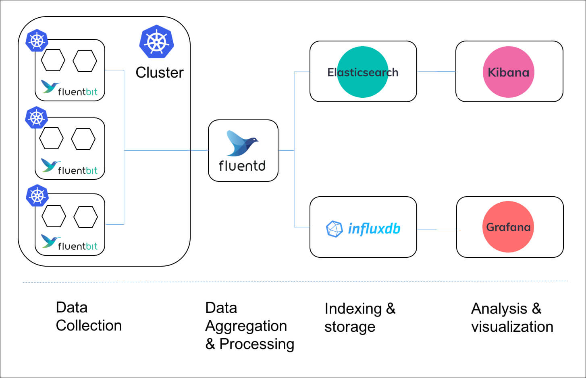

## 1. EFK

- EFK는 Elasticsearch, Fluentd, Kibana의 조합으로 구성된 로깅 시스템입니다.
- 분산 환경에서 발생하는 로그 데이터를 효율적으로 수집, 저장, 분석하고 시각화하는 데 사용되는 오픈 소스 솔루션들의 통합 스택입니다.
- 이번 글에서는 EFK를 쿠버네티스 환경에서 구축하는 방법에 대해 알아보겠습니다.

### 1.1 Elastic Search

- Elasticsearch는 분산형 검색 및 분석 엔진으로서 다음과 같은 특징을 가지고 있습니다:
- 대규모 로그 데이터를 효율적으로 저장하고 검색할 수 있는 기능을 제공합니다
- 실시간 데이터 처리가 가능하며, 강력한 검색 기능을 제공합니다
- 쿠버네티스의 Cluster Level Logging Architecture에서 logging backend 역할을 담당합니다

### 1.2 Fluentd

- Fluentd는 로그 데이터를 수집하고 분석하는 데 사용되는 오픈 소스 데이터 수집기다.
- 다양한 소스로부터 로그 데이터를 수집하고 처리할 수 있습니다
- 수집한 데이터를 여러 출력 대상으로 전달할 수 있습니다
- 쿠버네티스 환경에서는 각 노드에 배포되어 logging agent 역할을 수행합니다

### 1.3 Kibana

- Kibana는 Elasticsearch의 데이터를 시각화하고 탐색하는 도구로서 다음과 같은 기능을 제공합니다:
- 직관적인 대시보드를 통해 로그 데이터를 시각적으로 표현합니다
- Elasticsearch에 저장된 데이터를 다양한 방식으로 분석하고 탐색할 수 있습니다
- 사용자 친화적인 인터페이스를 통해 복잡한 쿼리와 분석을 수행할 수 있습니다

### 1.4 EFK 적용을 위한 사전 준비

- EFK를 효과적으로 구축하기 위해서는 다음과 같은 사항들을 먼저 이해해야 합니다:
- 쿠버네티스의 cluster-level logging 아키텍처의 기본 개념을 파악합니다
- Elasticsearch, Fluentd, Kibana 각 컴포넌트의 역할과 상호작용 방식을 이해합니다
- 로깅 시스템 구축에 필요한 리소스 요구사항을 검토합니다

## 2 Logging Architecture

- EFK를 적용하기에 앞서 먼저 kubernetes의 cluster-level logging 아키텍처를 이해하는 것이 중요합니다.
- 이는 로그 관리의 기본이 되는 핵심 개념이기 때문입니다.

### 2.1 컨테이너 로그 관리 필요성

- 우리가 EFK를 사용하는 이유는 컨테이너 런타임에서 제공하는 기본 기능으로 로그를 저장하고 분석 및 조회하기가 어렵기 때문입니다.
- 다음과 같은 상황에서도 애플리케이션의 로그를 확인할 수 있어야 합니다:
	- 컨테이너가 예기치 않게 종료된 경우
	- 파드가 노드에서 퇴출된 경우
		- 노드 자체가 장애를 겪은 경우
- 하지만 현재 실행 중인 컨테이너와 직전 컨테이너의 로그만 보관되어 과거 이력 추적이 어렵습니다.
- 추가적으로 로드 밸런싱 환경에서는 여러 파드에 분산된 로그를 통합적으로 분석해야 할 필요가 있습니다.
	- 디버깅을 위해 모든 파드의 로그를 일일이 찾아야 하는 번거로움이 있습니다.
- 즉 컨테이너 런타임에서 제공하는 로깅 기능만으로는 로그 관리가 어렵다는 것을 알 수 있습니다
- 따라서 cluster-level logging을 적용하면 중앙화된 로그 저장소에 모든 로그를 저장하고 관리된다면 이러한 문제를 해결할 수 있습니다.

### 2.2 노드가 컨테이너 로그를 다루는 방법

- 쿠버테니스의 모든 노드에는 Kubelet과 컨테이너 런타임 작동하고 있습니다.
- kubelet이 CRI를 통해 컨테이너 런타임에게 명령을 전달하면 컨테이너 런타임이 주어진 위치에 컨테이너 로그를 기록하는 방식으로 작동합니다.
- 컨테이너 런타임은 컨테이너에서 만들어지는 stdout and stderr streams을 처리하고 리다이렉트 합니다.
- 즉 컨테이너에서 생성되는 로그를 캡처해서 지정된 로그 파일에 기록합니다.
- 노드에서 동작 중인 컨테이너의 로그는 노드의 어느 위치에 위치한 로그 파일에 쓰이고 있습니다.
- Kubelet은 기본적으로 컨테이너를 다시 시작하면 종료된 컨테이너 하나를 로그와 함께 보관합니다.
- 만약 파드가 노드에서 퇴출당하면 포함된 모든 컨테이너와 로그가 함께 제거됩니다.
- 로그의 생명 주기가 파드와 같기 때문에 파드가 퇴출되면 cluster-level logging이 없으면 더 이상 로그를 보는 것이 불가능합니다.
- cluster-level logging 솔루션을 적용하면 애플리케이션의 로그는 노드, 파드, 컨테이너와 별개로 독립적인 backend에 저장되기 때문에 로그를 계속해서 볼 수 있습니다.

:::info[Container Runtime Interface (CRI)]
Kubelet과 컨테이너 런타임은 긴밀한 협력 관계를 통해 작동한다. Kubelet이 각 노드의 컨테이너 런타임을 관리하는 역할을 하기 때문이다. 그런데 컨테이너 런타임에는 여러 가지 종류가 존재하는데
Kubelet은 어떻게 서로 다른 컨테이너 런타임과 협력할 수 있을까? 이유는 Kubelet과 컨테이너 런타임 사이의 표준 프로토콜 CRI가 존재한다. 따라서 CRI를 만족시키는 컨테이너 런타임들은 교체해도
Kubelet은 무리 없이 협력이 가능하다.
:::

### 2.3 Log Rotation

- 파드를 계속해서 실행하게 되면 로그 파일에 쌓이는 로그의 양이 많아질 텐데 쿠버네티스는 이를 어떻게 관리할까?
- kubelet의 Log Rotaion 설정을 통해 로그 파일을 일정한 크기로 관리할 수 있습니다.
- kubelet이 CRI를 통해 컨테이너 런타임에게 명령을 전달하면 컨테이너 런타임이 주어진 위치에 컨테이너 로그를 기록하는 방식으로 작동합니다.
- kubelet의 containerLogMaxSize, containerLogMaxFiles 설정해서 로그 파일을 관리합니다.
	- containerLogMaxSize: 로그 파일 하나의 최대 크기(Default: "10Mi")
	- containerLogMaxFiles: 컨테이너 하나가 가질 수 있는 최대 로그 파일의 개수(Default: 5)
- kubelet의 Log Rotation을 직접 설정하고
  싶다면 [configuration settings](https://kubernetes.io/docs/reference/config-api/kubelet-config.v1beta1/), [kubelet configuration file](https://kubernetes.io/docs/tasks/administer-cluster/kubelet-config-file/)
  를 참고하자.

### 2.3 Cluster-level logging architectures

- 쿠버네티스는 자체적인 로깅 시스템을 제공하지 않기 때문에 cluster-level logging을 직접 구현해야 합니다.
- 3가지 방식으로 cluster-level logging을 구현할 수 있습니다.
	- 모든 노드에 logging agent를 놓는 방식
	- logging을 위한 사이드카 컨테이너를 pod에 포함시키는 방식
	- 애플리케이션에서 logging backend로 직접 로그를 전송하는 방식

#### 2.3.1 모든 노드에 logging agent를 놓는 방식


- logging agent를 각각의 노드에 하나씩 배치시키는 방법입니다.
- logging agent가 로그를 logging backend로 보내는 역할을 합니다.
	- EKF 스택에서는 Fluent Bit를 logging agent로 사용합니다.
- 일반적으로 logging agent는 해당 노드에서 작동하는 모든 컨테이너의 로그 파일에 직접 접근이 가능합니다.
- 노드 당 하나의 logging agent가 필요하기 때문에 DaemonSet을 이용해 agent를 배포하는 것이 좋습니다.
- 컨테이너마다 생성하는 로그의 형식이 다를 수 있기 때문에, logging agent는 이를 파싱하여 통일된 형식으로 변환한 후 logging backend로 전송하는 기능이 필요할 수 있습니다

#### 2.3.2 logging을 위한 사이드카 컨테이너를 pod에 포함시키는 방식


- 만약 노드 레벨의 logging agent가 적합하지 않은 상황이라면 파드에 사이드카로 logging agent를 추가할 수 있습니다.
- logging agent를 사이드카로 사용하는 것은 엄청난 양의 리소스를 소비할 수 있으니 주의가 필요합니다.

#### 2.3.3 애플리케이션에서 logging backend로 직접 로그를 전송하는 방식


- 애플리케이션 컨테이너가 직접 logging backend로 로그를 전달하는 방식입니다.

### 2.4 EFK의 아키텍처

- logging agent를 사이드카로 사용하는 것은 엄청난 양의 리소스를 소비할 수 있으니 우선적으로 모든 노드에 logging agent를 놓는 아키텍처로 진행하겠습니다.
- 즉 모든 노드에 하나씩 logging agent(Fluent Bit)을 배치하고 logging backend(ElasticSearch)로 로그를 전달하는 방식으로 EFK를 구축해 보겠습니다.
- Kibana는 ElasticSearch에 저장된 로그를 시각화하는 도구로 사용하겠습니다.

## 3 데모 애플리케이션 만들기

- EFK 구축에 앞서 로깅을 생성하는 HTTP API 애플리케이션을 구현해보겠습니다.
- 이 데모 애플리케이션의 개발 배경은 다음과 같습니다.
- 실제 프로젝트 진행 중 클라이언트의 HTTP API 호출에서 INTERNAL SERVER ERROR가 발생했을 때, 관련 로그를 찾는 데 어려움이 있었습니다.
- 쿠버네티스의 기본 로깅 기능만으로는 특정 API 요청과 관련된 로그만을 조회하기가 매우 불편했기 때문입니다.
- 이러한 문제를 해결하기 위해, 각 요청마다 고유한 ID를 부여하고 모든 로그에 이 요청 ID를 포함시키는 방식을 적용하기로 했습니다.
- 이렇게 하면 특정 요청과 관련된 모든 로그를 쉽게 검색하고 추적할 수 있습니다.
- 요청별 고유 식별자를 할당하는 기능은 Servlet Filter를 통해 직접 구현할 수도 있지만, Spring Cloud Sleuth를 사용하면 의존성 추가만으로도 동일한 기능을 손쉽게 구현할 수 있습니다.
- 따라서 이번 데모 프로젝트에서는 Spring Cloud Sleuth를 활용하여 요청 ID를 관리하도록 하겠습니다.

### 3.1 의존성 설정

### 3.2 Logback 포맷 설정

- 로그 출력 형식을 커스터마이징하기 위해 Logback 설정을 수정하겠습니다.
- Logback은 기본 포맷을 제공하지만, 우리의 요구사항에 맞게 커스터마이징할 수 있습니다.
- logback-spring.xml 파일에 Logback에 대한 설정을 추가하겠습니다.
- logback-spring.xml은 src/main/resources/logback-spring.xml에 위치합니다.

#### logback-spring.xml 파일

```xml

<configuration>
    <include resource="org/springframework/boot/logging/logback/defaults.xml"/>
    <springProperty scope="context" name="springAppName" source="spring.application.name"/>

    <conversionRule conversionWord="color" converterClass="org.springframework.boot.logging.logback.ColorConverter"/>

    <appender name="STDOUT" class="ch.qos.logback.core.ConsoleAppender">
        <encoder>
            <pattern>${springAppName} %date{yyyy-MM-dd HH:mm:ss.SSS} %-5level [%thread] [%X{traceId:-none}] %logger{36}
                - %message%n
            </pattern>
        </encoder>
    </appender>

    <root level="INFO">
        <appender-ref ref="STDOUT"/>
    </root>

</configuration>
```

- 위와 같이 Logback 설정을 추가하면 로그 출력 형식이 변경됩니다.

```text
logging-demo-application 2023-07-06 09:08:09.863 INFO  [http-nio-8080-exec-2] [96e5e5fc41b2ba87] o.a.c.c.C.[Tomcat].[localhost].[/] - Initializing Spring DispatcherServlet 'dispatcherServlet'
logging-demo-application 2023-07-06 09:08:09.864 INFO  [http-nio-8080-exec-2] [96e5e5fc41b2ba87] o.s.web.servlet.DispatcherServlet - Initializing Servlet 'dispatcherServlet'
logging-demo-application 2023-07-06 09:08:09.864 INFO  [http-nio-8080-exec-2] [96e5e5fc41b2ba87] o.s.web.servlet.DispatcherServlet - Completed initialization in 0 ms
logging-demo-application 2023-07-06 09:08:09.878 INFO  [http-nio-8080-exec-2] [96e5e5fc41b2ba87] c.e.l.controller.DemoController - DemoController
logging-demo-application 2023-07-06 09:08:09.878 INFO  [http-nio-8080-exec-2] [96e5e5fc41b2ba87] c.e.l.service.DemoService - DemoService
```

- 위는 Logback 설정을 추가한 결과입니다.

### 3.3 요청 ID를 부여하는 Filter 구현

- 검색 용이성을 위해 응답에 요청 ID를 포함시키는 Filter를 구현합니다.
	- 응답 헤더에 요청 ID를 포함시키는 Filter를 구현한다.

```java
@Component
@RequiredArgsConstructor
public class TraceIdFilter implements Filter {
    private final Tracer tracer;

    @Override
    public void doFilter(ServletRequest request, ServletResponse response, FilterChain chain) throws IOException, ServletException {
        if (response instanceof HttpServletResponse) {
            HttpServletResponse httpServletResponse = (HttpServletResponse) response;
            httpServletResponse.setHeader("trace-id", tracer.currentSpan().context().traceIdString());
        }

        chain.doFilter(request, response);
    }
}
```

## 4 솔루션 비교

### 4.1 Fluentd vs Logstash

- 성능 비교
  - 사용 메모리는 Fluentd(120MB)가 Logstash(40MB)보다 적습니다.
  - 현대 머신에서는 큰 차이가 아닌거 같지만 모든 말단 노드에서 실행된다는 것을 감안하면 Fluentd가 더 경제적입니다.
- 플러그인 생태계
  - 둘다 풍부한 플러그인 생태계를 가지고 있습니다.
  - Logstash는 하나의 [깃허브 저장소](https://github.com/logstash-plugins)에 모든 플러그인을 관리하고 있습니다.
    - 글을 작성하는 현재 274개의 플러그인이 존재합니다.
  - Fluentd는 보다 분산적인 방식으로 플러그인을 관리하고 있습니다.
    - [플러그인 목록 확인](https://www.fluentd.org/plugins/all)
    - Logstash보다 플러그인 수가 많습니다.
		

### 4.1 Fluentd vs Fluent bit

- Fluentd와 Fluent Bit은 둘 다 오픈 소스 로그 수집 도구로 사용할 수 있다.
- Cloud Native Computing Foundation (CNCF)의 일부이며 많은 공통점이 있지만, 사용 목적과 환경에 따라 선호되는 경우가 다르다.
- Fluentd와 Fluentbit은 상호 배타적 관계가 아니기 때문에 같이 사용할 수 있다.
- Fluentbit과 Fluentd의 관계는 Beats와 Logstash의 관계와 유사하다.
- 따라서 아래와 같이 Fluentd 과 Fluent bit을 같이 사용하는 아키텍처도 가능하다.



#### 비교


- Fluent Bit은 경량화가 중점인 로그 수집 도구로, IoT와 같이 리소스가 제한된 환경에서 사용하기 좋다.
- 표를 보면 Fluent Bit은 더 적은 메모리와 CPU를 사용하며, 코어 기능에 중점을 두고 있다.
- 기본적인 로그 처리와 전달 기능을 제공하며, 고급 필터링, 태깅, 라우팅 등의 기능을 제공한다.
- Fluent Bit은 제공하는 플러그인의 수가 비교적 적기는 하지만 이번 EFK 구축에 필요한 플러그인들이 이미 정의되어 있기 때문에 경량 버전인 Fluent bit을 사용하도록 하겠다.

## 5. Helm Chart를 이용한 EFK 설치

- 