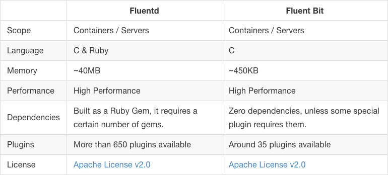
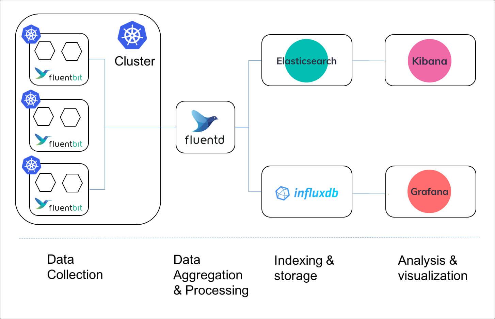

##  1 Fluent Bit

- Fluent Bit은 Fluentd의 경량 버전이라고 생각하면 된다.


###  1.1 Fluent Bit과 Fluentd

**Fluent Bit과 Fluentd 비교**



- Fluentd와 Fluentbit은 상호 배타적 관계가 아니다.
  - Fluentbit은 Fluentd의 경량 버전이라고 생각하면 쉽다.
  - Fluentbit과 Fluentd의 관계는 Beats와 Logstash의 관계와 유사하다.
  - https://logz.io/blog/fluentd-vs-fluent-bit/를 참고하자.


**Fluent Bit과 Fluentd를 같이 사용하는 아키텍처가 가능하다**



- Fluent Bit을 daemonset을 이용해서 노드마다 하나씩 배포한다.
- Fluent Bit은 데이터를 수집하고 Fluentd로 포워딩한다.
- Fluentd는 클러스터 당 하나의 인스턴스를 배포한다.
  - Fluent Bit로부터 받은 데이터를 aggregation하고 다시 포워딩한다. 


###  1.2 Key Concept


####  1.2.1 Event or Record

- [레퍼런스](https://docs.fluentbit.io/manual/concepts/key-concepts#event-or-record)
- Fluent Bit로 들어오는 모든 데이터 조각들을 Event 또는 Record라고 부른다.
  - 데이터: 로그 또는 메트릭


**Event의 포맷**

- Event는 아래 3가지로 구성된다.
  - timestamp
  - key/value metadata (since v2.1.0)
  - payload

```
[[TIMESTAMP, METADATA], MESSAGE]
```

- TIMESTAMP: 초 단위로 표현된 정수 또는 부동소수점 값으로 나타내는 타임스탬프입니다(문자열이 아님).
- METADATA: 이벤트 메타데이터를 포함하는 가능성이 있는 객체
- MESSAGE: 이벤트 본문을 포함하는 객체


**Structured Messages**

- Messages는 아래와 같이 Structure를 가질수도 있고 아닐수도 있다.
  - `{"project": "Fluent Bit", "created": 1398289291}`
  - `"Project Fluent Bit created on 1398289291"`
- structure가 있는 메시지를 처리하는 것이 더 빠르다.


####  1.2.2 Tag

- 모든 이벤트에는 Tag가 부여된다.
- Tag는 이후 필터 단계와 아웃풋 단계에서 사용된다.
- 대부분의 Tag는 설정을 통해 직접 부여된다.
- 만약 Tag를 명시하지 않으면 Fluent Bit는 자동으로 인풋 플러그인의 이름을 Tag로 부여한다.


###  1.3 Data Pipeline

%20(2)%20(2)%20(2)%20(2)%20(2)%20(2)%20(2)%20(1).png?alt=media)

- Fluent Bit로 들어오는 데이터는 아래와 같은 파이프라인을 거친다.
  - input
  - Parser
  - Filter
  - Buffer
  - Router
  - Output


##  2 Input 

- [레퍼런스](https://docs.fluentbit.io/manual/concepts/data-pipeline/input)
- Fluent Bit는 여러 가지 소스로부터 정보를 모으기 위해 여러 Input Plugin을 제공한다.
  - 여러 인풋 플러그인 https://docs.fluentbit.io/manual/pipeline/inputs 참고


###  2.1 Tail Plugin

- **tail** input plugin은 텍스트 파일을 모니터링한다.
  - `tail -f`와 유사하게 작동한다.
- Tail은 `Path` 패턴에 매칭되는 모든 파일을 모니터링한다.
  - 텍스트 파일에 새로운 줄이 추가되면 새로운 이벤트(레코드)를 생성한다.


**Configuration Parameters**

- [레퍼런스](https://docs.fluentbit.io/manual/pipeline/inputs/tail#config)


**Multiline Support**

- Fluent Bit 1.8버전 부터 Multiline 기능이 추가되었다.
- 그래서 현재 old configuration mechanism과 new configuration mechanism 두가지 방식이 존재한다.
  - 하위 호환성을 위해 old configuration mechanism은 그대로 남겨두었다.
- new configuration mechanism을 이용하면 `multiline.parser`라는 키를 이용하면 된다.
  - multiline.parser를 사용하게 되면 old configuration mechanism인 아래의 키를 사용할 수 없다.
  - parser
  - parser_firstline
  - parser_N
  - multiline
  - multiline_flush
  - docker_mode


##  3 Parser

- Parser는 structure가 없는 데이터에 structure를 부여하는 역할을 한다.
- 구조가 없는 데이터 처리하는 것은 매우 비효율적이기 때문에 Input 단계에서 구조가 없는 데이터가 들어오면 바로 Parser에 의해 구조를 부여한다.


**예시**

```
192.168.2.20 - - [28/Jul/2006:10:27:10 -0300] "GET /cgi-bin/try/ HTTP/1.0" 200 3395
```

- 위와 같은 구조가 없는 데이터를 Parser를 이용해 아래와 같이 구조를 가진 데이터로 만든다.

```json
{
  "host":    "192.168.2.20",
  "user":    "-",
  "method":  "GET",
  "path":    "/cgi-bin/try/",
  "code":    "200",
  "size":    "3395",
  "referer": "",
  "agent":   ""
 }
```


###  3.1 JSON Parser

- **JSON는 원본 로그 소스가 JSON 형태일 경우 사용**할 수 있다.
- 로그 소스를 구조화하고 직접적으로 내부 바이너리 표현으로 변환한다.


```yaml
[PARSER]
    Name        docker
    Format      json
    Time_Key    time
    Time_Format %Y-%m-%dT%H:%M:%S %z
```


````
{"key1": 12345, "key2": "abc", "time": "2006-07-28T13:22:04Z"}
````

- 원본 로그 소스가 위처럼 JSON 형태일 경우

```
`[1154103724, {"key1"=>12345, "key2"=>"abc"}]`
```

- JSON Parser를 거치면 위와 같이 표현으로 변환된다.


###  3.2 Regular Expression Parser

- [레퍼런스](https://docs.fluentbit.io/manual/pipeline/parsers/regular-expression)
- Ruby Regular Expression을 사용해서 원본 소스에 구조를 부여할 수 있다.
- Ruby Regular Expression이 제대로 동작하는 아래 사이트에서 테스트할 수 있다.
  - http://rubular.com/


**예시**

```yaml
[PARSER]
    Name   apache
    Format regex
    Regex  ^(?<host>[^ ]*) [^ ]* (?<user>[^ ]*) \[(?<time>[^\]]*)\] "(?<method>\S+)(?: +(?<path>[^\"]*?)(?: +\S*)?)?" (?<code>[^ ]*) (?<size>[^ ]*)(?: "(?<referer>[^\"]*)" "(?<agent>[^\"]*)")?$
    Time_Key time
    Time_Format %d/%b/%Y:%H:%M:%S %z
    Types code:integer size:integer
```

위 Parser 설정은 Apache HTTP Server log entry를 정규 표현식으로 구조화한다.

```
192.168.2.20 - - [29/Jul/2015:10:27:10 -0300] "GET /cgi-bin/try/ HTTP/1.0" 200 3395
```

위는 Apache HTTP Server log entry로 보시다시피 구조가 없는 상태다.


위 정규 표현식 테스트 사이트에 원본 로그 데이터와 정규 표현식을 넣으면 오른쪽 아래와 같이 구조화된 데이터를 얻을 수 있다.


###  3.1 Parser Plugin

- 기본적으로 Fluent Bit 여러 타입의 로그에 대한 미리 정의된 Parser를 제공한다.

  - Apache

  - Nginx

  - Docker

  - Syslog rfc5424

  - Syslog rfc3164


**Configuration Parameters**

- [레퍼런스](https://docs.fluentbit.io/manual/pipeline/parsers/configuring-parser#configuration-parameters)


###  3.3 Multiline Parsing

- [레퍼런스](https://docs.fluentbit.io/manual/administration/configuring-fluent-bit/multiline-parsing)
- 이상적으로, 애플리케이션들은 로그 메시지를 한 줄로 기록할 수 있지만, 실제로는 애플리케이션들이 같은 컨텍스트에 속한 여러 로그 메시지를 생성한다.
  - 이런 정보를 처리할 때는 매우 복잡하다.
  - 예를 들어, 애플리케이션 stack trace는 항상 여러 로그 라인을 가지고 있기 때문이다.
- Multiline parser를 사용하는 방법에는 2가지가 있다.
  - Built-in multiline parser를 이용하기
  - Configurable multiline parser를 이용하기


**Built-in Multiline Parsers**

- 추가 설정 없이 Fluent Bit에서 미리 설정한 Built-in Multiline Parsers를 사용할 수 있다.
- 아래표 참고해서 적합한 **Built-in Multiline Parsers**가 있다면 바로 사용할 수 있다.

| Parser | Description                                                  |
| ------ | ------------------------------------------------------------ |
| docker | Process a log entry generated by a Docker container engine. This parser supports the concatenation of log entries split by Docker. |
| cri    | Process a log entry generated by CRI-O container engine. Same as the *docker* parser, it supports concatenation of log entries |
| go     | Process log entries generated by a Go based language application and perform concatenation if multiline messages are detected. |
| python | Process log entries generated by a Python based language application and perform concatenation if multiline messages are detected. |
| java   | Process log entries generated by a Google Cloud Java language application and perform concatenation if multiline messages are detected. |


**Configurable Multiline Parsers**

- [레퍼런스](https://docs.fluentbit.io/manual/administration/configuring-fluent-bit/multiline-parsing)
- **Built-in Multiline Parsers**가 맞지 않는다면 설정을 이용해 커스텀한 **Multiline Parsers**를 직접 정의할 수 있다.
- Configurable Multiline Parsers는 `[MULTILINE_PARSER]` 키워드를 사용해서 정의한다.


[MULTILINE_PARSER]가 가지는 프로퍼티

| Property      | Description                                                  | Default |
| ------------- | ------------------------------------------------------------ | ------- |
| name          | Specify a unique name for the Multiline Parser definition. A good practice is to prefix the name with the word `multiline_` to avoid confusion with normal parser's definitions. |         |
| type          | Set the multiline mode, for now, we support the type `regex`. |         |
| parser        | Name of a pre-defined parser that must be applied to the incoming content before applying the regex rule. If no parser is defined, it's assumed that's a raw text and not a structured message.Note: when a parser is applied to a raw text, then the regex is applied against a specific key of the structured message by using the `key_content` configuration property (see below). |         |
| key_content   | For an incoming structured message, specify the key that contains the data that should be processed by the regular expression and possibly concatenated. |         |
| flush_timeout | Timeout in milliseconds to flush a non-terminated multiline buffer. Default is set to 5 seconds. | 5s      |
| rule          | Configure a rule to match a multiline pattern. The rule has a specific format described below. Multiple rules can be defined. |         |


**설정하기**

- 파서를 설정하기 전에 알아야 할 것!
  1. multiline message의 첫 번째 라인과 매칭되는 정규 표현식
  2. 이어지는 두 번째 라인과 마지막 라인까지 매칭되는 정규 표현식
- 1번 정규 표현식과 매칭되면 start_state 상태라고 한다.
- 2번 정규 표현식과 매칭되면 커스텀한 state 이름을 붙인다.


##  4 Filter

- [레퍼런스](https://docs.fluentbit.io/manual/concepts/data-pipeline/filter)
- Filter가 하는 역할
  - 데이터 수정하기
  - 데이터에 정보 추가하기
  - 데이터 드롭하기


###  4.1 Kubernetes Plugin

- [레퍼런스](https://docs.fluentbit.io/manual/pipeline/filters/kubernetes)
- Kubernetes Filter는 이벤트에 Kubernetes 메타 데이터를 넣어준다.
- Fluent Bit은 쿠버네티스 클러스터에 데몬셋으로 배포했을 때 Fluent Bit이 컨테이너의 로그 파일을 읽고 이벤트를 생성한다.
- 이렇게 생성된 이벤트에 Kubernetes 필터가 아래와 같은 Kubernetes 메타 데이터를 추가해준다.
  - Pod Name
  - Namespace
  - Container Name
  - Container ID
  - Pod ID
  - Labels
  - Annotations


##  5 Buffer

- [레퍼런스](https://docs.fluentbit.io/manual/concepts/data-pipeline/buffer)


##  6 Router

- [레퍼런스](https://docs.fluentbit.io/manual/concepts/data-pipeline/router)
- Data 파이프라인을 거친 데이터를 최종적으로 어디로 보낼것인가를 결정하는 역할을 한다.
- 라우팅 과정에서 Tag와 Match가 사용된다.
  - Input 단계에서 모든 데이터는 Tag가 부여된다.
  - output 단계에서 설정한 Match 룰을 토대로 어디로 보낼지가 결정된다.


**예시**

```
[INPUT]
    Name cpu
    Tag  my_cpu

[INPUT]
    Name mem
    Tag  my_mem

[OUTPUT]
    Name   es
    Match  my_cpu

[OUTPUT]
    Name   stdout
    Match  my_mem
```

- CPU metrics은 Elasticsearch로 보내고 Memory metrics은 standard output으로 보내는 Match Rule

##  7 Output
- Input 소스가 다양한 만큼 Output 소스도 다양하다.
  - 지원되는 아웃풋 솟 https://docs.fluentbit.io/manual/pipeline/outputs 참고

###  7.1 Elasticsearch Plugin

- [레퍼런스](https://docs.fluentbit.io/manual/pipeline/outputs/elasticsearch)