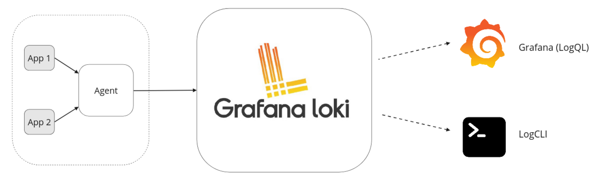
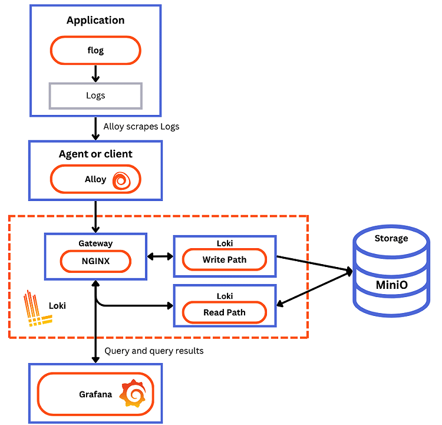

## 1. Grafana Loki

- 그라파나 로키는 완전한 기능을 갖춘 로깅 스택으로 구성할 수 있는 오픈 소스 컴포넌트 세트입니다. 
- 작은 인덱스와 고도로 압축된 청크는 운영을 단순화하고 로키의 비용을 크게 낮춥니다.
- Grafana Loki는 로그 집계 시스템으로, Prometheus와 유사한 방식으로 작동합니다.
- 다른 로깅 시스템과 달리, 로키는 로그의 레이블(프로메테우스 레이블과 같은)에 대한 메타데이터만 인덱싱하는 아이디어를 중심으로 구축되었습니다. 
- 로그 데이터 자체는 압축되어 Amazon Simple Storage Service(S3)나 Google Cloud Storage(GCS)와 같은 객체 스토리지에 청크 형태로 저장되거나, 심지어 로컬 파일 시스템에도 저장될 수 있습니다.

## 2. Loki의 특징

- 확장성
  - Loki는 확장성을 위해 설계되었으며, 라즈베리 파이에서 실행하는 것만큼 작은 규모부터 하루에 페타바이트를 수집하는 큰 규모까지 확장할 수 있습니다. 
  - 가장 일반적인 배포 방식인 "단순 확장 모드"에서 Loki는 요청을 별도의 읽기 및 쓰기 경로로 분리하므로 독립적으로 확장할 수 있어, 어느 시점에서든 워크로드에 빠르게 적응할 수 있는 유연한 대규모 설치로 이어집니다. 
  - 필요한 경우, 각 Loki 구성 요소는 Kubernetes 내에서 네이티브하게 실행되도록 설계된 마이크로서비스로도 실행될 수 있습니다.
- 멀티테넌시
  - Loki는 여러 테넌트가 단일 Loki 인스턴스를 공유할 수 있게 합니다. 
  - 멀티테넌시를 통해 각 테넌트의 데이터와 요청은 다른 테넌트와 완전히 격리됩니다. 멀티테넌시는 에이전트에서 테넌트 ID를 할당하여 구성됩니다.
- 서드파티 통합
  - 여러 서드파티 에이전트(클라이언트)는 플러그인을 통해 Loki를 지원합니다. 이를 통해 기존 관측성 설정을 유지하면서 Loki로 로그를 전송할 수 있습니다.
- 효율적인 저장소
  - Loki는 로그 데이터를 고도로 압축된 청크로 저장합니다. 
  - 마찬가지로, Loki 인덱스는 레이블 집합만 인덱싱하기 때문에 다른 로그 집계 도구보다 크기가 훨씬 작습니다. 
  - 유일한 데이터 저장 메커니즘으로 객체 저장소를 활용함으로써, Loki는 기본 객체 저장소의 신뢰성과 안정성을 상속받습니다. 
  - 또한 로컬로 연결된 솔리드 스테이트 드라이브(SSD)와 하드 디스크 드라이브(HDD)와 같은 다른 저장 메커니즘보다 객체 저장소의 비용 효율성과 운영 단순성을 활용합니다.
  - 압축된 청크, 작은 인덱스, 저비용 객체 저장소 사용으로 Loki의 운영 비용이 절감됩니다.
- LogQL, Loki 쿼리 언어
  - LogQL은 Loki의 쿼리 언어입니다. 
  - Prometheus 쿼리 언어인 PromQL에 이미 익숙한 사용자는 LogQL이 로그에 대한 쿼리를 생성하는 데 익숙하고 유연하다는 것을 알게 될 것입니다. 
  - 이 언어는 또한 로그 데이터에서 메트릭을 생성하는 것을 용이하게 하는데, 이는 로그 집계를 훨씬 넘어서는 강력한 기능입니다.
- 알림
  - Loki에는 ruler라고 하는 구성 요소가 포함되어 있으며, 이는 로그에 대해 쿼리를 지속적으로 평가하고 결과에 따라 조치를 취할 수 있습니다. 
  - 이를 통해 로그에서 이상 징후나 이벤트를 모니터링할 수 있습니다. 
  - Loki는 Prometheus Alertmanager 또는, Grafana 내의 알림 관리자와 통합됩니다.
- Grafana 통합
  - Loki는 Grafana, Mimir 및 Tempo와 통합되어 완전한 관측성 스택을 제공하며, 로그, 메트릭 및 트레이스 간의 원활한 상관 관계를 제공합니다.

## 3. Prometheus와의 차이점

- Loki는 Prometheus에서 영감을 받은 수평적으로 확장 가능하고, 고가용성을 갖춘 멀티테넌트 로그 집계 시스템입니다. 
- Loki는 메트릭 대신 로그에 중점을 두고, 풀(pull) 대신 푸시(push) 방식으로 로그를 수집한다는 점에서 Prometheus와 다릅니다.

## 4. Loki 로깅 스택

- 일반적인 Loki 기반 로깅 스택은 3가지 구성 요소로 이루어집니다:
- 에이전트
  - Grafana Alloy나 Loki와 함께 배포되는 Promtail과 같은 에이전트 또는 클라이언트입니다. 
  - 에이전트는 로그를 스크랩(수집)하고, 레이블을 추가하여 로그를 스트림으로 변환한 후, HTTP API를 통해 Loki로 스트림을 푸시합니다.
- Loki
  - 로그 수집, 저장 및 쿼리 처리를 담당하는 메인 서버입니다. 
  - 세 가지 다른 구성으로 배포될 수 있으며, 자세한 내용은 배포 모드를 참조하세요.
- Grafana
  - 로그 데이터 쿼리 및 표시에 사용됩니다. 
  - LogCLI를 사용하거나 Loki API를 직접 사용하여 명령줄에서 로그를 쿼리할 수도 있습니다.

## 참고

- https://grafana.com/docs/loki/latest/
- https://grafana.com/docs/loki/latest/get-started/overview/