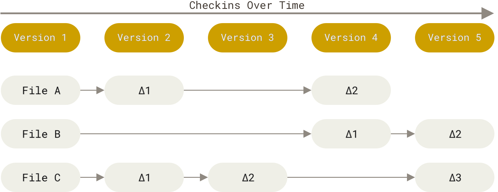

## 1. Git

- Git이 무엇인지, 그리고 Git이 작동하는 기본 원리를 이해한다면, Git을 효과적으로 사용하는 것이 훨씬 쉬워질 것이기 때문입니다.
- Git을 배우면서 CVS, Subversion, Perforce와 같은 다른 VCS에 대해 알고 있는 것들을 머릿속에서 지우려고 노력해보세요.
- Git은 정보를 매우 다른 방식으로 저장하고 생각하며, 이러한 차이점을 이해하는 것이 Git을 사용하는 동안 혼란스러워하는 것을 피하는 데 도움이 될 것입니다.

## 2. 차이점이 아닌 스냅샷

- Git과 다른 모든 VCS(Subversion과 그 친구들 포함) 사이의 주요 차이점은 Git이 데이터에 대해 생각하는 방식입니다. 
- 개념적으로, 대부분의 다른 시스템들은 정보를 파일 기반 변경사항의 목록으로 저장합니다. 
- 이러한 다른 시스템들(CVS, Subversion, Perforce 등)은 저장하는 정보를 파일 세트와 시간이 지남에 따라 각 파일에 적용된 변경사항으로 생각합니다
  - 이는 일반적으로 델타 기반 버전 제어라고 설명됩니다

- Git은 이런 방식으로 데이터를 생각하거나 저장하지 않습니다. 
- 대신, Git은 데이터를 미니어처 파일시스템의 일련의 스냅샷처럼 생각합니다. 
- Git에서는 커밋하거나 프로젝트 상태를 저장할 때마다, Git은 기본적으로 그 순간 모든 파일이 어떻게 생겼는지 사진을 찍고 그 스냅샷에 대한 참조를 저장합니다. 
- 효율성을 위해, 파일이 변경되지 않았다면 Git은 파일을 다시 저장하지 않고, 이미 저장된 이전의 동일한 파일에 대한 링크만 저장합니다. 
- Git은 데이터를 스냅샷의 스트림처럼 생각합니다.

## 3. 거의 모든 작업이 로컬

- Git의 대부분의 작업은 로컬 파일과 리소스만 있으면 작동합니다.
- 일반적으로 네트워크상의 다른 컴퓨터로부터 정보가 필요하지 않습니다.
- 프로젝트의 전체 히스토리가 바로 로컬 디스크에 있기 때문에, 대부분의 작업이 거의 즉시 이루어지는 것처럼 보입니다.

## 참고

- https://git-scm.com/book/en/v2/Getting-Started-What-is-Git%3F