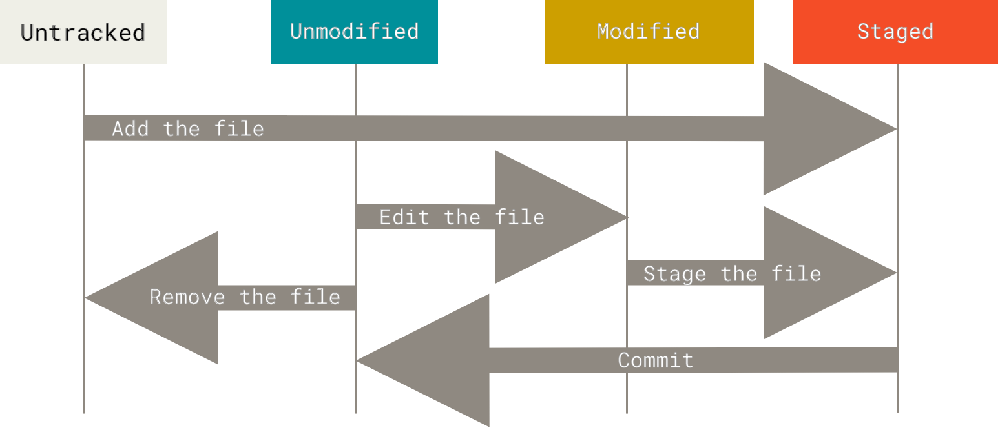
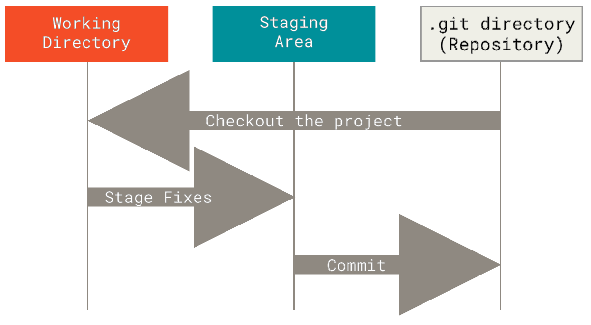

## 1. git file의 상태



- Git에는 파일이 존재할 수 있는 주요 상태가 있습니다.
- 위 그림은 파일 상태의 라이프사이클을 나타냅니다.
- Untracked, Unmodified, Modified, Staged, Committed

### 1.1 Untracked

- 작업 디렉토리의 각 파일은 추적됨(tracked) 또는 추적되지 않음(untracked) 두 상태 중 하나에 있을 수 있습니다.
- 추적되지 않는 파일은 마지막 스냅샷에 없었고 스테이징 영역에도 없는 작업 디렉토리의 모든 파일들입니다.
- Untracked에서 가능한 상태 변화
  - Untracked → Staged: git add 명령을 사용하여 새 파일을 스테이지합니다.

#### 예시

```bash
$ echo 'My Project' > README
$ git status
On branch master
Your branch is up-to-date with 'origin/master'.
Untracked files:
  (use "git add <file>..." to include in what will be committed)

    README

nothing added to commit but untracked files present (use "git add" to track)
```

- 프로젝트에 새 파일, 간단한 README 파일을 추가한다고 해봅시다. 
- 파일이 이전에 존재하지 않았고, git status를 실행하면 다음과 같이 추적되지 않는 파일을 볼 수 있습니다.
- 새 README 파일이 상태 출력의 "Untracked files" 제목 아래에 있기 때문에 추적되지 않는다는 것을 볼 수 있습니다. 
- 추적되지 않는다는 것은 기본적으로 Git이 이전 스냅샷(커밋)에 없었고 아직 스테이지되지 않은 파일을 본다는 의미입니다
- Git은 명시적으로 지시할 때까지 커밋 스냅샷에 포함하기 시작하지 않습니다. 
  - 이는 생성된 바이너리 파일이나 포함하려는 의도가 없었던 다른 파일들을 실수로 포함하기 시작하지 않도록 하기 위해서입니다. 

```bash
$ git add README
```

- 새 파일 추적을 시작하려면 git add 명령을 사용합니다. 
- README 파일 추적을 시작하려면 위 명령어를 실행합니다.

```bash
$ git status
On branch master
Your branch is up-to-date with 'origin/master'.
Changes to be committed:
  (use "git restore --staged <file>..." to unstage)

    new file:   README
```

- 상태 명령을 다시 실행하면, README 파일이 이제 추적되고 커밋될 준비가 되어 스테이지되었다는 것을 볼 수 있습니다.
- "Changes to be committed" 제목 아래에 있기 때문에 스테이지되었다는 것을 알 수 있습니다.
- 즉 add 명령을 통해 파일의 상태가 Untracked에서 Staged로 변경되었습니다.

### 1.2 Unmodified

- Unmodified에서 가능한 상태 변화
  - Unmodified → Modified: 파일의 내용을 변경합니다.

### 1.3 Modified

- 작업 디렉토리의 파일이 마지막 커밋 이후로 변경되었지만 아직 스테이지되지 않은 상태입니다.
- 가능한 상태 변화
  - Modified → Staged: git add 명령을 사용하여 파일을 스테이지합니다.
  - Modified → Unmodified: git restore 명령을 사용하여 파일의 변경사항을 취소합니다.

#### 예시

```bash
$ git status
On branch master
Your branch is up-to-date with 'origin/master'.
Changes to be committed:
  (use "git reset HEAD <file>..." to unstage)

    new file:   README

Changes not staged for commit:
  (use "git add <file>..." to update what will be committed)
  (use "git checkout -- <file>..." to discard changes in working directory)

    modified:   CONTRIBUTING.md
```

- 이미 추적되고 있던 파일을 변경해봅시다. 
- CONTRIBUTING.md라는 이전에 추적되던 파일을 변경하고 git status 명령을 다시 실행하면, 위와 같은 결과를 볼 수 있습니다.
- "Changes not staged for commit" 제목 아래에 있는 CONTRIBUTING.md 파일이 있습니다.
  - 이는 추적되는 파일이 작업 디렉토리에서 수정되었지만 아직 스테이지되지 않았다는 의미입니다
- 스테이지하려면 git add 명령을 실행합니다.
  - git add는 다목적 명령입니다. 새 파일 추적을 시작하고, 파일을 스테이지하고, 병합 충돌 파일을 해결됨으로 표시하는 등의 다른 일들을 하는 데 사용합니다.

```bash
$ git add CONTRIBUTING.md
$ git status
On branch master
Your branch is up-to-date with 'origin/master'.
Changes to be committed:
  (use "git reset HEAD <file>..." to unstage)

    new file:   README
    modified:   CONTRIBUTING.md
```

- 이제 git add를 실행하여 CONTRIBUTING.md 파일을 스테이지하고, 그 다음 git status를 다시 실행해봅시다.
- 두 파일 모두 스테이지되었고 다음 커밋에 들어갈 것입니다.

### 1.4 Staged

- 스테이지된 파일은 커밋될 준비가 된 상태입니다.
- Staged에서 가능한 상태 변화
  - Staged → Unmodified: git commit 명령을 사용하여 커밋합니다.
  - Staged → Modified: git restore --staged 명령을 사용하여 스테이지에서 제거합니다.

## 2. Working Directory, Staging Area, Repository

### 2.1 Working Directory(Working Tree)

- Working Directory는 현재 작업 중인 디렉토리입니다.

### 2.2 Staging Area(Index)

- Staging Area는 커밋할 파일을 준비하는 영역입니다.
- Staging Area는 다음에 커밋될 파일들의 정보를 저장하는 파일입니다.
  - `.git/index` 파일로 저장됩니다.
- Git의 3단계 워크플로우에서 Working Directory와 Repository 사이의 중간 단계 역할을 합니다.
- `git add` 명령어로 파일을 Staging Area에 추가할 수 있습니다.
- Staging Area를 통해 선택적 커밋이 가능합니다.
  - 작업 디렉토리의 모든 변경사항이 아닌, 원하는 변경사항만 다음 커밋에 포함시킬 수 있습니다.
- `git status` 명령어로 현재 Staging Area의 상태를 확인할 수 있습니다.
- Index라는 용어와 Staging Area는 동일한 개념을 가리키는 서로 다른 표현입니다.
  - Index: Git 내부적으로 사용하는 공식 용어
  - Staging Area: 사용자에게 더 직관적인 용어

### 2.3 Repository(Git directory)

- Git 디렉토리는 Git이 프로젝트의 메타데이터와 객체 데이터베이스를 저장하는 곳입니다.
- Git의 가장 중요한 부분이며, 다른 컴퓨터로부터 repository를 클론할 때 복사되는 부분입니다.
- 기본적인 Git 워크플로우는 다음과 같습니다.
  - 작업 트리에서 파일을 수정합니다.
  - 다음 커밋의 일부가 되기를 원하는 변경사항만을 선택적으로 스테이징하며, 이는 오직 해당 변경사항만을 스테이징 영역에 추가합니다.
  - 커밋을 수행하면, 스테이징 영역에 있는 파일들의 상태를 가져와서 해당 스냅샷을 Git 디렉토리에 영구적으로 저장합니다.

## 참고

- https://git-scm.com/book/en/v2/Getting-Started-What-is-Git%3F
- https://git-scm.com/book/en/v2/Git-Basics-Recording-Changes-to-the-Repository