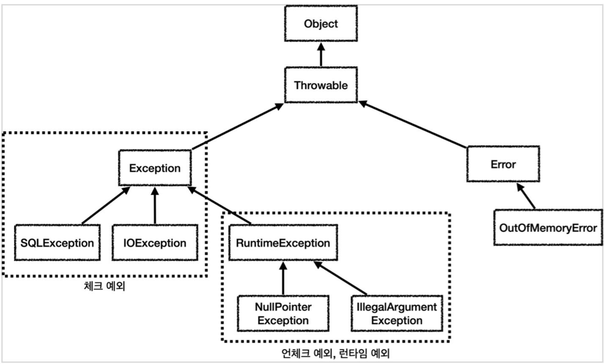

## 1 예외

### 1.1 Error

- 자바에서는 컴퓨터 하드웨어 오작동 또는 고장으로 오류가 발생하는 것을 에러라고 합니다.
- 에러는 JVM 실행에 문제가 있다는 것으로 개발자는 이런 에러에 대처할 방법이 없습니다.
- 메모리 부족이나 심각한 시스템 오류와 같이 애플리케이션에서 복구 불가능한 시스템 예외입니다.
- 상위 예외를 catch 로 잡으면 그 하위 예외까지 함께 잡습니다.
	- 따라서 애플리케이션 로직에서는 Throwable 예외도 잡으면 안되는데, 앞서 이야기한 Error 예외도 함께 잡을 수 있기 때문입니다.
	- **애플리케이션 로직은 이런 이유로 Exception 부터 필요한 예외로 생각하고 잡으면 됩니다.**
- Error 도 언체크 예외입니다.

### 1.2 Exception(예외)

- 애플리케이션 로직에서 사용할 수 있는 실질적인 최상위 예외입니다.

### 1.3 Exception의 종류



- 예외는 두 가지 종류가 있습니다
- 하나는 Checked Exception이고 다른 하나는 Unchecked Exception입니디.
	- Checked Exception: `Exception` 클래스를 상속 받습니다.
	- Unchecked Exception: `RuntimeException` 클래스를 상속 받습니다.
- 두 가지 종류를 나누는 기본 규칙: `호출하는 쪽에서 복구하리라 여겨지는 상황이리면 Checked Exception을 사용하라`
- 자세한 내용은 아래에서 다룹니다.

## 2. 예외 던지기

- 예외는 프로그램 실행 중에 발생하는 이벤트로, 프로그램 명령의 정상적인 흐름을 방해합니다.
- 메소드 내에서 오류가 발생하면 메소드는 객체를 만들어 런타임 시스템으로 전달합니다.
	- 예외 개체라고 하는 개체에는 오류 발생 시 프로그램 상태 및 유형 등 오류에 대한 정보가 포함되어 있습니다.
	- 예외 개체를 만들어 런타임 시스템에 전달하는 것을 예외 던지기라고 합니다.

### 2.1 예외 던지기 흐름

**call stack**


- 메서드가 예외를 발생시킨 후 런타임 시스템은 메서드를 처리할 수 있는 핸들러를 콜 스택에서 찾으려고 시도합니다.

**exception handler를 콜 스택에서 찾는 과정**


- 런타임 시스템은 콜 스택에서 예외를 처리할 수 있는 코드 블록을 포함하는 메서드를 찾습니다.
	- 이 코드 블록을 exception handler(예외 처리기)라고 합니다.
- 예외 처리기 검색은 오류가 발생한 메서드로 시작하여 메서드가 호출된 역순으로 콜 스택을 통해 진행됩니다.
- 적절한 처리기가 발견되면 런타임 시스템은 예외를 처리기에 전달합니다.
	- 던져진 예외 개체의 유형이 처리기에서 처리할 수 있는 유형과 일치하는 경우 예외 처리기가 적절한 것으로 간주됩니다.
	- 이것을 예외 핸들러가 예외를 잡는다고(catch) 합니다.
- 적절한 예외 처리기를 찾지 못하면 프로그램이 종료됩니다.
  - 자바 `main()` 쓰레드의 경우 예외 로그를 출력하면서 시스템이 종료됩니다.
  - 웹 애플리케이션의 경우 여러 사용자의 요청을 처리하기 때문에 하나의 예외 때문에 시스템이 종료되면 안됩니다.
  - 이 경우 WAS가 해당 예외를 받아서 처리하는데, 주로 사용자에게 개발자가 지정한, 오류 페이지를 보여줍니다.

## 3 Checked Exception

- Exception 클래스를 상속한 예외들은 모두 Checked Exception입니다.
  - 단 RuntimeException 클래스를 상속한 예외는 Unchecked Exception입니다.
- Checked Exception이란 컴파일러가 예외 처리를 제대로 하는지 확인 해주는 예외입니다.
- 어느 메서드가 어떤 예외를 던지는지 명확히 알 수 있습니다.
- 자바 소스를 컴파일하는 과정에서 Checked Exception이 발생하는 코드에서 아래와 같은 조치중 하나를 하지않는다면 컴파일 오류가 발생한다.
	- 발생한 예외를 그 메서드 안에서 처리(`catch` 블록)
	- 처리를 안 할 경우 그 사실을 메서드 시그니쳐 옆에 표기(`throws`)
		- 그러면 이 메서드의 호출자가 다시 이 둘 중에 하나를 해야한다.

### 3.1 Checked Exception의 목적

- Checked Exception을 던지면 호출자가 그 예외를 catch로 잡아 처리하거나 더 바깥으로 전파라도록 강제합니다.
- 따라서 메서드 선언에 포함된 Checked Exception은 메서드를 호출했을 때 **발생할 수 있는 유력한 결과임을 API 사용자에게 알려줄 수 있습니다.**
- **달리 말하면 API 설계자는 Checked Exception를 던져주어 그 상황에서 회복해내라고 요구하는 것입니다.**
- 물론 사용자가 예외를 잡기만하고 별다른 조치를 취하지 않을 수 있지만 이는 사용자의 책임입니다.

### 3.2 Checked Exception의 장점

- Checked Exception은 예외 처리를 강제하기 때문에 안정성을 높일 수 있습니다.

### 3.3 Checked Exception의 단점

- 실제로는 개발자가 모든 체크 예외를 반드시 잡거나 던지도록 처리해야 하기 때문에 코드가 복잡해질 수 있습니다.
- 대부분의 체크 예외는 개발자가 처리할 방법이 없는 경우가 많습니다.
  - 예를 들면 SQLException예를 예외는 데이터베이스에 무언가 문제가 있어서 발생하는 예외입니다.
  - SQL 문법에 문제가 있을 수 도 있고, 데이터베이스 자체에 뭔가 문제가 발생했을 수도 있습니다.
  - 데이터베이스 서버가 중간에 다운 되었을 수도 있습니다. 이런 문제들은 개발자가 처리할 방법이 없습니다.
- 의존성 누수
  - 앞서 대부분의 예외는 복구 불가능한 예외라고 했습니다.
  - 하지만 체크 예외이기 때문에 컨트롤러나 서비스 입장에서는 본인이 처리할 수 없어도 어쩔 수 없이 `throws` 를 통해 던지는 예외를 선언해야 합니다.
  - 예를 들어 리포지토리에서 `SQLException`을 던지고, 서비스에서 이를 호출하면 서비스에서도 `SQLException`을 던져야 합니다.
  - 이 경우 서비스, 컨트롤러에서 `java.sql.SQLException`을 의존하기 때문에 문제가 됩니다.
  - 향후 리포지토리를 JDBC 기술이 아닌 다른 기술로 변경한다면, 그래서 `SQLException` 이 아니라 예를 들어서`JPAException`으로 예외가 변경된다면 어떻게 될까?
  - `SQLException` 에 의존하던 모든 서비스, 컨트롤러의 코드를 `JPAException` 에 의존하도록 고쳐야 합니다.
  - 서비스나 컨트롤러 입장에서는 어차피 본인이 처리할 수 도 없는 예외를 의존해야 하는 큰 단점이 발생하게 됩니다.
  - 이러한 문제를 의존성 누수라고 할 수 있습니다.

#### 예시

- 리포지토리는 DB에 접근해서 데이터를 저장하고 관리하며 `SQLException` 체크 예외를 던집니다.
- `NetworkClient`는 외부 네트워크에 접속해서 기능을 처리하며 `ConnectException` 체크 예외를 던집니다.
- 서비스는 리포지토리와 `NetworkClient`를 둘 다 호출하므로 `SQLException`과 `ConnectException`을 처리해야 합니다.
  - 서비스는 이 예외들을 처리할 방법이 없으므로 둘 다 밖으로 던집니다.
  - 체크 예외이기 때문에 다음과 같이 선언해야 합니다: `method() throws SQLException, ConnectException`
- 컨트롤러도 이 예외들을 처리할 방법이 없으므로 밖으로 던집니다.
  - 웹 애플리케이션에서는 서블릿의 오류 페이지나 Spring MVC의 `ControllerAdvice`에서 공통으로 처리합니다.
  - 사용자에게는 "서비스에 문제가 있습니다"라는 일반적인 메시지를 보여줍니다.
  - API는 보통 HTTP 상태 코드 500(내부 서버 오류)으로 응답합니다.
- 공통 예외는 로그를 남기고, 개발자가 빨리 인지할 수 있도록 메일, 문자, 슬랙 등으로 알림을 받아야 합니다.
  - 예를 들어, `SQLException`이 잘못된 SQL로 인해 발생했다면, 개발자가 수정하기 전까지 사용자는 같은 문제를 겪게 됩니다.

## 4 Unchecked Exception

- RuntimeException 클래스를 상속한 예외는 모두 Unchecked Exception입니다.
- Unchecked Exception은 컴파일하는 과정에서 예외 처리 코드를 검사하지 않는 예외를 말합니다.
- 처리를 안 할 경우에도 `throws`를 표기하지 않아도 됩니다.
  - 예외를 잡지 않으면 자동으로 밖으로 던져집니다.
  - 참고로 언체크 예외도 `throws 예외` 를 선언할 수 있습니다.
  - 하지만 언체크 예외는 일반적으로 throws를 선언하지 않습니다. 

### 4.1 Unchecked Exception의 장단점

- 장점
  - 신경쓰고 싶지 않은 언체크 예외를 무시할 수 있습니다.
  - 체크 예외의 경우 처리할 수 없는 예외를 밖으로 던지려면 항상 `throws 예외` 를 선언해야 하지만, 언체크 예외는 이 부분을 생략할 수 있습니다.
  - 이후에 설명하겠지만, 신경 쓰고 싶지 않은 예외의 의존관계를 참조하지 않아도 되는 장점이 있다.
- 단점
  - 언체크 예외는 개발자가 실수로 예외를 누락할 수 있다습니다. 반면에 체크 예외는 컴파일러를 통해 예외 누락을 잡아줍니다.

## 5 선택 가이드

### 5.1 비교

|              | Checked Exception         | Unchecked Exception                            |
|--------------|:--------------------------|------------------------------------------------|
| 처리 여부        | 반드시 예외 처리 해야함             | 예외 처리 하지 않아도됨                                  |
| 확인 시점        | 컴파일                       | 런타임                                            |
| 대표 Exception | IOException, SQLException | NullPointerException, IllegalArgumentException |

### 5.2 선택 기준

- 둘 중 어떤 예외를 사용해야 될까?
- **Checked Exception**로 만들었다는 것은 오류를 회복하라는 뜻입니다. 즉 예외를 처리해서 정상상태로 만들라는 것입니다.
- 회복을 하는것(예외로부터 안전한 프로그래밍)이 쉬울까?
	- 매우 어렵다 여러 연산 도중 예외가 발생했을 때 이미 처리된 연산을 되돌리기란 쉽지 않습니다.
	- 클래스의 수가 적은 간단한 구조에서는 가능해도 복잡할 수록 어려워집니다.
	- 모든 곳에서는 불가능 필요한 곳에서만 사용하도록 합니다.
- 복구 가능성을 확신하기 어렵다면 Unchecked Exception을 선택하는 편이 좋습니다.
- 데이터베이스나 네트워크 통신처럼 시스템 레벨에서 올라온 예외들은 대부분 복구가 불가능합니다.
  - 그리고 실무에서 발생하는 대부분의 예외들은 이런 시스템 예외들입니다.

### 5.3 원칙

1. 기본적으로 언체크(런타임) 예외를 사용합니다.
2. 체크 예외는 비즈니스 로직상 의도적으로 던지는 예외에만 사용합니다.
	- 이 경우 해당 예외를 잡아서 반드시 처리해야 하는 문제일 때만 체크 예외를 사용해야 합니다.
  - 예를 들어서 다음과 같은 경우가 있습니다.
    - 계좌 이체 실패 예외
    - 결제시 포인트 부족 예외
    - 로그인 ID, PW 불일치 예외
  - 물론 이 경우에도 100% 체크 예외로 만들어야 하는 것은 아닙니다.
    - 다만 계좌 이체 실패처럼 매우 심각한 문제는 개발자가 실수로 예외를 놓치면 안된다고 판단할 수 있습니다. 
    - 이 경우 체크 예외로 만들어 두면 컴파일러를 통해 놓친 예외를 인지할 수 있습니다.

### 5.4 런타임 예외로 전환

- 앞서 살펴본 것처럼 체크 예외는 대부분의 경우 복구가 불가능한 예외입니다.
- 따라서 현업에서는 체크 예외를 런타임 예외로 전환하는 경우가 많습니다.
  - 처리할 수 없는 체크 예외를 계속해서 던지면 윗 레이어에서 예외에 대한 의존 관계가 생기게 됩니다.
  - 해당 문제에 대해서는 Checked Exception의 단점에서 설명했습니다.

#### 예시

- `SQLException`은 데이터베이스와 관련된 문제로 발생하는 예외입니다.
- 해당 체크 예외를 런타임 예외로 전환해보겠습니다.

```java
class RuntimeSQLException extends RuntimeException {
	public RuntimeSQLException() {
	}
	
	public RuntimeSQLException(Throwable cause) {
		super(cause);
	}
}
```

- 리포지토리에서 체크 예외인 `SQLException` 이 발생하면 런타임 예외인 `RuntimeSQLException`해서 예외를 던집니다.
- 참고로 이때 기존 예외를 포함해주어야 예외 출력시 스택 트레이스에서 기존 예외도 함께 확인할 수 있습니다.
- 예외를 전환할 때는 반드시 기존 예외를 포함해야 합니다.
  - 이는 예외를 전환할 때 기존 예외의 정보를 잃지 않기 위함입니다.
  - 따라서 `Throwable cause`로 기존 예외를 받아 `super(cause)`로 기존 예외를 포함합니다.
  - 

```java
public void call() {
	try {
		runSQL();
	} catch (SQLException e) {
		throw new RuntimeSQLException(e);
	}
}
```

- 이렇게 런타임 예외로 전환하면 사용자는 더 이상 `SQLException`에 의존하지 않아도 됩니다.
- 또한 기존 예외를 전달하여 예외를 처리할 때 기존 예외의 정보를 확인할 수 있습니다.
- 예외를 포함하지 않으면 기존에 발생한 `java.sql.SQLException` 과 스택 트레이스를 확인할 수 없습니다.
  - 변환한`RuntimeSQLException` 부터 예외를 확인할 수 있습니다.
  - 만약 실제 DB에 연동했다면 DB에서 발생한 예외를 확인할 수 없는 심각한 문제가 발생합니다.


### 5.5 예외 세분화

- **예외를 얼마나 세분화해야 될까?**
- 예전엔 **Checked Exception**를 주로 사용해서 예외 타입에 따라 처리를 달리 해줘야 했기 때문에 예외를 세분화하는 경향이 있었습니다.
- 요즘은 catch을 할 때 Exception으로 모든 예외를 잡는 방식을 선호합니다.
- 예외를 세분화하지말고 **RuntimeException**을 던지고 메세지를 잘 적자는 사람도 있고 예외를 던질 때는 세세한 예외 형을 던지자는 사람도 있습니다.
- 이는 팀 동료들과 상의해서 결정을 내리는 것이 좋습니다.

## 6 예외 처리 블록

- 예외가 발생한 경우 프로그램의 종료를 막고 정상 실행을 유지할 수 있도록 처리하는 코드를 예외 처리 코드라고 한다.
- 자바 컴파일러는 컴파일 할 때 **Checked Exception** 발생할 가능성이 있는 코드를 발견하면 컴파일 오류를 발생시켜 개발자가 강제적으로 예외 처리 코드를 작성하도록 요구한다.
- **Unchecked Exception**은 컴파일러가 체크해주지 않기 때문에 개발자의 경험을 바탕으로 작성해야 한다.
- 예외 처리 코드는 try-catch-finally 블록을 이용한다.

### 6.1 try-catch-finally 블록

```java
try {
  // 예외 발생 가능 코드
} catch( 예외클래스 e) {
  // 예외 처리 코드
} finally {
  // 항상 실행되는 코드
}
```

- try 블록
	- 예외 발생 가능 코드가 위치한다.
	- try 블록에서 예외 발생 없이 정상 실행되면 catch블록은 실행되지 않고 finally 블록이 실행된다.
	- 만약 예외 발생시 즉시 실행을 멈추고 catch블록으로 이동하여 예외 처리 코드를 실행하고 마지막으로 finally 블록을 실행한다.
- catch 블록
	- 각 캐치 블록은 argument에 표시된 예외 유형을 처리하는 예외 핸들러다
	- try 블록에서 예외가 발생한 경우 해당 예외를 처리하는 코드를 작성하는 블록
	- try 블록에서 다양한 예외가 발생할 수 있기 때문에 예외별로 처리코드를 다르게 하고 싶다면 다중 catch블록을 작성한다.
		- 발생한 예외를 위에서부터 아래로 매칭시키기 때문에 상위 예외 클래스가 하위 예외 클래보다 아래쪽에 위치해야한다.
- finally 블록
	- 옵션으로 생략 가능하다
	- 예외 발생 여부와 상관없이 항상 실행할 내용이 있을 경우 사용한다.
	- finally 블록은 try와 catch 블록 다음과, 통제권이 이전으로 다시 돌아가기 전 사이에 실행된다
	- try, catch 블록에서 return(continue, break, 예외)을 통해 블록을 벗어나도 finally 블록은 항상 실행된다.
	- finally 블록이 실행되지 않은 경우는 아래와 같다
		- try, catch 블록에서 JVM이 종료됨
		- try, catch 블록을 수행하는 스레드가 죽어버림

#### finally 블록 주의점

```java
FileInputStream fis = null;
try {
  fis = new FileInputStream("file.txt");
  ...
} catch(IOException e){
  ...
} finally {
  if(fis != null) {
    try {
      fis.close();
    } catch (IOException e) {}
  }
}
```

- 보통 finally 블록은 리소스를 해제하는 코드를 작성합니다.
- 리소스를 선언하면서 동시에 할당할 수가 없습니다. try, finally는 코드 블록이 다르기 때문에 변수의 스코프가 다릅니다.
	- 따라서 리소스를 블록 밖에 선언하고 할당하는 코드는 try 블록 안에서 작성해야 합니다.
	- 이후 finally 블록에서 리소스를 해제하는 코드를 작성합니다.
	- 따라서 finally 블록에서 리소스의 null 체크가 필요합니다. 체크하지 않으면 NullPointerException이 발생합니다.
- finally 코드 블록은 항상 호출되기 때문에 자원이 잘 정리될 것 같지만, 이번에는 자원을 정리하는 중에 예외가 발생할 수 있습니다.
- 이 경우에 원래 발생했던 예외는 무시되고 finally 블록에서 발생한 예외가 호출자에게 전달됩니다.
	- 즉 어떤예외 때문에 자원을 정리하고 있는데, 자원 정리중에 또 예외가 발생하여 기존 예외를 덮어쓰는 경우가 발생할 수 있습니다.
- 이 경우 자원을 정리 하는 코드에서도 try-catch 블록을 사용하여 예외를 처리해야 합니다.
- catch 이후에 finally 호출, 자원 정리가 조금 늦어질 수 있습니다.
- 리소스 해제의 호출 순서를 역순으로 호출하는 것이 좋습니다.
	- 먼저 할당한 리소스를 나중에 해제하는 것이 좋습니다.
	- 이유는 앞서 할당한 리소스가 뒤에 할당한 리소스에 의존할 수 있기 때문입니다.
- finally 블록으로 자원을 정리하는 것이 어렵기 때문에 자바 7부터는 try-with-resources 블록을 사용하여 리소스를 안전하게 닫을 수 있도록 지원합니다.

### 6.2 try-with-resources 블록

- try-with-resources를 사용하면 예외 발생 여부와 상관없이 사용했던 리소스 객체의 close() 메소드를 호출해서 안전하게 리소스를 닫아줍니다.
- 리소스 객체는 AutoCloseable 인터페이스를 구현해야 합니다.
- try-catch-finally 블록을 사용하면 자원 해제 시 발생하는 예외를 처리하기 까다롭습니다.
- 따라서 가급적 try-with-resources 블록을 사용하여 자원을 안전하게 닫아주는 것을 권장합니다.
	- 하지만 모든 경우에 try-with-resources를 사용할 수 있는 것은 아닙니다.
	- `try-with-resources` 는 try 선언부에서 사용한 자원을 try가 끝나는 시점에 정리합니다.
	- 따라서 try에서 자원의 선언과 자원 정리를 묶어서 처리할 때 사용할 수 있습니다.
	- 따라서 try블록과 무관하게 자원을 정리할 필요가 있다면 `try-with-resources`를 사용할 수 없습니다.

#### 6.2.1 AutoCloseable 인터페이스

```java
public interface AutoCloseable {
  void close() throws Exception;
}
```

- AutoCloseable 인터페이스는 close() 메소드를 정의하고 있습니다.
- close() 메소드는 예외를 던질 수 있습니다.
- AutoCloseable 인터페이스를 구현한 클래스는 try-with-resources 블록을 사용하여 자원을 안전하게 닫을 수 있습니다.
- AutoCloseable 인터페이스를 구현한 클래스는 close() 메소드를 오버라이딩하여 리소스를 닫는 코드를 작성합니다.

#### 5.2.2 try-with-resources 블록 사용

```java
try (FileInputStream fis = new FileInputStream("file.txt"); ){
	...
} catch(IOException e){
  ...
}
```

- try 블록에서 리소스를 선언하면 자동으로 close() 메소드가 호출됩니다.

#### 5.2.3 try-with-resources 블록 동작 방식

- try 블록이 정상적으로 실행을 완료했거나 도중에 예외가 발생하면 자동으로 FileInputStream의 close() 메소드가 실행됩니다.
	- 여러개의 리소스를 사용할 경우 세미콜론으로 구분하여 사용합니다.
	- 리소스를 사용한 순서의 역순으로 close() 메소드가 호출됩니다.
- try에서 예외가 발생하면 close()로 리소스를 닫고 catch 블록을 실행합니다.
	- try-catch-finally 블록에서는 catch 이후 finally 블록에서 리소스를 닫는 코드를 작성해야 했습니다.
- try-catch-finally 블록에서는 리소스 해제 시 발생하는 예외가 기존 예외를 덮어쓰는 문제가 있었습니다.
- try-with-resources의 경우 핵심 예외를 반환하며 close()에서 발생한 예외는 핵심 예외안에 `Suppressed`로 담아서 반환합니다.

#### 5.2.4 try-with-resources 장점

- 리소스 누수 방지
	- 모든 리소스가 제대로 닫히도록 보장합니다.
	- 실수로 `finally` 블록을 적지 않거나, `finally`블럭 안에서 자원 해제 코드를 누락하는 문제들을 예방할 수 있습니다.
- 코드 간결성 및 가독성 향상
	- 명시적인 `close()` 호출이 필요 없어 코드가 더 간결하고 읽기 쉬워집니다.
- 스코프 범위 한정
	- 예를 들어 리소스로 사용되는 `resource1,2` 변수의 스코프가 `try` 블럭 안으로 한정된다. 따라서 코드 유지보수가 더 쉬워집니다.
- 조금 더 빠른 자원 해제: 기존에는 try-catch-finally 블록은 catch이후 자원을 반납하지만 try-with-resources는 try 블록이 끝나는 시점에 자원을 반납합니다.
- 자원 정리 순서: 먼저 선언한 자원을 나중에 정리합니다.
- 부가 예외 포함
	- `close()` 메소드에서 발생한 예외를 핵심 예외에 포함하여 반환합니다.

### 6.3 예외 떠넘기기

- 메소드 내부에서 예외가 발생할 수 있는 코드를 작성할 때 예외를 처리하지 않고 메소드를 호출한 곳으로 예외를 떠넘길 수 있다.
	- 이때 `throws` 키워드를 사용한다.
	- `throws` 키워드가 붙은 메소드는 반드시 try 블록 내에서 호출되어야 한다. 그리고 catch 블록에서 예외를 처리해야 한다.
	- `throws` 키워드가 붙은 메소드를 try 블록으로 감싸지않고 다시 `throws` 키워드로 예외를 떠넘길 수 있다.
	- 계속 이어져 main() 메소드에서도 `throws` 키워드로 예외를 떠넘기면 결국 JVM이 최종적으로 예외를 처리한다.
		- 예외 내용을 콘솔에 출력하는 것으로 예외 처리함

```java
public void writeList() throws IOException, IndexOutOfBoundsException {
	...
}
```

### 6.4 예외 던지기

- 모든 메소드는 `throw` 문을 사용하여 예외를 던질 수 있다.
- 던질 수 있는 객체는 `Throwable` 클래스의 모든 하위 클래스 인스턴스이다.

```java
public Object pop() {
    Object obj;

    if (size == 0) {
      	// 예외 던지기
        throw new EmptyStackException();
    }

    obj = objectAt(size - 1);
    setObjectAt(size - 1, null);
    size--;
    return obj;
}
```

## 참고

- https://docs.oracle.com/javase/tutorial/essential/exceptions/index.html
- 이것이 자바다(이상민 저)
- [스프링 DB 1편 - 데이터 접근 핵심 원리](https://www.inflearn.com/course/%EC%8A%A4%ED%94%84%EB%A7%81-db-1)