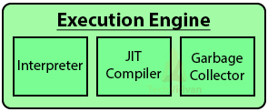

## 1 Execution Engine

- 클래스 로더를 통해 JVM 내의 런타임 데이터 영역에 배치된 바이트코드는 실행
- 엔진에 의해 실행된다.
- 실행 엔진은 자바 바이트코드를 명령어 단위로 읽어서 실행한다.
- CPU가 기계 명령어을 하나씩 실행하는 것과 비슷하다.
- 바이트코드의 각 명령어는 1바이트짜리 OpCode와 추가 피연산자로 이루어져 있으며, 실행 엔진은 하나의 OpCode를 가져와서 피연산자와 함께 작업을 수행한 다음, 다음 OpCode를 수행하는 식으로 동작한다.
- 자바 바이트코드는 기계가 바로 수행할 수 있는 언어보다는 비교적 인간이 보기 편한 형태로 기술된 것이다.
	- 그래서 실행 엔진은 이와 같은 바이트코드를 실제로 JVM 내부에서 기계가 실행할 수 있는 형태로 변경하며, 그 방식은 Interpreter 또는 JIT Compiler를 사용하는 방법 두 가지가 있다.

**Execution Engine의 구조**

## 2 Interpreter

- 바이트코드 명령어를 하나씩 읽어서 해석하고 실행합니다.
- 한 줄씩 바이트코드를 기계어로 변환하여 실행합니다.

### 2.1 Interpreter의 단점

- 하나씩 해석하고 실행하기 때문에 바이트코드 하나하나의 해석은 빠른 대신 인터프리팅 결과의 실행은 느리다는 단점을 가지고 있습니다.
- 같은 메소드가 여러 번 호출될 때마다 바이트코드를 중복적으로 변환하고 실행하는 과정을 거칩니다.
- 전체적인 실행 속도가 느리다는 것이 가장 큰 단점입니다.

## 3 JIT Compiler(Just-In-Time Compiler)

- 전통적인 입장에서 컴퓨터 프로그램을 만드는 방법은 두 가지가 있습니다.
	- 인터프리트 방식: 실행 중 프로그래밍 언어를 읽어가면서 해당 기능에 대응하는 기계어 코드를 실행합니다.
	- 정적 컴파일 방식: 실행하기 전에 프로그램 코드를 기계어로 번역합니다.
- 인터프리터의 단점을 보완하기 위해 도입된 것이 JIT 컴파일러입니다.
- 인터프리터 방식으로 실행하다가 적절한 시점에 바이트코드 전체를 컴파일하여 네이티브 코드로 변경하고, 이후에는 해당 메서드를 더 이상 인터프리팅하지 않고 네이티브 코드로 직접 실행하는 방식입니다.
- 네이티브 코드를 실행하는 것이 하나씩 인터프리팅하는 것보다 빠르고, 네이티브 코드는 캐시에 보관하기 때문에 한 번 컴파일된 코드는 계속 빠르게 수행되게 됩니다.

### 3.1 프로파일러

- JIT 컴파일러가 컴파일하는 과정은 바이트코드를 하나씩 인터프리팅하는 것보다 훨씬 오래 걸립니다.
	- 만약 한 번만 실행되는 코드라면 컴파일하지 않고 인터프리팅하는 것이 훨씬 유리합니다.
	- JIT 컴파일러를 사용하는 JVM들은 내부적으로 해당 메서드가 얼마나 자주 수행되는지 체크하고, 일정 정도를 넘을 때에만 컴파일을 수행합니다.
- 인터프리트 모드로 실행하는 동안 애플리케이션을 모니터링하면서 가장 자주 실행되는 코드 파트를 발견해 JIT 컴파일을 수행합니다.
  - 특정 메서드가 어느 한계치(임계점)을 넘어가면 프로파일러가 특정 코드 섹션을 컴파일합니다.

## 4 Garbage Collector

- 가비지 컬렉터(Garbage Collector)는 JVM의 중요한 구성 요소로, 자동 메모리 관리를 담당합니다.
- 동적으로 할당된 메모리 영역 중 더 이상 사용되지 않는 영역을 자동으로 탐지하여 해제합니다.
- 개발자가 명시적으로 메모리를 해제할 필요가 없어 메모리 관리의 부담을 줄여줍니다.
- 메모리 누수를 방지하고 메모리 관리의 안정성을 높여줍니다.
- [Garbage Collection 참고](../Garbage-Collection/Garbage-Collection.md)
- [ZGC 참고](../Garbage-Collection/ZGC.md)