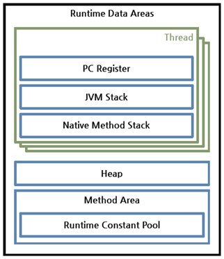
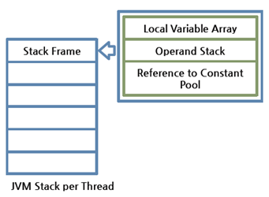
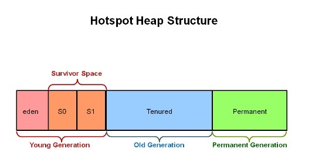

## 1 Runtime Data Area

- 런타임 데이터 영역은 JVM이라는 프로그램이 운영체제 위에서 실행되면서 할당받는 메모리 영역입니다.
- JVM은 프로그램 실행 중에 사용되는 다양한 런타임 데이터 영역을 정의합니다.
- 이러한 데이터 영역은 크게 두 가지로 분류됩니다:
	- JVM 시작 시 생성되어 종료될 때까지 유지되는 영역
	- 스레드별로 생성되고 스레드 종료 시 파괴되는 영역
- 구체적으로는 6개의 영역으로 나눌 수 있습니다:
	- 스레드별 영역: PC 레지스터(PC Register), JVM 스택(JVM Stack), 네이티브 메서드 스택(Native Method Stack)
	- 모든 스레드가 공유하는 영역: 힙(Heap), 메서드 영역(Method Area), 런타임 상수 풀(Runtime Constant Pool)

## 2 PC 레지스터

- JVM은 한 번에 여러 실행 스레드를 지원할 수 있습니다.
- 각 스레드는 자신만의 PC(Program Counter) 레지스터를 가지고 있습니다.
- PC 레지스터는 현재 수행 중인 JVM 명령의 주소를 갖는다.
- PC는 사실상 메소드 영역의 주소를 가리킨다

## 3 JVM 스택

- JVM 스택은 각 스레드마다 하나씩 존재하며 스레드가 시작될 때 생성됩니다.
	- 스택은 지역 변수와 부분 결과를 보관하고 메서드 호출과 반환에 관여합니다.
- JVM 스택은 스택 프레임을 저장하는 스택이며 스택 프레임을 추가하거나 제거하는 동작만 수행합니다.
- 메소드를 호출 할 때마다 프레임을 추가하고 메소드가 종료되면 해당 프레임을 제거하는 동작을 수행합니다.
- 예외 발생 시 printStackTrace() 등의 메서드로 보여주는 Stack Trace의 각 라인은 하나의 스택 프레임을 표현합니다.
- 스레드의 계산에 허용된 것보다 더 큰 JVM 스택이 필요한 경우, JVM은 StackOverflowError를 발생시킵니다.
- VM 스택이 동적으로 확장될 수 있는 상황에서, 확장이 시도되었으나 확장에 필요한 충분한 메모리를 사용할 수 없거나, 새 스레드를 위한 초기 JVM 스택을 생성하는 데 필요한 메모리가 부족한 경우, JVM은
  OutOfMemoryError를 발생시킵니다.

### 3.1 스택 프레임

- JVM 내에서 메서드가 수행될 때마다 하나의 스택 프레임이 생성되어 해당 스레드의 JVM 스택에 추가되고 메서드가 종료되면 스택 프레임이 제거됩니다.
- 스택 프레임의 구성
	- **지역 변수 배열**(Local Variable Array)
	- **피연산자 스택**(Operand Stack)
	- 현재 실행 중인 메서드가 속한 클래스의 런타임 상수 풀에 대한 레퍼런스를 갖는다.
	- Return value
- 지역 변수 배열, 피연산자 스택의 크기는 컴파일 시에 결정되기 때문에 스택 프레임의 크기도 메서드에 따라 크기가 고정된다.
	- 따라서 가변 길이의 객체와 배열을 스택 프레임에 저장할 수 없다.
- 각 스레드의 JVM 스택에서는 오직 하나의 프레임만이 활성화되어 실행됩니다.
  - 이를 *현재 프레임*(current frame)이라 하며, 이 프레임의 메서드를 *현재 메서드*(current method)라고 합니다.
  - 현재 메서드가 정의된 클래스를 *현재 클래스*(current class)라고 합니다.
  - 지역 변수와 피연산자 스택에 대한 모든 작업은 현재 프레임을 기준으로 이루어집니다.
- 프레임의 생명주기
  - 현재 메서드가 다른 메서드를 호출하면, 새로운 프레임이 생성되어 현재 프레임이 됩니다.
  - 메서드가 반환될 때, 현재 프레임은 필요한 경우 메서드의 실행 결과를 이전 프레임에 전달합니다.
  - 이후 현재 프레임은 제거되고 이전 프레임이 다시 현재 프레임이 됩니다.

### 3.2 지역 변수 배열(Local Variable Array)

- 각 프레임은 지역 변수라고 알려진 변수 배열을 포함합니다. 프레임의 지역 변수 배열의 길이는 컴파일 시점에 결정됩니다.
- 지역 변수는 인덱스로 접근됩니다. 첫 번째 지역 변수의 인덱스는 0입니다.
- 지역 변수 배열에는 `this` 에 대한 참조와 Method의 Parameter Value 와 Local Variable을 저장합니다.
	- 저장 순서는 this, Parameter Value, Local Variable 순입니다.
	- instance method의 경우 지역 변수 0은 항상 인스턴스 메서드가 호출되는 객체에 대한 참조(Java 프로그래밍 언어에서의 this)를 전달하는 데 사용됩니다.
  - 이후 모든 매개변수는 지역 변수 1부터 시작하여 연속된 지역 변수에 전달됩니다.
	- static method는 첫 번째 슬롯부터 메소드의 파라미터가 시작합니다.

### 3.3 Operand Stack

- 각 프레임은 피연산자 스택(operand stack)이라고 알려진 후입선출(LIFO) 스택을 포함합니다.
- Operand Stack 은 JVM 의 작업 공간입니다.
- JVM 이 연산에 필요한 데이터와 연산 결과를 Operand Stack에 넣고 처리합니다.
- 작동 방식은 하나의 Instruction이 연산을 위해 Operand Stack에 값을 넣으면 다음 Instruction에서는 이 값을 빼서 사용하게 됩니다.
- 연산의 결과 역시 Operand Stack에 저장된다 . Operand Stack 역시 Array로 구성되어 있으며 Stack의 구조로 Push, Pop 작업을 수행한다

## 4 네이티브 메서드 스택

- 자바 외의 언어로 작성된 네이티브 코드를 위한 스택이입니다.
- 즉, JNI(Java Native Interface)를 통해 호출하는 C/C++ 등의 코드를 수행하기 위한 스택으로, 언어에 맞게 C 스택이나 C++ 스택이 생성됩니다.

## 5 Method Area

- JVM은 모든 JVM 스레드 간에 공유되는 메서드 영역을 가집니다.
- 메서드 영역은 가상 머신 시작 시 생성됩니다.
- 메서드 영역은 고정된 크기일 수도 있고, 계산에 필요한 만큼 확장될 수 있으며, 더 큰 메서드 영역이 불필요해지면 축소될 수 있습니다.
- 메서드 영역은 운영체제 프로세스의 주소 공간 중 "텍스트" 세그먼트와 유사합니다.
- JVM이 읽어 들인 각각의 클래스와 인터페이스에 대한 런타임 상수 풀, 필드 데이터, 메소드 데이터, 메소드 코드, 생성자 코드 등을 보관합니다.
- 논리적으론 힙의 한 부분이지만 물리적으론 떨어져 있습니다.
  - 따라서 단순한 구현에서는 가비지 컬렉션이나 압축을 수행하지 않을 수 있습니다
- 메서드 영역은 JVM 벤더마다 다양한 형태로 구현할 수 있습니다.
	- 오라클 핫스팟 JVM(HotSpot JVM)에서는 흔히 Permanent Area, 혹은 Permanent Generation(PermGen)이라고 불립니다.
	- 메서드 영역에 대한 가비지 컬렉션은 JVM 벤더의 선택 사항이다.

## 6 런타임 상수 풀

- 런타임 상수 풀은 Java 클래스 파일이 실행될 때 필요한 모든 상수 정보를 담고 있는 테이블이라고 생각하면 됩니다.
  - 이는 컴파일 시점에 알려진 숫자 리터럴부터 런타임에 해석되어야 하는 메서드와 필드 참조까지 여러 종류의 상수를 포함합니다
- 각 클래스와 인터페이스마다 별도의 런타임 상수 풀을 가집니다.
  - 클래스나 인터페이스의 런타임 상수 풀은 JVM에 의해 해당 클래스나 인터페이스가 생성될 때 구성됩니다.
- 런타임 상수 풀은 마치 프로그램의 "사전"처럼 작동한다고 볼 수 있습니다.
- 각 런타임 상수 풀은 JVM의 메서드 영역에서 할당됩니다.
- 런타임 상수 풀의 생성은 클래스 로더에 의해 수행됩니다.

## 7 힙

- 자바 가상 머신은 모든 자바 가상 머신 스레드들 간에 공유되는 힙을 가지고 있습니다. 
- 힙은 모든 클래스 인스턴스와 배열을 위한 메모리가 할당되는 런타임 데이터 영역입니다.
- 힙 영역에 생성된 객체와 배열은 JVM 스택 영역의 변수나 다른 객체의 필드에서 참조합니다.
- 참조하는 변수나 필드가 없다면 의미 없는 객체가 되기 때문에 JVM은 가비지 컬렉션을 실행해 힙 영역에서 제거합니다.
- JVM 성능 등의 이슈에서 가장 많이 언급되는 공간입니다.
- 힙 구성 방식이나 가비지 컬렉션 방법 등은 JVM 벤더의 재량입니다.
- 자바 가상 머신 구현체는 프로그래머나 사용자에게 힙의 초기 크기에 대한 제어권을 제공할 수 있으며, 힙이 동적으로 확장되거나 축소될 수 있는 경우, 최대 및 최소 힙 크기에 대한 제어권도 제공할 수 있습니다.
- 만약 연산이 자동 저장소 관리 시스템(garbage collector)에 의해 제공될 수 있는 것보다 더 많은 힙을 필요로 한다면, 자바 가상 머신은 OutOfMemoryError를 던집니다.

**힙의 구조**

참고 자료

- https://docs.oracle.com/javase/specs/jvms/se11/html/index.html
