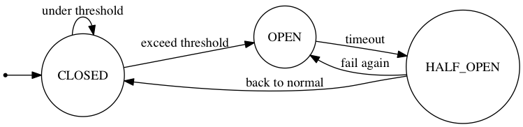

## 1. Circuit Breaker 패턴 소개

- 현대의 분산 시스템에서는 여러 서비스가 네트워크를 통해 서로 통신합니다.
- Michael Nygard의 "Release It"에서 소개된 Circuit Breaker 패턴은 이러한 분산 환경에서 발생할 수 있는 연쇄적인 장애를 예방하는 핵심적인 디자인 패턴입니다.

### 1.1 Circuit Breaker가 필요한 이유

- 원격 호출은 네트워크 지연, 서비스 불능 등으로 실패하거나 타임아웃될 수 있습니다.
- 응답하지 않는 서비스에 많은 호출이 집중되면 중요한 시스템 리소스가 고갈될 수 있습니다.
- 한 서비스의 장애가 의존성이 있는 다른 서비스로 전파되어 전체 시스템이 마비될 수 있습니다.
- 특히 마이크로서비스 아키텍처에서는 장애의 근본 원인을 찾기가 더욱 어려워집니다.

:::info
Circuit Breaker는 전기 회로의 차단기처럼 장애가 발생한 서비스를 격리하여 전체 시스템을 보호합니다.
:::

## 2. Circuit Breaker의 동작 원리

- Circuit Breaker는 원격 호출을 감싸는 상태 기계(State Machine)로 구현됩니다.
- 호출의 성공과 실패를 모니터링하다가 실패율이 임계치를 넘으면 자동으로 회로를 차단합니다.

### 2.1 Circuit Breaker의 상태

- Circuit Breaker는 다음 세 가지 상태를 가집니다:
- **CLOSED (닫힘)**
	- 정상 상태로, 모든 요청이 보호된 서비스로 전달됩니다
	- 실패를 계속 모니터링하며 실패율 계산
	- 임계치 초과 시 OPEN 상태로 전환
- **OPEN (열림)**
	- 회로가 차단된 상태
	- 모든 요청이 즉시 에러를 반환 (Fail Fast)
	- 설정된 시간 경과 후 HALF-OPEN 상태로 전환
- **HALF-OPEN (반열림)**
	- 회로 재연결을 시도하는 상태
	- 제한된 수의 테스트 요청 허용
	- 성공 시 CLOSED, 실패 시 OPEN으로 전환

### 2.2 실패율(Failure Rate) 계산

:::warning
실패율 계산과 임계치 설정은 Circuit Breaker 구현의 핵심입니다.
:::

- 실패율 모니터링은 다음 요소들을 고려합니다:
	- **Failure Rate Threshold**: 회로를 차단하는 실패율 임계치
	- **Minimum Request Threshold**: 실패율 계산에 필요한 최소 요청 수
	- **Sliding Window**: 실패율을 계산하는 시간 단위

## 3. Circuit Breaker 구현 시 고려사항

### 3.1 오류 처리

- 모든 오류가 회로를 차단해야 하는 것은 아닙니다
- 정상적인 비즈니스 로직상의 실패는 제외
- 네트워크 연결 실패, 타임아웃 등 인프라 관련 오류에 집중

### 3.2 비동기 처리

- 동기식 호출뿐만 아니라 비동기 통신에도 Circuit Breaker 적용 가능
- 메시지 큐를 사용하는 경우 큐가 가득 찰 때 회로 차단
- Thread Pool을 사용한 병렬 처리에서 풀 고갈 시 차단

### 3.3 모니터링과 알림

- Circuit Breaker 상태 변경은 반드시 로깅
- 상태 모니터링을 위한 메트릭 수집
- 회로 차단 시 운영팀에 즉시 알림
- 수동으로 회로를 차단하거나 재설정할 수 있는 관리 인터페이스 제공

## 4. 장애 대응 전략

- Circuit Breaker가 작동했을 때의 대응 전략을 미리 수립해야 합니다:
- **대체 응답 제공**
	- 캐시된 이전 데이터 사용
	- 기본값이나 빈 응답 반환
	- 성능을 희생하더라도 작동하는 대체 경로 사용
- **비동기 재처리**
	- 신용카드 승인과 같은 중요 작업은 큐에 저장
	- 서비스 복구 후 재처리

:::tip
장애 상황에서도 핵심 비즈니스 기능은 계속 작동하도록 설계하는 것이 중요합니다.
:::

## 5.Circuit Breaker 적용 계층

- 마이크로서비스 아키텍처에서 Circuit Breaker는 인프라 레벨(Istio)과 애플리케이션 레벨(Spring Cloud)에서 구현할 수 있습니다.

### 5.1 인프라 레벨 - Istio

- **특징**
	- 서비스 메시 플랫폼으로서 인프라 계층에서 동작
	- 쿠버네티스 환경의 모든 서비스에 사이드카 프록시(Envoy) 주입
	- 네트워크 트래픽 제어와 관찰에 중점
- **장점**
	- 애플리케이션 코드 변경 없이 적용 가능
	- 모든 서비스에 일관된 정책 적용
	- 운영팀에서 중앙 집중식 관리 가능
- **한계**
	- 호스트 단위의 제한적인 설정
	- 쿠버네티스 환경 필요
	- 비즈니스 로직 수준의 세밀한 제어 어려움

### 5.2 애플리케이션 레벨 - Spring Cloud

- **특징**
	- 애플리케이션 프레임워크 레벨에서 동작
	- 서비스 내부의 비즈니스 로직과 통합
	- 개발자가 직접 제어 가능
- **장점**
	- API나 메서드 단위의 세밀한 제어 가능
	- 비즈니스 로직에 따른 유연한 정책 설정
	- 특정 인프라에 종속되지 않음
- **한계**
	- 각 서비스마다 코드 수정 필요
	- 프레임워크에 따른 제약
	- 일관된 정책 적용을 위한 추가 관리 필요

:::tip[선택 가이드]

- 인프라 레벨(Istio): 서비스 간 네트워크 통신의 안정성이 주 관심사일 때
- 애플리케이션 레벨(Spring Cloud): 비즈니스 로직과 연계된 세밀한 제어가 필요할 때
- 두 방식의 조합: 대규모 시스템에서 다층적 방어 체계 구축 시
  :::

## 6. 결론

- Circuit Breaker 패턴은 분산 시스템의 안정성을 높이는 필수적인 도구입니다.
- 단순히 장애를 감지하고 차단하는 것을 넘어, 시스템의 자가 회복력을 높이고 운영자에게 중요한 모니터링 정보를 제공합니다.

:::note
성공적인 Circuit Breaker 구현을 위해서는 시스템의 특성에 맞는 세심한 설정과 지속적인 모니터링이 필요합니다.
:::

참고

- https://engineering.linecorp.com/ko/blog/applying-circuitbreaker-to-channel-gateway
- https://engineering.linecorp.com/ko/blog/circuit-breakers-for-distributed-services
- http://martinfowler.com/bliki/CircuitBreaker.html