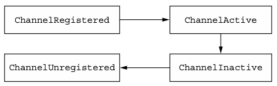

## 1. Netty 아키텍처 개요

- Netty는 비동기 이벤트 기반 네트워크 애플리케이션 프레임워크입니다.
- Netty의 아키텍처를 이해하기 위해서는 다음 핵심 구성요소들의 역할과 상호작용을 이해하는 것이 중요합니다:
	- Channel: 네트워크 소켓 추상화
	- EventLoop: 이벤트 처리 및 제어 흐름 관리
	- ChannelFuture: 비동기 작업 결과 처리
	- ChannelHandler: 데이터 처리 로직 구현
	- ChannelPipeline: ChannelHandler 체인 관리

## 2. Channel - 네트워크 통신의 기본 단위

- Channel은 네트워크 소켓을 추상화한 인터페이스입니다.
  - 여기서 Channel은 Java NIO의 java.nio.channels.Channel과는 다른, Netty가 자체적으로 정의한 io.netty.channel.Channel 인터페이스입니다.
- 기본적인 I/O 작업(bind, connect, read, write)을 제공하며, Java의 기본 Socket 작업을 훨씬 단순화시켜줍니다.
	- Socket: 로우 레벨 네트워킹 기본 클래스
- Netty의 Channel 인터페이스는 Socket을 직접 다루는 복잡성을 크게 줄여주는 API를 제공합니다.

### 2.1 주요 Channel 구현체

- Netty는 다양한 프로토콜과 전송 방식을 지원하기 위해 여러 Channel 구현체를 제공합니다
	- NioSocketChannel: TCP 클라이언트 연결용
	- NioServerSocketChannel: TCP 서버 연결용
	- NioDatagramChannel: UDP 통신용
	- LocalServerChannel: 같은 JVM 내 통신용
	- EmbeddedChannel: 테스트용

### 2.2 Channel의 Life Cycle



- Channel은 다음과 같은 4가지의 상태를 가집니다.
	- ChannelUnregistered: Channel이 등록되지 않은 상태
	- ChannelRegistered: Channel이 EventLoop에 등록된 상태
	- ChannelActive: Channel이 활성화된 상태(리모트 피어와 연결된 상태), 데이터 통신 가능
	- ChannelInactive: Channel이 비활성화된 상태(리모트 피어와 연결이 끊긴 상태)

## 3. EventLoop - 이벤트 처리의 핵심

- EventLoop는 연결의 수명주기 동안 발생하는 이벤트를 처리하는 핵심 컴포넌트입니다.

### 3.1 EventLoop의 주요 특징

- 하나의 EventLoop는 생명주기 동안 하나의 Thread에 바인딩됨
- 모든 I/O 이벤트는 할당된 Thread에서 처리
- 하나의 Channel은 하나의 EventLoop에 등록
- 하나의 EventLoop는 여러 Channel 담당 가능

:::info
EventLoop 모델의 가장 큰 장점은 Channel의 모든 I/O 작업이 동일한 Thread에서 실행되므로 동기화가 거의 필요 없다는 점입니다.
:::

## 4. ChannelFuture - 비동기 작업 결과 처리

- Netty의 모든 I/O 작업은 비동기로 실행됩니다.
- ChannelFuture는 이러한 비동기 작업의 결과를 나중에 확인할 수 있게 해주는 인터페이스입니다.
- ChannelFuture에는 addListener 메서드를 통해 ChannelFutureListener를 등록할 수 있습니다.
- ChannelFutureListener는 작업이 완료되었을 때 호출되는 콜백 메서드를 정의합니다.
	- 즉 ChannelFutureListener를 통해 비동기 작업의 성공 또는 실패 여부를 확인할 수 있습니다.

### 4.1 ChannelFuture 활용

```java
ChannelFuture future = channel.connect(new InetSocketAddress("127.0.0.1", 8080));
future.addListener(new ChannelFutureListener() {
    @Override
    public void operationComplete(ChannelFuture future) {
        if (future.isSuccess()) {
            System.out.println("Connection successful!");
        } else {
            System.err.println("Connection failed");
            future.cause().printStackTrace();
        }
    }
});
```

- 비동기 작업의 결과를 나타내는 ChannelFuture를 반환 받아, ChannelFutureListener를 등록하여 작업의 성공 여부를 확인합니다.
- ChannelFutureListener의 operationComplete 메서드는 작업이 완료되었을 때 호출되며, 작업의 성공 여부를 확인할 수 있습니다.

:::tip
ChannelFuture는 작업의 완료를 기다리는 동안 애플리케이션이 다른 작업을 수행할 수 있게 해줍니다.
:::

## 5. ChannelHandler - 데이터 처리 로직의 컨테이너

- 애플리케이션 개발자 입장에서 Netty의 주요 컴포넌트는 ChannelHandler입니다.
- ChannelHandler는 Netty 애플리케이션의 핵심 컴포넌트로, 실제 비즈니스 로직이 구현되는 곳입니다.
- ChannelHandler는 네트워크 이벤트에 의해 트리거되는 메서드를 정의하고, 이를 통해 데이터 처리 로직을 구현합니다.
- 이벤트 루프에 등록된 Channel에서 발생하는 이벤트는 ChannelHandler를 통해 처리됩니다.

### 5.1 주요 ChannelHandler 타입

- ChannelInboundHandler: 인바운드 이벤트 처리
- ChannelOutboundHandler: 아웃바운드 이벤트 처리
- ChannelDuplexHandler: 인바운드/아웃바운드 이벤트 모두 처리

### 5.2 인코더와 디코더

- 데이터 변환을 위한 특별한 형태의 ChannelHandler입니다:
	- Encoder: Java 객체를 바이트로 변환
	- Decoder: 바이트를 Java 객체로 변환

### 5.3 ChannelHandler의 Life Cycle Method

- ChannelHandler는 다음과 같은 3가지의 라이프 사이클 메서드를 가집니다
	- handlerAdded: ChannelPipeline에 추가될 때 호출
	- handlerRemoved: ChannelPipeline에서 제거될 때 호출
	- exceptionCaught: ChannelPipeline에서 발생한 예외 처리
- ChannelHandler의 서브 인터페이스인 ChannelInboundHandler, ChannelOutboundHandler에는 추가적인 라이프 사이클 메서드가 있습니다.

## 6. ChannelPipeline - 데이터 흐름 관리

- ChannelPipeline은 ChannelHandler들의 체인을 관리하는 컨테이너입니다.
- 즉 ChannelPipeline은 여러 ChannelHandler의 조합을 의미하며 데이터 처리 흐름을 관리합니다.

### 6.1 Channel과의 관계

- 각 Channel은 생성 시 자신만의 ChannelPipeline을 가집니다.
- 이 관계는 영원하며 Channel에서 ChannelPipeline를 추가하거나 제거할 수 없습니다.
	- 즉 ChannelPipeline은 Channel은 1:1 관계입니다.

### 6.2 ChannelPipeline의 특징

- Handler 체인을 통해 데이터가 순차적으로 처리됨
- 인바운드와 아웃바운드 이벤트가 각각 다른 경로로 전파

```plaintext
[인바운드 이벤트 흐름]
Socket → Inboud Handler1 → Inboud Handler2 → Inboud Handler3 → Application

[아웃바운드 이벤트 흐름]
Application → Outbound Handler3 → Outbound Handler2 → Outbound Handler1 → Socket
```

:::warning
ChannelPipeline에 Handler를 추가할 때는 순서가 매우 중요합니다. 잘못된 순서로 인해 데이터 처리가 의도한 대로 동작하지 않을 수 있습니다.
:::

### 6.3 ChannelPipeline 동적 수정

- ChannelPipeline은 실행 중에도 동적으로 ChannelHandler를 추가, 제거, 교체할 수 있습니다.
- 이러한 동적 수정 기능은 유연한 데이터 처리 로직 구현을 가능하게 합니다.

#### ChannelHandler 수정 메서드

ChannelPipeline은 다음과 같은 메서드를 통해 Handler를 동적으로 수정할 수 있습니다:

- addFirst(): Pipeline의 첫 번째 위치에 Handler 추가
- addLast(): Pipeline의 마지막 위치에 Handler 추가
- addBefore(): 지정된 Handler 앞에 새로운 Handler 추가
- addAfter(): 지정된 Handler 뒤에 새로운 Handler 추가
- remove(): Handler 제거
- replace(): 기존 Handler를 새로운 Handler로 교체

#### 사용 예시

```java
ChannelPipeline pipeline = ...;

// Handler 추가
pipeline.addLast("handler1", firstHandler);
pipeline.addLast("handler2", new SecondHandler());
pipeline.addLast("handler3", new ThirdHandler());

// Handler 제거
pipeline.remove("handler3");
pipeline.remove(firstHandler);  // 참조로 제거

// Handler 교체
pipeline.replace("handler2", "handler4", new FourthHandler());
```

:::info
Handler 이름은 Pipeline 내에서 고유해야 합니다. 같은 이름의 Handler를 추가하려고 하면 예외가 발생합니다.
:::

#### 주의사항

- Handler 수정은 thread-safe 합니다.
- EventLoop 스레드에서 수정 작업을 수행하는 것이 권장됩니다.
- Handler 제거 시 해당 Handler의 handlerRemoved() 메서드가 호출됩니다.
- Handler 추가 시 해당 Handler의 handlerAdded() 메서드가 호출됩니다.

:::warning
Handler 수정은 실행 중인 Pipeline의 동작에 영향을 줄 수 있으므로, 신중하게 수행해야 합니다. 특히 운영 중인 시스템에서는 충분한 테스트를 거친 후 적용하세요.
:::

## 7. 부트스트래핑 - 애플리케이션 시작하기

- Netty는 서버와 클라이언트의 시작을 위해 두 가지 부트스트랩 클래스를 제공합니다:
	- ServerBootstrap: 서버용
	- Bootstrap: 클라이언트용

### 7.1 주요 차이점

- ServerBootstrap은 두 개의 EventLoopGroup이 필요 (연결 수락용, 데이터 처리용)
- Bootstrap은 하나의 EventLoopGroup만 필요

## 8. 정리

- Netty의 각 컴포넌트는 명확한 역할을 가지고 있으며, 이들이 유기적으로 결합되어 고성능 네트워크 애플리케이션을 구현할 수 있게 해줍니다.
	- Channel: 네트워크 통신의 기본 단위
	- EventLoop: 이벤트 처리 및 실행 제어
	- ChannelFuture: 비동기 작업 결과 관리
	- ChannelHandler: 실제 비즈니스 로직 구현
	- ChannelPipeline: 데이터 처리 흐름 관리
- 이러한 컴포넌트들의 이해는 Netty 기반 애플리케이션을 개발할 때 필수적입니다.