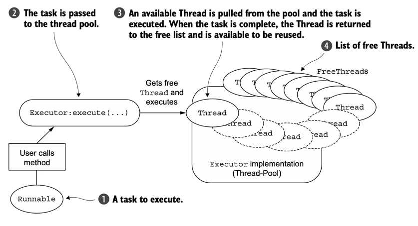
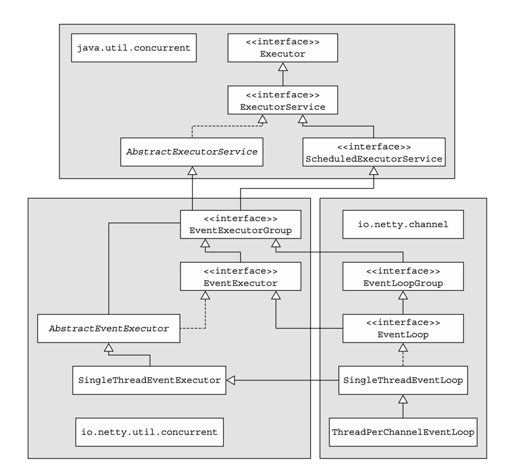
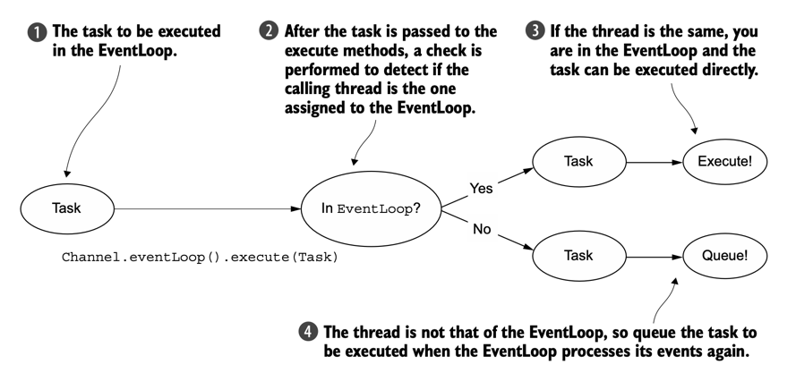
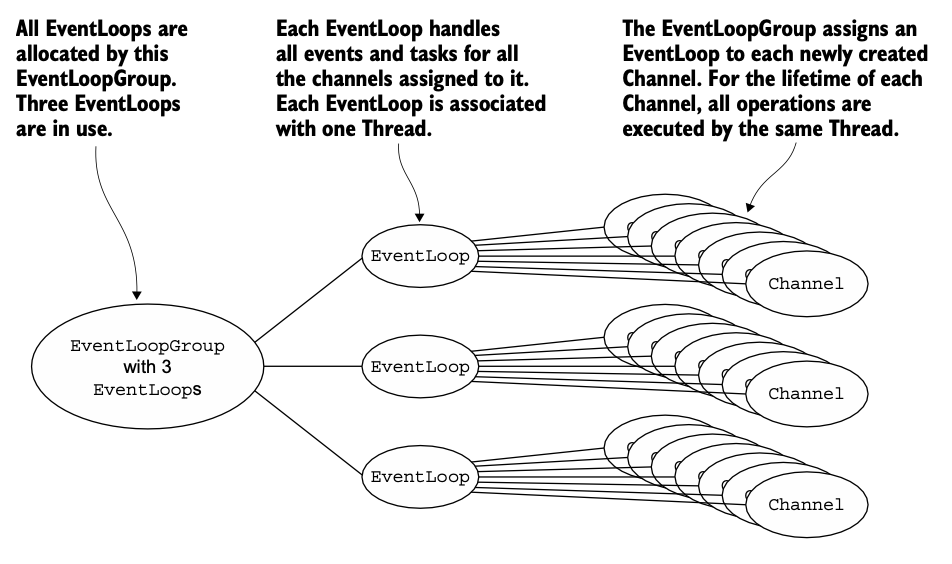
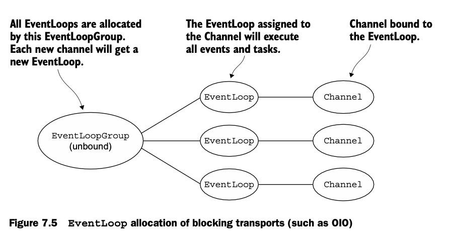

## 1. 스레딩 모델 개요

- 스레딩 모델은 운영체제, 프로그래밍 언어, 프레임워크 또는 애플리케이션에서 스레드 관리의 핵심 측면을 지정합니다.
- 개발자는 각 모델의 트레이드오프를 이해하고 적절한 모델을 선택해야 합니다.

### 1.1 자바의 스레딩 발전 과정

- 초기 자바 애플리케이션에서는 매우 단순한 방식으로 스레드를 관리했습니다.
	- 새로운 작업이 필요할 때마다 Thread 객체를 생성하고 시작
	- 작업이 완료되면 스레드를 종료
	- 필요에 따라 이 과정을 반복
- 이러한 원시적인 접근 방식은 다음과 같은 문제점을 가지고 있었습니다:
	- 스레드 생성/제거의 높은 오버헤드
	- 리소스 낭비
	- 시스템 부하 증가

### 1.2 Java 5의 Executor API



- Java 5에서는 이런 문제를 해결하기 위해 Executor API가 도입되었습니다.
- 이는 스레드 풀 패턴을 구현한 것으로, 다음과 같이 작동합니다
	- 풀의 free list에서 스레드를 선택
	- 선택된 스레드에 제출된 작업(Runnable) 할당
	- 작업 완료 후 스레드를 free list로 반환
	- 스레드 재사용 가능

```java
// 스레드 풀 생성
ExecutorService executor = Executors.newFixedThreadPool(10);

// 작업 제출
executor.submit(() -> {
    // 실행할 작업
});
```

### 1.3 컨텍스트 스위칭 오버헤드

- 스레드 풀링은 개선된 방식이지만, 여전히 다음과 같은 문제가 있습니다:
- 활성 스레드 수가 증가할수록 컨텍스트 스위칭 비용 증가
- 높은 부하 상황에서 성능 저하
- 복잡한 애플리케이션에서 스레드 관련 문제 발생 가능성

## 2. EventLoop

- Netty의 EventLoop는 연결 수명 동안 발생하는 이벤트를 처리하는 핵심 추상화입니다.

### 2.1 EventLoop 동작 원리

- EventLoop의 기본 동작은 다음과 같은 무한 루프 형태입니다

#### 예시

```java
while (!terminated) {
    List<Runnable> readyEvents = blockUntilEventsReady();
    for (Runnable ev: readyEvents) {
        ev.run();
    }
}
```

- EventLoop는 다음과 같은 순서로 작업을 처리합니다:
	- 이벤트가 준비될 때까지 블록
	- 준비된 이벤트들을 순차적으로 실행
	- 종료 신호를 받을 때까지 반복

### 2.2 EventLoop 인터페이스

```java
public interface EventLoop extends OrderedEventExecutor, EventLoopGroup {
    EventLoopGroup parent();
}
```

- EventLoop 인터페이스는 ScheduledExecutorService를 확장한 형태로, 단 하나의 메소드만을 정의합니다.
- 여기서 parent() 메소드는 현재 EventLoop 구현체가 속한 EventLoopGroup에 대한 참조를 반환하는 역할을 합니다.

#### 2.2.1 계층 구조



- Netty의 EventLoop는 두 가지 주요 API를 결합합니다
- 동시성 API (io.netty.util.concurrent)
	- JDK의 java.util.concurrent 패키지를 확장
	- 스레드 실행자 제공
- 채널 이벤트 API (io.netty.channel)
	- Channel 이벤트와 인터페이스
	- 네트워킹 작업 처리

### 2.3 주요 특징

- 하나의 EventLoop는 정확히 하나의 스레드로 구동
- 하나의 Channel은 수명 주기 동안 하나의 EventLoop에만 할당
- EventLoop는 여러 Channel을 처리할 수 있음
- Channel의 모든 I/O 이벤트는 할당된 EventLoop 스레드에서만 처리

## 3. 태스크 스케줄링

### 3.1 JDK의 스케줄링 API

Java의 ScheduledExecutorService 인터페이스를 통해 기본적인 태스크 스케줄링이 가능합니다

```java
ScheduledExecutorService executor = 
    Executors.newScheduledThreadPool(10);

ScheduledFuture<?> future = executor.schedule(
    new Runnable() {
        @Override
        public void run() {
            System.out.println("60 seconds later");
        }
    }, 
    60, 
    TimeUnit.SECONDS
);

executor.shutdown();
```

- 이 방식의 한계:
	- 스레드 풀 관리에 따른 오버헤드
	- 과도한 스케줄링 시 성능 저하
	- 리소스 사용량 증가

### 3.2 EventLoop를 사용한 태스크 스케줄링

- Netty의 EventLoop를 사용한 스케줄링은 더 효율적입니다:

```java
Channel ch = ...
ScheduledFuture<?> future = ch.eventLoop().schedule(
    new Runnable() {
        @Override
        public void run() {
            System.out.println("60 seconds later");
        }
    }, 
    60, 
    TimeUnit.SECONDS
);
```

주기적인 작업 스케줄링:

```java
ScheduledFuture<?> future = ch.eventLoop().scheduleAtFixedRate(
    new Runnable() {
        @Override
        public void run() {
            System.out.println("Run every 60 seconds");
        }
    },
    60, 
    60, 
    TimeUnit.SECONDS
);
```

작업 취소:

```java
ScheduledFuture<?> future = ch.eventLoop().scheduleAtFixedRate(...);
boolean mayInterruptIfRunning = false;
future.cancel(mayInterruptIfRunning);
```

## 4. 구현 세부사항

### 4.1 Netty의 EventLoop에서 Task가 실행되는 과정



1. 현재 스레드는 Task가 EventLoop에서 실행되기 위해 Channel.eventLoop().execute(Task) 메서드를 호출합니다.
2. Task가 execute 메서드로 전달된 후, 현재 실행 중인 스레드가 EventLoop의 스레드인지 확인하는 검사가 수행됩니다.
3. 만약 현재 스레드가 EventLoop의 스레드와 동일하다면, Task는 직접 실행됩니다. (이는 동일한 스레드에서 실행되므로 추가적인 컨텍스트 스위칭이 필요없습니다.)
4. 만약 현재 스레드가 EventLoop의 스레드가 아니라면, Task는 EventLoop의 작업 큐에 추가됩니다.
	- 이 Task는 나중에 EventLoop가 이벤트들을 처리할 때 실행됩니다.
  - 이 경우는 다른 스레드가 EventLoop에게 작업을 시키는 것입니다.
  - 해당 작업은 바로 실행되지 않고 EventLoop의 대기열에 추가됩니다.
- 이렇게 처리하는 이유는 Netty의 "한 채널은 항상 같은 스레드에서만 처리한다"는 원칙을 지키기 위해서입니다.

### 4.2 EventLoop/스레드 할당

#### 4.2.1 ASYNCHRONOUS TRANSPORTS

- 비동기식 구현은 소수의 EventLoop(및 관련 스레드)만 사용하며, 현재 모델에서 이들은 여러 Channel 간에 공유될 수 있습니다.
  - 즉 여러 Channel이 동일한 EventLoop를 공유할 수 있습니다.
- 이를 통해 Channel마다 하나의 스레드를 할당하는 대신 가능한 적은 수의 스레드로 많은 Channel을 처리할 수 있게 됩니다.

**할당 과정**



- 크기가 고정된 3개의 EventLoop(각각 하나의 스레드로 구동)를 가진 EventLoopGroup이 있습니다.
- EventLoop는 필요할 때 사용 가능하도록 EventLoopGroup이 생성될 때 직접 할당됩니다.
- EventLoopGroup은 새로 생성된 각 Channel에 EventLoop를 할당하는 역할을 담당합니다. 
- 현재 구현에서는 라운드 로빈 방식을 사용하여 균형 있는 분배를 달성하며, 동일한 EventLoop가 여러 Channel에 할당될 수 있습니다.

:::info
Channel에 EventLoop가 할당되면, 해당 Channel은 수명 주기 내내 이 EventLoop(및 관련 스레드)를 사용합니다. 이 점을 기억하세요, 이는 ChannelHandler를 구현할 때 스레드 안전성과 동기화에 대한 걱정을 덜어줍니다.
:::

:::warning
ThreadLocal 사용에 있어 EventLoop 할당이 미치는 영향을 알고아야 합니다. EventLoop는 보통 여러 Channel을 구동하기 때문에, ThreadLocal은 관련된 모든 Channel에서 동일합니다. 이로 인해 상태 추적과 같은 기능을 구현하기에는 적합하지 않습니다. 그러나 무상태 컨텍스트에서는 무겁거나 비용이 많이 드는 객체, 또는 이벤트를 Channel 간에 공유하는 데 여전히 유용할 수 있습니다.
:::


#### 4.2.2 SYNCHRONOUS TRANSPORTS

- OIO 트랜스포트의 설계는 비동기 트랜스포트와 다릅니다

**할당 과정**



- OIO 트랜스포트에서는 각 Channel마다 하나의 EventLoop(및 하나의 스레드)이 할당됩니다. 이는 Java의 기본 java.io 패키지의 블로킹 I/O 구현을 사용하는 애플리케이션에서 볼 수 있는 패턴입니다.
- 비동기 트랜스포트와 마찬가지로, 각 Channel의 I/O 이벤트는 오직 하나의 스레드(해당 Channel의 EventLoop를 구동하는 스레드)에 의해서만 처리됩니다.
- 이러한 일관된 설계 원칙은 Netty의 신뢰성과 사용 편의성에 크게 기여합니다.

:::info
두 방식 모두 "한 Channel의 모든 이벤트는 항상 같은 스레드에서 처리된다"는 Netty의 핵심 원칙을 지킵니다. 이 원칙 덕분에 개발자는 ChannelHandler를 구현할 때 동기화 문제를 걱정할 필요가 없습니다.
:::

## 5. 마치며

- Netty의 EventLoop와 스레딩 모델은 다음과 같은 장점을 제공합니다:
	- 효율적인 리소스 사용
	- 예측 가능한 동작
	- 간단한 동시성 관리
	- 높은 성능
- 적절한 활용을 위해서는:
	- 블로킹 작업 최소화
	- 장시간 실행 작업은 별도 스레드풀 사용
	- ThreadLocal 사용 시 주의