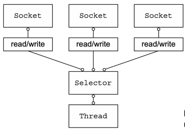

## 1. 자바 네트워킹의 초기 시대

- 자바가 처음 등장했던 1995년부터 2002년까지, 네트워크 프로그래밍은 상당히 복잡한 작업이었습니다.
- C 언어의 소켓 라이브러리를 기반으로 한 초기 자바의 네트워킹 API(java.net)는 객체 지향적인 인터페이스를 제공했지만, 여전히 많은 상용구 코드(boilerplate code)가 필요했습니다.

### 1.1 전통적인 블로킹 I/O

- 초기 자바의 네트워킹 API는 시스템 소켓 라이브러리의 블로킹 함수만을 지원했습니다.
- 다음은 전통적인 블로킹 I/O를 사용한 서버 코드의 예시입니다:

**전통적인 블로킹 I/O 예시**

```java
// 서버 소켓 생성 및 포트 바인딩
ServerSocket serverSocket = new ServerSocket(portNumber);

// 클라이언트 연결 대기
Socket clientSocket = serverSocket.accept();

// 입력 스트림 설정
BufferedReader in = new BufferedReader(
    new InputStreamReader(clientSocket.getInputStream()));

// 출력 스트림 설정 (autoFlush = true)
PrintWriter out = new PrintWriter(clientSocket.getOutputStream(), true);

String request, response;
// 클라이언트의 요청을 처리하는 메인 루프
while ((request = in.readLine()) != null) {
    if ("Done".equals(request)) {
        break;
    }
    response = processRequest(request);
    out.println(response);
}
```

1. **서버 소켓 초기화**
	- `ServerSocket`이 지정된 포트 번호에서 연결 요청을 수신하기 위해 생성됩니다.
	- 이 소켓은 서버의 진입점 역할을 합니다.
2. **클라이언트 연결 수락**
	- `accept()` 메서드는 새로운 클라이언트 연결이 들어올 때까지 블로킹됩니다.
	- 연결이 수립되면 클라이언트와의 통신을 위한 새로운 `Socket` 객체를 반환합니다.
	- `ServerSocket`은 다시 다른 연결 요청을 기다리는 상태로 돌아갑니다.
3. **스트림 설정**
	- `BufferedReader`는 소켓의 입력 스트림에서 생성되어 텍스트를 읽습니다.
	- `PrintWriter`는 소켓의 출력 스트림에서 생성되어 텍스트를 쓰고 자동으로 플러시합니다.
	- 두 스트림 모두 문자 기반으로 동작하며, 바이트-문자 변환을 자동으로 처리합니다.
4. **요청 처리 루프**
	- `readLine()` 메서드는 클라이언트로부터 개행문자(\\n)나 캐리지 리턴(\\r)으로 끝나는 문자열을 받을 때까지 블로킹됩니다.
	- "Done" 메시지를 받으면 루프를 종료합니다.
	- 각 요청은 `processRequest()` 메서드로 처리되어 응답이 생성됩니다.
	- 응답은 `println()`을 통해 클라이언트로 전송됩니다.

:::warning
이 구현의 가장 큰 제한사항은 한 번에 하나의 클라이언트만 처리할 수 있다는 점입니다. 새로운 클라이언트가 연결을 시도해도, 현재 처리 중인 클라이언트의 요청-응답 사이클이 완료될 때까지 대기해야 합니다.
따라서 여러 클라이언트를 동시에 처리하기 위해서는 각 클라이언트 연결마다 새로운 스레드를 할당해야 했습니다. 이는 다음 섹션에서 설명할 심각한 확장성 문제를 야기했습니다.
:::

### 1.2 블로킹 I/O의 한계

- 이러한 블로킹 I/O 방식은 다음과 같은 심각한 한계를 가지고 있었습니다:
- **리소스 낭비**: 연결당 하나의 스레드가 필요하며, 많은 스레드들이 단순히 입출력 데이터를 기다리며 대기 상태로 있게 됩니다.
- **메모리 부담**: 각 스레드는 OS에 따라 64KB에서 1MB 크기의 스택 메모리를 할당받아야 합니다.
- **컨텍스트 스위칭 오버헤드**: JVM이 물리적으로 많은 스레드를 지원할 수 있다 하더라도, 10,000개 정도의 연결만 되어도 컨텍스트 스위칭 오버헤드가 심각해집니다.

## 2. Java NIO의 등장

- 2002년 JDK 1.4에서 도입된 java.nio 패키지는 이러한 문제를 해결하기 위한 논블로킹 I/O를 지원했습니다.
- [Java NIO](../../Language/Java/NIO/NIO.md) 참고

### 2.1 셀렉터(Selector) 기반 논블로킹 I/O

- Java NIO의 핵심은 `java.nio.channels.Selector` 클래스입니다.
- 셀렉터는 이벤트 통지 API를 사용하여 여러 논블로킹 소켓 중에서 I/O 준비가 된 소켓을 감지하고 처리할 수 있게 해줍니다.

### 2.2 셀렉터 기반 아키텍처



- 위 다이어그램은 셀렉터를 사용한 논블로킹 I/O의 구조를 보여줍니다.
- 이 설계의 핵심 특징은 다음과 같습니다:
	- **단일 스레드 처리**: 하나의 스레드가 셀렉터를 통해 여러 소켓 연결을 관리합니다.
	- **이벤트 기반 처리**: 셀렉터는 이벤트 통지 API를 사용하여 I/O 준비가 된 소켓을 감지합니다.
	- **비동기 작업**: 읽기/쓰기 작업의 완료 상태를 언제든 확인할 수 있습니다.

### 2.3 리소스 관리의 향상

- 이 모델은 블로킹 I/O에 비해 다음과 같은 장점을 제공합니다:

1. **효율적인 리소스 활용**
	- 적은 수의 스레드로 많은 연결을 처리할 수 있습니다.
	- 메모리 관리와 컨텍스트 스위칭 오버헤드가 크게 감소합니다.
2. **유연한 스레드 활용**
	- I/O 작업이 없을 때는 스레드를 다른 작업에 활용할 수 있습니다.
	- 시스템 리소스를 더 효율적으로 사용할 수 있습니다.

:::warning[NIO 직접 사용의 위험성]
Java NIO API를 직접 사용하여 많은 애플리케이션이 구축되었지만, 이를 올바르고 안전하게 구현하는 것은 결코 쉽지 않습니다. 특히 높은 부하 상황에서 I/O를 안정적이고 효율적으로 처리하고 디스패치하는 것은
매우 복잡하고 오류가 발생하기 쉬운 작업입니다.
:::

## 3. 비동기와 확장성의 이해

- 비동기 프로그래밍은 우리의 일상생활에서 자주 접하는 개념입니다.
- 이메일을 예로 들면:
	- 응답이 즉시 오지 않을 수 있습니다
	- 예상치 못한 시점에 메시지를 받을 수 있습니다
	- 답변을 기다리는 동안 다른 일을 할 수 있습니다

### 3.1 비동기와 확장성의 관계

- 비동기 시스템의 핵심 특징:
	- 언제든지, 어떤 순서로든 발생하는 이벤트에 응답 가능
	- 확장성 달성을 위한 핵심 요소
	- 작업 완료를 기다리지 않고 다른 작업 수행 가능

### 3.2 네트워킹에서의 비동기 처리

- 논블로킹 네트워크 호출의 장점:
	- 작업 완료를 기다리지 않아도 됨
	- 비동기 메서드는 즉시 반환
	- 완료 시점에 사용자에게 알림
- 셀렉터 활용:
	- 적은 수의 스레드로 많은 연결 모니터링 가능
	- 블로킹 I/O보다 훨씬 많은 이벤트를 더 빠르고 경제적으로 처리

:::tip
비동기 프로그래밍의 이해는 현대적인 네트워크 애플리케이션 개발의 기초가 됩니다. 특히 높은 확장성이 요구되는 시스템에서는 필수적인 개념입니다.
:::

## 4. 네티(Netty)의 필요성

- Java NIO는 강력한 기능을 제공하지만, 직접 사용하기에는 너무 복잡하고 오류가 발생하기 쉽습니다.
- 특히 높은 부하 상황에서 I/O를 안정적이고 효율적으로 처리하는 것은 매우 어려운 작업입니다.

### 4.1 네티의 주요 특징

- 네티는 이러한 복잡성을 추상화하고 다음과 같은 이점을 제공합니다:
	- **통합된 API**: 블로킹/논블로킹 전송 유형을 위한 단일화된 API 제공
	- **단순하면서 강력한 스레딩 모델**: 효율적인 이벤트 처리 아키텍처
	- **체이닝 가능한 로직 컴포넌트**: 재사용 가능한 구성요소 지원
	- **뛰어난 성능**: 코어 자바 API보다 더 나은 처리량과 더 낮은 지연시간
	- **리소스 관리**: 메모리 풀링과 재사용을 통한 리소스 소비 최적화
	- **보안**: SSL/TLS와 StartTLS 완벽 지원

## 5. 결론

- 네트워크 프로그래밍의 복잡성이 증가하고 동시성 요구사항이 높아짐에 따라, 저수준 API를 직접 다루는 것은 더 이상 실용적이지 않게 되었습니다.
- 네티는 이러한 복잡성을 추상화하면서도 높은 성능을 제공하는 프레임워크로서, 현대적인 네트워크 애플리케이션 개발에 필수적인 도구가 되었습니다.

:::tip

네티를 시작하기 전에 전통적인 자바 네트워킹과 NIO의 기본 개념을 이해하는 것이 좋습니다. 이를 통해 네티가 제공하는 추상화의 가치를 더 잘 이해할 수 있습니다.

:::

#### 같이 보면 좋은 글

- [Netty의 구성 요소](../Components/Components.md)