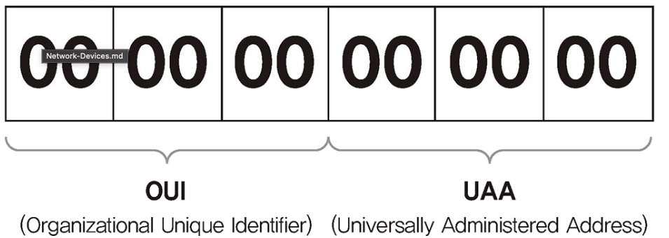

## 1 MAC 주소
- Meadia Access Control의 약자로 네트워크 인터페이스 카드에 할당된 고유 식별자를 의미합니다.
- MAC 주소는 이더넷과 와이파이를 포함한 대부분의 IEEE 802 네트워크 기술에서 주소로 사용됩니다.
- 네트워크에 모든 장비는 MAC 주소라는 물리적인 주소가 있어야하고 이 주소를 통해 서로 통신합니다.
- MAC 주소는 단말에 종속되지 않고 NIC에 종속되므로 단말이 여러개의 NIC를 가질 수 있으므로 MAC주소도 여러개 가질 수 있습니다.

## 2 MAC 주소 체계

- 6byte의 크기를 가집니다.
- OUI: NIC 제조사마다 고유한 번호를 가지고 있습니다.
- UAA: 각 제조사마다 자체적으로 할당합니다.

## 3 유일하지 않은 MAC 주소
- 네트워크 장비 제조업체의 실수나 의도적으로 UAA 값을 중복 할당할 수 있습니다.
- MAC 주소는 동일 네트워크에서만 중복되지 않으면 큰 문제가 없습니다.
- 다른 네트워크와 통신할 때 라우터가 다른 네트워크로 넘겨줄 때 출발지와 도착지 MAC 주소를 변경하므로 기존 출발지와 도착지 주소를 유지하지 않습니다.

## 4 MAC 주소 변경
- MAC 주소는 BIA 상태로 NIC에 할당되어 있습니다.
- 일반적으로 ROM 형태로 고정되어 출하되므로 변경이 어렵습니다.
- 하지만 결국 이 MAC 주소도 메모리에 적재되어 구동되므로 여러 가지 방법을 이용해 변경된 MAC 주소로 NIC를 동작시킬 수 있습니다.