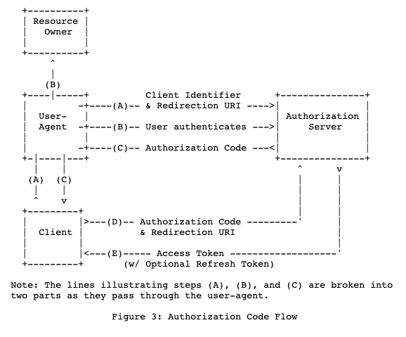

## 1 용어 정리

### 1.1 Client

* `client` 는 `resource owner` 의 `protected resource`에 접근을 시도하는 애플리케이션이다.
* `protected resource` 에 접근하려면  `client` 는 `Resource Owner` 의 허가 즉 `access token`이 필요하다.


### 1.2 Resource Server

* `resource owner`의 `protected resource`를 가지고 있는 API 서버이다.
*  `resource owner`의 `protected resource`를 접근하려면 `access token` 이 필요하다.


### 1.3 Authorization Server

* `client`에게 `access token`을 발급하는 서버
* `resource server`와 통합되어 있을 수 있다


### 1.4 Resource Owner

* `protected resource`의 접근 권한을 줄 수 있는 사람
* `end-user`라 불린다.


### 1.5 Access Token

* `protected resource` 을 접근할 때 사용되는 자격 인증서


### 1.6 Authorization Endpoint

* `client`가 `user-agent`리디렉션을 통해 `resource owner`로 부터 권한을 얻는 데 사용하는 endpoint


### 1.7 Token endpoint

* `client`가 `resource server`에게서 `access token`을 얻기 위해 사용되는 endpoint


### 1.8 Redirection Endpoint

* `authorization server`가 `resource owner`의  `user-agent`를 리디렉션 하는 endpoint 


## 2 OAuth 2.0

> 사용자가 가입된 서비스의 API에 접근하기 위해서는 사용자로부터 권한을 위임 받아야 합니다. 이 때 사용자의 패스워드 없이도 권한을 위임 받을 수 있는 방법이 필요합니다. 이를 위해서 고안된 기술이 OAuth입니다. 오늘날 많은 API들이 OAuth를 통해서 상호 연동을 지원하고 있습니다.
>
> OAuth가 사용되기 전에는 인증방식의 표준이 없었기 때문에 기존의 기본인증인 아이디와 비밀번호를 사용하였는데, 이는 보안상 취약한 구조이다. 기본 인증이 아닐 경우는 각 애플리케이션들이 각자의 개발한 회사의 방법대로 사용자를 확인하였다. OAuth는 이렇게 제각각인 인증방식을 표준화한 인증방식이다.

### 2.1 장점

* 소셜 로그인을 사용하면 회원가입 시 이메일 인증, 로그인 시 보안, 비밀번호 찾기/변경, 회원정보 변경 등 을 구글, 페이스북, 네이버 등에 맡기 되므로 서비스 개발에 집중 할 수 있다.


### 2.2 OAuth 2.0의 흐름



**Register(등록)**

* Client ID: `Client`의 식별자
* Client Secret: 비밀번호
* Authorized Redirect URIs: `Resource Server`가  `Authorization code`를 전달 할 `client`의 주소


**A. `Client` 가 `resource owner` 의 `user-agent` 를 `Authorization Server` 의 `Authorization endpoint` 로 보낸다.**

* `Authorization endpoint` 에는 `Client Id`, `scope`, `state`, `redirection URI` 가 포함된다.
* `Authorization endpoint` 예시

```
https://authorization-server.com/auth?response_type=code&client_id=CLIENT_ID&redirect_uri=REDIRECT_URI&scope=photos&state=1234zyx
```


**B. `authorization server`는 `resource owner`을 인증한다.**


**C. 인증이 성공하면, `authorization server` 는 `user-agent` 를 `redirection URI`  로 리다이렉팅 한다**

* `redirection URI` 는 `authorization code` 와  `state` 가 포함된다.
* 응답 예시

```
HTTP/1.1 302 Found
Location: https://client.example.com/code=SplxlOBeZQQYbYS6WxSbIA&state=1234zyx
```


**D. `client` 가 `authorization server`의 `Token endpoint`로  `access token`을 요청한다.**

* 요청에는 `grant_type`, `authorization code`, `Redirect URI`, `client id`, `client secret` 을 포함된다.
* 요청 예시

```
POST https://api.authorization-server.com/token
  grant_type=authorization_code&
  code=AUTH_CODE_HERE&
  redirect_uri=REDIRECT_URI&
  client_id=CLIENT_ID&
  client_secret=CLIENT_SECRET
```


**E. `authorization server` 는 `client` 를 인증한다.** 

* `authorization code`, `Redirect URI`, `client id`, `client secret` 가 맞는지 확인
* 맞으면 `access token` 과 함께 응답한다.
* `refresh token` 은 옵션
* 응답 예시

```
 HTTP/1.1 200 OK
 Content-Type: application/json;charset=UTF-8
 Cache-Control: no-store
 Pragma: no-cache
{
   "access_token":"2YotnFZFEjr1zCsicMWpAA",
   "token_type":"example",
   "expires_in":3600,
   "refresh_token":"tGzv3JOkF0XG5Qx2TlKWIA",
   "example_parameter":"example_value"
}
```


**참고**

* https://tools.ietf.org/html/rfc6749#page-4
* https://opentutorials.org/course/3405
* https://docs.spring.io/spring-security/site/docs/5.2.12.RELEASE/reference/html/oauth2.html