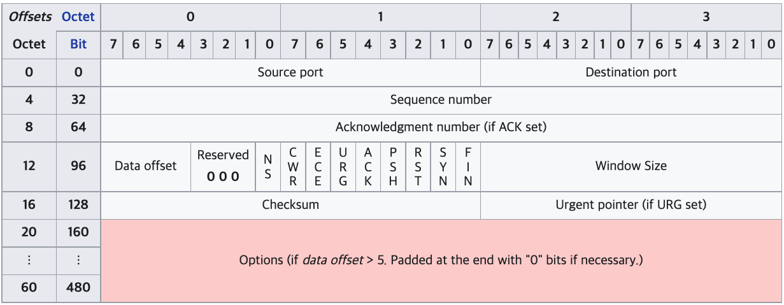
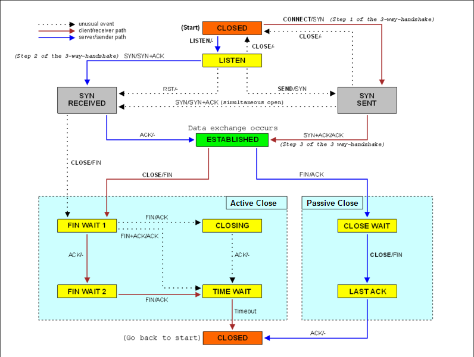
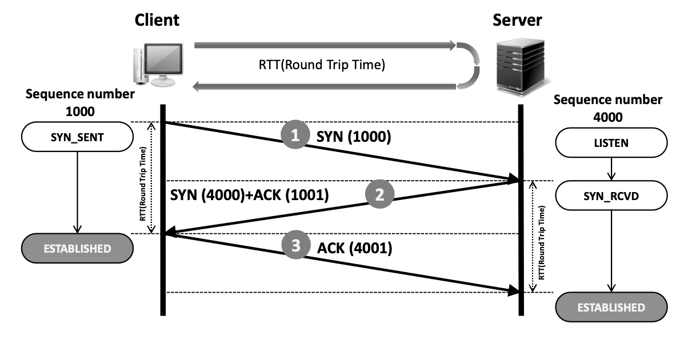
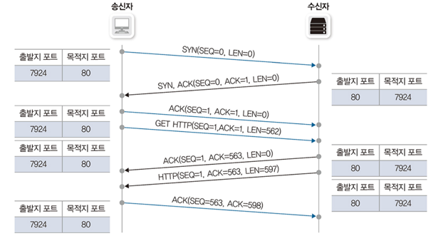
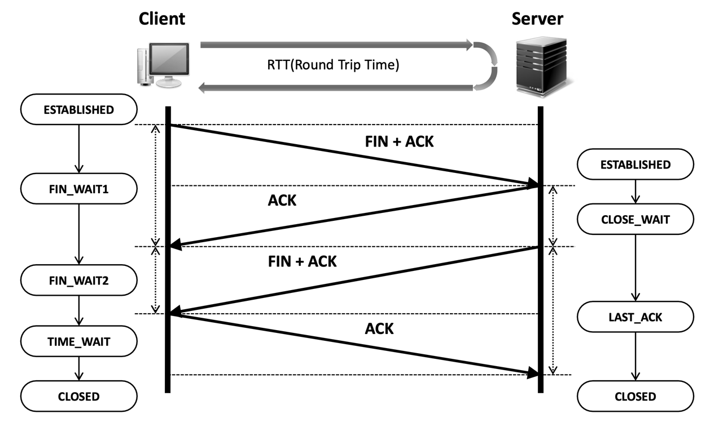
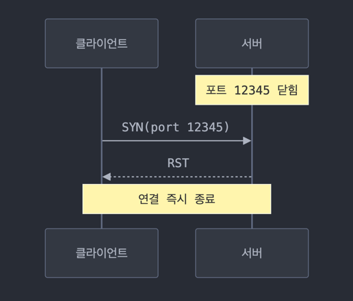
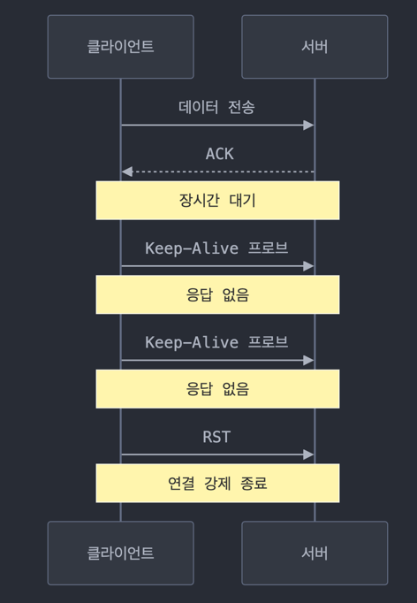
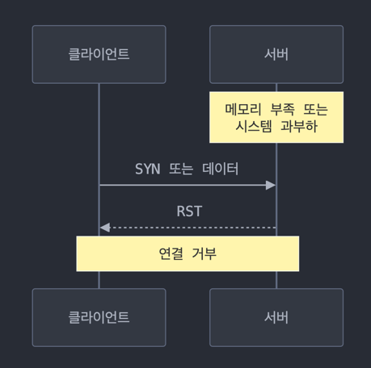

## 1. TCP 프로토콜 개요

- TCP(Transmission Control Protocol)는 신뢰할 수 없는 공용망에서도 정보 유실 없는 통신을 보장하는 핵심 프로토콜입니다.
- TCP/IP 프로토콜 스택의 전송 계층(Transport Layer)에 위치하며, 다음과 같은 특징을 가집니다.
	- 패킷에 번호를 부여하고 잘 전송되었는지에 대해 응답합니다.
	- 한꺼번에 얼마나 보내야 수신자가 잘 받아 처리할 수 있는지 전송 크기를 고려해 통신합니다.

:::info[계층별 프로토콜과 데이터 단위]

- 응용 계층 (Application Layer): 메시지 (Message)
	- HTTP, FTP, SMTP 등
- 전송 계층 (Transport Layer): 세그먼트 (Segment)
	- TCP, UDP
- 인터넷 계층 (Internet Layer): 패킷 (Packet)
	- IP, ICMP, ARP
- 네트워크 액세스 계층 (Network Access Layer): 프레임 (Frame)
	- 이더넷, Wi-Fi
	  :::

## 2. TCP 세그먼트 헤더 구조



- TCP 헤더는 데이터 전송에 필요한 다양한 제어 정보를 포함합니다:

### 2.1 기본 헤더 필드

- **Source Port (16비트)**: 출발지 포트 번호
- **Destination Port (16비트)**: 목적지 포트 번호
- **Sequence Number (32비트)**
	- 전송하는 데이터의 순서 번호입니다.
- **Acknowledgment Number (32비트)**
	- 다음에 받기를 기대하는 시퀀스 번호입니다.
- **Offset (4비트)**: TCP 헤더의 길이(32비트 워드 단위)
- **Window Size (16비트)**: 수신자가 받을 수 있는 데이터의 크기

### 2.2 제어 플래그 (Control Flags)

- **SYN**
	- 연결 시작을 나타내며, 초기 연결 설정 시 1로 설정
- **ACK**
	- 응답 번호가 유효한 경우 1로 표시합니다.
	- 초기 SYN이 아닌 모든 패킷은 기존 메시지에 대한 응답이므로 1로 표기됩니다.
- **FIN**
	- 연결 종료 시 1로 표시됩니다.
	- 데이터 전송을 마치고 정상적으로 양방향 종료 시 사용됩니다.
- **RST**: 비정상적인 상황에서 연결을 강제 종료할 때 사용
	- TCP 연결을 즉시 강제로 종료하며, 일반적인 4-way handshake 과정을 거치지 않을 때 사용됩니다.
	- RST를 받은 측의 동작
		- 즉시 연결을 종료
		- 응용 프로그램에 에러 전달 (Connection Reset 등)
		- 버퍼에 있는 미전송 데이터는 모두 폐기
- **URG**: 긴급 데이터가 포함되어 있음을 표시
- **PSH**: 수신 즉시 응용 프로그램으로 데이터 전달을 요청
	- TCP는 기본적으로 효율성을 위해 데이터를 버퍼에 모았다가 한꺼번에 전송하는 방식을 사용합니다
	- PSH 플래그가 1로 설정되면 이러한 버퍼링을 무시하고:
		- 송신측: 현재 버퍼에 있는 모든 데이터를 즉시 전송
		- 수신측: 받은 데이터를 즉시 응용 프로그램으로 전달
	- 주요 사용 사례:
		- 실시간 게임, 채팅 앱 등 즉각적인 응답이 필요한 애플리케이션
		- SSH, Telnet과 같은 대화형 프로토콜
		- 지연에 민감한 실시간 데이터 처리

## 3. TCP 연결 관리



- TCP 연결은 신중하게 관리되는 상태 기계(State Machine)를 통해 이루어집니다.
- 각 연결은 여러 상태를 거치며, 이를 상태 전이(State Transition)라고 합니다.

## 4. 연결 설정 과정 (3-way Handshake)

- TCP에서는 유실없는 안전한 통신을 위해 통신 시작 전 사전 연결작업을 수행합니다.
- 목적지가 데이터를 받을 준비가 되었는지 확인하고, 데이터 전송을 시작하기 위한 초기화 작업을 수행합니다.
- TCP에서는 3번 패킷을 주고받으면서 통신을 서로 준비하므로 이를 3-way Handshake라고 합니다.
- 헤더의 플래그를 이용해 어떤 패킷이 새로운 연결 시도이고 기존 통신에 대한 응답인지 구분합니다.

### 4.1 시작하기 전 상태

- **서버**:
	- 처음에는 CLOSED 상태
	- `socket()` 함수 호출로 소켓 생성
	- `bind()` 함수로 포트 번호 할당
	- `listen()` 함수 호출로 `LISTEN` 상태로 전환
	- 이제 서버는 클라이언트의 연결 요청을 받을 준비 완료

#### 4.2 way Handshake 연결 과정 상세 설명



##### Step 1: 클라이언트의 연결 요청

- **클라이언트 동작**:
	- SYN 세그먼트 생성 및 전송합니다.
	- CLOSED → SYN_SENT로 상태 변경
- **서버 동작**:
	- LISTEN 상태에서 SYN 세그먼트 수신
	- 클라이언트의 ISN(100) 저장

**전송되는 세그먼트 구조**

```
TCP 세그먼트 구조:
- Source Port: 12345 (임의의 포트)
- Destination Port: 80 (서버 포트)
- Sequence Number: 100 (임의의 ISN)
- ACK Number: 0
- Flags: SYN=1, ACK=0
- Window Size: 8192 (예시)
```

- 연결을 시작하기 위해 클라이언트는 SYN 세그먼트를 생성하고 서버에 전송합니다.
- SYN 플래그는 연결 시작 용도로 사용됩니다.

##### Step 2: 서버의 응답

- 서버 동작:
	- LISTEN 상태에서 SYN 세그먼트 수신
	- LISTEN → SYN_RECEIVED로 상태 변경
	- SYN+ACK 세그먼트 생성 및 전송

**전송되는 세그먼트**

```
TCP 세그먼트 구조:
- Source Port: 80
- Destination Port: 12345
- Sequence Number: 300 (서버의 ISN)
- ACK Number: 101 (클라이언트 ISN + 1)
- Flags: SYN=1, ACK=1
- Window Size: 65535 (예시)
```

- 서버는 클라이언트의 SYN 세그먼트를 수신하고, 이에 대한 응답으로 SYN과 ACK를 플래그한 세그먼트를 생성하여 전송합니다.
- 수신자는 자신이 보내는 첫 패킷이므로 SYN을 1로 설정하고, 이전에 받은 시퀀스 번호에 1을 더한 값을 ACK 번호로 설정합니다.

##### Step 3: 클라이언트의 최종 확인

- 클라이언트 동작:
	- SYN_SENT 상태에서 ACK 세그먼트 수신
	- SYN_SENT → ESTABLISHED로 상태 변경
	- ACK 세그먼트 생성 및 전송
- 서버 동작:
	- SYN_RECEIVED 상태에서 ACK 세그먼트 수신
	- SYN_RECEIVED → ESTABLISHED로 상태 변경
- 양방향 데이터 통신 준비 완료

**전송되는 세그먼트**

```
TCP 세그먼트 구조:
- Source Port: 12345
- Destination Port: 80
- Sequence Number: 101
- ACK Number: 301 (서버 ISN + 1)
- Flags: ACK=1
- Window Size: 8192
```

:::info[시퀀스 번호와 데이터 길이]
TCP에서 시퀀스 번호는 바이트 스트림의 위치를 나타냅니다:

- 다음 ACK 번호 = 현재 시퀀스 번호 + 데이터 길이
- SYN과 FIN 플래그는 시퀀스 공간에서 1바이트를 차지
- 예: 시퀀스 번호 1000으로 100바이트 데이터 전송 시
- 다음 ACK 번호는 1100 (1000 + 100)
  :::

### 4.2 시퀀스 번호(ISN)가 중요한 이유

- 연결의 신뢰성 보장
- 이전 연결과의 구분
- 패킷 순서 보장
- 재전송 메커니즘 지원

:::warning[연결 설정의 중요성]
3방향 핸드셰이크는 다음과 같은 중요한 목적을 가집니다:

- 양쪽 모두 송수신이 가능한 상태인지 확인
- 초기 시퀀스 번호 동기화
- 연결 파라미터(윈도우 크기 등) 협상
  :::

## 5 데이터 전송 단계

### 5.1 데이터 전송 과정



- **1) TCP 연결 수립 (3-way handshake)**
	- 클라이언트(7924) → 서버(80): `SYN(SEQ=0, LEN=0)`
	- 서버(80) → 클라이언트(7924): `SYN, ACK(SEQ=0, ACK=1, LEN=0)`
	- 클라이언트 → 서버: `ACK(SEQ=1, ACK=1, LEN=0)`
- **2) HTTP GET 요청 전송**
	- 클라이언트는 562바이트 길이의 GET 요청을 전송
	- `GET HTTP(SEQ=1, ACK=1, LEN=562)`
	- SEQ=1: 클라이언트의 데이터 시작점
	- LEN=562: 요청 데이터의 길이
- **3) 서버의 HTTP 응답**
	- 서버는 먼저 GET 요청 수신 확인 메시지 전송
		- `ACK(SEQ=1, ACK=563, LEN=0)`
		- ACK=563은 다음에 받고 싶은 클라이언트 데이터 위치 (1 + 562)
	- 이어서 실제 HTTP 응답 데이터 전송
		- `HTTP(SEQ=1, ACK=563, LEN=597)`
		- SEQ=1: 서버의 응답 데이터 시작점
		- LEN=597: 응답 데이터의 길이
- **4) 클라이언트의 응답 확인**
	- 클라이언트가 서버의 응답 데이터 수신 확인
	- `ACK(SEQ=563, ACK=598)`
	- SEQ=563: 클라이언트의 다음 데이터 시작점
	- ACK=598: 다음에 받고 싶은 서버 데이터 위치 (1 + 597)

### 5.2 윈도우 사이즈와 슬라이딩 윈도우

- TCP는 패킷 전송 시 수신자의 수신 상태를 확인하기 위해 ACK를 확인합니다.
- 효율적인 전송을 위해 여러 패킷을 한꺼번에 보내고 하나의 ACK로 응답받습니다.
- 한 번에 전송할 수 있는 데이터 크기를 윈도우 사이즈라고 합니다.

### 5.3 윈도우 사이즈 특징

- TCP 헤더의 윈도우 사이즈 최대값은 2^16입니다.
- 기본 64K 크기는 현대 네트워크에서는 작은 값이므로, 기준 숫자의 10배, 100배로 확장하여 사용합니다.
- 네트워크 혼잡 시 윈도우 사이즈를 절반으로 줄이고, 정상 통신 시 서서히 증가시킵니다.

## 6. 연결 종료 과정 (4-way Handshake)

- TCP 연결 종료는 양방향 통신을 각각 종료하는 과정으로, 4-way Handshake라고 부릅니다.
- 연결 종료는 클라이언트나 서버 어느 쪽에서든 시작할 수 있지만, 일반적으로 클라이언트가 먼저 종료하는 것이 권장됩니다.
- 이는 서버의 리소스 관리와 성능 최적화를 위해 중요합니다.

:::warning[서버 종료 주의사항]
서버는 가능한 한 Passive Close(수동 종료) 방식을 사용해야 합니다. Active Close(능동 종료)를 수행하는 쪽에서 TIME_WAIT 상태가 발생하는데, 이 상태는 일반적으로 2MSL(Maximum
Segment Lifetime) 동안 지속됩니다. 리눅스 시스템의 경우 기본값이 60초로 설정되어 있어, TIME_WAIT는 최대 120초까지 지속될 수 있습니다.

서버가 Active Close를 수행하면:

- 많은 수의 TIME_WAIT 소켓이 누적될 수 있음
- 각 TIME_WAIT 소켓이 메모리를 점유
- 포트 재사용이 제한되어 새로운 연결 수락이 지연될 수 있음
- 전체적인 서버 성능 저하 발생 가능
  :::



### 6.1 첫 번째 단계: 클라이언트의 연결 종료 요청

- **클라이언트 동작**
	- FIN 패킷 전송 (ACK 플래그도 설정)
	- ESTABLISHED → FIN_WAIT_1 상태로 전환
	- "더 이상 전송할 데이터가 없음"을 서버에 알림
- **서버 동작**
	- FIN 패킷 수신
	- ESTABLISHED → CLOSE_WAIT 상태로 전환
	- ACK 패킷으로 응답

### 6.2 두 번째 단계: 서버의 데이터 전송 완료 대기

- **클라이언트**
	- ACK 수신 후 FIN_WAIT_1 → FIN_WAIT_2 상태로 전환
	- 서버로부터의 데이터는 계속 수신 가능
- **서버**
	- CLOSE_WAIT 상태 유지
	- 남은 데이터가 있다면 계속 전송
	- 모든 데이터 전송이 완료될 때까지 대기

### 6.3 세 번째 단계: 서버의 연결 종료 요청

- **서버**
	- 모든 데이터 전송 완료 후
	- CLOSE_WAIT → LAST_ACK 상태로 전환
	- FIN 패킷 전송
- **클라이언트**
	- FIN_WAIT_2 상태에서 FIN 패킷 수신
	- TIME_WAIT 상태로 전환
	- ACK 패킷 전송

### 6.4 마지막 단계: 연결 종료 완료

- **서버**
	- ACK 수신 후 즉시 CLOSED 상태로 전환
	- 연결 종료 완료
- **클라이언트**
	- TIME_WAIT 상태에서 2MSL 동안 대기
	- 이후 CLOSED 상태로 전환

### 6.5 TIME_WAIT의 목적과 영향

TIME_WAIT 상태는 네트워크의 신뢰성을 보장하기 위해 필수적이지만, 서버 리소스에 상당한 영향을 미칠 수 있습니다.

#### 6.5.1 TIME_WAIT가 필요한 이유

- **패킷 신뢰성 보장**
	- 지연된 패킷이 나중에 도착했을 때 올바르게 처리
	- 이전 연결의 패킷이 새로운 연결에 섞이는 것을 방지
- **연결의 신뢰성 있는 종료**
	- 마지막 ACK가 유실된 경우를 대비
	- 서버가 LAST_ACK 상태에서 재전송한 FIN을 처리

#### 6.5.2 서버 성능에 미치는 영향

- **리소스 사용**
	- 각 TIME_WAIT 소켓당 메모리 사용
	- 큰 규모의 서버에서 수천 개의 TIME_WAIT 발생 가능
- **포트 고갈**
	- 로컬 포트 번호가 재사용되지 못하고 대기
	- 새로운 연결 수립이 지연될 수 있음
- **해결 방안**
	- net.ipv4.tcp_tw_reuse 시스템 파라미터 활성화
	- SO_REUSEADDR 소켓 옵션 사용
	- keepalive 설정으로 불필요한 연결 종료 방지

## 7. TCP 비정상 종료

- RST(Reset)는 TCP가 비정상 상황을 감지했을 때 연결을 즉시 종료하기 위해 보내는 명시적인 신호입니다.

### 7.1 RST (Reset) 패킷을 통한 강제 종료

- RST 패킷은 TCP 연결을 즉시 종료하기 위해 사용되는 특수한 제어 패킷입니다.
- 정상적인 4-way handshake 과정을 거치지 않고 즉시 연결을 종료합니다.
- 연결이 비정상 상태임을 상대방에게 알리는 용도로 사용됩니다.

#### 7.1.1 RST 발생 상황과 패킷 흐름

##### 존재하지 않는 포트로 연결 시도



- 클라이언트가 서버의 닫힌 포트(예: 12345)로 SYN 패킷을 보냅니다.
- 서버는 해당 포트에서 리스닝하는 프로세스가 없음을 확인합니다.
- 서버는 즉시 RST 패킷을 응답하여 해당 포트가 사용 불가함을 알립니다.

##### 타임아웃 발생



- Keep-Alive 타임아웃:
	- 일정 시간 동안 데이터 교환이 없으면 Keep-Alive 프로브 패킷을 전송
	- 여러 번의 재시도 후에도 응답이 없으면 RST 전송
- 연결 설정 타임아웃:
	- SYN 패킷 전송 후 일정 시간 내에 응답이 없으면 RST 전송

##### 시스템 리소스 부족



- 메모리 부족 상황:
	- 서버의 메모리가 부족하여 새로운 연결을 수락할 수 없음
	- 기존 연결의 버퍼 할당 실패
- 시스템 과부하:
	- CPU나 기타 리소스가 포화 상태
	- 더 이상의 연결 처리가 불가능한 상황

### 7.2 RST 수신 시 동작

- **즉시 연결 종료**
	- 추가적인 handshake 없이 연결이 종료됩니다.
	- 양쪽 모두 CLOSED 상태로 전환됩니다.
- **버퍼 데이터 처리**
	- 송신 버퍼의 미전송 데이터는 폐기됩니다.
	- 수신 버퍼의 미처리 데이터도 폐기됩니다.
- **애플리케이션 통지**
	- 소켓 에러로 애플리케이션에 통지됩니다.
	- 일반적으로 "Connection Reset" 에러가 발생합니다.

:::warning[RST 처리 시 주의사항]
RST로 인한 연결 종료는 데이터 손실을 초래할 수 있습니다:

- 전송 중인 데이터는 모두 유실됨
- 버퍼에 있는 데이터도 모두 폐기됨
- TIME_WAIT 상태를 거치지 않아 이전 연결의 패킷이 새로운 연결에 영향을 줄 수 있음
  :::

### 7.3 통신 불능으로 인한 묵시적 비정상 종료

- RST를 보내지 못하는 상황에서 발생하는 연결 종료입니다.
- 한쪽이 갑자기 통신이 불가능한 상태가 되어 연결이 끊어지는 경우입니다.

#### 7.3.1 발생 원인

- **물리적 장애**
	- 네트워크 케이블 분리
	- 시스템 전원 차단
	- 하드웨어 고장
- **소프트웨어 장애**
	- 시스템 크래시
	- OS 커널 패닉
- **네트워크 장애**
	- 라우팅 문제
	- 방화벽에 의한 차단
	- 중간 네트워크 장비 고장

#### 7.3.2 장애 감지의 어려움

- RST와 달리 명시적인 종료 신호가 없음
- 상대방의 상태를 즉시 알 수 없음
- 양쪽 모두 연결이 살아있다고 착각할 수 있음

### 7.4 좀비 세션 대응 방안

- 좀비 세션이란 한쪽 또는 양쪽이 연결이 끊어졌다고 인식하지 못한 채 계속 유지되는 TCP 연결을 말합니다.
- RST 패킷을 통한 명시적 종료와 달리, 갑작스러운 통신 불능 상태에서는 연결 종료를 알리는 신호(RST나 FIN)를 보내지 못해 발생합니다.
- 이런 좀비 세션은 시스템 리소스를 불필요하게 점유하고, 새로운 연결 수립을 방해할 수 있습니다.
- 좀비 세션을 방지하고 대응하기 위한 방안을 살펴봅니다.

#### 7.4.1 Keep-Alive 메커니즘 활용

- **타이머 설정**
	- tcp_keepalive_time: 첫 번째 probe 전송까지의 시간
	- tcp_keepalive_intvl: probe 재전송 간격
	- tcp_keepalive_probes: 최대 재시도 횟수
- **운영체제 수준 설정 예시**

```
# 예시 Linux 시스템 설정
net.ipv4.tcp_keepalive_time = 7200    # 2시간
net.ipv4.tcp_keepalive_intvl = 75     # 75초
net.ipv4.tcp_keepalive_probes = 9     # 9회 시도
```

#### 7.4.2 애플리케이션 레벨 대응

- **주기적인 상태 확인**
	- 헬스체크(health check) 구현
	- 애플리케이션 레벨 ping-pong

## 8. TCP vs UDP 비교

- TCP와 UDP는 전송 계층의 대표적인 프로토콜로, 각각 다른 특성과 용도를 가집니다:

| 특성    | TCP                          | UDP                   |
|-------|------------------------------|-----------------------|
| 연결 방식 | 연결 지향적 (Connection-oriented) | 비연결형 (Connectionless) |
| 신뢰성   | 높음 (오류 제어 수행)                | 낮음 (오류 제어 없음)         |
| 전송 순서 | 보장                           | 보장하지 않음               |
| 전송 방식 | 유니캐스트                        | 유니캐스트, 멀티캐스트, 브로드캐스트  |
| 주요 용도 | 신뢰성이 필요한 데이터 전송              | 실시간 스트리밍, 게임 등        |

:::info[선택 기준]

- TCP: 데이터의 정확한 전달이 중요한 경우 (웹, 이메일, 파일 전송)
- UDP: 실시간성이 중요한 경우 (음성/영상 스트리밍, 온라인 게임)
  :::

## 9. 결론

- TCP는 복잡한 제어 메커니즘을 통해 신뢰성 있는 데이터 전송을 보장합니다.
- 3방향 핸드셰이크, 시퀀스 번호 관리, 윈도우 크기 조절 등의 특징은 현대 인터넷 통신의 근간을 이루고 있으며, 특히 데이터의 정확한 전달이 중요한 애플리케이션에서 필수적인 프로토콜입니다.
- 상태 전이를 통한 체계적인 연결 관리는 TCP의 신뢰성과 안정성을 보장하는 핵심 메커니즘입니다.