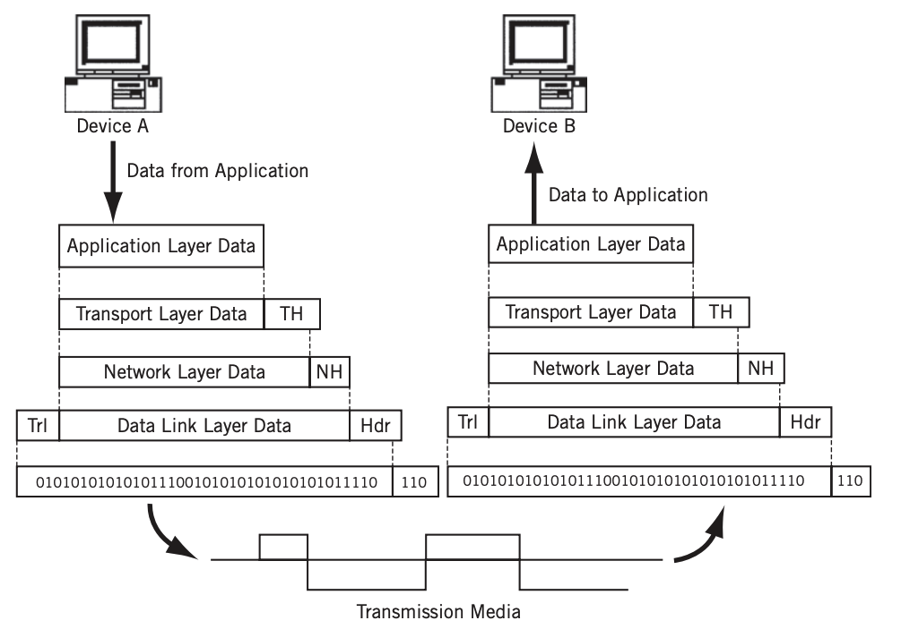

## 1 TCP/IP Model
- TCP/IP Model은 이론보다 실용성에 중점을 둔 네트워크 모델입니다.
- OSI Model이 네트워크 계층을 7개로 나누어 놓았다면, TCP/IP Model은 4개의 계층으로 나누어 놓았습니다.
- TCP/IP Model은 아래와 같이 총 4개의 계층으로 나누어져 있습니다.
  - Application Layer
  - Transport Layer
  - Internet Layer
  - Link Layer(또는 Network Access Layer)
- Link Layer를 다시 physical, data link 두 레이어로 쪼개 5개의 계층으로 정의하기도 합니다.

**TCP/IP Model**

- 위는 TCP/IP Model을 5계층으로 나타낸 그림입니다.
- Link Layer는 Physical Layer와 Data Link Layer로 나누어져 있습니다.

### 1.1 OSI Model과의 비교
- OSI Model은 7개의 계층으로 나누어져 있지만, TCP/IP Model은 4개의 계층으로 나누어져 있습니다.
- OSI Model은 이론적인 모델이며, TCP/IP Model은 실용적인 모델입니다.
- OSI Model은 계층에 번호를 붙이지만, TCP/IP Model은 이름만 존재합니다.
- OSI Model은 계층 간의 통신 방법을 정의하지만, TCP/IP Model은 각 계층의 역할만을 정의합니다.

### 1.2 Encapsulation
- 각 계층은 상위 계층의 페이로드에 헤더를 추가해서 하위 계층으로 전달합니다.
  - 애플리케이션에서 데이터를 데이터 플로 계층으로 내려보내면서 패킷에 데이터를 넣을 수 있도록 분할하는데 이 과정을 Encapsulation이라고 합니다.
- 헤더에 포함되는 가장 중요한 두 가지 정보는 아래와 같습니다.
  - 각 계층에서 정의하는 정보
  - **상위 프로토콜 지시자 정보**
  - Decapsulation 과정에서 헤더에 상위 프로토콜 지시자 정보가 없으면 페이로드를 어떻게 해석해야 되는지 모르기 때문입니다.
  - 예를 들어 Internet Layer에서 받은 패킷의 헤더에 상위 프로토콜 지시자 정보가 없으면 Transport Layer의 TCP로 해석할지 UDP로 해석할지 모릅니다.
- 예시
  - IP Protocol(Internet Layer)은 Transport Layer에서 받은 페이로드에 헤더를 추가하여 Data Link Layer로 전달한다
  - IP Protocol이기 때문에 헤더에는 받는 노드의 IP 주소와 같은 정보들이 있다

**Encapsulation**

- 각 계층은 상위 계층의 페이로드에 헤더를 추가하며 Encapsulation한다
- 수신자인 Device B에서는 하위 계층이 Decapsulation을 통해 페이로드를 추출하고 이를 상위 계층으로 전달한다

### 1.3 Decapsulation
- Encapsulation과 반대로, 각 계층은 하위 계층에서 받은 페이로드를 추출하여 상위 계층으로 전달합니다.
- Physical Layer에서 받은 전기 신호를 데이터 형태로 만들어 Data Link Layer로 전달합니다.
- Data Link Layer에서는 받은 데이터를 MAC 주소를 확인 자신에게 온 패킷이 아니면 버리고 맞으면 Internet Layer로 전달합니다.
- Internet Layer에서는 받은 패킷의 헤더 정보를 확인하고 Transport Layer로 전달합니다.
- Transport Layer에서는 받은 패킷의 헤더 정보를 확인하고 Application Layer로 전달합니다.

### 1.4 통신 과정

- DeviceA에서 DeviceB로 패킷을 전달하는 과정을 나타낸 그림입니다.
- Intermediate Node에서는 Physical, Data Link, Network까지만 개입합니다.
  - Intermediate Node에서는 IP 주소를 통해 DeviceB로 패킷을 전달하는 것이 목표입니다.
  - 따라서 IP가 속한 Network Layer까지만 개입해도 DeviceB를 찾을 수 있습니다.

## 2 Application Layer

### 2.1 프로토콜
- HTTP, HTTPS, DNS, FTP, SMTP, SSH, TLS, SSL

## 3 Transport Layer
- 송신자의 프로세스와 수신자의 프로세스를 연결하는 통신 서비스를 제공합니다.

### 3.1 프로토콜
- TCP, UDP

### 3.2 주소체계
- 특정 프로세스와 특정 프로세스가 통신하기 위해서는 `포트 번호`가 필요합니다.
- 하나의 포트는 하나의 프로세스에 할당되고 하나의 프로세스는 여러 개의 포트 번호를 사용할 수 있습니다.
- [Port-Numbers.md](../Port-Numbers/Port-Numbers.md) 참고

## 4 Internet Layer
- 프레임을 Encapsulation한 packet의 형태로 출발지에 목적지까지 전달합니다.

### 4.1 프로토콜
- IP

### 4.2 주소체계
* IP Address
* [IP.md](../Protocol/IP/IP.md) 참고

## 5 Data Link Layer
- 비트 스트림을 조직화하여 프레임으로 만들고 이 프레임을 이웃한 시스템으로 전달하는 기능을 담당합니다.
- 주요 장비
  - 스위치, 네트워크 인터페이스 카드

### 5.1 프로토콜
- Ethernet

### 5.2 주소체계
- Data Link Layer에서 쓰이는 주소체계는 MAC 주소입니다.
- [MAC-Address.md](../MAC-Address/MAC-Address.md) 참고

## 6 Physical Layer
- 주로 전기 신호를 전달하는데 초점이 맞추어져 있습니다.
  - Physical Layer는 들어온 전기 신호를 그대로 잘 전달하는 것이 목표입니다.
- 주요 장비
  - 허브, 리피터, 케이블, 커넥터, 트랜시버

## 6.1 주소 체계
- Physical Layer는 주소 개념이 없습니다.
- 전기 신호가 들어온 포트를 제외하고 모든 포트에 같은 전기 신호를 전송합니다.

참고
- https://en.wikipedia.org/wiki/Internet_protocol_suite
- https://www.geeksforgeeks.org/tcp-ip-model/
- https://users.exa.unicen.edu.ar/catedras/comdat1/material/TP1-Ejercicio5-ingles.pdf