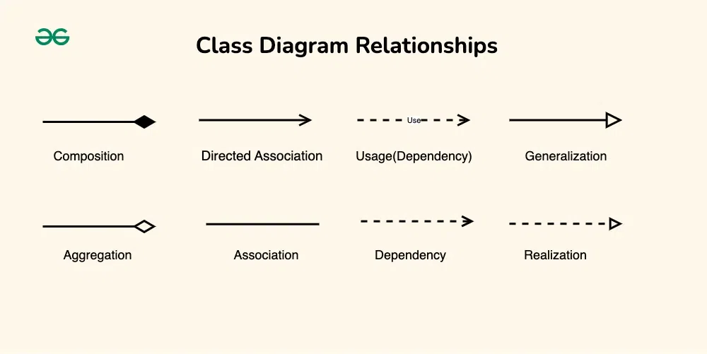

## 1. 클래스 다이어그램이란

- 클래스 다이어그램은 UML에서 가장 널리 사용되는 구조 다이어그램으로, 시스템의 정적 구조를 표현합니다.
- 객체지향 시스템에서 클래스들과 그들 간의 관계를 시각적으로 나타내어 시스템의 전체적인 구조를 이해할 수 있게 해줍니다.
- 설계 단계에서 시스템의 구조를 계획하고, 개발 완료 후에는 시스템 문서화의 핵심 역할을 담당합니다.

:::info
클래스 다이어그램은 '정적 모델'입니다. 즉, 시스템이 실행되는 동안의 동작이나 상태 변화가 아닌, 시스템의 구조적 관점을 보여줍니다.
:::

### 1.1 클래스 다이어그램의 중요성

- **설계 검증**: 구현 전에 클래스 구조의 타당성을 검토할 수 있습니다.
- **의사소통**: 개발팀 간의 공통 이해를 도모합니다.
- **문서화**: 시스템의 구조를 체계적으로 기록합니다.
- **유지보수**: 기존 코드의 구조를 빠르게 파악할 수 있습니다.
- **리팩토링**: 코드 개선 방향을 시각적으로 계획할 수 있습니다.

## 2. 클래스 표기법

### 2.1 기본 클래스 구조

- 클래스는 3개 구획으로 나뉜 직사각형으로 표현됩니다
- 첫 번째 구획은 클래스 이름, 두 번째 구획은 속성(필드), 세 번째 구획은 메서드를 나타냅니다.

### 2.2 가시성 표시자 (Visibility)

- 각 속성과 메서드 앞에는 접근 제한자를 나타내는 기호가 붙습니다:
- **+ (public)**: 모든 클래스에서 접근 가능
- **- (private)**: 해당 클래스 내부에서만 접근 가능
- **# (protected)**: 해당 클래스와 하위 클래스에서 접근 가능
- **~ (package)**: 같은 패키지 내에서만 접근 가능

#### 2.2.1 Java 코드와의 대응

```java
public class User {
    private String name;           // - name: String
    protected int age;             // # age: int
    public String email;           // + email: String
    String phoneNumber;            // ~ phoneNumber: String
    
    public void setName(String name) {    // + setName(String): void
        this.name = name;
    }
    
    private boolean isValid() {           // - isValid(): boolean
        return name != null && !name.isEmpty();
    }
}
```

### 2.3 추상 클래스와 인터페이스

- **추상 클래스**: 클래스명을 이탤릭체로 표시하거나 `<<abstract>>` 스테레오타입 사용
- **인터페이스**: `<<interface>>` 스테레오타입 사용

```
┌─────────────────────────┐
│    <<interface>>        │
│      Drawable           │
├─────────────────────────┤
│                         │
├─────────────────────────┤
│ + draw(): void          │
└─────────────────────────┘
```

## 3. 클래스 간 관계 표현



### 3.1 연관 (Association)

- 한 객체가 다른 객체에게 메세지를 보낼 수 있으면 두 객체를 `연관` 관계라고 할 수 있습니다.
- 한 객체가 다른 객체를 참조하므로써 연관 관계를 만들 수 있습니다.
	- 구현 방식으로 인스턴스 변수가 있습니다.
- 두 클래스는 독집적인 자체 수명을 가집니다.
- 객체와 객체 사이에 **양방향** 또는 **단반향** 관계가 있습니다.

#### 3.1.1 양방향 연관

```java
// Java 코드 예시
public class Student {
    private List<Course> courses;  // Student가 Course를 참조
}

public class Course {
    private List<Student> students;  // Course가 Student를 참조
}
```

- 양방향 연관은 두 클래스가 서로를 참조하는 관계입니다.
- UML에서는 실선으로 표기합니다.

#### 3.1.2 단방향 연관

```java
public class Order {
    private Customer customer;  // Order만 Customer를 참조
}

public class Customer {
    // Customer는 Order를 직접 참조하지 않음
}
```

- 단방향 연관은 한 클래스가 다른 클래스를 참조하는 관계입니다.
- UML에서는 실선 화살표로 표기합니다.

### 3.2 집합 (Aggregation)

- Aggregation을 집약 또는 집합이라고도 하며, 두 객체 사이의 "전체-부분" 관계를 나타냅니다.
- Aggregation은 단방향 연관 관계입니다.
	- Association과 나머지 특성은 같지만 단 하나 다른점이 방향입니다.
	- Aggregation 관계를 이루는 객체는 트리를 구성합니다.
	- 부모에서 자식으로의 단방향 참조만 있기 때문에 사이클이 발생하지 않습니다.
	- 반면에 Association은 양뱡향 참조가 있을 수 있기 때문에 사이클이 발생할 수 있습니다.
- 두 객체 사이에 소유 관계가 있으며 이를 `HAS-A` 관계가 있다라고 합니다.
- 두 객체는 자체 수명 주기를 가지고 있습니다.
  - 즉 전체 객체가 삭제되어도 부분 객체는 독립적으로 존재할 수 있습니다.
- UML에서는 빈 다이아몬드로 표현합니다.

#### 3.2.1 Java 코드 예시

```java
public class Department {
    private List<Employee> employees;
    
    public void addEmployee(Employee employee) {
        employees.add(employee);
    }
    
    // Department가 삭제되어도 Employee는 다른 부서로 이동 가능
}

public class Employee {
    private String name;
    private Department department;
}
```

- 위 예시에서 `Department`에서 `Employee`를 단방향으로 참조하고 있습니다.
- `Department`가 삭제되어도 `Employee`는 다른 부서로 이동할 수 있습니다.
- 따라서 `Department`와 `Employee`는 집합(Aggregation) 관계입니다.

### 3.3 합성 (Composition)

- Composition은 더 제한적인 Aggregation 관계를 의미합니다.
- Aggregation은 두 객체가 자체 생명 주기를 가지는 두 객체의 `HAS-A` 관계를 의미한다면, Composition은 단독으로 존재할 수 없는 객체를 포함하는 `HAS-A` 관계를 의미합니다.
- Composition 관계의 부모 자식이 있으면 자식의 라이프사이클은 부모에 의해 관리됩니다.
	- 자식을 생성하고 삭제하거나 자식을 책임질 다른 부모에게 넘겨줄 수 있습니다.
- 합성은 강한 "전체-부분" 관계를 나타내며, 채워진 다이아몬드로 표현합니다.

#### 3.3.1 Java 코드 예시

```java
public class House {
    private List<Room> rooms;
    
    public House() {
        rooms = new ArrayList<>();
        rooms.add(new Room("거실"));
        rooms.add(new Room("침실"));
        // House 생성 시 Room들도 함께 생성
    }
    
    // House가 삭제되면 Room들도 함께 삭제됨
}

public class Room {
    private String name;
    
    public Room(String name) {
        this.name = name;
    }
}
```

- 위 예시에서 `House`는 `Room`을 포함하고 있으며, `House`가 삭제되면 `Room`도 함께 삭제됩니다.
- 따라서 `House`와 `Room`은 합성(Composition) 관계입니다.

### 3.4 상속 (Inheritance/Generalization)

- 상속은 일반화-특수화 관계를 나타내며, 빈 삼각형 화살표로 표현합니다.

#### 3.4.1 Java 코드 예시

```java
public abstract class Animal {
    protected String name;
    
    public abstract void makeSound();
    
    public void sleep() {
        System.out.println(name + " is sleeping");
    }
}

public class Dog extends Animal {
    @Override
    public void makeSound() {
        System.out.println("멍멍!");
    }
}

public class Cat extends Animal {
    @Override
    public void makeSound() {
        System.out.println("야옹!");
    }
}
```

### 3.5 실현 (Realization/Implementation)

- 실현은 인터페이스 구현 관계를 나타내며, 점선과 빈 삼각형으로 표현합니다.

#### 3.5.1 Java 코드 예시

```java
public interface Drawable {
    void draw();
    void resize(double factor);
}

public class Circle implements Drawable {
    private double radius;
    
    @Override
    public void draw() {
        System.out.println("Drawing a circle");
    }
    
    @Override
    public void resize(double factor) {
        radius *= factor;
    }
}
```

### 3.6 의존 (Dependency)

- 의존은 한 클래스가 다른 클래스를 사용하는 관계를 나타내며, 점선 화살표로 표현합니다.
- Association과의 차이점은 지속성에 있습니다.
  - Association은 지속적인 참조 관계를 나타내는 반면, 의존은 일시적인 관계를 나타냅니다.
- 의존의 구현 방식으로 메서드 매개변수, 지역변수 등이 있습니다.

#### 3.6.1 의존 관계의 종류

- **매개변수 의존**: 메서드의 매개변수로 사용
- **지역변수 의존**: 메서드 내에서 지역변수로 사용
- **정적 메서드 호출**: 다른 클래스의 정적 메서드 호출

```java
public class OrderService {
    public void processOrder(Order order) {
        // EmailService에 의존 (매개변수로 사용하지 않지만 내부에서 생성)
        EmailService emailService = new EmailService();
        emailService.sendConfirmation(order.getCustomer().getEmail());
```

## 참고

- https://stackoverflow.com/questions/885937/what-is-the-difference-between-association-aggregation-and-composition
- https://groups.google.com/g/comp.object/c/_j4g-I9jqVg/m/rouCJeVXzR4J