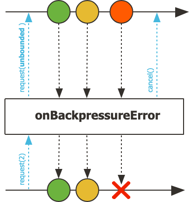
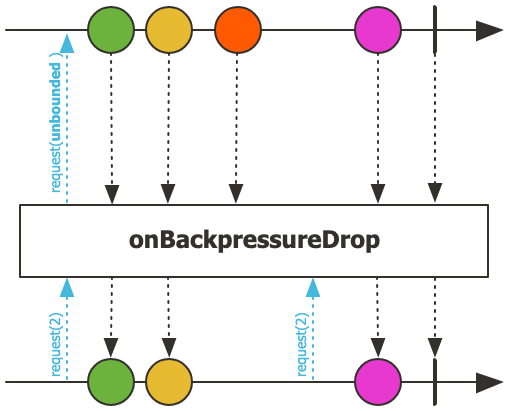
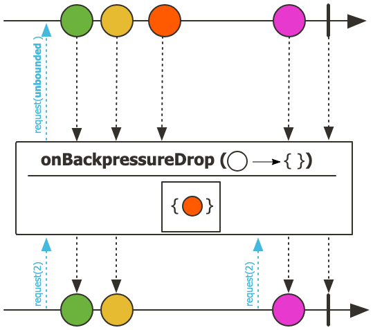
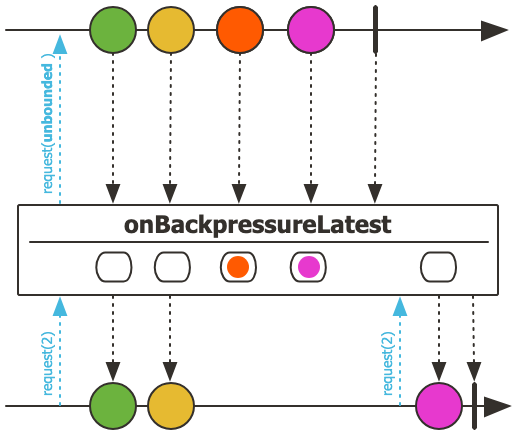
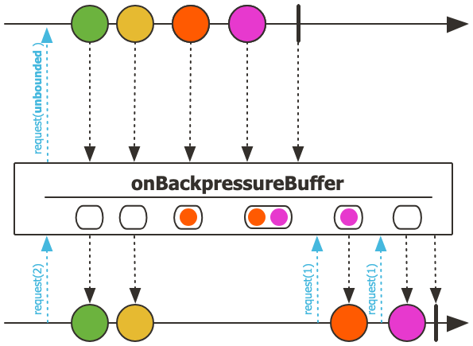
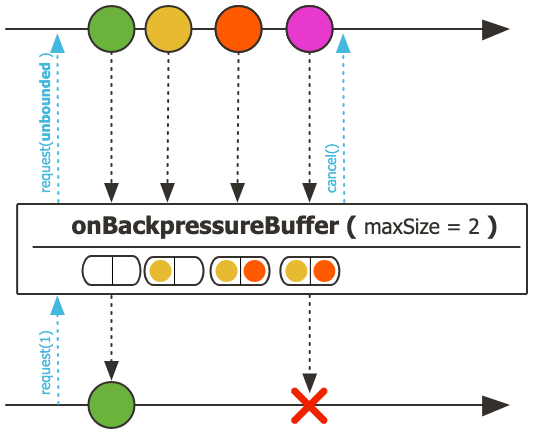

## 1. Backpressure 개념 이해

- Backpressure(배압)는 데이터 스트림에서 Publisher(생산자)와 Subscriber(소비자) 사이의 데이터 처리 속도 차이를 조절하는 메커니즘입니다.
- 이는 리액티브 프로그래밍에서 시스템의 안정성과 신뢰성을 보장하는 핵심 개념입니다.
- 데이터 처리 과정에서 생산자가 소비자보다 빠른 속도로 데이터를 생성할 때 발생하는 문제를 해결
- 시스템의 과부하를 방지하고 메모리 부족 현상을 예방
- 전체 시스템의 응답성과 탄력성을 유지

## 2. Publisher와 Subscriber 간의 데이터 흐름

- Reactive Streams 스펙은 Publisher와 Subscriber 간의 데이터 흐름을 다음과 같이 정의합니다
	- [ReactiveStream 참고](../../ReactiveStream/ReactiveStream/ReactiveStream.md)

### 2.1 데이터 흐름

1. 구독 시작 (Subscription)
	- Subscriber가 Publisher.subscribe(Subscriber) 메서드를 호출하여 구독을 시작
	- Publisher는 새로운 Subscription 객체를 생성
	- Publisher가 Subscriber.onSubscribe(Subscription) 메서드를 호출하여 Subscription 객체를 전달
2. 데이터 요청 (Request)
	- Subscriber는 전달받은 Subscription 객체의 request(n) 메서드를 호출하여 데이터를 요청
	- 이때 n은 Subscriber가 처리할 수 있는 데이터의 최대 개수
	- 예: request(10)은 "최대 10개의 데이터를 처리할 준비가 되었다"는 의미
3. 데이터 전송 (Data Flow)
	- Publisher는 요청받은 n개 이하의 데이터를 Subscriber.onNext() 메서드를 통해 전송
	- 각 onNext() 호출마다 request(n)에서 지정한 수량이 1씩 감소
	- 모든 데이터가 전송되면 Subscriber.onComplete() 호출
	- 오류 발생 시 Subscriber.onError() 호출
4. 추가 요청 (Additional Requests)
	- Subscriber는 onNext()에서 데이터를 처리한 후 추가 request(n)을 호출
	- 이는 일종의 크레딧 시스템처럼 작동하며, 각 데이터 처리가 완료될 때마다 새로운 데이터를 요청하는 방식으로 흐름을 제어

## 3. Backpressure의 필요성

- 실시간으로 데이터를 처리하는 시스템에서 Publisher(생산자)가 Subscriber(소비자)의 처리 능력을 초과하는 속도로 데이터를 생성할 때, 적절한 Backpressure 메커니즘이 없다면 다음과 같은
  심각한 문제들이 발생할 수 있습니다:

### 3.1 메모리 부족 (Out of Memory)

- 데이터 생성 속도가 처리 속도를 초과하면, 처리되지 못한 데이터는 메모리에 계속 축적됩니다.
- 이는 마치 수도꼭지에서 물이 쏟아지는데 배수구가 좁아 물이 넘치는 것과 같은 상황입니다.
- 처리 대기 중인 데이터가 메모리를 계속 점유
- 결과적으로 시스템의 가용 메모리가 고갈
- 극단적인 경우 OutOfMemoryError 발생으로 애플리케이션 중단

### 3.2 시스템 성능 저하

- 과도한 데이터 유입은 전반적인 시스템 성능에 부정적인 영향을 미칩니다:
- CPU 부하 증가
	- 대기 중인 데이터를 관리하기 위한 추가적인 연산 발생
	- 전체적인 시스템 응답 시간 증가
- 가비지 컬렉션(GC) 부하
	- 많은 객체 생성과 제거로 인한 GC 빈번 발생
	- GC 수행 중 애플리케이션 일시 정지(Stop-the-world) 현상 증가

### 3.3 데이터 신뢰성 저하

- 시스템이 과부하 상태가 되면 데이터의 안정적인 처리가 불가능해집니다:
- 중요한 데이터의 유실 가능성
- 처리 순서 보장의 어려움
- 에러 상황에서의 복구 및 재처리 어려움

### 3.4 Backpressure의 장점

- 데이터 흐름 제어: Subscriber가 처리할 수 있는 만큼만 데이터를 요청
- 시스템 안정성 보장: 과부하 상황을 사전에 방지
- 리소스 효율적 사용: 메모리와 CPU 사용량을 적절한 수준으로 유지
- 효과적인 Backpressure 구현은 마치 수도꼭지의 물 조절처럼, 데이터의 생성과 소비 사이의 균형을 맞추어 시스템의 안정성과 효율성을 모두 확보할 수 있게 해줍니다.

## 4. Reactor에서의 Backpressure 구현

- Reactor는 Reactive Streams 스펙을 구현하여 실제 사용 가능한 형태의 Backpressure를 제공합니다.
- 특히 개발자가 쉽게 Backpressure를 다룰 수 있도록 BaseSubscriber라는 추상 클래스를 제공합니다.

### 4.1 BaseSubscriber 제공

- Reactor는 Subscriber 인터페이스의 구현을 돕는 BaseSubscriber 추상 클래스를 제공합니다.
- BaseSubscriber는 기본적인 구독 로직을 구현하고 있어, 개발자는 hook 메서드만 오버라이드하여 필요한 동작을 정의할 수 있습니다.
- BaseSubscriber는 내부적으로 Subscription 객체를 관리하며, 이를 통해 request(n) 호출을 간단하게 만들어줍니다:
	- `request(n)`: Subscription.request(n)을 호출하는 헬퍼 메서드
	- 개발자가 직접 Subscription 객체를 관리하지 않아도 됨
	- subscription.request(n) 대신 간단히 request(n) 호출 가능
- BaseSubscriber는 다음과 같은 주요 hook 메서드들을 제공합니다:
	- hookOnSubscribe: 구독 시작 시점의 동작 정의
	- hookOnNext: 데이터 수신 시의 동작 정의
	- hookOnComplete: 완료 시점의 동작 정의
	- hookOnError: 에러 발생 시의 동작 정의
	- hookOnCancel: 취소 시점의 동작 정의

### 4.2 구현 예제

- 다음은 BaseSubscriber를 사용하여 Backpressure를 구현하는 예제입니다

```java
Flux.range(1, 100)
    .onBackpressureBuffer(10)
    .subscribe(new BaseSubscriber<Integer>() {
        @Override
        protected void hookOnSubscribe(Subscription subscription) {
            request(5); // 초기에 5개의 데이터만 요청
        }
        
        @Override
        protected void hookOnNext(Integer value) {
            System.out.println("Received: " + value);
            request(1); // 하나씩 추가 요청
        }
        
        @Override
        protected void hookOnComplete() {
            System.out.println("Completed!");
        }
        
        @Override
        protected void hookOnError(Throwable throwable) {
            System.err.println("Error: " + throwable.getMessage());
        }
    });
```

- hookOnSubscribe에서 초기 데이터 요청량을 5개로 지정
- hookOnNext에서 데이터를 처리하고 추가로 1개씩 요청
- 버퍼 크기를 10으로 제한하여 메모리 사용량 제어
- 에러와 완료 상황에 대한 처리도 포함

## 5. Backpressure 전략

- Reactor는 다양한 Backpressure 전략을 제공하며, 상황에 따라 적절한 전략을 선택할 수 있습니다.

### 5.1 ERROR 전략

- `onBackpressureError()`를 사용하여 ERROR 전략을 적용할 수 있습니다.
- ERROR 전략은 Project Reactor의 기본 Backpressure 전략입니다.
	- 별도의 Backpressure 전략을 지정하지 않으면 이 전략이 사용됩니다.
- Subscriber의 처리 속도가 Publisher의 생성 속도를 따라가지 못할 때 Publisher가 IllegalStateException을 발생시킵니다.
	- IllegalStateException의 하위 클래스인 OverflowException이 발생합니다.
- 데이터 유실을 허용하지 않는 중요한 비즈니스 로직에서 사용합니다.
- 시스템의 과부하 상태를 즉시 감지하고 대응해야 하는 경우에 적합
- 디버깅과 테스트 단계에서 Backpressure 관련 문제를 발견하는데 유용합니다.
- publishOn()과 같은 스케줄러 연산자를 사용할 때 Project Reactor는 기본적으로 작은 크기(256개)의 버퍼를 제공합니다.
	- 이는 backpressure 전략과는 독립적으로 적용됩니다.

#### 5.1.1 ERROR 전략 동작 방식



- onBackpressureError는 업스트림에 Long.MAX_VALUE 만큼의 데이터를 request합니다
- 다운스트림의 request 양보다 더 많은 데이터가 emit되면
- OverflowException을 발생시키며 하위 스트림으로 onError 시그널을 전달합니다.
- 동시에 업스트림으로 구독 취소(cancel) 시그널을 보냅니다

##### 예시

```java

Flux
	.interval(Duration.ofMillis(1))
	.onBackpressureError()
	.doOnNext(data -> log.info("doonNext: {}", data))
	.publishOn(Schedulers.parallel())
	.subscribe(data -> {
			try {
				Thread.sleep(5L);
			} catch (InterruptedException e) {}
			log.info("onNext: {}", data);
		},
		error -> log.error("onError: {}", error.getMessage());
```

- interval 연산자로 1ms 간격으로 데이터를 발행합니다.
- subscribe 메서드로 데이터를 소비하며, onNext에서 5ms 시간이 걸리도록 시뮬레이션 합니다.

### 5.2 DROP 전략

#### 5.2.1 `onBackpressureDrop()`

- onBackpressureDrop()은 다운스트림의 처리 속도가 느릴 때 초과된 데이터를 버리는 백프레셔 전략입니다.
- 이 전략은 실시간 데이터 처리와 같이 최신 데이터가 더 중요하고, 처리되지 못한 중간 데이터를 버려도 되는 경우에 적합합니다.

##### 동작 방식



- 업스트림에 대해 무제한(unbounded) 데이터 요청
- 업스트림은 제한 없이 자유롭게 데이터를 생성/방출
- 다운스트림의 처리:
	- 다운스트림이 요청한 개수(request(n))만큼만 데이터를 처리
	- 다운스트림의 처리 능력을 초과한 데이터는 버림(drop)
- 예시
	- 다운스트림이 request(2)를 보냈다면
	- 처음 2개의 데이터는 다운스트림으로 전달
	- 그 이후 들어오는 데이터는 다운스트림의 추가 요청이 있을 때까지 모두 버림

#### 5.2.2 `onBackpressureDrop(Consumer<? super T> onDropped)`



- `onBackpressureDrop(Consumer<? super T> onDropped)`를 사용하면 버려진 데이터에 대한 추가 처리를 할 수 있습니다.
- onDropped 콜백 함수를 통해 버려진 데이터를 로깅하거나 다른 처리를 할 수 있습니다.

### 5.3 LATEST 전략

- `onBackpressureLatest()`를 사용하여 LATEST 전략을 적용할 수 있습니다.
- 이는 최신 정보만 중요한 실시간 시스템(예: 주식 시세, 센서 데이터)에 적합합니다.

#### 5.3.1 동작 방식



- 상단 타임라인:
	- 4개의 데이터(초록, 노랑, 주황, 분홍)가 순차적으로 발생
	- 마지막에 완료 신호(|)
- 중간 버퍼:
	- onBackpressureLatest 버퍼가 있음
	- 다운스트림의 요청(request) 속도가 느릴 때 가장 최신 데이터만 유지
	- 이전 데이터는 버림
- 하단 타임라인(결과):
	- request(2)로 처음 2개 데이터(초록, 노랑) 처리
	- 그동안 들어온 데이터 중 최신 데이터(분홍)만 유지
	- 다시 request(2)가 오면 유지했던 분홍 데이터 전달
	- 완료 신호(|) 전달
- 즉, 다운스트림이 처리하지 못한 데이터들 중 가장 최신 데이터만 보관하고 나머지는 버리는 방식입니다.
- 이는 실시간 데이터 처리에서 최신 정보만 필요한 경우 유용합니다.

### 5.4 BUFFER 전략

- `onBackpressureBuffer()`를 사용하여 BUFFER 전략을 적용할 수 있습니다.

#### 5.4.1 `onBackpressureBuffer()`



- 업스트림 요청
	- `request(unbounded)`로 업스트림에 무제한 데이터 요청합니다.
	- 따라서 업스트림은 제한 없이 데이터를 생성/방출합니다.
- 데이터 흐름
	- 다운스트림 `request(2)`: 초록, 노랑 데이터 처리
	- 추가 데이터(주황, 분홍)는 다운스트림 처리 속도 부족으로 버퍼에 저장
	- 다운스트림 `request(1)`: 버퍼의 주황 데이터 전달
	- 다운스트림 `request(1)`: 버퍼의 분홍 데이터 전달
- 특징
	- 업스트림으로부터 받은 데이터를 버퍼링
	- 버퍼링은 FIFO(First-In-First-Out) 방식으로 동작합니다.
	- 다운스트림 처리 준비될 때까지 데이터 보관하며 저장된 데이터를 순서대로 전달합니다.
	- 취소/에러 시 버퍼 데이터 폐기
	- 에러는 버퍼 소진까지 지연
	- 기본 버퍼 크기는 256개

#### 5.4.2 `onBackpressureBuffer(int maxSize)`



- 업스트림 요청
	- `request(unbounded)`로 업스트림에 무제한 데이터 요청
	- 업스트림은 제한 없이 데이터를 생성/방출
- 데이터 흐름
	- 다운스트림 `request(2)`: 초록, 노랑 데이터 처리
	- 추가 데이터는 버퍼에 저장 (maxSize까지만 저장 가능)
	- 다운스트림이 요청할 때마다 버퍼의 데이터를 순서대로 전달
- 버퍼 오버플로우 상황
	- 버퍼가 maxSize를 초과하면 오버플로우 발생
	- 오버플로우 발생 시 즉시 업스트림을 취소(cancel)
	- 오버플로우 에러 발생 (하지만 에러는 지연됨)
- 에러 처리
	- 오버플로우 에러는 지연됨
	- 지연된 동안 구독자는 버퍼의 데이터를 계속 요청 가능
	- 취소나 에러 발생 시 버퍼에 남은 데이터는 폐기
- 특징
	- 제한된 크기의 버퍼 사용으로 메모리 사용량 예측 가능
	- FIFO(First-In-First-Out) 방식으로 동작
	- maxSize를 초과하는 데이터는 즉시 거부되고 오버플로우 에러 발생

#### 5.4.3 BufferOverflowStrategy

- `onBackpressureBuffer(int maxSize, BufferOverflowStrategy bufferOverflowStrategy)`를 사용하여 버퍼가 가득 찼을 때의 동작을 제어할 수 있습니다. 
- BufferOverflowStrategy는 다음과 같은 세 가지 전략을 제공합니다:
- BufferOverflowStrategy.ERROR
  - 버퍼가 가득 찼을 때 IllegalStateException을 발생시킵니다
  - 엄격한 버퍼 제한이 필요한 경우에 적합합니다
  - 버퍼 오버플로우를 즉시 감지하고 대응해야 하는 시나리오에서 유용합니다
- BufferOverflowStrategy.DROP_LATEST
  - 버퍼가 가득 찼을 때 새로 들어오는 데이터를 무시합니다
  - 최신 데이터보다 기존 데이터의 처리가 더 중요한 경우에 사용합니다
  - 예시: 센서 데이터 수집 시 처리 속도가 수집 속도를 따라가지 못할 때
- BufferOverflowStrategy.DROP_OLDEST
  - 버퍼가 가득 찼을 때 가장 오래된 데이터를 제거하고 새 데이터를 버퍼 끝에 추가합니다
  - 최신 데이터가 더 중요한 실시간 처리 시나리오에 적합합니다
  - 예시: 실시간 모니터링 시스템, 주식 시세 처리 등

## 6. 실제 사용 사례

### 6.1 데이터베이스 조회 결과 스트리밍

```java
repository.findAll()
    .onBackpressureBuffer(1000)
    .flatMap(this::processData)
    .subscribe(new BaseSubscriber<ProcessedData>() {
        @Override
        protected void hookOnSubscribe(Subscription subscription) {
            request(100); // 초기 요청량
        }
        
        @Override
        protected void hookOnNext(ProcessedData data) {
            process(data);
            request(1); // 처리 완료 후 다음 데이터 요청
        }
    });
```

### 6.2 외부 API 호출 제어

```java
webClient.get()
    .uri("/api/data")
    .retrieve()
    .bodyToFlux(Data.class)
    .onBackpressureLatest()
    .subscribe(data -> {
        // 데이터 처리 로직
    });
```

## 7. 마치며

- Backpressure는 리액티브 시스템의
- 안정성을 보장하는 핵심 메커니즘입니다.
- Project Reactor는 다양한 Backpressure 전략을 제공하여 개발자가 상황에 맞는 최적의 선택을 할 수 있도록 돕습니다.
- 효과적인 Backpressure 관리를 통해 안정적이고 탄력적인 리액티브 시스템을 구축할 수 있습니다.