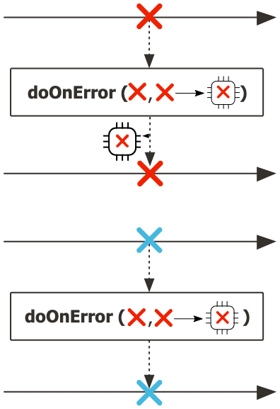
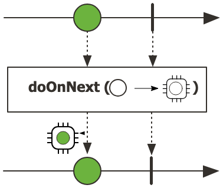
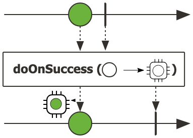
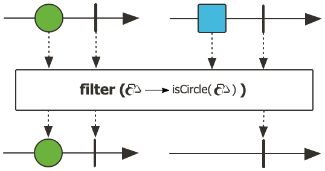
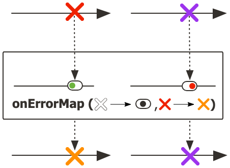
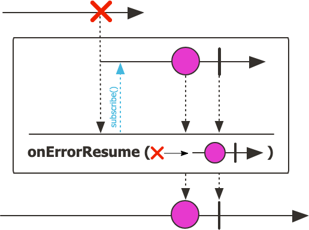
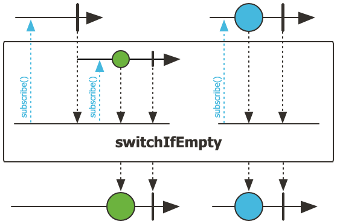
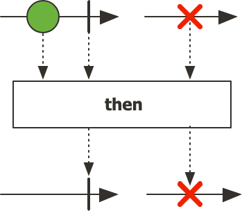

## 1. Mono

- 기본적인 rx 연산자를 갖춘 Reactive Streams Publisher입니다.
  - rx 연산자(Reactive Extensions 연산자)는 리액티브 프로그래밍에서 비동기 데이터 스트림을 생성, 변환, 결합, 필터링하는 데 사용되는 함수들을 말합니다.
- onNext 신호를 통해 최대 하나의 항목만 방출한 다음 onComplete 신호로 종료됩니다(값이 있거나 없는 성공적인 Mono)
  - 또는 단일 onError 신호만 방출합니다(실패한 Mono).
- 대부분의 Mono 구현은 Subscriber#onNext(T)를 호출한 후 즉시 Subscriber.onComplete()를 호출할 것으로 예상됩니다.
- Mono.never()는 예외적인 경우로, 어떤 신호도 방출하지 않습니다.
  - 이는 기술적으로 금지된 것은 아니지만 테스트 외에는 그다지 유용하지 않습니다.
  - 반면, onNext와 onError의 조합은 명시적으로 금지되어 있습니다.

### 1.1 특징 요약

- 최대 하나의 항목: Mono는 최대 한 개의 항목만 방출할 수 있습니다.
- 종료 신호: 항목 방출 후에는 항상 onComplete 신호로 종료되거나, 오류 발생 시 onError 신호만 방출합니다.
- 동작 방식: 대부분의 Mono 구현은 onNext 호출 후 즉시 onComplete를 호출합니다.
- 예외 사례: Mono.never()는 어떤 신호도 방출하지 않는 특수 케이스입니다.
- 금지된 동작: onNext와 onError 신호의 조합은 명시적으로 금지되어 있습니다.

## doOnError



```java
public final <E extends java.lang.Throwable> Mono<T> doOnError(java.lang.Class<E> exceptionType,
                                                               java.util.function.Consumer<? super E> onError)
```

- [레퍼런스](https://projectreactor.io/docs/core/release/api/reactor/core/publisher/Mono.html#doOnError-java.lang.Class-java.util.function.Consumer-)
- doOnError 메서드는 특정 타입의 예외가 발생했을 때 추가 동작을 수행할 수 있게 해주는 연산자입니다.
- 주어진 예외 타입과 일치하는 오류로 Mono가 완료될 때 트리거되는 동작을 추가합니다.
- Consumer가 먼저 실행된 다음, onError 신호가 다운스트림으로 전파됩니다.
- doOnError는 오류를 처리(복구)하지 않는다는 점에서 onErrorResume이나 onErrorReturn과 다릅니다.
- 특징
  - 지정된 예외 타입(exceptionType)과 일치하는 오류만 처리합니다. 이를 통해 특정 예외 타입에 대해서만 반응할 수 있습니다.
  - 데이터 흐름을 변경하지 않고 오류 발생 시 부가적인 작업(로깅, 메트릭 기록 등)을 수행합니다.
  - Consumer 실행 후에도 원래의 오류는 계속해서 다운스트림으로 전파됩니다. 이는 오류를 처리(해결)하는 것이 아니라 단순히 관찰하는 것입니다.
- 타입 매개변수
  - E: 처리할 오류의 타입
- 매개변수
  - exceptionType: 처리할 예외의 타입
  - onError: 관련 오류에 대한 오류 핸들러
- 반환값
  - Mono에 관찰자(observer) 패턴이 적용된 새로운 Mono 인스턴스
- 사용 예시
  - 로깅, 메트릭 기록, 오류 처리 등 다양한 상황에서 유용하게 사용됩니다.
  - 오류를 복구하지 않고 부가적인 작업만 수행하고 싶을 때

## doOnNext



```java
public final Mono<T> doOnNext(java.util.function.Consumer<? super T> onNext)
```

- [레퍼런스](https://projectreactor.io/docs/core/release/api/reactor/core/publisher/Mono.html#doOnNext-java.util.function.Consumer-)
- Mono가 데이터를 성공적으로 방출할 때 트리거되는 동작을 추가합니다.
- Consumer가 먼저 실행된 다음, onNext 신호가 다운스트림으로 전파됩니다.
- 매개변수
  - onNext: 방출된 데이터에 대해 수행할 동작을 정의하는 Consumer입니다.
- 반환값
  - 새로운 Mono 인스턴스입니다. 이 인스턴스는 원본 Mono와 동일합니다.

## doOnSuccess



```java
public final Mono<T> doOnSuccess(java.util.function.Consumer<? super T> onSuccess)
```

- [레퍼런스](https://projectreactor.io/docs/core/release/api/reactor/core/publisher/Mono.html#doOnSuccess-java.util.function.Consumer-)
- doOnSuccess는 Mono가 성공적으로 완료되었을 때 특정 동작을 추가하는 메서드입니다. 
  - 이 메서드는 Mono가 데이터와 함께 또는 데이터 없이 완료되는 두 가지 상황 모두에서 실행됩니다.
- 동작 방식 
  - Consumer에 전달되는 값은 완료 유형에 따라 달라집니다:
  - null: 데이터 없이 완료됨. 핸들러는 onComplete 신호가 다운스트림으로 전파되기 직전에 실행됩니다.
  - T: 데이터와 함께 완료됨. 핸들러는 onNext 신호가 다운스트림으로 전파되기 직전에 실행됩니다.
  - 중요한 점은 이 Consumer가 onNext 또는 onComplete 신호가 다운스트림으로 전파되기 전에 실행된다는 것입니다.
- 매개변수
  - onSuccess: 실행할 콜백 함수입니다. 
  - Mono가 데이터 없이 완료되면 인수는 null이 됩니다
  - 데이터와 함께 완료되면 해당 데이터가 인수로 전달됩니다

## filter



```java
public final Mono<T> filter(java.util.function.Predicate<? super T> tester)
```

- [레퍼런스](https://projectreactor.io/docs/core/release/api/reactor/core/publisher/Mono.html#filter-java.util.function.Predicate-)
- 이 Mono가 값을 가지고 있을 경우, 결과값을 테스트하고 predicate가 true를 반환하면 그 값을 다시 방출합니다. 그렇지 않으면 값 없이 완료됩니다.
- 폐기 지원
  - 요소가 필터 조건을 통과하지 못하면 "폐기"됩니다. 이는 메모리 관리 측면에서 중요합니다.
  - 취소(cancellation)가 발생하거나 데이터 신호에 의한 오류가 트리거되는 경우에도 요소가 폐기됩니다.
- 매개변수
  - tester: 테스트할 조건을 정의하는 Predicate입니다.
- 반환값
  - 필터링 된 Mono 인스턴스입니다.

## onErrorMap



```java
public final Mono<T> onErrorMap(java.util.function.Predicate<? super java.lang.Throwable> predicate,
                                java.util.function.Function<? super java.lang.Throwable,? extends java.lang.Throwable> mapper)
```

- [레퍼런스](https://projectreactor.io/docs/core/release/api/reactor/core/publisher/Mono.html#onErrorMap-java.lang.Class-java.util.function.Function-)
- 이 Mono에서 발생한 에러가 주어진 predicate와 일치하면, 동기적으로 함수를 적용하여 해당 에러를 변환합니다.
- 그렇지 않으면 에러를 그대로 통과시킵니다.
- 매개변수
  - predicate: 에러를 필터링하는 조건을 정의하는 Predicate입니다.
  - mapper: 에러를 변환하는 함수를 정의하는 Function입니다.
- 반환값
  - 일부 소스 에러를 다른 에러로 변환하는 Mono 인스턴스입니다.
- onErrorMap 메서드는 Project Reactor의 에러 처리 메커니즘 중 하나로, 특정 조건에 맞는 에러를 다른 타입의 에러로 변환할 수 있게 해줍니다.
- 에러가 predicate 조건을 만족하면, mapper 함수를 적용하여 에러를 다른 타입으로 변환합니다.
- 에러가 predicate 조건을 만족하지 않으면, 원래 에러가 그대로 전파됩니다.
- 변환된 에러는 원래 에러를 cause로 포함할 수 있어, 에러의 원인 체인을 유지할 수 있습니다.
- onErrorMap과 다른 에러 처리 연산자의 차이
  - onErrorMap: 에러를 다른 에러로 변환합니다.
  - onErrorReturn: 에러 발생 시 기본값을 반환합니다.
  - onErrorResume: 에러 발생 시 대체 Publisher를 제공합니다.
  - onErrorContinue: 에러를 처리하고 스트림을 계속 진행합니다.
- 사용 예시
  - 외부 API 예외를 내부 비즈니스 예외로 변환
  - 네트워크 관련 예외를 사용자 친화적인 메시지가 포함된 예외로 변환
  - 보안 관련 예외를 일반화된 예외로 변환하여 구체적인 보안 정보를 숨김

## onErrorResume



```java
public final Mono<T> onErrorResume(java.util.function.Function<? super java.lang.Throwable,? extends Mono<? extends T>> fallback)
```

- [레퍼런스](https://projectreactor.io/docs/core/release/api/reactor/core/publisher/Mono.html#onErrorResume-java.lang.Class-java.util.function.Function-)
- 어떤 오류가 발생했을 때, 오류에 따라 대체 게시자를 선택하는 함수를 사용하여 대체 게시자를 구독합니다.
- 메서드에 전달하는 fallback 함수는 발생한 오류를 입력으로 받아, 그에 따라 적절한 대체 Mono를 반환하는 역할을 합니다.
- 최종적으로 이 메서드는 원본 Mono와 동일한 결과를 생성하지만, 오류가 발생할 경우 지정된 대체 로직으로 전환되는 새로운 Mono를 반환합니다.
- 매개변수
  - fallback: 오류 발생 시 대체할 대안 Mono를 선택하는 함수입니다.
- 반환값
  - 원본 소스에서 onError 이벤트 발생 시 대체(fallback)되는 Mono

## switchIfEmpty



```java
public final Mono<T> switchIfEmpty(Mono<? extends T> alternate)
```

- [레퍼런스](https://projectreactor.io/docs/core/release/api/reactor/core/publisher/Mono.html#switchIfEmpty-reactor.core.publisher.Mono-)
- 이 메서드를 사용하면 Mono가 값을 방출하지 않고 완료될 때 대체 값이나 대체 데이터 소스를 제공할 수 있습니다.
- 동작
  - 원본 Mono가 값을 방출하면, 그 값이 그대로 전달됩니다.
  - 원본 Mono가 값을 방출하지 않고 완료(empty)되면, alternate Mono로 전환됩니다.
  - 원본 Mono가 에러를 방출하면, 에러가 그대로 전파되고 alternate는 사용되지 않습니다.
- 매개변수
  - alternate: 원본 Mono가 empty일 때 사용할 대체 Mono입니다.
- 반환값
  - 소스가 요소 없이 완료될 경우 대체 Mono로 전환하는 Mono

### 예시

```java

// 다중 데이터 소스에서 고객 데이터를 가져오는 예시
Mono<CustomerData> getCustomerData(String customerId) {
    return primaryDataSource.getCustomer(customerId)
        .switchIfEmpty(secondaryDataSource.getCustomer(customerId))
        .switchIfEmpty(legacyDataSource.getCustomer(customerId))
        .switchIfEmpty(Mono.error(new CustomerNotFoundException(customerId)));
}

// 캐시 조회 후 미스인 경우 DB에서 조회하는 예시
Mono<Document> getDocument(String docId) {
    return cacheService.getDocument(docId)
        .switchIfEmpty(
            documentService.fetchDocument(docId)
                .doOnSuccess(doc -> {
                    if (doc != null) {
                        cacheService.saveDocument(docId, doc).subscribe();
                    }
                })
        );
}

// 기본 값을 제공하는 예시
Mono<UserPreferences> getUserPreferences(String userId) {
    return userPreferenceRepository.findByUserId(userId)
        .switchIfEmpty(
            userGroupRepository.findGroupByUserId(userId)
                .flatMap(group -> groupPreferenceRepository.findByGroupId(group.getId()))
                .switchIfEmpty(Mono.just(UserPreferences.getSystemDefaults()))
        );
}
```

## then



```java
public final Mono<java.lang.Void> then()
```

- [레퍼런스](https://projectreactor.io/docs/core/release/api/reactor/core/publisher/Mono.html#then--)
- 현재 Mono에서 complete 및 error 신호만 재생하는 `Mono<Void>`를 반환합니다.
- 폐기 지원
  - then() 메서드는 원본 Mono의 데이터 값을 무시하고 완료 또는 오류 신호만 전달하는 새로운 `Mono<Void>`를 생성합니다.
- 이 메서드는 다음과 같은 특징을 갖습니다:
  - 원본 Mono가 방출하는 데이터 항목은 폐기됩니다. 즉, 다운스트림으로 전달되지 않습니다.
  - 원본 Mono의 완료 신호(onComplete)와 오류 신호(onError)만 새로운 Mono에 전달됩니다.
  - 반환되는 Mono는 항상 `Mono<Void>` 타입입니다. 이는 어떤 데이터도 방출하지 않고 완료 신호만 전달하는 리액티브 스트림입니다.
- 반환값
  - 페이로드를 무시하는 `Mono<Void>`입니다.
- 주요 사용 사례
  - 데이터 자체가 아닌 작업의 완료 여부만 중요할 때

## 참고

- https://projectreactor.io/docs/core/release/api/reactor/core/publisher/Mono.html