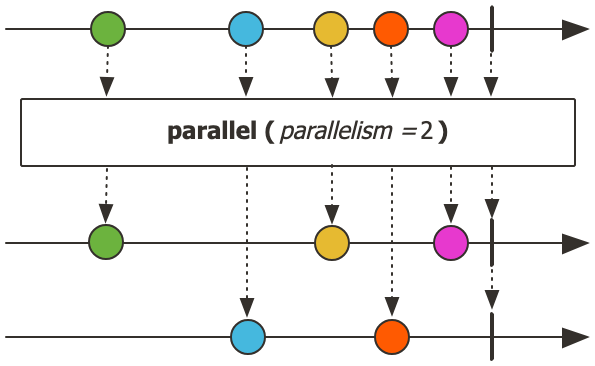

## 1. Scheduler 소개

- Project Reactor의 Scheduler는 리액티브 스트림에서 작업이 실행될 스레드를 관리하는 핵심 컴포넌트입니다.
- 개발자가 직접 스레드를 제어하는 대신, Scheduler가 작업의 실행 컨텍스트를 효율적으로 관리합니다.

### 1.1 Scheduler의 주요 역할

#### 스레드 관리 추상화

- 개발자가 직접 스레드를 생성하고 관리할 필요가 없습니다
- 작업 특성에 맞는 스레드 풀을 자동으로 관리합니다
- 스레드의 생명주기(생성, 재사용, 종료)를 자동으로 처리합니다

#### 실행 컨텍스트 제어

- 각 작업이 실행될 스레드를 결정합니다
- subscribeOn: 스트림의 시작점 스레드를 지정
- publishOn: 이후 작업들의 실행 스레드를 전환

#### 비동기 작업 최적화

- I/O 작업과 CPU 작업을 분리하여 처리
- 블로킹 작업을 비동기적으로 처리
- 여러 작업을 동시에 효율적으로 실행

### 1.2 Scheduler의 이점

#### 리소스 활용 최적화

- 작업 특성에 따른 적절한 스레드 풀 사용
	- I/O 작업: boundedElastic (탄력적인 스레드 풀)
	- CPU 작업: parallel (코어 수 기반 스레드 풀)
	- 순차 처리: single (단일 스레드)
- 스레드 재사용을 통한 시스템 리소스 절약

#### 성능 향상

- 작업 특성에 맞는 병렬 처리
- 효율적인 컨텍스트 전환
- 시스템 리소스의 균형있는 사용

#### 코드 품질 향상

- 선언적인 방식의 스레드 관리
- 비즈니스 로직과 스레드 관리의 분리
- 유지보수가 용이한 코드 구조

## 2. Scheduler 종류

- Project Reactor는 `reactor.core.scheduler.Schedulers` 클래스를 통해 다양한 스케줄러를 제공합니다.
- 이 클래스는 정적 팩토리 메서드를 통해 용도에 맞는 스케줄러 인스턴스를 생성할 수 있게 해줍니다.
- 각각의 스케줄러는 서로 다른 특성과 사용 목적을 가지고 있어, 상황에 따라 적절한 스케줄러를 선택하는 것이 중요합니다.
- 예를 들어, I/O 작업에는 `boundedElastic()`이 적합하고, CPU 집약적인 작업에는 `parallel()`이 효과적입니다.
- 다음은 Reactor에서 제공하는 주요 스케줄러들입니다:

### 2.1 Schedulers.immediate()

- 별도의 스레드를 추가적으로 생성하지 않고 현재 스레드에서 즉시 실행합니다.
- 작업을 지연 없이 바로 처리하므로 빠른 반응성을 제공합니다.
- 추가적인 스레드 풀이나 큐를 사용하지 않아 성능상 이점이 있습니다.
- 주로 테스트나 디버깅 목적으로 사용됩니다. 비동기적인 동작을 테스트할 때 스케줄링으로 인한 지연을 제거하여 테스트를 단순화할 수 있습니다.
- Scheduler가 필요하지만 스레드를 변경하고 싶지 않은 경우, 코드의 가독성을 높이거나 일관성을 유지하기 위해 사용됩니다.
- 장시간 실행되는 블로킹 작업에는 적합하지 않습니다. 현재 스레드를 차단할 수 있기 때문입니다.

#### 사용 예시

```java
Flux.range(1, 10)
    .subscribeOn(Schedulers.immediate())
    .subscribe(System.out::println);
``` 

- 이 코드는 현재 스레드에서 1부터 10까지의 숫자를 즉시 출력합니다.

### 2.2 Schedulers.single()

- JVM 내에서 단 하나의 스레드만 생성합니다. 애플리케이션이 실행되는 동안 이 하나의 스레드를 계속 재사용합니다.
- 작업들이 모두 이 하나의 스레드에서만 실행되기 때문에, 작업들은 자연스럽게 순차적으로 처리됩니다.
	- 예를 들어 작업 A, B, C가 있다면 반드시 A가 끝난 후 B가 실행되고, B가 끝난 후 C가 실행됩니다.
- 하나의 스레드만 사용하기 때문에 동시성 문제(여러 스레드가 동시에 접근하면서 발생하는 문제)가 발생하지 않습니다.
- 단, 하나의 스레드로만 작업을 처리하기 때문에 처리해야 할 작업이 많거나, 각 작업이 오래 걸리는 경우에는 성능이 좋지 않습니다.
	- 예를 들어 1초가 걸리는 작업 100개가 있다면, 최소 100초가 걸립니다.
- Schedulers.single()을 호출하는 모든 곳에서 같은 스레드를 공유합니다.
- 즉, 코드의 위치가 다르더라도 single()을 사용하면 모두 같은 하나의 스레드에서 실행됩니다.

#### 사용 예시

```java
// 첫 호출 시 스레드 생성
Flux.just(1, 2, 3)
    .publishOn(Schedulers.single())  // 여기서 스레드가 없으면 생성
    .map(i -> i * 2)
    .subscribe();

// 이후 호출에서는 같은 스레드 재사용
Flux.just(4, 5, 6)
    .publishOn(Schedulers.single())  // 이미 생성된 스레드 재사용
    .map(i -> i * 2)
    .subscribe();
```

### 2.3 Schedulers.parallel()

- CPU 코어 수에 맞춰 고정된 수의 스레드를 생성합니다.
- CPU 집약적인 작업이나 병렬 처리가 필요한 경우에 적합합니다.
- `Executors.newFixedThreadPool(Runtime.getRuntime().availableProcessors())`와 유사합니다.

#### 사용 예시

```java
Flux.range(1, 100)
    .parallel()
    .runOn(Schedulers.parallel())
    .map(i -> performHeavyComputation(i))
    .subscribe();
```

### 2.4 Schedulers.boundedElastic()

- ExcuterService 기반의 스레드 풀을 생성한 후 사용하는 스케줄러입니다.
- 스레드를 사용하고 난 뒤에는 풀로 반납하여 재사용합니다.
- 작업량에 따라 스레드의 개수를 동적으로 조정할 수 있습니다.
- 최대 스레드 수가 제한되어 있습니다. 기본값은 CPU 코어 수의 10배입니다.
- I/O 작업이나 블로킹 작업과 같이 시간이 오래 걸리는 작업에 적합합니다.
- 60초 동안 사용되지 않은 유휴 스레드는 제거됩니다.
- 최대 스레드 수에 도달한 후의 작업은 최대 100,000개까지 큐에 저장됩니다.

#### 사용 예시

```java
Flux.range(1, 100)
    .flatMap(i -> 
        Mono.fromCallable(() -> blockingIOOperation(i))
            .subscribeOn(Schedulers.boundedElastic())
    )
    .subscribe();
```

### 2.5 Schedulers.fromExecutorService()

- 사용자가 직접 생성한 ExecutorService를 사용하는 스케줄러입니다.
- 직접 생성한 ExecutorService를 사용할 수 있지만 Reactor에서는 이 방식을 권장하지 않습니다.

### 2.6 newBoundedElastic(), newParallel(), newSingle()

- 이전에 살펴본 `boundedElastic()`, `parallel()`, `single()`은 Reactor에서 제공하는 기본 Scheduler 인스턴스를 사용합니다.
	- 즉 여러 코드에서 호출해도 동일한 인스턴스를 사용합니다.
- 필요하다면 newBoundedElastic(), newParallel(), newSingle()을 사용하여 새로운 인스턴스를 생성할 수 있습니다.

#### 2.6.1 Schedulers.newBoundedElastic()

- 새로운 boundedElastic 스케줄러 인스턴스를 생성합니다.
- 아래 파라미터를 지정할 수 있습니다.
	- threadCap: 최대 스레드 수를 지정합니다. 기본값은 CPU 코어 수의 10배입니다.
	- queueCap: 큐의 최대 크기를 지정합니다. 기본값은 100,000입니다.
	- name: 스레드 이름 접두사입니다. 기본값은 boundedElastic입니다.
	- ttlSeconds: 유휴 스레드의 유효 시간을 지정합니다. 기본값은 60초입니다.

#### 2.6.2 Schedulers.newParallel()

- 새로운 parallel 스케줄러 인스턴스를 생성합니다.
- 아래 파라미터를 지정할 수 있습니다.
	- parallelism: 병렬 스레드 수를 지정합니다. 기본값은 CPU 코어 수입니다.
	- name: 스레드 이름 접두사입니다. 기본값은 parallel입니다.
	- daemon: 데몬 스레드 여부를 지정합니다. 기본값은 false입니다.

#### 2.6.3 Schedulers.newSingle()

- `Schedulers.single()`과 달리 호출할 때마다 새로운 스레드를 생성합니다.
- 아래 파라미터를 지정할 수 있습니다.
	- name: 스레드 이름을 지정합니다. 기본값은 single입니다.
	- daemon: 데몬 스레드 여부를 지정합니다. 기본값은 false입니다.
- 특정 작업에 대해 전용 스레드를 사용하고 싶을 때 활용합니다.
- 작업이 완료된 후 스레드를 해제하고 싶을 때 유용합니다.
- 매번 새로운 스레드를 생성하므로, 과도한 사용 시 리소스 낭비가 발생할 수 있습니다.
- 각 호출마다 독립적인 스레드를 사용하므로, 작업 간 격리가 필요한 경우에 유용합니다.

### 2.7 스케줄러 상황별 추천

#### 2.7.1 I/O 바운드 작업

- **추천**: `Schedulers.boundedElastic()` 또는 `Schedulers.newBoundedElastic()`
- **적합한 상황**:
	- 데이터베이스 쿼리 실행
	- 파일 읽기/쓰기 작업
	- 네트워크 요청(HTTP 호출, 외부 API 통신)
	- 블로킹 레거시 API 호출
- **설정 고려사항**:
	- 매우 많은 수의 블로킹 작업을 처리할 경우 `newBoundedElastic()`으로 전용 풀 생성
	- 긴 지연 시간이 예상되는 경우 큐 크기(`queueCap`) 조정 고려

#### 2.7.2 CPU 바운드 작업

- **추천**: `Schedulers.parallel()` 또는 `Schedulers.newParallel()`
- **적합한 상황**:
	- 복잡한 계산 작업
	- 데이터 변환 및 처리
	- 인메모리 정렬, 필터링
	- 대용량 컬렉션 처리
- **설정 고려사항**:
	- 특별히 격리된 컴퓨팅 작업이 필요한 경우 `newParallel()`로 전용 풀 생성
	- 코어 수보다 많은 병렬 처리가 필요한 경우 `parallelism` 파라미터 조정

#### 2.7.3 순차적 처리 작업

- **추천**: `Schedulers.single()` 또는 `Schedulers.newSingle()`
- **적합한 상황**:
	- 순서가 중요한 작업 처리
	- 공유 상태 접근이 필요한 작업
	- UI 업데이트(JavaFX, Swing)
	- 이벤트 시퀀스 처리
- **설정 고려사항**:
	- 서로 간섭하지 않아야 하는 순차 처리 그룹이 여러 개 있을 경우 `newSingle()`로 분리
	- 애플리케이션 종료 시 스레드도 종료되어야 하는 경우 `daemon=true` 설정

#### 2.7.4 트랜잭션 또는 보안 컨텍스트 작업

- **추천**: `Schedulers.newSingle()`
- **적합한 상황**:
	- 트랜잭션 컨텍스트 유지가 필요한 작업
	- 보안 컨텍스트(인증 정보 등)가 필요한 작업
	- ThreadLocal 값에 의존하는 작업
- **설정 고려사항**:
	- 컨텍스트별로 전용 스레드를 사용하기 위해 의미 있는 이름으로 스레드 생성

#### 2.7.5 테스트 환경

- **추천**: `Schedulers.immediate()`
- **적합한 상황**:
	- 단위 테스트
	- 스레드 전환 없이 동기적 실행이 필요한 경우
	- 비동기 코드의 디버깅

## 3. Scheduling Operators

- Project Reactor에서는 스케줄러를 지정하기 위한 다양한 연산자를 제공합니다.
- 각 연산자는 고유한 특성과 사용 목적을 가지고 있으며, 이들을 적절히 조합하여 효율적인 비동기 처리를 구현할 수 있습니다.

### 3.1 subscribeOn 연산자

- `subscribeOn`은 스트림의 시작점부터 모든 연산의 실행 컨텍스트를 결정합니다.
- 구독이 시작되는 시점의 스레드를 지정한다고 이해하면 됩니다.

#### subscribeOn의 주요 특징

- 스트림 전체에 영향을 미침
- 선언 위치와 관계없이 동일하게 동작
- 여러 번 사용해도 첫 번째로 지정된 스케줄러만 적용
- 소스(Source)에 가장 가까운 연산자에 적용

#### subscribeOn 상세 예제

```java
Flux.range(1, 3)
    .map(i -> {
        System.out.println("First map: " + Thread.currentThread().getName());
        return i * 2;
    })
    .subscribeOn(Schedulers.boundedElastic())
    .map(i -> {
        System.out.println("Second map: " + Thread.currentThread().getName());
        return i + 1;
    })
    .subscribeOn(Schedulers.parallel())  // 이 subscribeOn은 무시됨
    .subscribe(i -> 
        System.out.println("Subscribe: " + Thread.currentThread().getName())
    );
```

실행 결과:

```
First map: boundedElastic-1
Second map: boundedElastic-1
Subscribe: boundedElastic-1
First map: boundedElastic-1
Second map: boundedElastic-1
Subscribe: boundedElastic-1
First map: boundedElastic-1
Second map: boundedElastic-1
Subscribe: boundedElastic-1
```

### 3.2 publishOn 연산자

- `publishOn`은 선언된 지점 이후의 연산자들의 실행 컨텍스트를 변경합니다.
	- 즉 publishOn을 기준으로 다운 스트림의 실행 스레드가 변경됩니다.
- 데이터 스트림의 중간에서 스레드를 전환할 때 사용됩니다.

#### publishOn의 주요 특징

- 선언 지점 이후의 연산자들에만 영향
- 여러 번 사용 가능하며 각각 독립적으로 동작
- 스트림 내에서 컨텍스트 스위칭이 필요한 경우 유용
- 위치가 매우 중요함

#### publishOn 상세 예제

```java
Flux.range(1, 3)
    .map(i -> {
        System.out.println("First map: " + Thread.currentThread().getName());
        return i * 2;
    })
    .publishOn(Schedulers.boundedElastic())
    .map(i -> {
        System.out.println("Second map: " + Thread.currentThread().getName());
        return i + 1;
    })
    .publishOn(Schedulers.parallel())
    .map(i -> {
        System.out.println("Third map: " + Thread.currentThread().getName());
        return i * 3;
    })
    .subscribe();
```

실행 결과:

```
First map: main
First map: main
First map: main
Second map: boundedElastic-1
Second map: boundedElastic-1
Second map: boundedElastic-1
Third map: parallel-1
Third map: parallel-1
Third map: parallel-1
```

### 3.3 parallel() 연산자와 runOn()

- `parallel()`과 `runOn()`은 데이터 스트림을 병렬로 처리할 때 사용되는 연산자입니다.

#### parallel()의 주요 특징



- 스트림을 병렬 처리가 가능한 ParallelFlux로 변환합니다.
- 원본 Flux를 CPU 코어 수에 맞게 데이터를 '레일'로 나누어 라운드-로빈 방식으로 준비합니다.
- 실제로 병렬 작업을 수행하려면 이후에 ParallelFlux.runOn(Scheduler)를 호출해야 합니다

#### runOn()의 주요 특징

- ParallelFlux의 각 레일에 대한 스케줄러 지정합니다.
- parallel() 이후에만 사용 가능합니다.
- 병렬 처리의 실제 실행 컨텍스트 결정합니다.

#### parallel과 runOn 상세 예제

```java
Flux.range(1, 10)
    .map(i -> {
        System.out.println("Before parallel: " + Thread.currentThread().getName());
        return i;
    })
    .parallel(4)  // 4개의 병렬 레일 생성
    .runOn(Schedulers.parallel())
    .map(i -> {
        System.out.println("Parallel processing: " + Thread.currentThread().getName());
        return i * 2;
    })
    .sequential()  // 다시 일반 Flux로 변환
    .subscribe(i -> 
        System.out.println("Result: " + i)
    );
```

### 3.4 스케줄링 연산자 조합 패턴

- 실제 애플리케이션에서는 다양한 스케줄링 연산자를 조합하여 사용하는 것이 일반적입니다.
- 다음은 주요 사용 패턴입니다:

#### I/O 작업과 CPU 작업 분리 패턴

```java
Flux.from(source)
    .subscribeOn(Schedulers.boundedElastic())  // I/O 작업용
    .map(data -> performIOOperation(data))
    .publishOn(Schedulers.parallel())          // CPU 작업용
    .map(data -> performCPUIntensiveTask(data))
    .subscribe();
```

#### 병렬 처리 패턴

```java
Flux.range(1, 100)
    .parallel()
    .runOn(Schedulers.parallel())
    .map(i -> performHeavyComputation(i))
    .sequential()
    .publishOn(Schedulers.single())
    .subscribe(System.out::println);
```

#### 다중 컨텍스트 전환 패턴

```java
Flux.range(1, 10)
    .subscribeOn(Schedulers.boundedElastic())
    .map(i -> performIOOperation(i))
    .publishOn(Schedulers.parallel())
    .map(i -> performCPUTask(i))
    .publishOn(Schedulers.single())
    .map(i -> performSequentialTask(i))
    .subscribe();
```