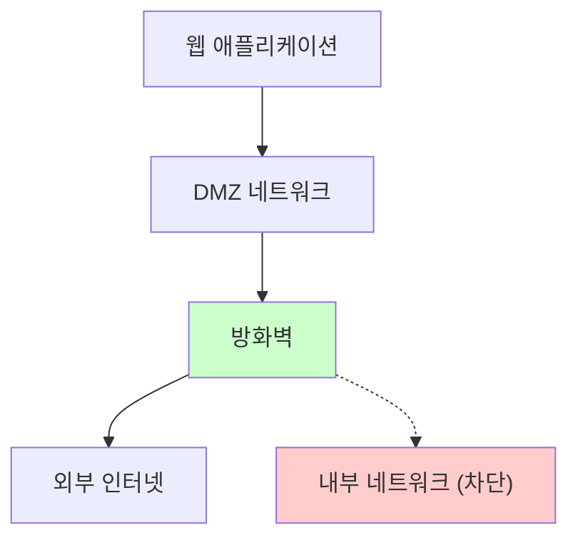

## 1. SSRF(Server Side Request Forgery) 개요

- 서버 측 요청 위조(Server-Side Request Forgery) 공격은 공격자가 서버의 기능을 악용하여 내부 리소스에 무단 접근하는 보안 취약점입니다.

:::note[간단한 비유]
회사 직원에게 "저 파일 좀 가져와줘"라고 부탁하는 것과 같습니다. 악의적인 요청자가 "내부 기밀 서류함에서 급여 명세서 가져와줘"라고 요청하면, 검증 없이 실행하는 직원(취약한 서버)이 내부 정보를 유출하게 됩니다.
:::

## 2. 공격 동작 방식

- 대상 애플리케이션은 URL에서 데이터를 가져오거나, URL로 데이터를 발행하거나, 조작 가능한 URL에서 데이터를 읽는 기능이 있을 수 있습니다.
- 이 경우 공격자는 다음과 같은 방법으로 해당 기능을 악용합니다.

### 2.1 URL 조작

- 공격자가 서버에서 실행되는 코드가 읽어올 URL을 제공하거나 수정
- 완전히 다른 URL 제공하거나 URL 구조 조작 (경로 탐색 등)

### 2.2 내부 서비스 접근

- 조작된 요청을 통해 다음과 같은 내부 자원에 접근:
- **클라우드 메타데이터**: AWS의 `http://169.254.169.254/`에서 설정 정보 및 인증 키 추출
- **데이터베이스 HTTP 인터페이스**: MongoDB 같은 NoSQL DB의 REST API 악용
- **내부 REST API**: 외부에 노출되지 않은 내부 서비스 접근
- **로컬 파일**: `file://` URI를 통한 시스템 파일 읽기

## 3. 공격 예시

### 3.1 정상적인 사용

```http
POST /api/fetch-image
Content-Type: application/json

{
  "url": "https://example.com/public-image.jpg"
}
```

### 3.2 SSRF 공격

```http
POST /api/fetch-image
Content-Type: application/json

{
  "url": "http://169.254.169.254/latest/meta-data/iam/security-credentials/"
}
```

- 위 공격이 성공하면 AWS 인스턴스의 IAM 자격 증명을 탈취할 수 있어 클라우드 인프라 전체가 위험에 노출됩니다.

## 4. 주요 위험성

- **내부 네트워크 침투**: 방화벽으로 보호된 내부 서비스 접근
- **클라우드 메타데이터 탈취**: 인증 토큰 및 설정 정보 유출
- **데이터베이스 직접 접근**: 인증 우회를 통한 민감 정보 탈취
- **입력 검증 우회**: 신뢰할 수 없는 데이터를 신뢰하는 코드로 전달

## 5. 방어 방법

- SSRF 공격에 대한 방어는 애플리케이션 계층과 네트워크 계층에서 다층 방어 원칙을 적용해야 합니다.

### 5.1 애플리케이션 계층 방어

#### 5.1.1 입력 검증 및 화이트리스트

**신뢰할 수 있는 도메인만 허용:**

```javascript
const allowedDomains = ['api.trusted-service.com', 'cdn.example.com'];
const urlObj = new URL(userInput);

if (!allowedDomains.includes(urlObj.hostname)) {
  throw new Error('허용되지 않은 도메인입니다');
}
```

**IP 주소 검증 (Java 예시):**

```java
import org.apache.commons.validator.routines.InetAddressValidator;

public boolean isValidPublicIP(String ip) {
    InetAddressValidator validator = InetAddressValidator.getInstance();
    if (!validator.isValid(ip)) {
        return false;
    }
    
    // 내부 IP 대역 차단
    String[] privateCIDRs = {
        "10.0.0.0/8",
        "172.16.0.0/12", 
        "192.168.0.0/16",
        "127.0.0.0/8",
        "169.254.0.0/16"  // AWS 메타데이터
    };
    
    return !isInPrivateRange(ip, privateCIDRs);
}
```

#### 5.1.2 도메인 이름 검증

```python
import validators
import socket
import ipaddress

def validate_domain(domain):
    # 1. 도메인 형식 검증
    if not validators.domain(domain):
        return False
    
    # 2. DNS 해석하여 IP 확인
    try:
        ip_addresses = socket.gethostbyname_ex(domain)[2]
        for ip in ip_addresses:
            ip_obj = ipaddress.ip_address(ip)
            # 내부 IP인지 확인
            if not ip_obj.is_global:
                return False
        return True
    except socket.gaierror:
        return False
```

#### 5.1.3 프로토콜 제한

```javascript
const allowedProtocols = ['http:', 'https:'];
const urlObj = new URL(userInput);

if (!allowedProtocols.includes(urlObj.protocol)) {
  throw new Error('허용되지 않은 프로토콜입니다');
}

// 리다이렉션 비활성화
const options = {
  redirect: 'error',  // 리다이렉션 차단
  timeout: 5000       // 타임아웃 설정
};
```

#### 5.1.4 요청 정당성 검증

외부 서비스와 통신 시 토큰 기반 검증:

```javascript
// 대상 애플리케이션에서 생성한 랜덤 토큰 사용
const validationToken = generateRandomToken(20); // 20자 영숫자

const requestBody = {
  authToken: validationToken,
  businessData: validatedData
};

// POST 요청만 허용
const response = await fetch(validatedURL, {
  method: 'POST',
  headers: { 'Content-Type': 'application/json' },
  body: JSON.stringify(requestBody),
  redirect: 'error'
});
```

### 5.2 네트워크 계층 방어

#### 5.2.1 방화벽 규칙

```bash
# iptables 예시 - 내부 네트워크 접근 차단
iptables -A OUTPUT -d 10.0.0.0/8 -j REJECT
iptables -A OUTPUT -d 172.16.0.0/12 -j REJECT  
iptables -A OUTPUT -d 192.168.0.0/16 -j REJECT
iptables -A OUTPUT -d 127.0.0.0/8 -j REJECT
iptables -A OUTPUT -d 169.254.169.254 -j REJECT
```

#### 5.2.2 네트워크 분리



#### 5.2.3 DNS 정책

```yaml
# DNS 서버 설정 예시
# 내부 DNS는 내부 도메인만 해석
internal_dns:
  - domain: "*.company.local"
    server: "10.0.0.53"
  
# 외부 DNS는 퍼블릭 도메인만 해석  
external_dns:
  - server: "8.8.8.8"
  - server: "1.1.1.1"
```

### 5.3 클라우드 환경 보안

#### 5.3.1 AWS IMDSv2 적용

:::warning[클라우드 메타데이터 보호]
클라우드 환경에서는 메타데이터 서비스 보호가 필수입니다. AWS의 경우 IMDSv2를 반드시 적용하세요.
:::

```bash
# IMDSv2 강제 설정
aws ec2 modify-instance-metadata-options \
    --instance-id i-1234567890abcdef0 \
    --http-tokens required \
    --http-put-response-hop-limit 1
```

#### 5.3.2 IAM 역할 최소 권한

```json
{
  "Version": "2012-10-17",
  "Statement": [
    {
      "Effect": "Allow",
      "Action": [
        "s3:GetObject"
      ],
      "Resource": "arn:aws:s3:::specific-bucket/*",
      "Condition": {
        "StringEquals": {
          "aws:RequestedRegion": "us-east-1"
        }
      }
    }
  ]
}
```

### 5.4 모니터링 및 탐지

#### 5.4.1 로그 모니터링

```javascript
// 의심스러운 요청 로그
const suspiciousPatterns = [
  /169\.254\.169\.254/,     // AWS 메타데이터
  /localhost/,              // 로컬호스트
  /127\.0\.0\.1/,          // 루프백
  /file:\/\//,             // 파일 프로토콜
  /gopher:\/\//            // Gopher 프로토콜
];

function logSuspiciousRequest(url, sourceIP) {
  for (const pattern of suspiciousPatterns) {
    if (pattern.test(url)) {
      console.warn(`SSRF attempt detected: ${url} from ${sourceIP}`);
      // 보안 팀에 알림
      alertSecurityTeam({
        type: 'SSRF_ATTEMPT',
        url: url,
        sourceIP: sourceIP,
        timestamp: new Date()
      });
      break;
    }
  }
}
```

#### 5.4.2 네트워크 트래픽 모니터링

```python
# 도메인 모니터링 스크립트 예시
import dns.resolver
import ipaddress

def monitor_domain_resolution(domains):
    """허용된 도메인들이 내부 IP로 해석되는지 감시"""
    for domain in domains:
        try:
            answers = dns.resolver.resolve(domain, 'A')
            for rdata in answers:
                ip = ipaddress.ip_address(str(rdata))
                if not ip.is_global:
                    print(f"[ALERT] {domain} resolves to internal IP: {ip}")
        except Exception as e:
            print(f"[ERROR] Failed to resolve {domain}: {e}")

# 주기적으로 실행
monitor_domain_resolution(['trusted-api.com', 'external-service.org'])
```

:::tip[보안 모범 사례]

1. **다층 방어**: 애플리케이션과 네트워크 계층 모두에서 보호
2. **최소 권한**: 필요한 최소한의 네트워크 접근만 허용
3. **정기 모니터링**: 의심스러운 패턴 지속 감시
4. **리다이렉션 차단**: HTTP 클라이언트에서 자동 리다이렉션 비활성화

:::

:::danger[절대 하지 말아야 할 것]

- 사용자 입력으로 완전한 URL을 받는 것
- 클라이언트 측 검증에만 의존
- 블랙리스트만으로 보안 의존
- 메타데이터 서비스 보호 소홀

:::

## 6. 참고 자료

- [OWASP SSRF Prevention Cheat Sheet](https://cheatsheetseries.owasp.org/cheatsheets/Server_Side_Request_Forgery_Prevention_Cheat_Sheet.html)
- [PortSwigger: Server-side request forgery (SSRF)](https://portswigger.net/web-security/ssrf)