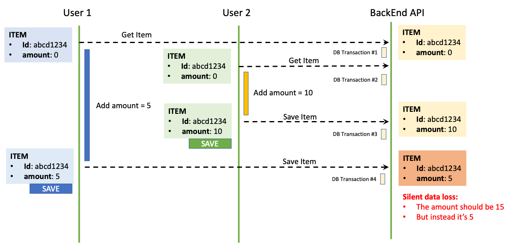
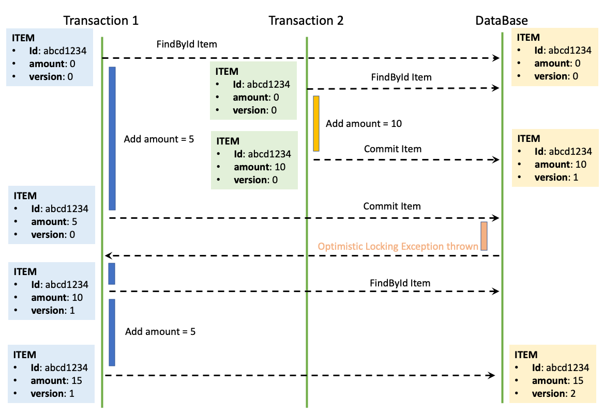
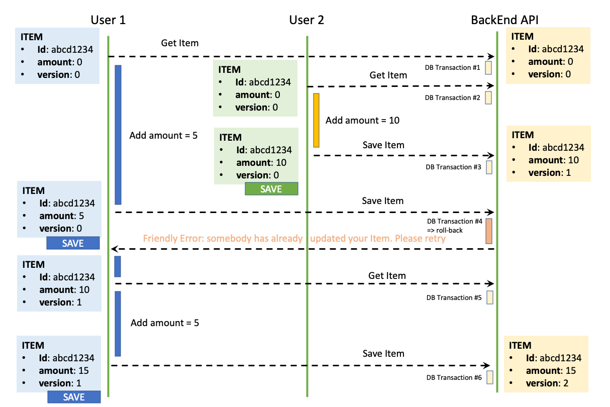

## 1 Silent Data Loss

- 먼저 Lock에 대해 알아보기 전에 Lock으로 해결할 수 있는 Silent Data Loss 문제에 대해 알아보자
	- Second Lost Update Problem라고 불리기도 한다.
- Silent Data Loss는 데이터베이스 트랙잭션 범위를 넘어서는 문제이다.
- Optimistic Locking과 Pessimistic Locking을 통해 Silent Data Loss 문제를 해결할 수 있다.
- 두 가지의 케이스를 보면서 Silent Data Loss 문제가 무엇이고 어떻게 발생하는지 알아보자.

### 1.1 Case1: Concurrent Database Transactions Problem


- Transaction 1과 Transaction 2가 같은 상태의 아이템을 읽는다
- 두 트랜잭션이 한 아이템에 대해서 다른 수정작업을 한다
	- Transaction 1은 아아템의 amount를 5 증가시킨다
	- Transaction 2은 아아템의 amount를 10 증가시킨다
- Transaction 2가 먼저 커밋하고 수정 사항을 데이터베이스에 영속화한다
- 잠시 뒤 Transaction 1이 커밋하면서 Transaction 2의 수정사항을 덮어쓴다
- 아이템의 amount 15가 되는 것을 기대했지만 최종적으로 Transaction 2의 수정사항이 없어져 amount가 5가 되었다
- 이러한 문제를 Silent Data Loss 또는 Second Lost Update Problem이라고 한다

### 1.2 Case2: Concurrent Long Conversations Problem**



- 두 명의 사용자가 똑같은 아이템을 수정하고 있다([SAVE] 버튼이 있는 GUI 폼을 통해서)
- 두 명의 유저 모두 같은 상태의 아이템을 가지고 있다
	- 유저 1은 Transaction1을 통해 아이템을 가져온다
	- 유저 2은 Transaction2을 통해 아이템을 가져온다
	- Transaction1과 Transaction2가 종료된 상태에서 수정 작업을 진행한다
	- 즉 수정 작업은 트랜잭션 밖에서 진행된다
	- 트랜잭션을 계속 유지한다면 성능상 좋지 않기 때문
- 유저2가 SAVE 버튼을 눌러 수정을 완료하면 유저2의 수정 사항이 Transaction3을 통해 데이터베이스의 영속화된다
- 잠시 뒤 유저1이 SAVE 버튼을 눌러 수정을 완료하면 Transaction4를 통해 유저 2의 수정 사항을 덮어쓴다
- 아이템의 amount 15가 되는 것을 기대했지만 최종적으로 유저 2의 수정사항이 없어져 amount가 5가 되었다
- 이러한 문제를 Silent Data Loss 또는 Second Lost Update Problem이라고 한다

### 1.3 Silent Data Loss 해결책

- 해결책으로 3가지 선택 방법이 있다
	- 마지막 커밋민 인정
	- 최초 커밋만 인정
	- 충돌하는 갱신 내용 병합
- JPA가 제공하는 버전 관리 기능을 사용하면 손쉽게 최초 커밋만 인정하기를 구현할 수 있다

## 2 Optimistic Locking

- Optimistic Locking은 기본적으로 각 트랜잭션이 같은 레코드를 변경할 가능성이 희박할 것이라고 가정한다
	- 따라서 우선 변경 작업을 수행하고 마지막에 잠금 충돌이 있었는지 확인해 문제가 있다면 ROLLBACK 처리한다
- 데이터베이스가 제공하는 Lock 기능을 사용하는 것이 아니라 JPA가 제공하는 버전 관리 기능을 사용한다
	- 쉽게 말하면 애플리케이션이 제공하는 락
- 낙관적 락은 트랜잭션을 커밋하기 전까지는 트랜잭션의 충돌을 알 수 없다
- JPA의 @Version을 사용하면 트랜잭션이 출동하면서 발생하는 Silent Data Loss 문제를 해결할 수 있다
	- 엔티티에 버전 필드를 두어 이 문제를 해결하는데 자세한 과정은 아래를 참고하자

### 2.1 Case1: Concurrent Database Transactions Solution



- Silent Data Loss 문제를 위해 Item 엔티티에 version이라는 필드를 추가했다. 이 필드는 충돌이 있는지 확인하기 위한 용도이다
- Transaction1이 Item을 읽었다 이 때 Item의 version은 0이다
- Transaction2이 Item을 읽었다 이 때 Item의 version은 0이다
- Transaction2이 Item의 amount를 10 증가시키고 version을 1 증가시키는 UPDATE 쿼리를 보낸다. (WHERE절에 version=0이라는 조건을 추가)
- Transaction1이 Item의 amount를 5 증가시키고 version을 1 증가시키는 UPDATE 쿼리를 보내지만 예외가 발생한다 (WHERE절에 version=0이라는 조건을 추가)
- Item의 현재 버전이 version이 1로 증가 했기 때문에 이 조건을 만족하는 Item을 찾을 수 없다 이 때 JPA는 버전이 이미 증가한 것으로 판단해서 예외를 발생시킨다.
- Transaction1은 예외 발생 이후 다시 Item(version1)을 읽어와 amount를 5 증가시키고 version을 1 증가시키는 UPDATE 쿼리를 보낸다. 최종적으로 count가 15가 되었다

### 2.2 Case2: Concurrent Long Conversations Solution



- 같은 방식으로 Silent Data Loss 문제를 해결할 수 있다.

## 3 @Version

- JPA가 제공하는 Optimistic Locking을 사용하려면 엔티티에 @Version 애노테이션이 붙은 필드가 필수적으로 필요하다
	- 이 필드를 버전 애트리뷰트라고 한다
- 버전 애트리뷰트가 있는 엔티티를 수정할 때 마다 버전이 하나씩 자동으로 증가한다
- 그리고 엔티티를 수정할 때 조회 시점의 버전과 수정 시점의 버전이 다르면 예외가 발생한다.
	- 예: 트랙잭션1이 조회한 엔티티를 수정하고 있는데 트랙잭션2에서 같은 엔티티를 수정하고 커밋해서 엔티티의 버전이 증가한다. 이후 트랜잭션1이 커밋할 때 버전 정보가 다르므로 예외 발생

**Item.java**

- 엔티티 클래스 Item의 버전 애트리뷰트  `version`

```java
@Entity
public class Item {
  @Id
  private Long id;
  private Long amount;
  @Version
  private Long version;
}
```

### 3.1 버전 애트리뷰트 규칙

- 각각의 엔티티 클래스는 오직 하나의 버전 애트리뷰트만 가져야한다
- 버전 애트리뷰트의 타입은 *int*, *Integer*, *long*, *Long*, *short*, *Short*, *java.sql.Timestamp*만 가능하다

### 3.2 JPA Optimistic Locking 동작 방식

- 엔티티를 수정하고 트랜잭션을 커밋하면서 영속성 컨텍스트를 플러시한다
- 버전이 1인 엔티티를 수정하는 경우 아래와 같은 UPDATE 쿼리를 실행한다

```sql
UPDATE BOARD
SET TITLE="제목",
    VERSION=2
WHERE ID = 1
  AND VERSION = 1
```

- 데이터베이스 버전과 엔티티 버전이 같으면 데이터를 수정하면서 동시에 버전도 하나 증가시키는 것을 볼 수 있다
- 만약 데이터베이스에 버전이 이미 증가해서(1이 아니라 2라면) 수정 중인 엔티티의 버전(1)과 다르다면 수정할 대상이 없다 이 때는 버전이 이미 증가한 것으로 판단해서 JPA가 예외를 발생시킨다

### 3.3 Lock Modes

**LockModeType.java**

```java
package javax.persistence;

public enum LockModeType{
  READ,
  WRITE,
  OPTIMISTIC,
  OPTIMISTIC_FORCE_INCREMENT,
  NONE
}
```

#### 3.3.1 NONE

- 락 모드를 적용하지 않아도 엔티티에 버전 애트리뷰트가 있으면 Optimistic Locking이 적용된다
- Second Lost Update Problem을 예방할 수 있다

**동작방식**

- 조회한 엔티티를 수정할 때 버전을 체크하면서 버전을 증가한다(UPDATE 쿼리 사용)
- 이때 데이터베이스의 버전 값이 현재 버전이 아니면 예외 발생

#### 3.3.2 OPTIMISTIC

- `NONE` 을 사용하면 엔티티를 수정해야 버전을 체크하지만 `OPTIMISTIC`을 사용하면 엔티티를 조회만 해도 버전을 체크한다
- 쉽게 얘기하면 한 번 조회한 엔티티는 트랜잭션을 종료할 때까지 다른 트랜잭션에서 변경하지 않음을 보장한다
- dirty read와 non repeatable read를 방지한다

**동작방식**

- 트랜잭션을 커밋할 때 버전 정보를 조회해서(SELECT 쿼리 사용) 현재 엔티티의 버전과 같은지 검증하고 같지 않으면 예외가 발생한다.

#### 3.3.3 OPTIMISTIC_FORCE_INCREMENT

- Optimistic Locking을 사용하면서 버전 정보를 강제로 증가한다
- 논리적인 단위의 엔티티 묶음을 관리할 떄 사용한다

**동작방식**

- 엔티티를 수정하지 않아도 트랜잭션을 커밋할 때 UPDATE 쿼리를 사용해 버전을 강제로 증가시킨다
- 이때 데이터베이스의 버전이 엔티티 버전과 다르다면 예외가 발생한다
- 추가로 엔티티를 수정하면 수정 시 버전 UPDATE가 발생한다 따라서 총 2번의 버전 증가가 나타날 수 있다

> OPTIMISTIC_FORCE_INCREMENT는 Aggregate Root에 사용할 수 있다. 예를 들어 Aggregate Root는 수정하지 않았지만 Aggregate Root가 관리하는 엔티티를 수정했을 때
> Aggregate Root의 버전을 강제로 증가시킬 수 있다


> OPTIMISTIC_FORCE_INCREMENT 참고
>
> - https://vladmihalcea.com/hibernate-locking-patterns-how-does-optimistic_force_increment-lock-mode-work/

### 3.4 JPA Lock 사용

#### 3.4.1 EntityManager

- 조회하면서 즉시 락 걸기

```java
entityManager.find(Student.class, studentId, LockModeType.OPTIMISTIC);
```

- 필요한 시점에 락 걸기

```java
Student student = entityManager.find(Student.class, id);
entityManager.lock(student, LockModeType.OPTIMISTIC);
```

```java
Student student = entityManager.find(Student.class, id);
entityManager.refresh(student, LockModeType.OPTIMISTIC);
```

#### 3.4.2 Query

```java
Query query = entityManager.createQuery("from Student where id = :id");
query.setParameter("id", studentId);
query.setLockMode(LockModeType.OPTIMISTIC_INCREMENT);
query.getResultList()
```

#### 3.4.3 NamedQuery

```java
@NamedQuery(name="optimisticLock",
            query="SELECT s FROM Student s WHERE s.id LIKE :id",
            lockMode = OPTIMISTIC_INCREMENT)
```

### 3.5 주의사항

- 버전 애트리뷰트는 엔티티를 통해 읽을 수 있지만 절대 개발자가 직접 업데이트하거나 증가시켜선 안된다
	- 벌크 연산은 버전을 무시하기 때문에 벌크 연산을 할 경우 버전 필드를 직접 증가시켜야한다
- 버전 애트리뷰트가 없어도 Optimistic Locking를 지원해주는 JPA 구현체도 있지만 항상 명시적으로 버전 애트리뷰트를 작성하자
- 위처럼 자동 지원하지 않는 구현체를 사용했을 때 버전 애트리뷰트가 없는 엔티티의 락을 얻을려고 한다면PersitenceException 발생

## 4 Pessimistic Locking

- 비관적 락은 이름 그대로 트랜잭션의 충돌이 발생한다고 가정하고 우선 락을 걸는 방식이다
- 데이터베이스가 제공하는 락 기능을 사용한다
- 대표적으로 `select for update` 구문이 있다

### 4.1 Lock Modes

- JPA에서 사용할 수 있는 3가지 모드
- `PESSIMISTIC_READ`: shared lock을 획득해서 다른 트랜잭션이 데이터를 업데이트 하거나 삭제하는 것을 막는다
- `PESSIMISTIC_WRITE`: exclusive lock을 획득해서 다른 트랜잭션이 데이터를 읽기/업데이트/삭제하는 것을 막는다
- `PESSIMISTIC_FORCE_INCREMENT`: `PESSIMISTIC_WRITE`와 똑같이 작동하며 추가적으로 versioned 엔티티의 version 애트리뷰트를 증가시킨다
	- versioned 엔티티란 @Version 애노테이션이 붙은 엔티티를 말한다

**LockModeType.java**

```java
package javax.persistence;

public enum LockModeType{
  ...
  PESSIMISTIC_READ,
  PESSIMISTIC_WRITE,
  PESSIMISTIC_FORCE_INCREMENT,
  ...
}
```

#### 4.1.1 PESSIMISTIC_WRITE

- Pessimistic Locking이라고 하면 일반적으로 이 모드를 뜻한다

#### 4.1.2 PESSIMISTIC_READ

- 일반적으로 잘 사용하지 않는다
- 데이터베이스 대부분은 방언에 의해 PESSIMISTIC_WRITE로 동작한다

#### 4.1.3 PESSIMISTIC_FORCE_INCREMENT

- Pessimistic Locking 중 유일하게 버전 정보를 사용한다
- Pessimistic Locking이지만 버전 정보를 강제로 증가시킨다

### 4.2 타임 아웃

- Pessimistic Locking을 사용하면 Lock 획득할 때까지 트랜잭션이 대기한다
- 무한정 기다릴 수는 없으므로 타임 아웃 시간을 지정할 수 있다
- 대기시간 동안 응답이 없으면 javax.persistence.LockTimeoutException이 발생한다
- 데이터베이스 특성에 따라 타임아웃이 동작하지 않을 수 있다

참고

- [Pessimistic Locking in JPA - Baeldung](https://www.baeldung.com/jpa-pessimistic-locking)
- [Optimistic Locking in JPA - Baeldung](https://www.baeldung.com/jpa-optimistic-locking)
- [Testing Optimistic Locking Handling with Spring Boot and JPA - mimacom](https://blog.mimacom.com/testing-optimistic-locking-handling-spring-boot-jpa/)
- [Testing Pessimistic Locking Handling with Spring Boot and JPA - mimacom](https://blog.mimacom.com/testing-pessimistic-locking-handling-spring-boot-jpa/)
- [자바 ORM 표준 JPA 프로그래밍](http://www.kyobobook.co.kr/product/detailViewKor.laf?mallGb=KOR&ejkGb=KOR&barcode=9788960777330)

블로그

- https://velog.io/@raiders032/Silent-Data-Loss-%ED%95%B4%EA%B2%B0%EB%B2%95Optimistic-Locking
