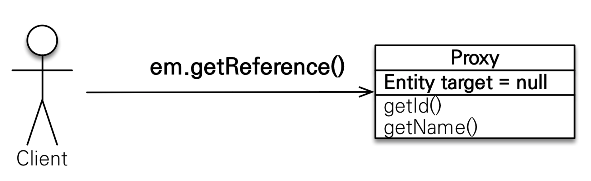
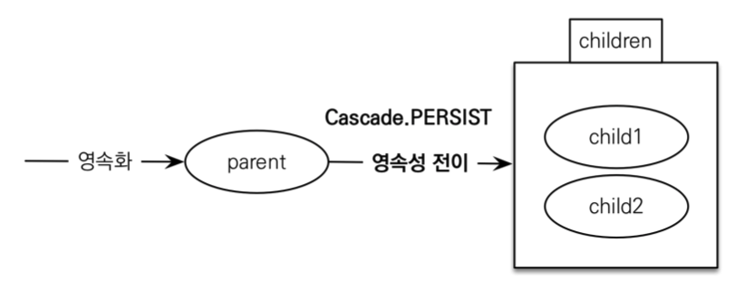

## 1 프록시

- 객체는 객체 그래프로 연관된 객체들을 탐색합니다.
- 그런데 객체가 데이터베이스에 저장되어 있으므로 연관된 객체를 자유롭게 탐색하기는 어렵습니다.
- JPA 구현체는 이를 해결하고자 `프록시`라는 기술을 사용합니다.
- `프록시`를 사용하면 연관된 객체를 처음부터 데이터베이스에서 조회하는 것이 아니라, 실제 사용하는 시점에 데이터베이스에서 조회할 수 있습니다.
	- 이를 `지연 로딩`이라 합니다.
- `지연 로딩` 기능을 사용하려면 실제 엔티티 객체 대신에 데이터베이스 조회를 지연할 수 있는 가짜 객체를 필요로 하는데 이를 `프록시 객체`라고 합니다.

### 1.1 프록시 기초

- 엔티티를 실제 사용하는 시점까지 데이터베이스 조회를 미루고 싶다면 `em.find()`대신  `em.getReference()`을 사용해야 한다.
- 이 메서드는 데이터베이스를 조회하지 않고 대신에 데이터베이스 접근을 위임한 프록시 객체를 반환합니다.



### 1.2 프록시 특징


- 프록시 객체는 원본 엔티티를 상속받음, 따라서 타입 체크시 주의해야 합니다.
	- `==` 비교 실패, 대신 `instance of` 사용
- 실제 클래스와 겉 모양이 같기 때문에 사용하는 입장에서는 진짜 객체인지 프록시 객체인지 구분하지 않고 사용하면 됩니다.
- 프록시 객체는 실제 객체의 참조(target)를 보관합니다.
- 프록시 객체를 호출하면 프록시 객체는 실제 객체의 메소드 호출합니다.
- 프록시 객체는 실제 사용될 때 데이터베이스를 조회해서 실제 엔티티 객체를 생성하는데 이것을 `프록시 객체의 초기화`라 합니다.
- 프록시 객체를 초기화 할 때, 프록시 객체가 실제 엔티티로 바뀌는 것은 아님, 초기화되면 프록시 객체를 통해서 실제 엔티티에 접근이 가능합니다.
- 영속성 컨텍스트에 찾는 엔티티가 이미 있으면 `em.getReference()`를 호출해도 실제 엔티티를 반환합니다.
- 영속성 컨텍스트의 도움을 받을 수 없는 준영속 상태일 때, 프록시를 초기화하면 문제가 발생합니다.

### 1.3 프록시 객체의 초기화

- 프록시 객체는 실제 사용될 때 데이터베이스를 조회해서 실제 엔티티 객체를 생성하는데 이것을 `프록시 객체의 초기화`라 합니다.

```java
Member member = em.getReference(Member.class, “id1”); 
member.getName();
```


프록시 객체 초기화 과정은 아래와 같습니다.

1. 프록시 객체에 `member.getName()`을 호출해서 실제 데이터를 조회합니다.
2. 프록시 객체는 실제 엔티티가 생성되어 있지 않으면 영속성 컨텍스트에 실제 엔티티를 생성하는 요청을 합니다. 이를 초기화라 합니다.
3. 영속성 컨텍스트는 데이터베이스를 조회해서 실제 엔티티 객체를 생성합니다.
4. 프록시 객체는 생성된 실제 엔티티 객체의 참조를 Member target 멤버변수에 보관합니다.
5. 프록시 객체는 실제 엔티티 객체의 getName()을 호출해서 결과를 반환합니다.

### 1.4 프록시 확인

- 프록시 인스턴스의 초기화 여부는 `PersistenceUnitUtil`을 사용해서 확인할 수 있습니다.
	- `PersistenceUnitUtil.isLoaded(Object entity)`
- 프록시 클래스 확인 방법
	- `entity.getClass().getName()`
	- 출력(..javasist.. or HibernateProxy...)
- 프록시 강제 초기화 방법
	- `org.hibernate.Hibernate.initialize(entity)`
	- JPA 표준은 강제 초기화 없습니다. 데이터를 조회해서 강제로 프록시를 초기화합니다.
	- 예를 들어, `member.getName()`을 호출하면 프록시 객체가 초기화됩니다.

## 2 즉시 로딩

- 즉시 로딩이란 엔티티를 조회할 때 연관된 엔티티도 조회합니다.
- 가급적 지연 로딩을 사용하는 것이 좋습니다.
- 즉시 로딩을 적용하면 예상하지 못한 SQL이 발생할 수 있습니다.
	- 즉시 로딩은 JPQL에서 N+1 문제를 일으킬 수 있습니다.
- @ManyToOne, @OneToOne은 기본이 즉시 로딩으로 설정됩니다.
	- 따라서 LAZY로 명시적으로 설정해야 지연 로딩이 됩니다.
- @OneToMany, @ManyToMany는 기본이 지연 로딩으로 설정됩니다.

### 2.1 예시

```java
@Entity
public class Member {
  @Id @GeneratedValue 
  private Long id;
  
  @Column(name = "USERNAME") 
  private String name;
  
  @ManyToOne(fetch = FetchType.EAGER) 
  @JoinColumn(name = "TEAM_ID")
  private Team team; ..
}
```

- 팀의 fetch 속성을 즉시 로딩으로 설정했습니다.
- 따라서 멤버를 조회하면 연관된 팀도 함께 조회합니다.
- 대부분의 JPA 구현체는 즉시 로딩을 최적화하기 위해 조인 쿼리를 사용해 쿼리 한번에 멤버와 팀을 가져옵니다.

```java
Member member = em.find(Member.class, "member1");
Team team = member.getTeam();
```

## 3 지연 로딩

- 연관된 엔티티를 항상 사용하는 것이 아니기 때문에 연관된 엔티티가 실제 사용될 때까지 데이터베이스 조회를 지연하는 방법은 `지연 로딩`이라 합니다.

```java
@Entity
public class Member {
  @Id @GeneratedValue 
  private Long id;
  
  @Column(name = "USERNAME") 
  private String name;
  
  @ManyToOne(fetch = FetchType.LAZY) 
  @JoinColumn(name = "TEAM_ID")
  private Team team; ..
}
```

- `Member member = em.find(Member.class, "member1")` 을 호출하면 회원을 조회하고 팀은 조회하지 않습니다.
- 대신 아래와 같이 team 멤버변수로 프록시 객체를 넣어줍니다.


### 3.1 지연 로딩 활용 팁

- 지연 로딩과 관련한 실무적 팁은 다음과 같습니다.
- 모든 연관관계에 지연 로딩을 사용해야 합니다.
- 실무에서 즉시 로딩을 사용하지 않는 것이 좋습니다.
- 연관된 엔티티가 필요하다면 JPQL fetch 조인이나, 엔티티 그래프 기능을 사용합니다.
- 즉시 로딩은 상상하지 못한 쿼리가 발생할 수 있습니다.

## 4 영속성 전이: CASCADE

- 특정 엔티티를 영속 상태로 만들 때 연관된 엔티티도 함께 영속 상태로 만들도 싶을 때 사용합니다.

### 4.1 영속성 전이: 저장



- 부모 엔티티에 `cascade = CascadeType.PERSIST`를 설정합니다.
	- 예, `@OneToMany(mappedBy="parent", cascade=CascadeType.PERSIST)`
- 부모 엔티티를 저장할 때 자식 엔티티도 함께 저장됩니다.

### 4.2 주의사항

- 영속성 전이는 연관관계를 매핑하는 것과 아무 관련이 없습니다.
- 엔티티를 영속화할 때 연관된 엔티티도 함께 영속화하는 편리함을 제공할 뿐입니다.
- 자식의 소유자(부모)가 하나일 때 사용합니다.

### 4.3 CASCADE의 종류

- ALL: 모두 적용
- PERSIST: 영속
- REMOVE: 삭제
- MERGE: 병합
- REFRESH: REFRESH
- DETACH: DETACH

## 5 고아 객체

- 고아 객체 제거란 부모 엔티티와 연관관계가 끊어진 자식 엔티티를 자동으로 삭제하는 기능입니다.
- 부모 엔티티의 컬렉션에서 자식 엔티티의 참조만 제거하면 자식 엔티티가 자동으로 삭제됩니다.

### 5.1 예시

```java
// orphanRemoval 활성화
@OneToMany(mappedBy = "parent", orphanRemoval = true)
private List<Child> Children = new ArrayList<>(); 

...

//자식 엔티티를 컬렉션에서 제거
//Delete SQL 자동 호출
Parent parent = em.find(Parent.class, id); 
parent.getChildren().remove(0);
```

### 5.2 주의사항

- 참조가 제거된 엔티티는 다른 곳에서 참조하지 않는 고아 객체로 보고 삭제하는 기능입니다.
- 참조하는 곳이 하나일 때 사용해야합니다.
	- 따라서 특정 엔티티가 개인 소유할 때 사용합니다.
- @OneToOne, @OneToMany만 사용할 수 있습니다.

:::info
개념적으로 부모를 제거하면 자식은 고아가 된다. 따라서 고아 객체 제거 기능을 활성화 하면, 부모를 제거할 때 자식도 함께 제거된다. 이것은 CascadeType.REMOVE처럼 동작한다.
:::

## 6. 부모가 자식의 생명주기를 관리하는 방법

### 6.1 개념

- 영속성 전이(CASCADE)와 고아 객체 제거(orphanRemoval)를 함께 사용하면 부모 엔티티가 자식 엔티티의 생명주기를 완전히 관리할 수 있습니다.
- 이는 부모-자식 관계에서 자식 엔티티가 부모 없이는 존재할 수 없는 강한 소유 관계를 표현할 때 사용됩니다.

### 6.2 설정 방법

```java
@Entity
public class Parent {
    @Id @GeneratedValue
    private Long id;
    
    @OneToMany(mappedBy = "parent", 
               cascade = CascadeType.ALL, 
               orphanRemoval = true)
    private List<Child> children = new ArrayList<>();
    
    // 편의 메서드
    public void addChild(Child child) {
        children.add(child);
        child.setParent(this);
    }
    
    public void removeChild(Child child) {
        children.remove(child);
        child.setParent(null);
    }
}
```

### 6.3 동작 원리

- **부모 저장 시:**
	- 부모를 `em.persist()`로 영속화하면 자식도 함께 영속화됩니다.
	- 별도로 자식을 `em.persist()`할 필요가 없습니다.
- **부모 삭제 시:**
	- 부모를 `em.remove()`로 제거하면 자식도 함께 제거됩니다.
- **자식 제거 시:**
	- 부모의 컬렉션에서 자식을 제거하면 자식 엔티티가 자동으로 삭제됩니다.
- 모든 작업이 부모에서 관리되므로, 자식 엔티티는 부모와의 관계를 통해서만 생명주기를 관리합니다.

### 6.4 사용 예시

```java
// 부모와 자식 생성
Parent parent = new Parent();
Child child1 = new Child();
Child child2 = new Child();

// 자식을 부모에 추가
parent.addChild(child1);
parent.addChild(child2);

// 부모만 저장하면 자식도 함께 저장됨
em.persist(parent);

// 자식 하나를 컬렉션에서 제거하면 DB에서도 삭제됨
parent.removeChild(child1);

// 부모를 삭제하면 모든 자식도 삭제됨
em.remove(parent);
```

### 6.5 적용 조건

- 이 패턴을 사용할 수 있는 조건은 다음과 같습니다
	- **단일 소유**: 자식 엔티티가 하나의 부모에게만 소속되어야 합니다.
	- **강한 결합**: 자식이 부모 없이는 의미가 없는 관계여야 합니다.

### 6.6 DDD Aggregate Root 구현

- 도메인 주도 설계(DDD)에서 Aggregate Root 개념을 구현할 때 이 패턴을 활용합니다.

```java
@Entity
public class Order { // Aggregate Root
    @Id @GeneratedValue
    private Long id;
    
    @OneToMany(mappedBy = "order", 
               cascade = CascadeType.ALL, 
               orphanRemoval = true)
    private List<OrderItem> orderItems = new ArrayList<>();
    
    // 도메인 로직을 통해서만 자식 엔티티를 조작
    public void addOrderItem(Product product, int quantity) {
        OrderItem orderItem = new OrderItem(product, quantity);
        orderItems.add(orderItem);
        orderItem.setOrder(this);
    }
}
```