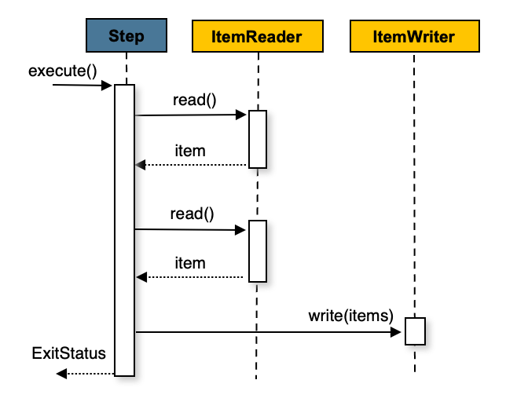
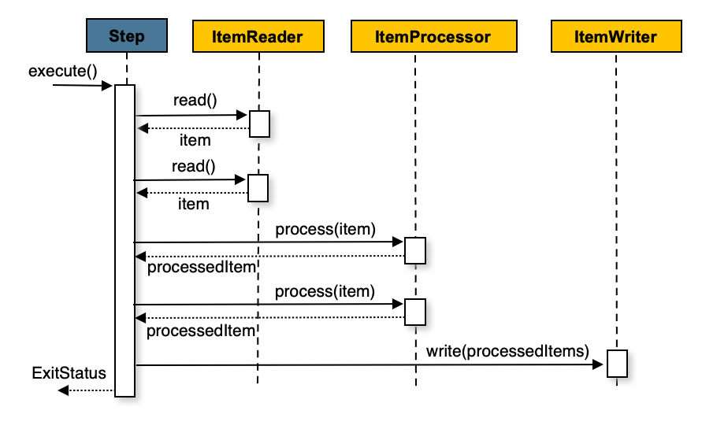

## 1. Chunk-orientedProcessing

- Spring Batch는 가장 일반적인 구현 방식으로 "청크 지향(chunk-oriented)" 처리 스타일을 사용합니다. 
- 청크 지향 처리란 데이터를 한 번에 하나씩 읽어서 '청크'를 생성하고, 이를 트랜잭션 경계 내에서 일괄 처리하는 방식을 의미합니다. 
- 읽은 아이템의 개수가 커밋 간격과 같아지면, 전체 청크가 ItemWriter에 의해 작성되고 이후 트랜잭션이 커밋됩니다.

## 2. Chunk-orientedProcessing의 동작 과정



- 청크 지향 처리의 기본 흐름은 위 이미지와 같습니다.
- 위 이미지를 코드로 표현하면 아래와 같습니다.

```java
List items = new Arraylist();
for(int i = 0; i < commitInterval; i++){
    Object item = itemReader.read();
    if (item != null) {
        items.add(item);
    }
}
itemWriter.write(items);
```

- 위 코드는 청크 지향 처리의 기본적인 흐름을 나타냅니다.
- `commitInterval`은 한 번에 처리할 아이템의 개수를 나타내며, 이 값에 도달하면 `ItemWriter`를 통해 일괄적으로 데이터를 저장합니다.



- 위 이미지처럼 ItemProcessor를 추가하여 아이템을 변환할 수도 있습니다.
- 위 이미지를 코드로 표현하면 아래와 같습니다.

```java
List items = new Arraylist();
for(int i = 0; i < commitInterval; i++){
    Object item = itemReader.read();
    if (item != null) {
        items.add(item);
    }
}

List processedItems = new Arraylist();
for(Object item: items){
    Object processedItem = itemProcessor.process(item);
    if (processedItem != null) {
        processedItems.add(processedItem);
    }
}

itemWriter.write(processedItems);
```

- 위 코드는 `ItemProcessor`를 사용하여 아이템을 변환하는 과정을 나타냅니다.
- commitInterval에 도달할 때 까지 아이템을 읽습니다.
- 읽은 아이템을 `ItemProcessor`를 통해 변환하고, 변환된 아이템을 `ItemWriter`를 통해 저장합니다.