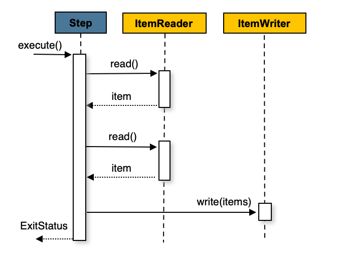
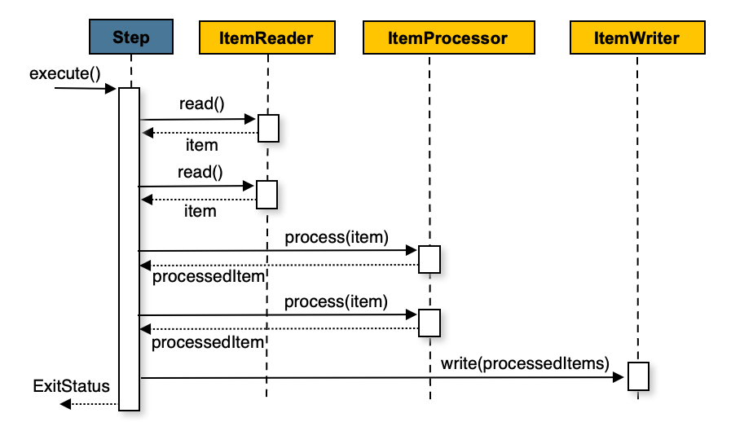

## 1. Chunk-oriented Processing

- Spring Batch는 가장 일반적인 구현 방식으로 "청크 지향(chunk-oriented)" 처리 스타일을 사용합니다. 
- 청크 지향 처리란 데이터를 한 번에 하나씩 읽어서 '청크'를 생성하고, 이를 트랜잭션 경계 내에서 일괄 처리하는 방식을 의미합니다. 
- 읽은 아이템의 개수가 커밋 간격과 같아지면, 전체 청크가 ItemWriter에 의해 작성되고 이후 트랜잭션이 커밋됩니다.
- Chunk-oriented Processing의 동작 과정은 아래에서 자세히 설명합니다.

## 2. Chunk-oriented Processing의 동작 과정



- 청크 지향 처리의 기본 흐름은 위 이미지와 같습니다.
- 위 이미지를 코드로 표현하면 아래와 같습니다.

```java
List items = new Arraylist();
for(int i = 0; i < commitInterval; i++){
    Object item = itemReader.read();
    if (item != null) {
        items.add(item);
    }
}
itemWriter.write(items);
```

- 위 코드는 청크 지향 처리의 기본적인 흐름을 나타냅니다.
- 먼저 `ItemReader`를 사용하여 아이템을 하나씩 읽습니다.
- `commitInterval`에 도달할 때까지 아이템을 읽고, 읽은 아이템을 리스트에 추가합니다.
- `commitInterval`에 도달하면 `ItemWriter`를 사용하여 일괄적으로 아이템을 저장합니다.
- 즉 `commitInterval`은 한 번에 처리할 아이템의 개수를 의미합니다.



- 위 이미지처럼 ItemProcessor를 추가하여 아이템을 변환할 수도 있습니다.
- 위 이미지를 코드로 표현하면 아래와 같습니다.

```java
List items = new Arraylist();
for(int i = 0; i < commitInterval; i++){
    Object item = itemReader.read();
    if (item != null) {
        items.add(item);
    }
}

List processedItems = new Arraylist();
for(Object item: items){
    Object processedItem = itemProcessor.process(item);
    if (processedItem != null) {
        processedItems.add(processedItem);
    }
}

itemWriter.write(processedItems);
```

- 위 코드는 `ItemProcessor`를 사용하여 아이템을 변환하는 과정을 나타냅니다.
- commitInterval에 도달할 때 까지 아이템을 읽습니다.
- 읽은 아이템을 `ItemProcessor`를 통해 변환하고, 변환된 아이템을 `ItemWriter`를 통해 저장합니다.
- 여기서 주의할 점은 아이템을 하나 읽고 바로 변환하는 것이 아니라, 먼저 아이템을 모두 읽은 후에 변환하는 것입니다.

## 3. Chunk-oriented Processing 설정

- 위에서 설명한 청크 지향 처리를 사용하기 위해서는 Spring Batch의 `Step`을 설정해야 합니다.
- 설정 과정은 아래 문서를 참고하여 진행할 수 있습니다.
	- [Commit Interval](../CommitInterval/CommitInterval.md)


## 참고

- https://docs.spring.io/spring-batch/reference/step/chunk-oriented-processing.html