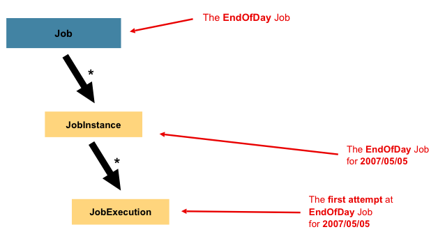

## 1 Domain Of Batch

- [레퍼런스](https://docs.spring.io/spring-batch/reference/domain.html)

## 2 Job



- [레퍼런스](https://docs.spring.io/spring-batch/reference/domain.html#job)
- Spring Batch에서 Job은 여러 Step을 묶어 하나의 배치 처리 단위로 관리하는 핵심 개념입니다.
- Job은 전체 배치 프로세스를 캡슐화하는 엔티티로, 중단이나 상호작용 없이 처음부터 끝까지 실행되는 작업을 의미합니다.
- 여러 Step이 모여 Job을 구성하며, Job은 Step 인스턴스들을 위한 컨테이너 역할을 합니다.
- 다른 Spring 프로젝트와 마찬가지로, Job은 XML 설정 파일이나 Java 기반 설정을 통해 정의할 수 있습니다.
- Job을 설정할 때 다음과 같은 요소를 지정합니다.
	- Job의 이름
	- Step 인스턴스들의 정의 및 실행 순서
	- 작업의 재시작 가능 여부

## 3 JobInstance

- [레퍼런스](https://docs.spring.io/spring-batch/reference/domain.html#jobinstance)
- JobInstance는 논리적인 작업 실행의 개념을 나타냅니다.
- 간단히 말해 JobInstance는 JobParameters를 가지고 실행된 Job을 의미합니다.
	- 식으로 나타내면 이와 같다. `JobInstance = Job + JobParameters`
  - 잡의 이름과 잡의 논리적 시행을 위해 제공되는 교유한 식별 파라미터의 모음이라고 할 수 있습니다.
- JobInstance는 한 번 성공적으로 완료되면 다시 실행시킬 수 없습니다.
- JobInstance는 잡 이름과 전달된 식별 파라미터로 식별되므로 , 동일한 식별 파라미터를 사용하는 잡은 한 번만 실행할 수 있습니다.

### 3.1 예시


- 하루가 끝날 때 한 번 실행되어야 하는 배치 작업을 생각해봅시다. 
- 위 다이어그램에서 EndOfDay Job과 같은 경우입니다. 
- EndOfDay 작업은 하나지만, 각각의 개별 Job 실행은 별도로 추적되어야 합니다. 
- 이 작업의 경우, 하루당 하나의 논리적 JobInstance가 있습니다. 
- 예를 들어, 1월 1일 실행, 1월 2일 실행 등이 있습니다. 
- 1월 1일 실행이 처음에 실패하고 다음 날 다시 실행된다면, 여전히 1월 1일 실행입니다. 
- 일반적으로 이는 처리하는 데이터와도 연관되어 있어, 1월 1일 실행은 1월 1일 데이터를 처리합니다. 
- 따라서 각 JobInstance는 여러 번의 실행(JobExecution)을 가질 수 있으며, 특정 시점에는 하나의 JobInstance(특정 Job과 식별 가능한 JobParameters에 해당하는)만 실행될 수 있습니다.
  - JobExecution은 이 장의 뒷부분에서 자세히 다룹니다

### 3.2 JobInstance의 역할

- JobInstance는 단순히 배치 작업의 실행을 구분하는 식별자 역할만 합니다. 
- 예를 들어 매일 실행되는 EndOfDay 배치의 경우, 1월 1일 실행과 1월 2일 실행은 서로 다른 JobInstance로 관리됩니다. 
- 하지만 JobInstance 자체는 어떤 데이터를 처리해야 하는지에 대한 정보는 전혀 갖고 있지 않습니다.
- 실제 데이터 선택과 로딩은 ItemReader가 담당합니다.
  - temReader는 비즈니스 요구사항에 따라 처리할 데이터를 결정합니다. 
  - EndOfDay 시나리오에서 데이터베이스 테이블에 effective_date나 schedule_date 같은 컬럼이 있다면, ItemReader는 이 컬럼을 기준으로 해당 날짜의 데이터만 선택적으로 읽어옵니다.
- JobInstance의 진짜 중요한 역할은 배치 실행 상태를 관리하는 것입니다. 
  - 동일한 JobInstance를 사용한다는 것은 이전 실행에서 저장된 ExecutionContext 정보를 활용한다는 의미입니다. 
  - 이를 통해 배치가 중간에 실패했을 때 처음부터 다시 시작하지 않고 중단된 지점부터 이어서 처리할 수 있습니다.
  - 반대로 새로운 JobInstance를 생성하면 완전히 새로운 실행으로 간주되어 처음부터 다시 시작됩니다. 
  - 기존 JobInstance를 재사용하면 이전 실행의 진행 상황과 상태 정보를 바탕으로 중단된 지점부터 재개됩니다.

## 4 JobParameters

- [레퍼런스](https://docs.spring.io/spring-batch/reference/domain.html#jobParameters)
- JobInstance를 다른 JobInstance와 구별시켜주는 것이 JobParameters입니다.
  - 같은 Job이라도 다른 JobParameters를 가지면 서로 다른 JobInstance가 됩니다.
- JobParameters는 배치 작업을 시작하는데 사용되는 파라미터들을 가지고 있는 객체입니다.
- JobParameters는 JobInstance의 식별목적이나 실행 중 참조 데이터로 사용될 수 있습니다.
- 모든 매개변수가 JobInstance의 식별자로 사용되지는 않습니다.
  - 기본적으로는 JobParameters는 JobInstance의 식별자로 사용되지만, 특정 JobParameters는 실행 중 참조 데이터로만 사용될 수 있습니다.

## 5 JobExecution

- [레퍼런스](https://docs.spring.io/spring-batch/reference/domain.html#jobexecution)
- JobInstance이 Job의 실행을 논리적으로 표현한 것이라면 JobExecution은 실제 실행을 의미합니다.
- JobExecution는 JobInstance의 한번의 시도를 나타냅니다.
- 잡을 실행할 때마다 매번 새로운 JobExecution을 얻게 됩니다.
- JobExecution은 실행의 모든 세부 정보를 저장합니다
- 실행이 성공해야만 JobInstance가 완료된 것으로 간주됩니다

### 5.1 JobInstance와의 관계

- JobInstance과 JobExecution은 일대다 관계입니다.
- JobExecution은 Job의 실행 결과로서 `FAILED` 또는 `COMPLETED` 상태를 가지고 있습니다.
- JobExecution이 `COMPLETED`면 JobInstance는 실행이 완료된 것으로 간주해 재실행하지 않습니다.
	- 즉 더이상 JobExecution이 생성되지 않습니다.
- JobExecution이 `FAILED`면 JobInstance는 실행이 완료되지 않은 것으로 간주해 재실행이 가능합니다.
	- 이 경우 JobExecution이 더 생성될 수 있습니다.
- JobExecution이 `COMPLETED`가 될 때가지 JobInstance가 여러번 시도될 수 있습니다.

### 5.2 JobExecution의 역할

- JobInstance의 역할이 실행들을 그룹화하여 올바른 재시작을 가능하게 하는 것이라면, JobExecution은 실행 중에 실제로 일어난 일에 대한 주요 저장 메커니즘입니다.
- 실행 중에 일어난 일에대한 저장은 아래 테이블의 속성들로 관리됩니다.

### 5.3 JobExecution Properties

- 이 속성들은 Spring Batch의 `JobExecution` 객체에서 배치 작업의 실행 상태와 결과를 추적하고 관리하는 데 사용됩니다.

| 속성 | 설명 |
|------|------|
| `Status` | 실행 상태를 나타내는 `BatchStatus` 객체입니다. 실행 중일 때는 `BatchStatus#STARTED`, 실패 시 `BatchStatus#FAILED`, 성공적으로 완료되면 `BatchStatus#COMPLETED` 상태가 됩니다. |
| `startTime` | 실행이 시작된 시점의 시스템 시간을 나타내는 `java.time.LocalDateTime`입니다. 작업이 아직 시작되지 않았다면 이 필드는 비어있습니다. |
| `endTime` | 성공/실패 여부와 관계없이 실행이 종료된 시점의 시스템 시간을 나타내는 `java.time.LocalDateTime`입니다. 작업이 아직 완료되지 않았다면 이 필드는 비어있습니다. |
| `exitStatus` | 실행 결과를 나타내는 `ExitStatus`입니다. 호출자에게 반환되는 종료 코드를 포함하고 있어 가장 중요한 속성입니다. 자세한 내용은 5장을 참조하세요. 작업이 아직 완료되지 않았다면 이 필드는 비어있습니다. |
| `createTime` | `JobExecution`이 처음 영구 저장된 시점의 시스템 시간을 나타내는 `java.time.LocalDateTime`입니다. 작업이 아직 시작되지 않았을 수도 있지만(따라서 시작 시간이 없을 수 있음), 프레임워크에서 job 레벨의 `ExecutionContext`를 관리하기 위해 필요한 `createTime`은 항상 존재합니다. |
| `lastUpdated` | `JobExecution`이 마지막으로 영구 저장된 시점을 나타내는 `java.time.LocalDateTime`입니다. 작업이 아직 시작되지 않았다면 이 필드는 비어있습니다. |
| `executionContext` | 실행 간에 유지되어야 하는 사용자 데이터를 담고 있는 "속성 컨테이너"입니다. |
| `failureExceptions` | `Job` 실행 중 발생한 예외들의 목록입니다. `Job` 실패 시 여러 예외가 발생할 경우 유용한 정보가 됩니다. |

## 5 Step

- [레퍼런스](https://docs.spring.io/spring-batch/reference/domain.html#step)
- 모든 Job은 하나 이상의 Step으로 구성됩니다.
- Step은 실제 배치 처리를 정의하고 제어하는 데 필요한 모든 정보를 포함합니다.
- step은 개발자가 원하는 만큼 단순할 수도 복잡할 수도 있습니다. 
  - 간단한 Step은 파일에서 데이터베이스로 데이터를 로드하는 작업으로, 거의 또는 전혀 코드가 필요하지 않을 수 있습니다
  - 더 복잡한 Step은 처리 과정의 일부로 적용되는 복잡한 비즈니스 규칙을 가질 수 있습니다
- Job과 마찬가지로 Step도 고유한 JobExecution과 연관되는 개별적인 StepExecution을 가지며, 이는 아래 `StepExecution`에서 자세히 설명합니다.
- [Step 참고](../Step/Step.md)

## 6 StepExecution

- [레퍼런스](https://docs.spring.io/spring-batch/reference/domain.html#stepexecution)
- StepExecution은 Step의 한번의 시도를 나타내는 객체입니다.
- 즉 Step이 실행될 때마다 새로운 StepExecution이 생성됩니다.
- JobExecution이 Job의 한번의 시도를 나타내는 객체라면, StepExecution은 Step의 한번의 시도를 나타내는 객체입니다.
- 하지만 이전 단계가 실패하여 해당 단계가 실행되지 못하는 경우에는 실행 정보가 저장되지 않습니다. 
  - StepExecution은 해당 Step이 실제로 시작될 때만 생성됩니다.
- Step 실행은 StepExecution 클래스의 객체로 표현됩니다. 
  - 각 실행은 해당하는 step과 JobExecution에 대한 참조를 포함하며, 커밋 및 롤백 횟수, 시작 및 종료 시간과 같은 트랜잭션 관련 데이터를 담고 있습니다. 
  - 또한 각 step 실행은 ExecutionContext를 포함하는데, 이는 개발자가 배치 실행 간에 유지해야 하는 모든 데이터(통계나 재시작에 필요한 상태 정보 등)를 담고 있습니다. 

### 6.1 JobExecution과의 관계

- JobExecution과 `StepExecution`의 관계는 일대다 관계입니다.
- 하나의 Job을 여러 Step으로 구성했을 때 `StepExecution`은 하나의 JobExecution을 부모로 가집니다.
- JobExecution의 모든 자식 `StepExecution`이 정상적으로 완료 되어어야 JobExecution이 정상적으로 완료됩니다.
- JobExecution의 자식 `StepExecution` 중 하나라도 실패하면 JobExecution은 실패합니다.

### 6.2 StepExecution의 속성들

| 속성 | 정의                                                                                                                                   |
|------|--------------------------------------------------------------------------------------------------------------------------------------|
| `Status` | 실행 상태를 나타내는 `BatchStatus` 객체입니다. 실행 중일 때는 `BatchStatus.STARTED`이고, 실패하면 `BatchStatus.FAILED`, 성공적으로 완료되면 `BatchStatus.COMPLETED`입니다. |
| `startTime` | 실행이 시작된 시점의 시스템 시간을 나타내는 `java.time.LocalDateTime`입니다. 스텝이 아직 시작되지 않았다면 이 필드는 비어있습니다.                                                |
| `endTime` | 성공 여부와 관계없이 실행이 완료된 시점의 시스템 시간을 나타내는 `java.time.LocalDateTime`입니다. 스텝이 아직 종료되지 않았다면 이 필드는 비어있습니다.                                    |
| `exitStatus` | 실행 결과를 나타내는 `ExitStatus`입니다. 호출자에게 반환되는 종료 코드를 포함하므로 가장 중요한 속성입니다. 자세한 내용은 5장을 참조하세요. 작업이 아직 종료되지 않았다면 이 필드는 비어있습니다.                 |
| `executionContext` | 실행 간에 유지되어야 하는 사용자 데이터를 담는 "속성 컨테이너"입니다.                                                                                             |
| `readCount` | 성공적으로 읽어온 아이템의 개수입니다.                                                                                                                |
| `writeCount` | 성공적으로 작성된 아이템의 개수입니다.                                                                                                                |
| `commitCount` | 이 실행에서 커밋된 트랜잭션의 개수입니다.                                                                                                              |
| `rollbackCount` | `Step`에 의해 제어되는 비즈니스 트랜잭션이 롤백된 횟수입니다.                                                                                                |
| `readSkipCount` | `read`가 실패하여 아이템이 건너뛰어진 횟수입니다.                                                                                                       |
| `processSkipCount` | `process`가 실패하여 아이템이 건너뛰어진 횟수입니다.                                                                                                    |
| `filterCount` | `ItemProcessor`에 의해 "필터링"된 아이템의 개수입니다.                                                                                               |
| `writeSkipCount` | `write`가 실패하여 아이템이 건너뛰어진 횟수입니다.                                                                                                      |

## 7 ExecutionContext

- [레퍼런스](https://docs.spring.io/spring-batch/reference/domain.html#executioncontext)
- ExecutionContext는 Spring Batch에서 배치 작업 실행 중에 상태나 데이터를 저장하고 공유하는 메커니즘입니다. 
- 마치 Map처럼 key-value 형태로 데이터를 저장할 수 있습니다.

### 7.1 주요 사용 목적: 재시작 지원

- 가장 중요한 용도는 배치 작업의 재시작을 지원하는 것입니다.
- 파일을 처리하다가 오류가 발생하거나 시스템이 중단되어도, 현재까지 처리한 위치를 저장해두어 재시작 시 그 지점부터 다시 시작할 수 있습니다.
- `executionContext.putLong(getKey(LINES_READ_COUNT), reader.getPosition());`
  - 위와 같이 `ExecutionContext`에 현재 읽은 줄 수를 저장할 수 있습니다.
  - 이 정보가 BATCH_STEP_EXECUTION_CONTEXT 테이블에 {piece.count=40321}로 저장됨
  - 재시작시에는 저장된 컨텍스트 정보를 읽어와서 해당 위치부터 다시 읽기 시작할 수 있습니다.

```java
if (executionContext.containsKey(getKey(LINES_READ_COUNT))) {
    log.debug("Initializing for restart. Restart data is: " + executionContext);

    long lineCount = executionContext.getLong(getKey(LINES_READ_COUNT));

    LineReader reader = getReader();

    Object record = "";
    while (reader.getPosition() < lineCount && record != null) {
        record = readLine();
    }
}
```

### 7.2 Job ExecutionContext와 Step ExecutionContext

#### 서로 다른 스코프와 생명주기

```java
ExecutionContext jobContext = jobExecution.getExecutionContext();

// Step ExecutionContext  
ExecutionContext stepContext = stepExecution.getExecutionContext();

// 이 둘은 완전히 다른 객체
System.out.println(jobContext == stepContext); // false
System.out.println(jobContext.equals(stepContext)); // false
```

- JobExecutionContext와 StepExecutionContext는 서로 다른 스코프와 생명주기를 가지고 있습니다.

#### 저장 시점의 차이

```java
@Component
public class MyProcessor implements ItemProcessor<String, String> {
    
    @Override
    public String process(String item) {
        // Step Context: 매 chunk 커밋마다 DB에 저장됨
        ExecutionContext stepContext = stepExecution.getExecutionContext();
        stepContext.putLong("processed.items", currentCount);
        
        // Job Context: Step이 완전히 끝날 때만 DB에 저장됨  
        ExecutionContext jobContext = jobExecution.getExecutionContext();
        jobContext.put("current.step", "processing-step");
        
        return item.toUpperCase();
    }
}
```

### 7.3 Spring Batch Meta-Data ERD

- StepExecution 스코프에서 사용 가능한 ExecutionContext는 BATCH_STEP_EXCUTION_CONTEXT에 저장된다.
- JobExecution 스코프에서 사용 가능한 ExecutionContext는 BATCH_JOB_EXCUTION_CONTEXT에 저장된다.

## 8 JobRepository

- [레퍼런스](https://docs.spring.io/spring-batch/reference/domain.html#jobrepository)
- 배치 잡 실행 중 오류가 발생하면 어떻게 복구할까?
	- 실행 중 오류가 발생했을 때 어떤 처리를 하고 있었는지 기록해야 다시 잡을 오류 발생 이전의 상태를 가지고 재시작될 수 있습니다.
	- 즉 잡의 상태를 저장하는 기능이 필요한데 스프링 배치는 잡의 상태를 JobRepository에 저장해 관리합니다.
- JobRepository는 다양한 배치 수행과 관련된 데이터(시작 시간, 종료 시간, 상태, 읽기 쓰기 횟수 등)뿐만 아니라 잡의 상태를 유지 관리합니다.
	- JobRepository는 오류 발생 복구를 위 한 잡의 상태 저장 뿐만아니라 모니터링 영역에서도 유용하게 사용됩니다.
- JobRepository는 일반적으로 관계형 데이터베이스를 사용하며 스프링 배치 내의 주요 컴포넌트가 공유합니다.
- [JobRepository 참고](../JobRepository/JobRepository.md)

## 9 JobLauncher

- [레퍼런스](https://docs.spring.io/spring-batch/reference/domain.html#joblauncher)
- `JobLauncher`는 `Job`을 실행하는 인터페이스입니다.
	- 실행할 `Job`과 `JobParameters`를 받아 Job을 실행하고 `JobExecution`을 반환합니다.
	- 잡을 실행하는 역할 이외에도 잡의 재실행 가능 여부 검증, 잡의 실행 방법(현재 스레드에서 실행할지 스레드 풀을 통해 실행할지 등), 파라미터 유효성 검증 등을 처리합니다.
- 스프링 부트를 사용하면 `JobLauncher` 빈이 자동 등록되며, 이를 통해 잡을 실행할 수 있습니다.
	- 스프링부트에서는 JobLauncherApplicationRunner가 자동으로 `JobLauncher`을 실행시켜줍니다.
	- 따라서 일반적으로 `JobLauncher`를 직접 다루진 않습니다.

### 9.1 JobLauncher Interface

```java
public interface JobLauncher {

public JobExecution run(Job job, JobParameters jobParameters)
            throws JobExecutionAlreadyRunningException, JobRestartException,
                   JobInstanceAlreadyCompleteException, JobParametersInvalidException;
}
```

## 10 ItemReader

- ItemReader는 Step에서 입력 데이터를 한 번에 하나씩 가져오는 작업을 추상화한 인터페이스입니다.
- ItemReader가 제공할 수 있는 아이템을 모두 소진했을 때는 null을 반환하여 이를 알립니다.
- Spring Batch는 다양한 데이터 소스(파일, 데이터베이스, 메시지 큐 등)에서 데이터를 읽을 수 있는 여러 ItemReader 구현체를 제공합니다.
- ItemReader의 주요 특징은 한 번에 하나의 아이템만 읽는다는 점입니다.
- 이는 메모리 효율성을 위한 설계로, 대용량 데이터를 처리할 때 전체 데이터를 메모리에 로드하지 않고 순차적으로 처리할 수 있게 합니다.

## 11 ItemWriter

- ItemWriter는 Step의 출력을 담당하는 추상화로, 한 번에 하나의 배치 또는 청크 단위로 아이템들을 처리합니다.
- 일반적으로 ItemWriter는 다음에 받을 입력에 대한 정보를 갖지 않으며, 현재 호출에서 전달받은 아이템에 대해서만 알고 있습니다.
- ItemReader가 하나씩 읽어오는 것과 달리, ItemWriter는 청크 단위로 여러 아이템을 한 번에 처리합니다.
- 이는 데이터베이스 배치 삽입이나 파일 일괄 쓰기 등의 성능 최적화를 위한 설계입니다.

## 12 ItemProcessor

- ItemProcessor는 아이템의 비즈니스 처리를 담당하는 추상화입니다.
- ItemReader가 하나의 아이템을 읽고, ItemWriter가 하나의 아이템을 쓰는 동안, ItemProcessor는 아이템을 변환하거나 다른 비즈니스 처리를 적용할 수 있는 접근점을 제공합니다.
- 아이템을 처리하는 동안 해당 아이템이 유효하지 않다고 판단되면 null을 반환하여 해당 아이템이 출력되지 않도록 할 수 있습니다.
- ItemProcessor는 선택적 구성 요소로, 단순히 데이터를 읽어서 쓰는 작업만 필요하다면 생략할 수 있습니다.

## 참고

- https://docs.spring.io/spring-batch/reference/domain.html#jobrepository