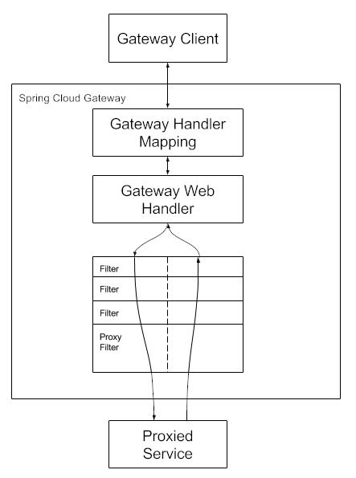

## 1. Spring Cloud Gateway 소개

- 마이크로서비스 아키텍처(MSA)가 발전하면서 API Gateway의 중요성이 더욱 커지고 있습니다.
- Spring Cloud Gateway는 스프링 진영에서 제공하는 강력한 API Gateway 솔루션으로, 비동기-논블로킹 방식을 지원하며 다양한 기능을 제공합니다.

### 1.1 Gateway가 필요한 이유

- MSA 환경에서는 수많은 서비스들이 존재하며, 이들 간의 통신을 효율적으로 관리해야 합니다.
- 서비스가 적고 트래픽이 적을 때는 클라이언트에서 서비스를 직접 호출해도 큰 부담이 없습니다.
- 하지만 스케일이 커지면 공통 로직을 모든 서버에 적용하고 배포하는 것이 큰 부담이 됩니다.
- Gateway는 다음과 같은 장점을 제공합니다
	- 라우팅 및 프로토콜 변환 담당
	- 마이크로서비스의 중개자 역할 수행
	- 보안 및 모니터링을 위한 단일 제어 지점 제공
	- 클라이언트와 독립적인 서비스 확장 가능

## 2. 핵심 컴포넌트

- Spring Cloud Gateway는 세 가지 핵심 컴포넌트로 구성됩니다:

### 2.1 Route (라우트)

- Gateway의 기본 구성 요소
- ID, 목적지 URI, Predicate 집합, Filter 집합으로 구성
- Predicate가 true일 때 해당 라우트가 매칭됨

### 2.2 Predicate (조건부)

- Java 8의 Function Predicate를 사용
- ServerWebExchange를 통해 HTTP 요청의 모든 요소 검사 가능
- Path, Method, Host 등 다양한 조건으로 요청 매칭

### 2.3 Filter (필터)

- GatewayFilter 인스턴스로 구현
- 요청과 응답을 변형할 수 있는 기능 제공
- 전처리(Pre)와 후처리(Post) 로직 모두 구현 가능

## 3. 주요 활용 사례

### 3.1 유저 Passport 시스템

- Passport 시스템은 마이크로서비스 환경에서 사용자 인증을 효율적으로 처리하기 위한 중앙화된 인증 메커니즘입니다. 
- 이 시스템은 다음과 같은 프로세스로 동작합니다:
  - 클라이언트 애플리케이션은 사용자의 고유 식별키(UUID, 토큰 등)를 포함하여 API를 호출합니다.
  - Gateway는 이 요청을 받아 인증 서버와 통신하여 Passport를 발급받습니다.
  - Passport에는 디바이스 식별자, OS 버전, 앱 버전과 같은 클라이언트 정보와 함께 사용자의 권한, 역할 등 상세 정보가 포함됩니다.
  - Gateway는 발급받은 Passport 정보를 직렬화하여 헤더에 포함시키고, 이를 대상 서비스로 전달합니다.
  - 각 마이크로서비스는 별도의 인증 서버 호출 없이 Passport에 포함된 정보를 활용하여 비즈니스 로직을 처리할 수 있습니다.
- 이러한 방식은 인증 로직을 중앙화하고, 각 서비스의 부하를 줄이며, 일관된 사용자 정보 관리를 가능하게 합니다.

### 3.2 종단간 암호화

- Gateway를 통한 종단간 암호화는 민감한 데이터를 안전하게 전송하기 위한 핵심 보안 기능입니다. 이 과정은 다음과 같이 진행됩니다:
- 클라이언트는 공유된 암호화 키나 공개키를 사용하여 요청 본문을 암호화합니다. 이때 AES, RSA 등 강력한 암호화 알고리즘이 사용됩니다.
- Gateway는 수신한 암호화된 데이터를 검증하고, 적절한 복호화 키를 사용하여 원본 데이터로 변환합니다.
- 복호화된 데이터는 내부 네트워크에서 마이크로서비스로 안전하게 전달됩니다.
  - 내부 마이크로서비스들은 복호화된 평문 데이터를 직접 처리할 수 있습니다.
  - 각 서비스는 암호화/복호화 로직을 구현할 필요가 없습니다.
- 필요한 경우, Gateway는 응답 데이터도 동일한 방식으로 암호화하여 클라이언트에게 전송할 수 있습니다.
- 이러한 암호화 체계는 중간자 공격(MITM)을 방지하고, 민감한 정보의 유출을 막는 데 효과적입니다. 
- 특히 금융 거래나 개인정보 처리와 같은 보안이 중요한 작업에서 필수적입니다.

### 3.3 Request sanitization

- 먼저 Gateway에서 클라이언트로부터 오는 요청을 sanitize할 수 있습니다.
- 잘못된 요청이나 악의적인 데이터를 필터링하여 안전한 형태로 변환합니다.
- Spring Cloud Gateway는 Filter Chain을 통해 요청을 조작할 수 있습니다.

### 3.4 Circuit Breaker 패턴

:::warning
마이크로서비스 환경에서는 하나의 서비스 장애가 전체 시스템에 영향을 줄 수 있습니다. Circuit Breaker를 통해 장애 전파를 방지하고 시스템 안정성을 확보할 수 있습니다.
:::

## 4. 모니터링과 운영

### 4.1 로깅

- 모든 요청/응답에 대한 Route ID 기록
- Method, URI, 상태 코드 등 상세 정보 저장
- Elasticsearch를 통한 로그 분석

### 4.2 메트릭

- Gateway 모니터링을 위한 주요 메트릭:
- 시스템 메트릭
	- CPU, Memory 사용량
	- 네트워크 트래픽 (RX/TX)
	- 시스템 리소스 현황
- 애플리케이션 메트릭
	- JVM 스레드 상태
	- GC 현황
	- Route별 처리 통계

## 5. Spring Cloud Gateway의 동작 방식

1. 클라이언트가 Gateway로 요청을 보냄
2. Gateway Handler Mapping이 요청을 분석
3. 매칭되는 라우트가 있다면 Gateway Web Handler로 전달
4. Filter Chain을 통해 요청 처리
	- Pre-filter 로직 실행
	- 프록시 요청 처리
	- Post-filter 로직 실행

:::tip
URI에 포트가 지정되지 않은 경우, HTTP는 80, HTTPS는 443이 기본값으로 사용됩니다.
:::

## 6. 마치며

- Spring Cloud Gateway는 MSA 환경에서 필수적인 컴포넌트입니다.
- 중앙 집중식 관리를 통해 트래픽 모니터링, 속도 제한, 보안 정책 적용 등을 효율적으로 수행할 수 있으며, 이는 대규모 마이크로서비스 클러스터의 안정적인 운영을 가능하게 합니다.