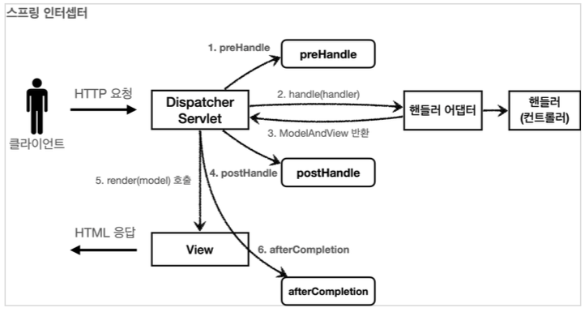

## 1 스프링 인터셉터

- 스프링 인터셉터도 서블릿 필터와 같이 **웹과 관련된 공통 관심 사항**을 효과적으로 해결할 수 있는 기술입나다.
- 서블릿 필터가 서블릿이 제공하는 기술이라면, 스프링 인터셉터는 스프링 MVC가 제공하는 기술입니다.
- 둘다 웹과 관련된 공통 관심 사항을 처리하지만, 적용되는 순서와 범위, 그리고 사용방법이 다릅니다.
- 스프링 인터셉터에도 URL 패턴을 적용할 수 있는데, **서블릿 URL 패턴과는 다르고, 매우 정밀하게 설정할 수 있습니다.**
- **스프링 MVC를 사용하고, 특별히 필터를 꼭 사용해야 하는 상황이 아니라면 인터셉터를 사용하는 것이 더 편리합니다.**

### 1.1 스프링 인터셉터 흐름

```
HTTP 요청 -> WAS -> 필터 -> 서블릿 -> 스프링 인터셉터 -> 컨트롤러
```

**스프링 인터셉터 체인**

```
HTTP 요청 -> WAS -> 필터 -> 서블릿 -> 인터셉터1 -> 인터셉터2 -> 컨트롤러
```

### 1.2 서블릿 필터와 비교

- 스프링 인터셉터도 서블릿 필터와 같이 웹과 관련된 공통 관심 사항을 효과적으로 해결할 수 있는 기술입니다.
- 서블릿 필터가 서블릿이 제공하는 기술이라면, 스프링 인터셉터는 스프링 MVC가 제공하는 기술입니다.
- 웹과 관련된 공통 관심 사항을 처리하지만, 적용되는 순서와 범위, 그리고 사용방법이 다릅니다.

#### 1.2.1 적용 순서

- 스프링 인터셉터는 디스패처 서블릿과 컨트롤러 사이에서 컨트롤러 호출 직전에 호출 됩니다.
- 스프링 인터셉터는 스프링 MVC가 제공하는 기능이기 때문에 결국 디스패처 서블릿 이후에 등장하게 됩니다.
  - 스프링 MVC의 시작점이 디스패처 서블릿이라고 생각해보면 이해가 될 것이다.
- 스프링 인터셉터에도 URL 패턴을 적용할 수 있는데, 서블릿 URL 패턴과는 다르고, 매우 정밀하게 설정할 수 있다.

#### 1.2.2 단계 세분화

- 서블릿 필터의 경우 단순하게 `doFilter()` 메서드 하나만 제공됩니다.
- 인터셉터는 컨트롤러 호출 전(preHandle), 호출 후(postHandle), 요청 완료 이후(afterCompletion)와 같이 단계적으로 잘 세분화하여 제공합니다.

## 2 스프링 인터셉터 인터페이스 : HandlerInterceptor

- 스프링의 인터셉터를 사용하려면 `HandlerInterceptor` 인터페이스를 구현하면 됩니다.
- `org.springframework.web.servlet` 패키지에 위치하고 있습니다.

### 2.1 HandlerInterceptor 인터페이스

```java
package org.springframework.web.servlet;

public interface HandlerInterceptor {
    default boolean preHandle(HttpServletRequest request, HttpServletResponse response, Object handler) throws Exception {
        return true;
    }

    default void postHandle(HttpServletRequest request, HttpServletResponse response, Object handler, @Nullable ModelAndView modelAndView) throws Exception {
    }

    default void afterCompletion(HttpServletRequest request, HttpServletResponse response, Object handler, @Nullable Exception ex) throws Exception {
    }
}
```

- `preHandle()`: 컨트롤러 호출 전에 호출됩니다.
- `postHandle()`: 컨트롤러 호출 후에 호출됩니다.
- `afterCompletion()`: 요청 처리 완료 후, 즉 뷰 렌더링 후에 호출됩니다.

### 2.2 스프링 인터셉터 호출 흐름



### 2.2 preHandle()

- 컨트롤러 호출 전에 호출됩니다. 더 정확히는 핸들러 어댑터 호출 전에 호출합니다.
- preHandle 의 응답값이 true이면 다음으로 진행하고, false이면 더는 진행하지 않습니다.
- false인 경우 나머지 인터셉터는 물론이고, 핸들러 어댑터도 호출하지 않습니다. 그림에서 1번에서 끝이 나버립니다.
- 핸들러 정보(`Object handler`)는 어떤 핸들러 매핑을 사용하는가에 따라 달라집니다.
- 스프링을 사용하면 일반적으로 `@Controller`, `@RequestMapping`을 활용한 핸들러 매핑을 사용하는데, 이 경우 핸들러 정보로 `HandlerMethod`가 넘어옵니다.

```java
@Override
public boolean preHandle(HttpServletRequest request, HttpServletResponse response, Object handler) throws Exception {
  if (handler instanceof HandlerMethod) {
    //호출할 컨트롤러 메서드의 모든 정보가 포함되어 있습니다.
    HandlerMethod hm = (HandlerMethod) handler; 
  }
}
```

## 2.3 postHandle()

- 컨트롤러 호출 후에 호출됩니다. 더 정확히는 핸들러 어댑터 호출 후에 호출됩니다.
- **컨트롤러에서 예외가 발생하면 postHandle 은 호출되지 않습니다.**

## 2.4 afterCompletion()

- 뷰가 렌더링 된 이후에 호출됩니다.
- **afterCompletion 은 항상 호출됩니다.**
- **예외가 발생해도 호출되기에 예외(ex)를 파라미터로 받아서 어떤 예외가 발생했는지 로그로 출력할 수 있습니다.**
- 예외와 무관하게 공통 처리를 하고 싶을 때 사용하면 됩니다.

## 3 인터셉터 사용하기

- 스프링 인터셉터를 이용해 사용자 인증을 체크하는 기능을 구현해보겠습니다.
- 인증이라는 것은 컨트롤러 호출 전에만 호출되면 됩니다.
  - 따라서 preHandle만 구현하면 됩니다.

### 3.1 인터셉터 구현

```java
@Slf4j
public class LoginCheckInterceptor implements HandlerInterceptor {
  @Override
  public boolean preHandle(HttpServletRequest request, HttpServletResponse response, Object handler) throws Exception {
    String requestURI = request.getRequestURI(); 
    log.info("인증 체크 인터셉터 실행 {}", requestURI);
    HttpSession session = request.getSession(false);
    
    if (session == null || session.getAttribute(SessionConst.LOGIN_MEMBER) == null) {
      log.info("미인증 사용자 요청");
      //로그인으로 redirect
      response.sendRedirect("/login?redirectURL=" + requestURI);
      // 더이상 진행하지 않고 응답을 주기위해 false 반환
      return false;
    }
    return true;
  }
} 
```

- `preHandle()` 메서드에서 인증 체크를 수행합니다.

### 3.2 인터셉터 설정

- 이제 구현된 인터셉터를 스프링에 등록해야 합니다.

```java
@Configuration
public class WebConfig implements WebMvcConfigurer {
  
  @Override
  public void addInterceptors(InterceptorRegistry registry) {
    registry.addInterceptor(new LoginCheckInterceptor())
      .order(2)
      .addPathPatterns("/**")
      .excludePathPatterns(
      "/", "/members/add", "/login", "/logout",
      "/css/**", "/*.ico", "/error"
    );
  }
}
```

- `WebMvcConfigurer`를 구현한 설정 클래스에 `addInterceptors()` 메서드를 오버라이드하여 인터셉터를 등록합니다.
- `order(2): `인터셉터의 우선순위를 설정합니다.
- `addPathPatterns("/**")`: 인터셉터를 적용할 URL 설정합니다.
- `excludePathPatterns()`: 예외 URL 패턴으로 인터셉터를 적용하지 않을 URL을 설정합니다.

## 4 스프링의 URL 경로

- 스프링이 제공하는 URL 경로는 서블릿 기술이 제공하는 URL 경로와 완전히 다릅니다. 
- 더욱 자세하고, 세밀하게 설정할 수 있습니다.

### 4.1 PathPattern

```
? 한 문자 일치
 - 경로(/) 안에서 0개 이상의 문자 일치
** 경로 끝까지 0개 이상의 경로(/) 일치
{spring} 경로(/)와 일치하고 spring이라는 변수로 캡처
{spring:[a-z]+} matches the regexp [a-z]+ as a path variable named "spring" {spring:[a-z]+} regexp [a-z]+ 와 일치하고, "spring" 경로 변수로 캡처
{*spring} 경로가 끝날 때 까지 0개 이상의 경로(/)와 일치하고 spring이라는 변수로 캡처

/pages/t?st.html 
— O /pages/test.html
- O /pages/tXst.html
- X /pages/toast.html

/resources/*.png 
— O all .png files in the resources directory

/resources/** 
— O all files underneath the /resources/ path
- O /resources/image.png 
- O /resources/css/spring.css

/resources/{*path} 
— matches all files underneath the /resources/ path and captures their relative path in a variable named "path";
- /resources/image.png
	- will match with "path" → "/image.png"
- /resources/css/spring.css 
	- will match with "path" → "/css/spring.css"

/resources/{filename:\\w+}.dat
-will match /resources/spring.dat and assign the value "spring" to the filename variable
```

## 참고

- [PathPattern 참고](https://docs.spring.io/spring-framework/docs/current/javadoc-api/org/springframework/web/util/pattern/PathPattern.html)

