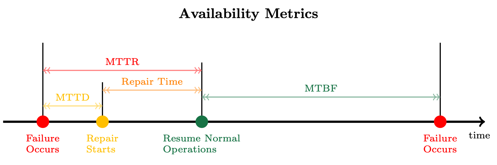
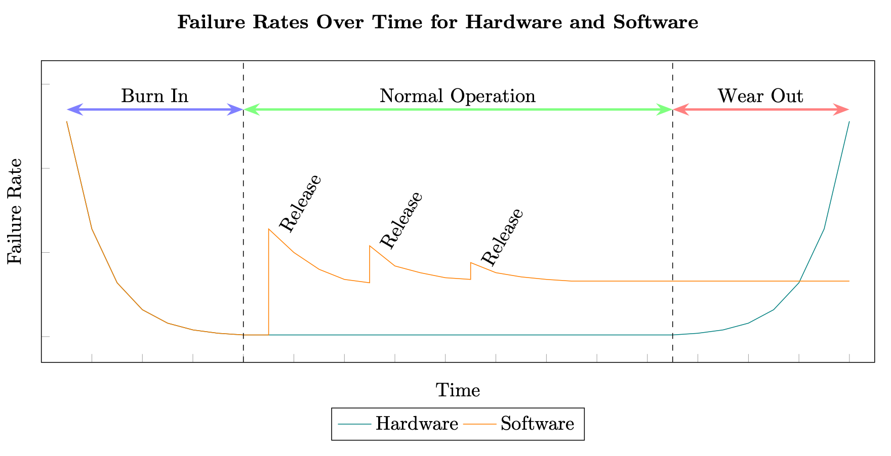

## 1. Availability 개요

- 가용성(Availability)은 시스템이 정상적으로 작동하며 사용 가능한 상태를 유지하는 능력을 의미합니다.
- 분산 시스템의 복원력(Resiliency)을 정량적으로 측정하는 가장 중요한 지표 중 하나입니다.
- 고가용성 워크로드를 구축한다는 것은 시스템이 장애 상황에서도 최소한의 중단 시간으로 서비스를 제공할 수 있도록 설계하는 것을 의미합니다.

### 1.1 가용성의 정의

- 가용성(A)은 워크로드가 사용 가능한 시간의 비율로 정의됩니다.
- 예상되는 "가동 시간(uptime)"과 전체 측정 시간(가동 시간 + 중단 시간) 사이의 비율입니다.

```
A = uptime / (uptime + downtime)

A: 가용성 (Availability)
uptime: 시스템이 정상적으로 작동하는 시간
downtime: 시스템이 중단된 시간
```

### 1.2 가용성의 중요성

- 사용자 경험에 직접적인 영향을 미칩니다.
- 비즈니스 손실을 최소화합니다.
- 시스템 신뢰성을 보장합니다.
- 경쟁 우위를 확보할 수 있습니다.

## 2. 가용성 측정 지표

가용성을 측정하고 개선하기 위해서는 다음 세 가지 핵심 지표를 이해해야 합니다.

### 2.1 MTBF (Mean Time Between Failure)

- MTBF는 평균 장애 간격을 의미합니다.
- 워크로드가 정상 작동을 시작한 시점부터 다음 장애가 발생할 때까지의 평균 시간입니다.
- MTBF가 길수록 시스템이 안정적이라는 의미입니다.

**예시**
```
시스템이 3개월 동안 3번 장애 발생:
- 1차 장애: 30일 후
- 2차 장애: 35일 후  
- 3차 장애: 25일 후

MTBF = (30 + 35 + 25) / 3 = 30일
```

### 2.2 MTTR (Mean Time To Repair/Recovery)

- MTTR은 평균 복구 시간을 의미합니다.
- 장애가 발생한 후 시스템이 정상 상태로 복구되기까지 걸리는 평균 시간입니다.
- 워크로드를 사용할 수 없는 기간을 나타냅니다.
- MTTR이 짧을수록 시스템의 가용성이 높습니다.
- **MTTR 구성 요소**
  - 장애 감지 시간
  - 문제 진단 시간
  - 수리/복구 실행 시간
  - 시스템 재시작 및 검증 시간

### 2.3 MTTD (Mean Time To Detection)

- MTTD는 평균 감지 시간을 의미합니다.
- 장애가 발생한 시점부터 복구 작업이 시작되기까지의 시간입니다.
- MTTR의 중요한 구성 요소입니다.
- MTTD가 짧을수록 빠르게 문제에 대응할 수 있습니다.

### 2.4 지표 간 관계



- MTTD는 MTTR의 일부입니다. 장애를 빨리 감지할수록(MTTD 감소) 전체 복구 시간(MTTR)도 줄어들어 가용성이 향상됩니다.

## 3. 가용성 계산

### 3.1 MTBF와 MTTR을 이용한 가용성 계산

- 가용성은 MTBF(가동 시간)와 MTTR(중단 시간)을 사용하여 표현할 수 있습니다.

```
A = MTBF / (MTBF + MTTR)
```

**예시 1**
```
MTBF = 720시간 (30일)
MTTR = 1시간

A = 720 / (720 + 1) = 0.9986 = 99.86%
```

**예시 2**
```
MTBF = 8760시간 (1년)
MTTR = 2시간

A = 8760 / (8760 + 2) = 0.9998 = 99.98%
```

### 3.2 장애 확률

- 워크로드가 "사용 불가능한" 상태일 확률은 장애 확률(F)로 표현됩니다.

```
F = 1 - A

F: 장애 확률 (Failure probability)
A: 가용성 (Availability)
```

**예시**
```
가용성이 99.9%인 시스템:
F = 1 - 0.999 = 0.001 = 0.1%

연간 중단 시간 = 365일 × 24시간 × 0.001 = 8.76시간
```

### 3.3 가용성 수준별 연간 다운타임

| 가용성 | 연간 다운타임 | 월간 다운타임 | 주간 다운타임 | 일일 다운타임 |
|--------|--------------|--------------|--------------|--------------|
| 90% (1 nine) | 36.53일 | 73시간 | 16.8시간 | 2.4시간 |
| 99% (2 nines) | 3.65일 | 7.31시간 | 1.68시간 | 14.40분 |
| 99.9% (3 nines) | 8.77시간 | 43.83분 | 10.08분 | 1.44분 |
| 99.95% (3.5 nines) | 4.38시간 | 21.92분 | 5.04분 | 43.20초 |
| 99.99% (4 nines) | 52.60분 | 4.38분 | 1.01분 | 8.64초 |
| 99.995% (4.5 nines) | 26.30분 | 2.19분 | 30.24초 | 4.32초 |
| 99.999% (5 nines) | 5.26분 | 26.30초 | 6.05초 | 0.86초 |

:::warning[높은 가용성의 비용]

가용성이 높아질수록 이를 달성하기 위한 비용과 복잡도가 기하급수적으로 증가합니다. 99.9%에서 99.99%로 향상하는 것보다 99.99%에서 99.999%로 향상하는 것이 훨씬 어렵습니다.

:::

## 4. 가용성 향상 전략

- 가용성 개선의 3가지 핵심 요소는 아래와 같습니다.

1. **더 긴 MTBF**: 장애가 덜 자주 발생하도록 함
2. **더 짧은 MTTD**: 장애를 빠르게 감지함
3. **더 짧은 MTTR**: 복구 시간을 단축함

이 세 가지 요소가 분산 시스템의 가용성을 개선하는 핵심입니다.

## 5. 분산 시스템의 가용성

### 5.1 분산 시스템의 구성 요소

- 분산 시스템은 소프트웨어 컴포넌트와 하드웨어 컴포넌트로 구성됩니다.
- 일부 소프트웨어 컴포넌트는 그 자체로 또 다른 분산 시스템일 수 있습니다.
- 하드웨어와 소프트웨어 컴포넌트 모두의 가용성이 워크로드의 전체 가용성에 영향을 미칩니다.

### 5.2 하드웨어와 소프트웨어의 장애 차이

#### 5.2.1 하드웨어 장애 특성

- **예측 가능한 수명**
  - 하드웨어는 사람의 노화처럼 예측 가능한 패턴으로 고장납니다. 이를 "욕조 곡선(Bathtub Curve)"이라고 부릅니다.
    - 초기: 불량품이 빠르게 고장 (유아 사망기)
    - 중기: 안정적으로 작동 (성인기)
    - 후기: 마모로 인한 고장 증가 (노년기)
  - 제조사는 테스트를 통해 하드웨어가 언제쯤 고장날지 미리 계산할 수 있습니다.
- **실제 수명 예시**
  - 일반 하드디스크(HDD)의 경우 연간 고장률이 약 1% 미만입니다.
  - 보통 3-5년 정도는 문제없이 사용할 수 있고, 더 오래 쓸 수도 있습니다.
  - 한번 만들어진 하드웨어는 사용 중에 물리적으로 바뀌지 않습니다.
- **수명이 있는 제품**
  - 하드웨어는 사용하다 보면 결국 수명이 다해서 교체해야 합니다.
  - 전구나 자동차 부품처럼 일정 기간 후에는 고장날 것을 예상하고 만들어집니다.

#### 5.2.2 소프트웨어 장애 특성



- 소프트웨어는 각 새로운 릴리스마다 도입되는 추가 결함으로 인해 계단식 곡선을 따릅니다.
- 분산 시스템의 소프트웨어는 일반적으로 하드웨어보다 기하급수적으로 높은 비율로 변경됩니다.
  - 예: 3-5년 동안 Amazon은 소프트웨어 시스템에 4억 5천만에서 7억 5천만 개 이상의 변경을 배포합니다.
- 소프트웨어는 이론적으로 마모 기간이 없으며 무기한 운영될 수 있습니다.
- 하드웨어에 사용되는 동일한 테스트 및 예측 모델을 소프트웨어에 적용할 수 없습니다.

:::warning[소프트웨어 가용성의 예측 어려움]

분산 시스템에서 "앞으로 얼마나 자주 고장날지(MTBF)", "고장나면 얼마나 빨리 복구할 수 있을지(MTTR)"를 미리 계산하는 것은 결국 예측이나 추정일 뿐입니다. 

이러한 수치는 보장이 아닙니다. 실제로는 예상보다 더 자주 고장날 수도 있고, 복구가 더 오래 걸릴 수도 있습니다.

:::

:::tip[Rule 2: 소프트웨어 가용성의 중요성]

워크로드 내 소프트웨어의 가용성은 워크로드 전체 가용성의 중요한 요소이며, 다른 컴포넌트와 동등한 수준의 관심을 받아야 합니다.

:::

### 5.3 분산 시스템의 버그 유형

분산 시스템에는 가용성에 영향을 미치는 두 가지 주요 버그 클래스가 있습니다.

#### 5.3.1 Bohrbug (보어버그)

- 반복 가능한 기능적 소프트웨어 이슈입니다.
- 동일한 입력이 주어지면 버그는 일관되게 동일한 잘못된 출력을 생성합니다.
- 결정론적인 보어 원자 모델처럼 견고하고 쉽게 감지됩니다.
- 이러한 유형의 버그는 워크로드가 프로덕션에 도달할 때까지는 드뭅니다.
- **Bohrbug의 특징**
  - 재현 가능
  - 디버깅 용이
  - 일관된 동작

#### 5.3.2 Heisenbug (하이젠버그)

- 일시적인 버그로, 특정하고 드문 조건에서만 발생합니다.
- 이러한 조건은 일반적으로 다음과 관련이 있습니다:
  - 하드웨어 (예: 일시적인 장치 오류, 레지스터 크기와 같은 하드웨어 구현 세부 사항)
  - 컴파일러 최적화 및 언어 구현
  - 제한 조건 (예: 일시적인 스토리지 부족)
  - 경쟁 조건 (예: 멀티스레드 작업에 세마포어를 사용하지 않음)
- **Heisenbug의 특징**
  - 프로덕션의 대부분의 버그를 차지합니다.
  - 찾기 어려움 
  - 관찰하거나 디버그하려고 하면 행동이 변하거나 사라지는 것처럼 보입니다.
  - 프로그램을 재시작하면 운영 환경이 약간 달라져서 Heisenbug를 발생시킨 조건이 제거되므로 실패한 작업이 성공할 가능성이 높습니다.

:::info[Heisenbug 대응 전략]

프로덕션의 대부분의 장애는 일시적이며, 작업을 재시도하면 다시 실패할 가능성이 낮습니다. 복원력을 갖추기 위해 분산 시스템은 Heisenbug에 대한 장애 허용성을 가져야 합니다.

:::

## 6. 의존성과 가용성

### 6.1 의존성의 종류

- 워크로드는 기능을 제공하기 위해 다양한 컴포넌트에 의존합니다. 
- 이러한 컴포넌트를 **의존성(Dependencies)**이라고 부릅니다.

#### 6.1.1 Hard Dependencies (하드 의존성)

- 워크로드가 기능을 수행하기 위해 반드시 필요한 것들입니다.
- 하드 의존성의 가용성은 워크로드의 가용성에 직접적인 영향을 미칩니다.
- 예시: 데이터베이스, 인증 서비스, 결제 게이트웨이

#### 6.1.2 Soft Dependencies (소프트 의존성)

- 사용할 수 없어도 일정 기간 동안 눈에 띄지 않거나 허용될 수 있는 것들입니다.
- 워크로드의 핵심 기능에는 영향을 주지 않습니다.
- 예시: 로깅 서비스, 분석 도구, 추천 엔진

### 6.2 이론적 최대 가용성 계산

워크로드의 이론적 최대 가용성을 계산하려면 모든 의존성의 가용성을 곱해야 합니다.

```
A = α₁ × α₂ × ... × αₙ

A: 워크로드의 가용성
αₙ: 각 하위 시스템의 가용성
```

**예시**
```
의존성 1: 99.9% 가용성
의존성 2: 99.9% 가용성
의존성 3: 99.9% 가용성

워크로드 가용성 = 0.999 × 0.999 × 0.999 = 0.997 = 99.7%
```

:::warning[의존성 증가의 영향]

순수하게 수학적으로 보면, 워크로드의 가용성은 그 의존성 중 어느 것보다 더 높은 가용성을 가질 수 없습니다. 1보다 작은 숫자들을 곱할수록 결과값은 작아집니다.

:::

### 6.3 실제 가용성과 이론적 가용성의 차이

- **이론 vs 현실**
  - 이론적으로는 99.99% 가용성을 가진 3개 의존성을 사용하면 워크로드의 가용성은 더 낮아져야 합니다.
  - 하지만 실제로는 99.99% 이상의 가용성을 달성할 수 있습니다.
- **가용성 수치는 추정치일 뿐**
   - SLA/SLO는 "최소한 이 정도는 보장한다"는 약속입니다.
   - 실제로는 명시된 수치보다 더 좋은 성능을 내는 경우가 많습니다.
- **내부적으로 더 높은 목표 설정**
   - 의존성 서비스들은 공개 SLA보다 높은 내부 목표를 가지고 있습니다.
   - 예: SLA는 99.9%지만, 실제 내부 목표는 99.95% (안전 마진)
- **SLA가 없는 의존성도 있음**
   - 예: 인터넷 라우팅 (어떤 ISP를 사용하는지 알 수 없음)
   - 이런 경우 정확한 가용성 계산이 불가능합니다.
- **결론**
  - 이론적 계산은 참고용일 뿐, 정확하지 않습니다.
  - 중요한 것은: **의존성을 줄일수록 전체 장애 가능성이 줄어든다**는 것입니다.


:::info[SLA와 SLO란?]

**SLA (Service Level Agreement) - 서비스 수준 약정**
- 서비스 제공자와 고객 간의 **계약서**입니다.
- "우리 서비스는 99.9% 가동을 보장합니다"처럼 명시된 약속입니다.
- 약속을 지키지 못하면 보상이나 환불 등의 페널티가 있습니다.
- 예: AWS EC2는 99.99% 가용성 SLA를 제공하며, 이를 못 지키면 크레딧을 제공합니다.

**SLO (Service Level Objective) - 서비스 수준 목표**
- SLA를 지키기 위해 내부적으로 설정하는 **목표치**입니다.
- 보통 SLA보다 더 높게 잡습니다 (안전 마진 확보).
- 예: SLA가 99.9%라면, SLO는 99.95%로 설정하여 여유를 둡니다.
- 고객에게 약속하지 않지만, 팀 내부에서 지키려고 노력하는 목표입니다.

**간단 비유**
- SLA: "손님에게 약속한 배달 시간 30분"
- SLO: "실제로 팀 내부 목표는 25분 (5분 여유)"

:::

### 6.4 의존성 관리 전략

:::tip[Rule 3: 의존성 감소]

의존성을 줄이는 것은 가용성에 긍정적인 영향을 미칠 수 있습니다. 1보다 작은 숫자를 곱하는 횟수가 적을수록 결과는 커집니다.

:::

:::tip[Rule 4: 의존성 선택]

일반적으로 워크로드의 가용성 목표와 같거나 그보다 높은 가용성 목표를 가진 의존성을 선택하세요.

:::

## 7. 중복성(Redundancy)과 가용성

### 7.1 중복 서브시스템을 통한 가용성 향상

- 워크로드가 여러 개의 독립적이고 중복된 서브시스템을 활용하면 단일 서브시스템을 사용하는 것보다 높은 이론적 가용성을 달성할 수 있습니다.
- 예를 들어, 두 개의 동일한 서브시스템으로 구성된 워크로드를 고려해봅시다.
  - 서브시스템 1 또는 서브시스템 2 중 하나만 작동하면 완전히 작동 가능합니다.
  - 전체 시스템이 다운되려면 두 서브시스템이 동시에 다운되어야 합니다.

### 7.2 중복성 가용성 계산

#### 7.2.1 기본 공식 (2개 서브시스템)

하나의 서브시스템 장애 확률이 `1 - α`라면, 두 개의 중복 서브시스템이 동시에 다운될 확률은 각 서브시스템의 장애 확률의 곱입니다.

```
F = (1 - α₁) × (1 - α₂)

가용성: A = 1 - F = 1 - (1 - α₁) × (1 - α₂)

두 서브시스템의 가용성이 동일한 경우(α₁ = α₂ = α):
A = 1 - (1 - α)²
```

**예시**
```
각 서브시스템의 가용성: 99%
장애 확률: 1 - 0.99 = 0.01 (1%)

두 서브시스템이 모두 실패할 확률:
F = 0.01 × 0.01 = 0.0001 (0.01%)

중복성을 사용한 가용성:
A = 1 - 0.0001 = 0.9999 = 99.99%
```

:::tip[중복성의 효과]

99% 가용성을 가진 서브시스템 두 개를 사용하면 99.99% 가용성을 달성할 수 있습니다. 단일 서브시스템보다 100배 더 높은 가용성입니다!

:::

#### 7.2.2 일반화된 공식 (n개 서브시스템, s개 스페어)

- 앞서 2개 서브시스템(1개 스페어)만 다뤘지만, 실제로는 훨씬 많은 스페어를 둘 수 있습니다. 
- 3개, 4개 또는 그 이상의 스페어를 두면 여러 서브시스템이 동시에 고장나도 시스템이 계속 작동할 수 있습니다.

**1. 기본 개념: 스페어가 늘어나면**

```
- 단일 스페어 (2개 중 1개 스페어)
    - 1개 고장 → OK
    - 2개 고장 → 시스템 멈춤
    - 확률: (1-α)²
- 복수 스페어 (3개 중 2개 스페어)
    - 1개 고장 → OK (스페어 2개 남음)
    - 2개 고장 → OK (스페어 1개 남음)
    - 3개 고장 → 시스템 멈춤
    - 확률: (1-α)³
```

:::info[핵심 원리]

**s개의 스페어가 있으면, s+1개가 동시에 고장나야 시스템이 멈춥니다.**

예: 스페어 2개 → 3개 동시 고장 시 멈춤
예: 스페어 5개 → 6개 동시 고장 시 멈춤

:::

**2. f (장애 모드 수)의 의미**

`f`는 "시스템이 멈추는 경우의 수"입니다. 조합론(Combinatorics)의 "n choose k" 개념을 사용합니다.

**단계별 이해**

```
질문: "전체 n개 중에서 k개를 선택하는 경우의 수는?"
답: C(n, k) = "n choose k"

우리 경우:
- 전체: n개 서브시스템
- 선택: s+1개 (고장나야 하는 개수)
- 답: f = C(n, s+1)
```

**구체적 예시 1: 작은 시스템**

```
상황: 3개 서브시스템, 1개 스페어
- 시스템이 멈추려면: 2개 동시 고장 (1+1=2)
- 3개 중 2개 선택 경우의 수:
  1) A, B 고장
  2) A, C 고장
  3) B, C 고장
- f = 3
```

**구체적 예시 2: 큰 시스템**

```
상황: 5개 서브시스템, 2개 스페어
- 시스템이 멈추려면: 3개 동시 고장 (2+1=3)
- 5개 중 3개 선택 경우의 수:
  1) A, B, C 고장    6) A, D, E 고장
  2) A, B, D 고장    7) B, C, D 고장
  3) A, B, E 고장    8) B, C, E 고장
  4) A, C, D 고장    9) B, D, E 고장
  5) A, C, E 고장   10) C, D, E 고장
- f = 10
```

**3. 조합 공식 (Binomial Theorem)**

"n choose k"를 계산하는 수학 공식입니다.

```
C(n, k) = n! / (k! × (n-k)!)

우리 경우 k = s+1 이므로:
f = C(n, s+1) = n! / ((s+1)! × (n-s-1)!)
```

**팩토리얼(!) 설명**
```
5! = 5 × 4 × 3 × 2 × 1 = 120
3! = 3 × 2 × 1 = 6
2! = 2 × 1 = 2

예: C(5,3) 계산
C(5,3) = 5! / (3! × 2!)
       = 120 / (6 × 2)
       = 120 / 12
       = 10
```

**4. 일반화된 가용성 공식**

```
A ≈ 1 - f × (1 - α)^(s+1)

여기서:
- f: 시스템이 멈추는 경우의 수
- (1-α): 각 서브시스템의 장애 확률
- (1-α)^(s+1): s+1개가 동시에 고장날 확률
- f × (1-α)^(s+1): 전체 장애 확률
- A: 가용성 = 1 - 장애 확률
```

**공식 유도 과정**

1. 각 서브시스템이 고장날 확률: `1-α`
2. s+1개가 동시에 고장날 확률: `(1-α)^(s+1)`
3. 그런 경우의 수가 f가지
4. 전체 장애 확률 = `f × (1-α)^(s+1)`
5. 가용성 = `1 - 전체 장애 확률`

**5. 상세한 계산 예시**

**시나리오: 5개 서브시스템, 각 99.5% 가용성, 2개 스페어**

```
단계 1: f 계산
f = C(5, 3) 
  = 5! / (3! × 2!)
  = (5×4×3×2×1) / ((3×2×1) × (2×1))
  = 120 / 12
  = 10

단계 2: 각 서브시스템 장애 확률
1 - α = 1 - 0.995 = 0.005 (0.5%)

단계 3: 3개 동시 고장 확률
(1 - α)³ = (0.005)³ = 0.000000125

단계 4: 전체 장애 확률
F = f × (1-α)³
  = 10 × 0.000000125
  = 0.00000125

단계 5: 가용성
A = 1 - 0.00000125
  = 0.99999875
  = 99.99988%
  
연간 다운타임 = 365일 × 24시간 × 60분 × 60초 × 0.00000125
             ≈ 3.94초
```

**예시: 99.5% 가용성 서브시스템**

```
1개 서브시스템 (스페어 없음):
A = 99.5%

2개 스페어 (총 3개):
A ≈ 1 - (1) × (1 - 0.995)³
A ≈ 1 - 0.000000125
A ≈ 99.9999875% (연간 약 3.94초 다운타임)

10개 스페어 (총 11개):
A ≈ 1 - (1) × (1 - 0.995)¹¹
A ≈ 25.5 nines (연간 다운타임 ≈ 0ms, 사실상 0)
```

### 7.3 스페어링의 비용 효율성

:::warning[수익 체감의 법칙]

스페어링은 최적화 문제입니다. 스페어가 너무 적으면 워크로드가 원하는 것보다 자주 실패하고, 스페어가 너무 많으면 워크로드 운영 비용이 너무 높아집니다.

:::

#### 7.3.1 비용 대비 가용성 분석

- 위 예시에서 2개 스페어와 10개 스페어를 비교하면
- **비용**: 5배 증가 (3개 → 11개)
- **다운타임 감소**: 연간 약 4초 감소
- **비용 대비 효과**: 매우 낮음

#### 7.3.2 최적 스페어 수

- 서브시스템이 최소 99% 가용성을 가질 때, 3개 스페어를 넘어서면 연간 다운타임이 초 단위로 줄어듭니다.
- 3개 스페어 이후부터는 수익 체감 구간에 도달합니다.
- "더 많이 추가"하고 싶은 충동이 있을 수 있지만, 실제로 비용 대비 효과는 매우 빠르게 사라집니다.
- 대부분의 워크로드에서 3개 이상의 스페어를 사용해도 눈에 띄는 실질적인 이득이 없습니다.

:::tip[Rule 5: 스페어를 사용한 가용성 향상]

워크로드의 의존성 가용성을 높이기 위해 스페어링을 사용하세요.

:::

:::tip[Rule 6: 비용 효율적인 스페어링]

스페어링에는 비용 효율성의 상한선이 있습니다. 필요한 가용성을 달성하는 데 필요한 최소한의 스페어를 활용하세요.

:::

### 7.4 장애 격리 경계와 스페어링

#### 7.4.1 장애 단위(Unit of Failure) 고려

스페어의 올바른 수를 선택할 때 장애 단위를 고려해야 합니다.

**예시: 단일 AZ 배포**
```
요구사항: 피크 용량 처리를 위해 10개의 EC2 인스턴스 필요
배포: 단일 AZ에 10개 인스턴스

문제점:
- AZ는 장애 격리 경계로 설계됨
- 장애 단위는 단일 EC2 인스턴스가 아니라 전체 AZ
- AZ 전체가 함께 실패할 수 있음
```

**해결책 1: 2개 AZ 사용**
```
배포: 2개 AZ × 10개 인스턴스 = 총 20개 인스턴스
- 하나의 AZ 장애 시에도 10개 인스턴스로 서비스 가능
- 실제로는 10개 스페어 인스턴스처럼 보이지만, 1개 스페어 AZ임
- Static Stability 패턴 적용
```

**해결책 2: 3개 AZ 사용 (더 비용 효율적)**
```
배포: 3개 AZ × 5개 인스턴스 = 총 15개 인스턴스
- 하나의 AZ 장애 시에도 10개 인스턴스로 서비스 가능
- 2개 AZ, 20개 인스턴스보다 비용 효율적
- 1개 스페어 AZ로 수익 체감 지점을 넘지 않음
```

### 7.5 스페어링의 추가 고려사항

#### 7.5.1 복잡도 증가

- 각 추가 스페어는 원래 모듈과 동일한 비용이 들어 최소한 선형적으로 비용이 증가합니다.
- 스페어를 사용할 수 있는 워크로드를 구축하면 복잡도가 증가합니다:
  - 의존성 장애를 식별하는 방법
  - 정상적인 리소스로 작업을 이동하는 방법
  - 워크로드의 전체 용량 관리

## 8. 결론

- 가용성은 시스템의 복원력을 정량적으로 측정하는 핵심 지표입니다.
- MTBF, MTTD, MTTR 세 가지 요소를 개선하여 가용성을 향상시킬 수 있습니다.
- 분산 시스템에서 하드웨어와 소프트웨어는 매우 다른 장애 특성을 가지고 있습니다.
  - 소프트웨어 가용성은 하드웨어만큼 중요하며 동등한 관심을 받아야 합니다.
- Bohrbug와 Heisenbug를 이해하고 특히 Heisenbug에 대한 장애 허용성을 갖춰야 합니다.
- 의존성을 줄이고 신중하게 선택하는 것이 가용성 향상에 중요합니다.
- 중복성(Redundancy)과 스페어링(Sparing)을 통해 가용성을 크게 향상시킬 수 있지만, 비용 효율성의 상한선이 있습니다.
- 장애 격리 경계(인스턴스, 셀, AZ, 리전)를 고려한 스페어링 전략이 필요합니다.
- 단순히 높은 가용성을 목표로 하는 것이 아니라, 비즈니스 요구사항에 맞는 적절한 수준의 가용성을 정의하고 달성하는 것이 중요합니다.

## 9. 핵심 규칙 요약

:::tip[Rule 1: 가용성 개선의 3가지 요소]

더 긴 MTBF(장애 빈도 감소), 더 짧은 MTTD(빠른 장애 감지), 더 짧은 MTTR(빠른 복구)이 분산 시스템의 가용성을 개선하는 핵심 요소입니다.

:::

:::tip[Rule 2: 소프트웨어 가용성의 중요성]

워크로드 내 소프트웨어의 가용성은 워크로드 전체 가용성의 중요한 요소이며, 다른 컴포넌트와 동등한 수준의 관심을 받아야 합니다.

:::

:::tip[Rule 3: 의존성 감소]

의존성을 줄이는 것은 가용성에 긍정적인 영향을 미칠 수 있습니다.

:::

:::tip[Rule 4: 의존성 선택]

일반적으로 워크로드의 가용성 목표와 같거나 그보다 높은 가용성 목표를 가진 의존성을 선택하세요.

:::

:::tip[Rule 5: 스페어를 사용한 가용성 향상]

워크로드의 의존성 가용성을 높이기 위해 스페어링을 사용하세요.

:::

:::tip[Rule 6: 비용 효율적인 스페어링]

스페어링에는 비용 효율성의 상한선이 있습니다. 필요한 가용성을 달성하는 데 필요한 최소한의 스페어를 활용하세요.

:::

## 참고 자료

- [AWS Well-Architected Framework - Reliability Pillar](https://docs.aws.amazon.com/wellarchitected/latest/reliability-pillar/welcome.html)
- [Understanding Availability - AWS Whitepaper](https://docs.aws.amazon.com/whitepapers/latest/availability-and-beyond-improving-resilience/understanding-availability.html)
- [Distributed System Availability - AWS Whitepaper](https://docs.aws.amazon.com/whitepapers/latest/availability-and-beyond-improving-resilience/distributed-system-availability.html)
- [Availability with Dependencies - AWS Whitepaper](https://docs.aws.amazon.com/whitepapers/latest/availability-and-beyond-improving-resilience/availability-with-dependencies.html)
- [Availability with Redundancy - AWS Whitepaper](https://docs.aws.amazon.com/whitepapers/latest/availability-and-beyond-improving-resilience/availability-with-redundancy.html)
- [Google SRE Book - Chapter 3: Embracing Risk](https://sre.google/sre-book/embracing-risk/)
- [Site Reliability Engineering: How Google Runs Production Systems](https://sre.google/books/)
- [Backblaze Hard Drive Stats](https://www.backblaze.com/blog/backblaze-drive-stats-for-2020/)
- [Amazon Builders' Library – Automating safe, hands-off deployments](https://aws.amazon.com/builders-library/automating-safe-hands-off-deployments/)
