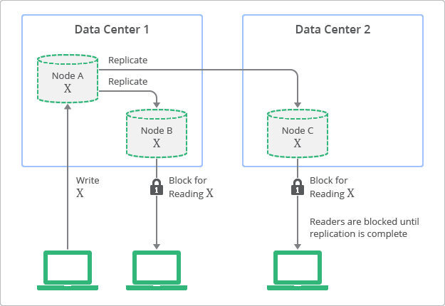

## 1. Consistency 개요

- 일관성이란 분산 시스템 설계에서 여러 노드에 데이터가 복제되고 분산되어 있더라도 시스템 내 모든 노드가 항상 동일한 상태나 데이터를 참조하도록 하는 개념입니다.
- 일관성(Consistency)은 분산 시스템에서 데이터의 정확성과 신뢰성을 보장하기 위한 핵심 개념입니다.
- 분산 환경에서는 여러 노드에 데이터가 복제되어 저장되므로, 모든 노드가 동일한 데이터를 보여주는 것이 중요합니다.
- 일관성 모델은 시스템이 데이터 업데이트를 처리하고 읽기 작업에 어떻게 반영하는지를 정의합니다.
- 일관성과 성능, 가용성 사이에는 트레이드오프 관계가 존재하며, 애플리케이션의 요구사항에 따라 적절한 일관성 수준을 선택해야 합니다.

### 1.1 일관성 유형

- 분산 시스템에서 주로 사용하는 일관성 유형은 다음과 같습니다.
- Strong Consistency: 모든 읽기 작업이 가장 최근의 쓰기 작업 결과를 반환하는 것을 보장합니다.
- Eventual Consistency: 항목이 새롭게 업데이트되지 않는다는 전제하에, 모든 읽기 작업이 최종적으로는 마지막으로 업데이트된 값을 반환한다는 것을 보장합니다.
- 각각의 유형에 대해서는 아래에서 자세히 설명합니다.

## 2. Strong Consistency

- Strong Consistency(강한 일관성)는 모든 읽기 작업이 가장 최근의 쓰기 작업 결과를 반환하는 것을 보장합니다.
- 업데이트가 완료되면 즉시 모든 클라이언트가 변경된 데이터를 조회할 수 있습니다.
- 기존 관계형 데이터베이스(RDBMS)가 기본적으로 제공하는 일관성 모델입니다.

### 2.1 특징

- **즉각적 일관성**: 쓰기 작업이 완료되면 모든 읽기 작업에서 즉시 반영됩니다.
- **데이터 정확성**: 항상 최신 데이터를 읽을 수 있어 데이터의 정확성이 보장됩니다.
- **동기화 오버헤드**: 모든 노드에 데이터를 동기화하는 동안 작업이 차단될 수 있습니다.
- **성능 트레이드오프**: 일관성을 보장하기 위해 확장성과 성능을 일부 희생합니다.

### 2.2 동작 방식



- 복제본이 항상 상위 노드와 일치하는 값을 가지지만, 업데이트가 완료되기 전까지 이 값에 액세스할 수 없습니다.
- 업데이트 또는 복제 프로세스 도중에는 데이터를 잠금 설정하여 다른 프로세스에서 동일한 데이터를 업데이트하지 않도록 합니다.
- 모든 복제본에 데이터가 동기화된 후에야 클라이언트에게 성공 응답을 반환합니다.

### 2.3 장단점

- 강한 일관성은 모든 노드가 동일한 순서에 따라 데이터 업데이트를 보장하므로, 개발자 입장에서 시스템이 예측 가능하고 직관적인 방식으로 동작합니다.
- 하지만 이러한 강한 일관성을 유지하려면 각 노드가 데이터 업데이트 순서에 동의할 때까지 기다려야 하기에 처리 속도가 느리거나 시스템 가용성이 떨어지는 단점이 있습니다.

### 2.4 사용 사례

- 강한 일관성은 민감한 데이터를 다루는 서비스에서 주로 사용됩니다.
- **금융 거래 시스템**: 계좌 잔액, 결제 정보 등 정확성이 중요한 경우
- **재고 관리 시스템**: 실시간 재고 수량 관리
- **예약 시스템**: 항공권, 호텔 예약 등 중복 예약을 방지해야 하는 경우
- **게임 플레이어 포인트**: 한 세션 동안 획득한 포인트 정보

## 3. Eventual Consistency

- Eventual Consistency(최종 일관성)는 항목이 새롭게 업데이트되지 않는다는 전제하에, 모든 읽기 작업이 최종적으로는 마지막으로 업데이트된 값을 반환한다는 것을 보장합니다.
- 쓰기 작업 직후에는 일시적으로 오래된 데이터를 읽을 수 있지만, 시간이 지나면 모든 노드가 동일한 데이터를 갖게 됩니다.
- 시스템의 가용성과 성능을 높이는 대신, 일시적인 데이터 불일치를 허용합니다.

### 3.1 특징

- **높은 가용성**: 쓰기 작업이 모든 노드에 즉시 전파되지 않아도 되므로 시스템 가용성이 높습니다.
- **뛰어난 확장성**: 노드 간 동기화 지연을 허용하여 수평적 확장이 용이합니다.
- **일시적 불일치**: 짧은 시간 동안 다른 노드에서 다른 데이터를 읽을 수 있습니다.
  - 일시적 데이터 불일치는 주로 네트워크 지연, 메시지 전달 속도, 레플리카 동기화 같은 요소로 인해 발생합니다.
- **비동기 복제**: 백그라운드에서 데이터를 비동기적으로 복제합니다.

### 3.2 동작 방식


- 복제본을 읽는 것은 언제든 가능하지만, 일부 복제본은 특정 시점에 상위 노드에 쓰여진 값과 일치하지 않을 수 있습니다.
- 상위 노드(노드 A)에 데이터가 쓰여진 후, 복제본(노드 B, C)으로 비동기적으로 전파됩니다.
- 모든 복제본이 최종적으로는 동일한 값을 갖게 되지만, 그 과정에서 시간 차이가 발생합니다.

### 3.3 최종 일관성 문제

- 최종 일관성의 문제는 충돌 해결, 데이터 복제, 가십 프로토콜 같은 기법으로 해결할 수 있습니다.
- 예를 들어 서로 다른 노드에서 동일한 데이터를 업데이트하려고 할 때, 충돌이 발생할 수 있습니다.
  - 시스템은 충돌 해결 전략을 적용하여 차이를 조정하고 데이터를 일관된 상태에 도달하도록 합니다.
- 데이터 복제 전략은 데이터를 여러 노드에 복사하여 유지하는 방식입니다.
  - 하나의 노드에서 업데이트되면 그 변경 사항이 다른 레플리카에게도 비동기적으로 전파됩니다.
  - 이것으로 시간이 지나면 모든 레플리카가 동일한 데이터를 갖게 됩니다.
- 마지막으로 가십 프로토콜은 시스템 전체에 업데이트가 서서히 전파될 수 있도록 하는 방식입니다.

### 3.4 사용 사례

- **소셜 미디어**: 게시물의 좋아요 수, 댓글 수 등
- **친구 목록**: 특정 시간에 온라인 상태인 사용자 확인
- **DNS 시스템**: 인터넷 도메인 이름 조회
- **캐싱 시스템**: CDN, 분산 캐시
- **뉴스 피드**: 최신 게시물 목록 (일시적인 지연 허용 가능)

### 3.5 DNS 시스템 예시

- DNS(도메인 이름 시스템)는 Eventual Consistency 모델이 사용된 대표적인 성공 사례입니다.
- DNS 서버가 항상 최신의 값을 반영하는 것은 아니며, 이러한 값들은 인터넷상의 수많은 디렉터리에서 캐싱되고 복제됩니다.
- 수정된 값을 모든 DNS 클라이언트와 서버에 복제하려면 어느 정도의 시간이 소요됩니다.
- 하지만 DNS 시스템은 인터넷의 근간을 이루는 요소로 자리잡은 매우 성공적인 시스템입니다.
- DNS는 가용성이 매우 높으며 엄청난 확장성이 증명되었고, 인터넷 전체에서 수천만 대 기기의 이름 조회를 가능하게 하고 있습니다.

## 4. 일관성 수준 선택 가이드

### 4.1 Strong Consistency가 필요한 경우

- 데이터의 정확성이 비즈니스에 직접적인 영향을 미치는 경우
- 금융 거래, 재고 관리 등 실시간 정확성이 중요한 경우
- 항목 수가 적고 맥락이 제한된 사용 사례
  - 사용자가 맥락을 통해 포함하거나 제외할 항목을 알 수 있으므로 사용자 경험이 영향을 받습니다.
- 법적 또는 규정 준수가 필요한 경우

### 4.2 Eventual Consistency가 적합한 경우

- 매우 많은 항목이 포함된 사용 사례
  - 쿼리가 대량의 결과를 반환하는 경우, 특정 항목을 포함하거나 제외해도 사용자 경험에 영향을 미치지 않을 가능성이 높습니다.
- 일시적인 데이터 불일치를 허용할 수 있는 경우
- 높은 확장성과 가용성이 중요한 경우
- 읽기 작업이 쓰기 작업보다 훨씬 많은 경우
- 소셜 미디어, 분석 데이터 등 근사치로 충분한 경우

### 4.3 하이브리드 접근

- 비관계형 데이터베이스는 개발자가 각 애플리케이션에서 Strong Consistency와 Eventual Consistency 사이에서 최적의 균형을 맞출 수 있도록 해줍니다.
- 동일한 시스템 내에서도 데이터의 종류와 사용 패턴에 따라 다른 일관성 수준을 적용할 수 있습니다.
  - 핵심 비즈니스 데이터: Strong Consistency
  - 통계 및 집계 데이터: Eventual Consistency
- 이를 통해 두 일관성 모델의 장점을 결합하여 활용할 수 있습니다.

## 5. Strong Consistency 보장 전략

분산 시스템이나 NoSQL 데이터베이스에서도 특정 범위 내에서 Strong Consistency를 보장할 수 있는 다양한 전략이 있습니다.

### 5.1 Entity Group (항목 그룹)

- Entity Group은 서로 관련된 데이터를 논리적으로 그룹화하는 방법입니다.
- 동일한 그룹 내의 항목들은 같은 파티션에 저장되어 Strong Consistency를 보장받을 수 있습니다.
- Google Cloud Datastore와 같은 NoSQL 데이터베이스에서 제공하는 기능입니다.

#### 5.1.1 동작 원리

- 상위(Parent) 항목과 하위(Child) 항목 간의 관계를 정의합니다.
- 동일한 Entity Group 내의 모든 데이터는 동일한 물리적 위치에 저장됩니다.
- 그룹 내 트랜잭션은 Strong Consistency를 보장합니다.

#### 5.1.2 Entity Group 설계 예시

```python
# 사용자와 해당 사용자의 주문을 Entity Group으로 관리

# 상위 항목: 사용자
user_key = client.key('User', user_id)

# 하위 항목: 주문 (상위 항목을 부모로 지정)
order_key = client.key('User', user_id, 'Order', order_id)

# 동일한 Entity Group 내에서 트랜잭션 수행
with client.transaction():
    user = client.get(user_key)
    orders = client.query(kind='Order', ancestor=user_key).fetch()
    # Strong Consistency 보장됨
```

#### 5.1.3 주의사항

- Entity Group별로 초당 쓰기 작업에 제한이 있을 수 있습니다.
  - 예: Google Cloud Datastore는 항목 그룹별로 초당 트랜잭션 1건 제한
- 너무 큰 Entity Group은 쓰기 성능 병목현상을 일으킬 수 있습니다.
- 그룹 설계 시 트랜잭션 요구사항과 쓰기 빈도를 함께 고려해야 합니다.

### 5.2 Ancestor Query (상위 쿼리)

- Ancestor Query는 특정 상위 항목을 가진 모든 하위 항목을 조회하는 쿼리입니다.
- Entity Group 내에서 Strong Consistency를 보장받을 수 있는 쿼리 방법입니다.
- 상위 키를 지정하여 쿼리하면 해당 Entity Group 내에서 최신 데이터를 읽을 수 있습니다.

```python
# Ancestor Query 사용 예시
user_key = client.key('User', user_id)

# 상위 쿼리로 해당 사용자의 모든 주문 조회 (Strong Consistency)
query = client.query(kind='Order', ancestor=user_key)
orders = query.fetch()
```

### 5.3 Quorum 기반 읽기/쓰기

- Quorum은 분산 시스템에서 일관성을 보장하기 위한 투표 메커니즘입니다.
- 읽기와 쓰기 작업에 참여하는 노드의 수를 조정하여 일관성 수준을 제어합니다.

#### 5.3.1 Quorum 공식

```
W + R > N

- N: 전체 복제본 수
- W: 쓰기 작업에 성공해야 하는 최소 노드 수
- R: 읽기 작업에 참여하는 최소 노드 수
```

- 이 조건을 만족하면 읽기 작업이 최신 데이터를 읽을 수 있습니다.

#### 5.3.2 설정 예시

```
N = 3 (3개의 복제본)
W = 2 (2개 노드에 쓰기 성공 필요)
R = 2 (2개 노드에서 읽기)
W + R = 4 > N = 3 (Strong Consistency 보장)
```

- Amazon DynamoDB, Apache Cassandra 등에서 사용하는 방법입니다.

### 5.4 두 단계 커밋 (Two-Phase Commit)

- 분산 트랜잭션에서 모든 노드가 동시에 커밋하거나 롤백하도록 보장하는 프로토콜입니다.
- 코디네이터가 모든 참여자에게 준비(Prepare) 요청을 보내고, 모두 성공하면 커밋(Commit)을 지시합니다.
- 하나라도 실패하면 모든 노드가 롤백합니다.

#### 5.4.1 동작 과정

```
Phase 1: Prepare
- 코디네이터 → 모든 참여자에게 "준비" 요청
- 각 참여자 → 로컬 트랜잭션 수행 후 "준비 완료" 응답

Phase 2: Commit
- 모든 참여자가 성공 응답 → 코디네이터가 "커밋" 지시
- 하나라도 실패 → 코디네이터가 "롤백" 지시
```

#### 5.4.2 장단점

**장점**
- 모든 노드에서 원자성(Atomicity) 보장
- Strong Consistency 달성

**단점**
- 성능 오버헤드가 큼 (모든 노드의 응답 대기)
- 코디네이터 장애 시 전체 시스템 블로킹 가능
- 확장성 제한

## 6. Eventual Consistency 최적화 기법

Eventual Consistency 환경에서도 데이터 불일치 시간을 줄이고 사용자 경험을 개선할 수 있는 다양한 기법이 있습니다.

### 6.1 Key-only Query (키 전용 쿼리)

- 데이터 자체가 아닌 키(식별자)만 조회하는 쿼리입니다.
- 인덱스만 읽으면 되므로 일관성이 더 빠르게 확보됩니다.
- 전체 데이터를 읽는 것보다 성능이 우수합니다.

```python
# Key-only Query 예시
query = client.query(kind='Order')
query.keys_only()  # 키만 조회
order_keys = list(query.fetch())

# 필요한 경우에만 전체 데이터 조회
if need_full_data:
    orders = client.get_multi(order_keys)
```

### 6.2 Memcache / 캐시 활용

- 자주 조회되는 데이터를 메모리 캐시에 저장하여 빠르게 제공합니다.
- 데이터 업데이트 시 캐시를 함께 업데이트하여 일관성을 개선합니다.
- 캐시 무효화 전략을 통해 오래된 데이터 제공을 방지합니다.

#### 6.2.1 캐시 전략

**Cache-Aside 패턴**
```python
def get_user(user_id):
    # 1. 캐시 확인
    user = cache.get(f"user:{user_id}")
    if user:
        return user
    
    # 2. 데이터베이스 조회
    user = db.get_user(user_id)
    
    # 3. 캐시에 저장
    cache.set(f"user:{user_id}", user, ttl=300)
    return user

def update_user(user_id, data):
    # 1. 데이터베이스 업데이트
    db.update_user(user_id, data)
    
    # 2. 캐시 무효화
    cache.delete(f"user:{user_id}")
```

**Write-Through 패턴**
```python
def update_user(user_id, data):
    # 1. 데이터베이스 업데이트
    db.update_user(user_id, data)
    
    # 2. 캐시 동시 업데이트
    user = db.get_user(user_id)
    cache.set(f"user:{user_id}", user, ttl=300)
```

### 6.3 분산 ID 생성

- 중앙 집중식 ID 생성 방식은 병목 현상을 일으킬 수 있습니다.
- 분산 ID 생성 방식을 사용하면 노드 간 충돌 없이 독립적으로 ID를 생성할 수 있습니다.

#### 6.3.1 분산 ID 생성 방법

**UUID (Universally Unique Identifier)**
```python
import uuid

# UUID v4: 랜덤 기반
order_id = str(uuid.uuid4())
# 예: '550e8400-e29b-41d4-a716-446655440000'
```

**Snowflake 알고리즘**
```
64비트 구조:
[1비트: 미사용] [41비트: 타임스탬프] [10비트: 머신ID] [12비트: 시퀀스]

- 타임스탬프: 밀리초 단위 시간
- 머신ID: 데이터센터ID + 워커ID
- 시퀀스: 동일 밀리초 내 중복 방지
```

**장점**
- 중앙 서버 없이 독립적으로 ID 생성 가능
- 시간 순서 정렬 가능 (Snowflake)
- 높은 처리량

### 6.4 인덱스 최적화

- 불필요한 인덱스를 제거하여 쓰기 작업의 부하를 줄입니다.
- 쿼리에 필요한 속성만 인덱싱하여 일관성 확보 시간을 단축합니다.

#### 6.4.1 인덱스 선택적 생성

```python
# Python Datastore 예시

# 인덱싱 제외 속성 지정
class Product:
    name = StringProperty()
    description = StringProperty(indexed=False)  # 검색하지 않는 필드
    price = IntegerProperty()
    view_count = IntegerProperty(indexed=False)  # 통계 데이터
```

#### 6.4.2 인덱스 최적화 효과

- 하나의 항목을 업데이트할 때 관련된 모든 인덱스도 함께 업데이트되어야 합니다.
- 100개의 속성이 모두 인덱싱되어 있다면, 항목 하나가 업데이트될 때마다 100개의 추가 업데이트가 생성됩니다.
- 인덱스를 최적화하면:
  - 일관성 확보 시간 감소
  - 스토리지 비용 절감
  - 쓰기 성능 향상

### 6.5 읽기 후 쓰기 일관성 (Read-after-Write Consistency)

- 사용자가 자신이 방금 작성한 데이터는 즉시 조회할 수 있도록 보장합니다.
- 다른 사용자에게는 Eventual Consistency를 적용하고, 작성자에게만 Strong Consistency를 보장합니다.

```python
def create_post(user_id, content):
    # 1. 게시물 생성
    post = db.create_post(user_id, content)
    
    # 2. 작성자의 세션에 게시물 ID 저장
    session[f"new_posts:{user_id}"].append(post.id)
    
    return post

def get_user_posts(user_id, viewer_id):
    # 자신이 작성한 게시물 조회
    if user_id == viewer_id:
        # 세션에서 최신 게시물 확인
        new_post_ids = session.get(f"new_posts:{user_id}", [])
        if new_post_ids:
            # 최신 게시물은 Primary DB에서 직접 조회
            new_posts = db.get_posts(new_post_ids)
        
        # 기존 게시물은 Replica에서 조회
        old_posts = replica_db.get_user_posts(user_id)
        return new_posts + old_posts
    else:
        # 다른 사용자는 Replica에서 조회
        return replica_db.get_user_posts(user_id)
```

## 7. 일관성과 CAP 이론

### 7.1 CAP 이론 개요

- CAP 이론은 분산 시스템이 다음 세 가지 속성 중 최대 두 가지만 동시에 만족할 수 있다는 이론입니다.
  - **C (Consistency)**: 일관성 - 모든 노드가 동일한 데이터를 본다
  - **A (Availability)**: 가용성 - 모든 요청이 응답을 받는다
  - **P (Partition Tolerance)**: 분할 내성 - 네트워크 장애에도 시스템이 동작한다

### 7.2 CAP 트레이드오프

- 네트워크 분할(Partition)은 분산 시스템에서 불가피하게 발생합니다.
- 따라서 실제로는 **Consistency**와 **Availability** 중 하나를 선택해야 합니다.

#### CP 시스템 (Consistency + Partition Tolerance)

- 일관성을 보장하지만 가용성을 희생합니다.
- 네트워크 분할 시 일부 노드는 응답하지 않을 수 있습니다.
- 예시: HBase, MongoDB (Strong Consistency 모드), Redis (동기 복제)

#### AP 시스템 (Availability + Partition Tolerance)

- 가용성을 보장하지만 일관성을 희생합니다.
- 모든 노드가 응답하지만 일시적으로 다른 데이터를 반환할 수 있습니다.
- 예시: Cassandra, DynamoDB (Eventual Consistency 모드), Couchbase

### 7.3 실무 적용

- 많은 현대 데이터베이스는 일관성 수준을 조정할 수 있는 옵션을 제공합니다.
- 사용 사례에 따라 적절한 수준을 선택할 수 있습니다.

```python
# DynamoDB 일관성 수준 설정 예시
from boto3.dynamodb.conditions import Key

# Eventual Consistency (기본값)
response = table.query(
    KeyConditionExpression=Key('user_id').eq('user123')
)

# Strong Consistency
response = table.query(
    KeyConditionExpression=Key('user_id').eq('user123'),
    ConsistentRead=True
)
```

## 8. 실무 권장사항

### 8.1 일관성 수준 결정 프로세스

1. **비즈니스 요구사항 분석**
   - 데이터의 정확성이 비즈니스에 미치는 영향 평가
   - 일시적인 데이터 불일치 허용 가능 여부 판단

2. **데이터 특성 파악**
   - 읽기/쓰기 비율 분석
   - 데이터 볼륨 및 증가율 예측
   - 접근 패턴 파악 (실시간 vs 배치)

3. **성능 요구사항 정의**
   - 응답 시간 목표 (SLA)
   - 처리량 요구사항 (TPS)
   - 확장성 요구사항

4. **일관성 수준 선택**
   - Strong Consistency: 금융, 결제, 재고
   - Eventual Consistency: 소셜, 분석, 로그
   - 하이브리드: 도메인별 다른 수준 적용

### 8.2 모니터링 및 측정

- **일관성 지연 시간 모니터링**
  - Replication Lag 측정
  - 쓰기 후 읽기 불일치 빈도 추적

```python
# Replication Lag 모니터링 예시
def check_replication_lag():
    # Primary에 타임스탬프 쓰기
    primary_db.set("heartbeat", datetime.now())
    
    time.sleep(0.1)
    
    # Replica에서 읽기
    replica_value = replica_db.get("heartbeat")
    
    # Lag 계산
    lag = datetime.now() - replica_value
    
    # 메트릭 기록
    metrics.record("replication_lag_ms", lag.total_seconds() * 1000)
```

- **사용자 영향도 측정**
  - 불일치로 인한 오류율
  - 사용자 불만 사항 추적

### 8.3 장애 대응 전략

1. **읽기 장애 시**
   - Strong Consistency: 에러 반환 또는 재시도
   - Eventual Consistency: 다른 복제본에서 읽기

2. **쓰기 장애 시**
   - 메시지 큐에 저장 후 재시도
   - 보상 트랜잭션 준비

3. **네트워크 분할 시**
   - CP 시스템: 읽기/쓰기 차단, 복구 대기
   - AP 시스템: 계속 서비스, 나중에 조정(Reconciliation)

### 8.4 테스트 전략

- **일관성 테스트**
  - 동시성 테스트: 여러 클라이언트의 동시 쓰기
  - Chaos Engineering: 네트워크 분할 시뮬레이션
  - 타이밍 테스트: 쓰기 직후 읽기 테스트

```python
# 동시성 테스트 예시
import concurrent.futures

def concurrent_write_test():
    def write_operation(thread_id):
        # 동일한 데이터에 동시 쓰기
        result = db.update("counter", {"$inc": {"value": 1}})
        return result
    
    # 100개 스레드에서 동시 실행
    with concurrent.futures.ThreadPoolExecutor(max_workers=100) as executor:
        futures = [executor.submit(write_operation, i) for i in range(100)]
        results = [f.result() for f in futures]
    
    # 최종 값 확인
    final_value = db.get("counter")["value"]
    
    # Strong Consistency라면 정확히 100이어야 함
    assert final_value == 100, f"Expected 100, got {final_value}"
```

## 9. 결론

- Eventual Consistency는 개발자가 확장성, 성능 및 일관성 사이에서 최적의 균형을 찾을 수 있게 해주는 분산 시스템의 핵심 요소입니다.
- 애플리케이션에 최적화된 시스템을 설계하기 위해서는 Eventual Consistency와 Strong Consistency 간의 균형을 처리하는 방법을 이해하는 것이 중요합니다.
- Entity Group과 Ancestor Query를 사용하는 것이 특정 범위에서 Strong Consistency를 보장할 수 있는 가장 좋은 방법입니다.
- 대규모 애플리케이션의 경우, 분산 ID 생성 및 인덱스 최적화와 같은 기법을 적용하여 일관성에 필요한 시간을 줄일 수 있습니다.
- 비즈니스 요구사항과 데이터 특성을 정확히 분석하여 적절한 일관성 수준을 선택하는 것이 성공적인 시스템 설계의 핵심입니다.

## 참고 자료

- [Google Cloud Datastore: Strong Consistency와 Eventual Consistency 간 균형 유지](https://cloud.google.com/datastore/docs/articles/balancing-strong-and-eventual-consistency-with-google-cloud-datastore?hl=ko)
- [CAP Theorem - Martin Kleppmann](https://martin.kleppmann.com/2015/05/11/please-stop-calling-databases-cp-or-ap.html)
- [Amazon DynamoDB - Consistency Models](https://docs.aws.amazon.com/amazondynamodb/latest/developerguide/HowItWorks.ReadConsistency.html)
- [Consistency Models in Distributed Systems](https://jepsen.io/consistency)


