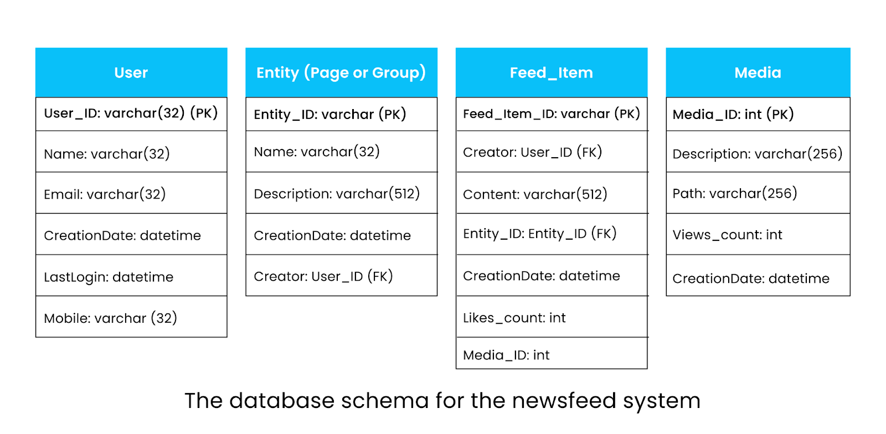

## 1. 뉴스피드 시스템이란?

- 뉴스피드는 소셜 미디어 플랫폼(Twitter, Facebook, Instagram 등)에서 사용자가 팔로우하는 엔티티들이 생성한 스토리들의 목록입니다. 
- 텍스트, 이미지, 비디오뿐만 아니라 좋아요, 댓글, 공유, 광고 등 다양한 활동들을 포함합니다. 
- 이 목록은 지속적으로 업데이트되며 사용자의 홈페이지에 표시됩니다. 
- 마찬가지로 뉴스피드 시스템은 친구, 팔로워, 그룹, 기타 페이지의 콘텐츠뿐만 아니라 사용자 자신의 게시물도 표시합니다.

### 1.1 뉴스피드의 역할

- 뉴스피드는 소셜 미디어 플랫폼 사용자들에게 필수적인 기능입니다. 
- 최신 업계 동향, 시사 정보, 관련 정보를 계속해서 제공하며, 사용자들이 플랫폼에 정기적으로 돌아와 소통할 수 있는 추가적인 이유를 제공합니다.

### 1.2 설계의 도전 과제

- 수십억 명의 사용자가 이러한 플랫폼을 사용합니다. 
- 시스템의 확장성과 고가용성을 유지하면서 실시간으로 개인화된 뉴스피드를 제공하는 것이 가장 큰 도전 과제입니다.
- 이번 글에서는 Facebook, Twitter, Instagram과 같은 소셜 플랫폼을 위한 뉴스피드 시스템의 고수준 설계와 상세 설계에 대해 논의합니다.

## 2. 뉴스피드 시스템 설계

- 뉴스피드 시스템 설계를 다음 세 가지 단계로 나누어 진행합니다.
- 문제의 범위를 제한하여 체계적으로 접근하고, 각 단계별로 구체적인 목표를 설정합니다.
- 설계 과정에서 수십억 사용자에게 개인화된 뉴스피드를 제공하는 복잡성을 단계적으로 해결합니다.

### 2.1 설계 단계

- **요구사항 분석**: 기능적 요구사항과 비기능적 요구사항을 식별하고, 매일 수십억 사용자에게 개인화된 뉴스피드를 제공하는 데 필요한 리소스 요구사항을 추정합니다.
- **시스템 설계**: 뉴스피드 시스템의 고수준 설계와 상세 설계를 논의하고, API 설계와 데이터베이스 스키마를 기술합니다. 또한 사용자에게 더 나은 경험을 제공하기 위한 뉴스피드 랭킹 방법도 설명합니다.
- **설계 평가**: 비기능적 요구사항을 기반으로 뉴스피드 시스템 설계를 평가하고, 설계에 대한 이해도를 확인합니다.

### 2.2 기능적 요구사항

- **뉴스피드 생성**: 사용자가 팔로우하는 페이지, 그룹, 팔로워를 기반으로 뉴스피드를 생성합니다. 사용자는 많은 친구와 팔로워를 가질 수 있으므로, 시스템은 모든 친구와 팔로워로부터 피드를 생성할 수 있어야 합니다.
- **콘텐츠 선별과 랭킹**: 잠재적으로 엄청난 양의 콘텐츠에서 사용자에게 적합한 콘텐츠를 선택하고, 우선순위를 정하여 어떤 것을 먼저 보여줄지 결정합니다.
- **뉴스피드 콘텐츠**: 뉴스피드는 텍스트, 이미지, 비디오를 포함할 수 있습니다.
- **뉴스피드 표시**: 랭킹 메커니즘을 기반으로 모든 활성 사용자의 뉴스피드에 새로운 게시물을 추가하고, 높은 순위의 콘텐츠를 먼저 표시합니다.

### 2.3 비기능적 요구사항

- **확장성**: Twitter, Facebook, Instagram과 같은 플랫폼의 지속적으로 증가하는 사용자 수를 지원할 수 있도록 높은 확장성을 가져야 합니다.
- **내결함성**: 시스템이 대량의 데이터를 처리해야 하므로, 시스템 구성 요소 간의 네트워크 장애 상황에서도 시스템 가용성을 보장하는 파티션 허용성이 필요합니다.
- **고가용성**: 사용자가 플랫폼에 지속적으로 참여할 수 있도록 서비스가 높은 가용성을 유지해야 합니다. PACELC 정리에 따라 가용성과 내결함성을 위해 강한 일관성을 타협할 수 있습니다.
- **낮은 지연시간**: 시스템은 실시간으로 뉴스피드를 제공해야 하므로, 최대 지연시간은 2초를 넘지 않아야 합니다.

## 3. 리소스 추정

- 뉴스피드 시스템을 위한 플랫폼의 기본 가정을 설정하고 트래픽, 스토리지, 서버 추정을 진행합니다.
- **기본 가정**: 일일 10억 사용자, 평균 5억 일일 활성 사용자(DAU), 사용자당 평균 300명의 친구와 250개 페이지 팔로우

### 3.1 트래픽 추정

- 각 일일 활성 사용자가 하루에 애플리케이션을 10회 실행한다고 가정합니다.
- **일일 총 요청 수**: `500M × 10 = 50억 요청/일 = 58K 요청/초`

### 3.2 스토리지 추정

- 피드는 오프라인으로 생성되고 요청 시 렌더링된다고 가정합니다.
- 각 사용자를 위해 상위 200개 게시물을 사전 계산합니다.
- **사용자 메타데이터 스토리지**
  - 한 사용자의 메타데이터 저장 공간: 50KB
  - 10억 사용자 기준: `1B × 50KB = 50TB`
- **텍스트 게시물 스토리지**
  - 모든 게시물은 텍스트를 포함하며, 평균 50KB라고 가정합니다.
  - 5억 사용자의 상위 200개 게시물: `200 × 500M × 50KB = 5PB`
- **미디어 콘텐츠 스토리지**
  - 게시물의 1/5은 비디오, 4/5는 이미지를 포함한다고 가정합니다.
  - 평균 이미지 크기: 200KB, 평균 비디오 크기: 2MB
  - 사용자당 200개 게시물의 스토리지:
    - 이미지: `200 × 4/5 × 200KB = 32MB`
    - 비디오: `200 × 1/5 × 2MB = 80MB`
    - **사용자당 총합**: `32MB + 80MB = 112MB`
  - **5억 사용자 총 미디어 스토리지**: `112MB × 500M = 56PB`

### 3.3 서버 수 추정

- 일반적인 서버 한 대는 초당 8,000개의 요청(RPS)을 처리할 수 있습니다.
- 시스템의 일일 활성 사용자 수: 약 5억 명
- **필요한 서버 수**: `58,000 RPS ÷ 8,000 RPS = 약 62,500대 서버`

## 4. 시스템 구성 요소

- 뉴스피드 시스템 설계에는 다음과 같은 핵심 구성 요소들이 사용됩니다.

### 4.1 데이터베이스

- **포스트 저장**: 다양한 엔티티들로부터 생성된 포스트를 저장합니다.
- **개인화된 뉴스피드**: 각 사용자를 위해 생성된 개인화된 뉴스피드 데이터를 저장합니다.
- **사용자 메타데이터**: 사용자 정보와 친구, 팔로워 등 다른 엔티티와의 관계를 저장합니다.

### 4.2 캐시

- **성능 최적화**: 자주 접근하는 데이터에 대한 빠른 액세스를 제공합니다.
- **저장 대상**: 포스트, 뉴스피드, 사용자 메타데이터 등을 캐시하여 응답 속도를 향상시킵니다.
- **부하 감소**: 데이터베이스에 대한 부하를 줄여 시스템 전반의 성능을 개선합니다.

### 4.3 블롭 스토리지

- **미디어 콘텐츠 저장**: 이미지와 비디오와 같은 대용량 미디어 파일을 효율적으로 저장합니다.
- **확장성**: 증가하는 미디어 콘텐츠 요구사항에 대응할 수 있는 확장 가능한 저장소를 제공합니다.

### 4.4 CDN (Content Delivery Network)

- **콘텐츠 전달 최적화**: 엔드유저에게 효과적으로 콘텐츠를 전달합니다.
- **지연시간 감소**: 사용자와 가까운 위치에서 콘텐츠를 서빙하여 지연시간을 최소화합니다.
- **백엔드 서버 부담 경감**: 정적 콘텐츠 전달을 담당하여 백엔드 서버의 부하를 줄입니다.

### 4.5 로드 밸런서

- **트래픽 분산**: 수백만 클라이언트의 뉴스피드 요청을 사용 가능한 서버 풀에 효율적으로 분산합니다.
- **고가용성**: 서버 장애 시에도 서비스 연속성을 보장합니다.
- **확장성**: 트래픽 증가에 따라 서버를 동적으로 추가하거나 제거할 수 있도록 지원합니다.

## 5. 뉴스피드 시스템의 고수준 설계

- 뉴스피드 시스템은 주로 다음 두 가지 작업을 담당합니다.

### 5.1 핵심 기능

- **피드 생성 (Feed Generation)**
  - 특정 랭킹 메커니즘을 기반으로 친구와 팔로워의 포스트(또는 피드 항목)를 집계하여 뉴스피드를 생성합니다.
- **피드 발행 (Feed Publishing)**
  - 피드가 발행될 때 관련 데이터가 캐시와 데이터베이스에 기록됩니다. 
  - 이 데이터는 텍스트 또는 미디어 콘텐츠일 수 있으며, 친구와 팔로워의 데이터를 포함한 포스트가 사용자의 뉴스피드에 채워집니다.

### 5.2 시스템 구조

- 뉴스피드 시스템의 고수준 설계는 위에서 언급한 두 가지 핵심 부분으로 구성됩니다.

### 5.3 주요 구성 요소

- 고수준 설계에 나타난 주요 구성 요소들은 다음과 같습니다.

#### 5.3.1 사용자 (Users)

- 콘텐츠가 포함된 포스트를 작성하거나 자신의 뉴스피드를 요청할 수 있습니다.

#### 5.3.2 로드 밸런서 (Load Balancer)

- 트래픽을 웹 서버 중 하나로 리디렉션합니다.

#### 5.3.3 웹 서버 (Web Servers)

- 백엔드 서비스를 캡슐화하고 사용자와 다양한 서비스 간의 중간 계층 역할을 수행합니다.
- 인증 및 속도 제한을 강제하는 것 외에도, 다른 백엔드 서비스로 트래픽을 리디렉션하는 역할을 담당합니다.

#### 5.3.4 알림 서비스 (Notification Service)

- 친구나 팔로워로부터 새로운 포스트가 사용 가능할 때마다 뉴스피드 생성 서비스에 알리고, 푸시 알림을 보냅니다.

#### 5.3.5 뉴스피드 생성 서비스 (Newsfeed Generation Service)

- 사용자의 팔로워/친구 포스트로부터 뉴스피드를 생성하고 뉴스피드 캐시에 보관합니다.

#### 5.3.6 뉴스피드 발행 서비스 (Newsfeed Publishing Service)

- 뉴스피드 캐시에서 사용자의 타임라인으로 뉴스피드를 발행하는 역할을 담당합니다.
- 블롭 스토리지에서 미디어 콘텐츠의 썸네일과 링크를 사용자를 위한 뉴스피드에 추가합니다.

#### 5.3.7 포스트 서비스 (Post Service)

- 사용자가 포스트 생성을 요청할 때 호출되며, 생성된 포스트는 포스트 데이터베이스와 해당 캐시에 저장됩니다.
- 포스트의 미디어 콘텐츠는 블롭 스토리지에 저장됩니다.

:::tip[시스템 워크플로우]
이러한 구성 요소들은 서로 협력하여 사용자에게 실시간으로 개인화된 뉴스피드를 제공하는 완전한 시스템을 구성합니다.
:::

## 6. API 설계

- API는 클라이언트가 서버와 통신하는 주요 방법입니다. 
- 일반적으로 뉴스피드 API는 HTTP 기반으로, 클라이언트가 상태 게시, 뉴스피드 검색, 친구 추가 등의 작업을 수행할 수 있도록 합니다. 
- 사용자의 뉴스피드를 생성하고 가져오는 것이 목표이므로, 다음 API들이 필수적입니다.

### 6.1 사용자 뉴스피드 생성

다음 API는 사용자의 뉴스피드를 생성하는 데 사용됩니다.

```
generateNewsfeed(user_id)
```

#### 6.1.1 기능 설명

- **사용자 식별**: 사용자 ID를 받아 해당 사용자의 친구와 팔로워를 결정합니다.
- **뉴스피드 생성**: 여러 포스트로 구성된 뉴스피드를 생성합니다.
- **오프라인 처리**: 내부 시스템 구성 요소에서 사용되므로 오프라인으로 호출하여 사용자를 위한 뉴스피드를 사전 생성할 수 있습니다.
- **저장**: 사전 생성된 뉴스피드는 영구 저장소와 관련 캐시에 저장됩니다.

#### 6.1.2 매개변수

- **user_id**: 뉴스피드를 생성할 사용자의 고유 식별자

### 6.2 사용자 뉴스피드 조회

다음 API는 사용자의 뉴스피드를 가져오는 데 사용됩니다.

```
getNewsfeed(user_id, count)
```

#### 6.2.1 기능 설명

- **뉴스피드 반환**: 포스트 목록으로 구성된 JSON 객체를 반환합니다.
- **페이징 지원**: count 매개변수를 통해 반환할 포스트 수를 제어할 수 있습니다.

#### 6.2.2 매개변수

- **user_id**: 뉴스피드를 요청하는 사용자의 고유 식별자
- **count**: 반환할 포스트의 개수

## 7. 스토리지 스키마



- 뉴스피드 시스템의 효율적인 데이터 저장을 위해 관계형 데이터베이스와 그래프 데이터베이스를 조합하여 사용합니다.

### 7.1 주요 데이터베이스 관계

뉴스피드 시스템의 데이터베이스 관계는 다음과 같습니다.

#### 7.1.1 User (사용자)

- 사용자에 대한 데이터를 포함합니다.
- 사용자는 다른 사용자의 팔로워나 친구가 될 수 있습니다.

#### 7.1.2 Entity (엔티티)

- 페이지, 그룹 등과 같은 모든 엔티티와 관련된 데이터를 저장합니다.

#### 7.1.3 Feed_item (피드 항목)

- 사용자가 생성한 포스트에 대한 데이터를 저장합니다.

#### 7.1.4 Media (미디어)

- 미디어 콘텐츠에 대한 정보를 저장합니다.

### 7.2 데이터베이스 아키텍처

#### 7.2.1 관계형 데이터베이스 (SQL)

- 사용자와 포스트 데이터는 구조화되어 있으므로 SQL 기반 데이터베이스를 사용합니다.
- **저장 데이터**:
  - 사용자 프로필 정보
  - 포스트 콘텐츠
  - 미디어 메타데이터
  - 엔티티 정보

#### 7.2.2 그래프 데이터베이스

- 사용자, 친구, 팔로워 간의 관계를 저장하기 위해 그래프 데이터베이스를 사용합니다.
- **모델**: Property Graph Model을 따릅니다.
- **구조**: 그래프 데이터베이스는 두 개의 관계형 테이블로 구성됩니다.
  - **Vertices (정점)**: 사용자를 나타냅니다.
  - **Edges (간선)**: 사용자 간의 관계를 나타냅니다.

### 7.3 스키마 구현

#### 7.3.1 관계형 스키마

그래프 저장소에 대해 관계형 스키마를 사용하며, PostgreSQL JSON 데이터 타입을 활용하여 각 정점(사용자) 또는 간선(관계)의 속성을 저장합니다.

```sql
-- Users 테이블 (정점)
CREATE TABLE users (
    user_id SERIAL PRIMARY KEY,
    properties JSONB NOT NULL,
    created_at TIMESTAMP DEFAULT CURRENT_TIMESTAMP
);

-- Relationships 테이블 (간선)
CREATE TABLE relationships (
    relationship_id SERIAL PRIMARY KEY,
    from_user_id INTEGER REFERENCES users(user_id),
    to_user_id INTEGER REFERENCES users(user_id),
    relationship_type VARCHAR(20) NOT NULL, -- 'friend', 'follower', etc.
    properties JSONB,
    created_at TIMESTAMP DEFAULT CURRENT_TIMESTAMP
);
```

## 8. 상세 설계

- 뉴스피드 시스템의 상세 설계를 심도 있게 탐구해보겠습니다.
- 앞서 논의한 바와 같이 뉴스피드 시스템은 두 가지 핵심 부분으로 구성됩니다
  - **뉴스피드 발행**과 **뉴스피드 생성**입니다. 
- 뉴스피드 생성 서비스부터 시작하여 두 부분 모두에 대해 논의하겠습니다.

## 9 뉴스피드 생성 서비스

- 뉴스피드는 사용자의 친구, 팔로워, 기타 엔티티(페이지 및 그룹)의 포스트(또는 피드 항목)를 집계하여 생성됩니다.

### 9.1 서비스 운영 방식

- 제안된 설계에서 뉴스피드 생성 서비스는 뉴스피드 생성을 담당합니다. 
- 사용자(예: Alice)로부터 뉴스피드 검색 요청이 웹 서버에 수신되면, 웹 서버는 다음 중 하나를 수행합니다:
  - **온디맨드 생성**: 플랫폼을 자주 방문하지 않는 사용자들의 경우, 요청 시점에 뉴스피드 생성 서비스를 호출하여 피드를 생성합니다.
  - **사전 생성된 피드 조회**: 플랫폼을 자주 방문하는 활성 사용자들을 위해 사전 생성된 뉴스피드를 가져옵니다.

### 9.2 기본 플로우

1. **사용자 요청**: Alice가 뉴스피드를 요청합니다.
2. **웹 서버 수신**: 웹 서버가 요청을 받고 Alice의 활성 사용자 여부를 확인합니다.

#### 9.3 활성 사용자 경로

- 활성 사용자인 경우 (자주 방문하는 사용자)는 아래와 같은 플로우를 통해 뉴스피드를 생성합니다.
- **캐시에서 조회**: 웹 서버가 뉴스피드 캐시에서 사전 생성된 피드를 조회합니다.
- **즉시 응답**: 캐시된 데이터를 바로 반환하여 빠른 응답을 제공합니다.

#### 9.4 비활성 사용자 경로 (상세 뉴스피드 생성 프로세스)

비활성 사용자인 경우 다음 6단계를 통해 뉴스피드를 생성합니다:

**1단계: 관계 조회**

- 그래프 데이터베이스에서 Alice가 팔로우하는 모든 사용자와 엔티티의 ID를 검색합니다.

**2단계: 사용자 정보 조회**

- 사용자 캐시에서 친구들(팔로워 및 엔티티)의 정보를 가져옵니다.
- 사용자 캐시는 사용자 데이터베이스가 업데이트/수정될 때마다 정기적으로 업데이트됩니다.

**3단계: 포스트 검색**

- 포스트 캐시에서 해당 ID들의 최신, 인기, 관련성 있는 포스트들을 검색합니다.
- 이들은 Alice의 뉴스피드에 표시될 수 있는 후보 포스트들입니다.

**4단계: 랭킹 처리**

- 랭킹 서비스가 Alice와의 관련성을 기반으로 포스트들의 순위를 매깁니다.
- 이것이 Alice의 현재 뉴스피드를 구성합니다.

**5단계: 캐시 저장**

- 뉴스피드는 뉴스피드 캐시에 저장되며, 여기서 상위 N개의 포스트가 Alice의 타임라인에 발행됩니다.

**6단계: 페이징 처리**

- Alice가 타임라인의 끝에 도달하면, 뉴스피드 캐시에서 다음 상위 N개의 포스트가 화면에 가져옵니다.

### 9.5 최종 응답

- 두 경로 모두 다음 단계로 진행됩니다:
  - **타임라인 발행**: 뉴스피드 발행 서비스가 타임라인을 준비합니다.
  - **사용자 응답**: 최종적으로 Alice에게 개인화된 뉴스피드를 전달합니다.

### 9.6 성능 최적화 포인트

- **캐시 우선**: 활성 사용자는 사전 계산된 데이터로 빠른 응답
- **지연 생성**: 비활성 사용자는 요청 시점에 생성하여 리소스 절약
- **병렬 처리**: 다중 캐시와 서비스를 활용한 동시 처리

:::tip[성능 최적화]
이 설계는 활성 사용자와 비활성 사용자를 구분하여 처리함으로써 시스템 리소스를 효율적으로 활용합니다.
:::

:::note[확장성 고려사항]
각 단계별로 캐싱과 분산 처리가 적용되어 대규모 사용자 요청을 효과적으로 처리할 수 있습니다.
:::

## 10 뉴스피드 발행 서비스

- 뉴스피드 생성 서비스에서 뉴스피드는 각 사용자의 친구, 팔로워, 엔티티로부터 생성되어 `<Post_ID, User_ID>` 형태로 뉴스피드 캐시에 저장됩니다.

### 10.1 발행 과정의 핵심 질문

- Alice를 위해 생성된 뉴스피드가 어떻게 그녀의 타임라인에 발행될까요?

### 10.2 뉴스피드 발행 프로세스

- 뉴스피드 발행 서비스는 다음과 같은 단계를 통해 작동합니다:

**1단계: 캐시에서 ID 조회**

- 뉴스피드 발행 서비스가 뉴스피드 캐시에서 포스트 ID 리스트를 가져옵니다.
- 캐시에서 가져온 데이터는 `<Post_ID, User_ID>` 형태의 튜플입니다.

**2단계: 완전한 데이터 구성**

- 포스트와 사용자 ID만으로는 불완전하므로, 완전한 뉴스피드를 구성하기 위해 추가 데이터가 필요합니다.
- **사용자 캐시**에서 사용자 정보 (프로필 사진, 이름 등)를 조회합니다.
- **포스트 캐시**에서 포스트의 완전한 내용 (텍스트, 미디어, 메타데이터 등)을 조회합니다.

**3단계: 뉴스피드 구성**

- 조회된 사용자 정보와 포스트 정보를 결합하여 완전히 구성된 뉴스피드를 만듭니다.
- 각 포스트는 작성자 정보, 콘텐츠, 좋아요 수, 댓글 등 모든 필요한 정보를 포함합니다.

**4단계: 클라이언트 전송**

- 완전히 구성된 뉴스피드는 Fan-out 방식 중 하나를 사용하여 클라이언트(Alice)에게 전송됩니다.

### 10.3 Fan-out 전략

- Fan-out 방식에는 Push 모델과 Pull 모델이 있습니다.

#### 10.3.1 Push 모델 (Fan-out on Write)

- 포스트가 작성되는 시점에 모든 팔로워의 피드에 즉시 푸시
- 장점: 빠른 읽기 성능
- 단점: 쓰기 시 높은 부하

#### 10.3.2 Pull 모델 (Fan-out on Read)

- 사용자가 피드를 요청할 때 실시간으로 생성
- 장점: 쓰기 성능 좋음, 실시간성
- 단점: 읽기 시 지연 발생
- 현재 시스템은 사실상 Pull 모델의 두 가지 변형입니다.
  - 활성 사용자: Pre-computed Pull
    - generateNewsfeed(user_id)를 미리 호출해서 캐시에 저장
    - 여전히 Alice 관점에서 자신이 팔로우하는 사람들의 포스트를 끌어오는 방식
  - 비활성 사용자: On-demand Pull
    - 요청 시점에 generateNewsfeed(user_id) 호출
    - 역시 Alice 관점에서 팔로우하는 사람들의 포스트를 끌어오는 방식

#### 8.3.4 CDN 활용

- **인기 뉴스피드**: 많은 사용자가 관심을 가지는 인기 콘텐츠는 CDN에 저장됩니다.
- **미디어 콘텐츠**: 이미지, 비디오 등의 미디어 파일도 CDN에 캐시되어 빠른 조회를 제공합니다.
- **글로벌 배포**: 전 세계 사용자에게 낮은 지연시간으로 콘텐츠를 전달합니다.

#### 8.3.5 데이터 흐름 예시

```
1. 뉴스피드 캐시: [<101, Alice>, <102, Bob>, <103, Charlie>]
2. 포스트 캐시 조회: Post_101의 전체 내용, Post_102의 전체 내용...
3. 사용자 캐시 조회: Alice 프로필, Bob 프로필, Charlie 프로필...
4. 완성된 피드: 
   {
     "post_id": 101,
     "author": "Alice",
     "profile_pic": "alice.jpg",
     "content": "Hello world!",
     "likes": 25,
     "media": ["image1.jpg"]
   }
```

:::warning[성능 주의사항]
발행 단계에서 여러 캐시를 조회하므로 네트워크 지연이 발생할 수 있습니다. 배치 조회나 캐시 최적화가 중요합니다.
:::

